# Architecture — Jim

*Last updated: 2026-04-29 (015-build-hooks build)*

> This document is generated and maintained by `/jim:arch`. Edit via the skill to preserve consistency.

---

## Project Structure

```
jim/
├── .claude-plugin/
│   └── plugin.json          # Plugin manifest — name, version, description
├── .claude/
│   └── settings.local.json  # Local permission allowlists (WebFetch domains, etc.)
├── bin/                     # Plugin executables — auto-added to Bash tool's PATH (Claude Code plugin convention)
│   └── jim_path             # Resolves a config key from .jim/config.md → stdout (or schema default)
├── agents/                  # Agent definitions — one .md per agent persona
│   ├── pm.md                # @jim:pm — product manager
│   ├── architect.md         # @jim:architect — technical architect
│   ├── researcher.md        # @jim:researcher — codebase investigator
│   ├── coder.md             # @jim:coder — TDD implementer
│   ├── meta.md              # @jim:meta — plugin developer (builds jim itself)
│   └── security.md          # @jim:security — security analyst
├── skills/                  # Skill definitions — one directory per skill
│   ├── _shared/             # Plugin-contract shared primitives (not overlayable)
│   │   ├── config-schema.md     # Authoritative config schema — keys, defaults, value rules
│   │   └── resolve-paths.md     # Shared preamble — config read, validation, placeholder resolution
│   ├── spec/                # /jim:spec — collaborative spec creation
│   ├── plan/                # /jim:plan — implementation planning
│   ├── research/            # /jim:research — codebase and landscape investigation
│   ├── build/               # /jim:build — TDD red-green-refactor execution
│   ├── debug/               # /jim:debug — structured failure diagnosis
│   ├── vision/              # /jim:vision — product vision and strategy
│   ├── roadmap/             # /jim:roadmap — execution milestones
│   ├── arch/                # /jim:arch — architecture document generation
│   ├── backlog/             # /jim:backlog — deferred work consolidation
│   ├── brainstorm/          # /jim:brainstorm — freeform ideation capture
│   ├── sec/                 # /jim:sec — security analysis and threat review
│   ├── config/              # /jim:config — project configuration scaffolding
│   ├── meta-skill/          # /jim:meta-skill — create/update jim skills
│   ├── meta-agent/          # /jim:meta-agent — create/update jim agents
│   └── meta-test/           # /jim:meta-test — static audit of config-adherence invariants
├── docs/
│   ├── specs/               # Spec directories grouped by domain (e.g., jim/001-meta)
│   ├── brainstorms/         # Freeform ideation (YYYYMMDD-topic.md)
│   ├── prior-art/           # Reference material from other projects
│   └── notes/               # Personal development notes
├── ARCHITECTURE.md          # This file
├── VISION.md                # Product vision — problem, solution, audience, north star
├── ROADMAP.md               # Execution sequence
├── BACKLOG.md               # Consolidated deferred work
├── WORKFLOW.md              # The SDLC process definition — commands, artifacts, philosophy
├── CLAUDE.md                # Claude Code project instructions
└── README.md                # Project readme
```

## High-Level System Diagram

```mermaid
flowchart TD
    subgraph User
        U[Developer via Claude Code]
    end

    subgraph "Strategic Skills"
        VIS["/jim:vision"]
        ROAD["/jim:roadmap"]
        ARCH["/jim:arch"]
        BACKLOG["/jim:backlog"]
        BRAIN["/jim:brainstorm"]
    end

    subgraph "SDLC Skills"
        SPEC["/jim:spec"]
        RES["/jim:research"]
        PLAN["/jim:plan"]
        SEC["/jim:sec"]
        BUILD["/jim:build"]
        DEBUG["/jim:debug"]
    end

    subgraph "Meta Skills"
        MS["/jim:meta-skill"]
        MA["/jim:meta-agent"]
        MT["/jim:meta-test"]
        CONF["/jim:config"]
    end

    subgraph Agents
        PM["@jim:pm"]
        ARCHITECT["@jim:architect"]
        RESEARCHER["@jim:researcher"]
        SECURITY["@jim:security"]
        CODER["@jim:coder"]
        META["@jim:meta"]
    end

    subgraph Artifacts
        VDOC["VISION.md"]
        RDOC["ROADMAP.md"]
        ADOC["ARCHITECTURE.md"]
        SDOC["spec.md"]
        PDOC["plan.md"]
        RESDOC["research.md"]
        CODE["Tests + Code"]
        SECDOC["security.md"]
        BLOGDOC["BACKLOG.md"]
        BDOC["brainstorm.md"]
        DDOC["debug report"]
        CONFDOC[".jim/config.md"]
    end

    U --> VIS & ROAD & ARCH & BACKLOG & BRAIN
    U --> SPEC & RES & PLAN & SEC & BUILD & DEBUG
    U --> MS & MA & MT & CONF

    VIS & ROAD & BACKLOG & BRAIN --> PM
    ARCH --> ARCHITECT
    SPEC --> PM
    RES --> RESEARCHER
    PLAN --> ARCHITECT
    SEC --> SECURITY
    BUILD & DEBUG --> CODER
    MS & MA & MT & CONF --> META

    PM --> VDOC & RDOC & SDOC & BLOGDOC & BDOC
    ARCHITECT --> ADOC & PDOC
    RESEARCHER --> RESDOC
    SECURITY --> SECDOC
    CODER --> CODE & DDOC
    META --> CONFDOC

    ARCHITECT -.->|spawns| RESEARCHER
    SECURITY -.->|spawns| RESEARCHER
    META -.->|delegates| PM & ARCHITECT & RESEARCHER
```



## Core Components

### Agents

Agents are markdown files (`agents/*.md`) that define personas with frontmatter metadata. Each agent declares its name, description, skill bindings, tool permissions, and model preference.

- **Purpose:** Define the persona, responsibilities, and boundaries for each specialized role in the SDLC
- **Location:** `agents/` — `pm.md` (L1–76), `architect.md` (L1–80), `researcher.md` (L1–83), `security.md` (L1–75), `coder.md` (L1–83), `meta.md` (L1–66)
- **Interfaces:** Frontmatter fields: `name`, `description`, `skills` (list), `tools` (list), `model` (string). Body contains persona instructions, context paths, core principles, process delegation, and constraints.
- **Dependencies:** Each agent references its bound skills in `skills/`. Agents may spawn other agents via the `Agent()` tool declaration (e.g., architect, PM, and security can spawn researcher; meta can spawn PM, architect, researcher). All agents read `.jim/config.md` at spawn for configurable paths, with hardcoded defaults as fallback.
- **Key Constraints:** Agents do not cross domain boundaries — PM does not write code, coder does not modify specs, researcher does not make design decisions. All agents stop after producing an artifact and wait for human approval.

### Skills

Skills are SKILL.md files inside `skills/{name}/` directories, optionally accompanied by `assets/` (templates) and `references/` (methodology docs).

- **Purpose:** Provide the detailed process instructions that agents follow when a `/jim:{verb}` command is invoked
- **Location:** `skills/` — 15 skill directories (spec, plan, research, sec, build, debug, vision, roadmap, arch, backlog, brainstorm, config, meta-skill, meta-agent, meta-test), plus the `_shared/` directory holding cross-skill plugin-contract files (see Shared Primitives below).
- **Interfaces:** Frontmatter fields: `name`, `description`, `agent` (which agent runs this skill), `argument-hint`. Body contains step-by-step process, argument routing, validation checklists.
- **Dependencies:** Skills reference their `assets/` templates and `references/` docs. Skills are bound to agents via the `agent` frontmatter field (documentation convention, not runtime routing). Every skill's step 1 follows `skills/_shared/resolve-paths.md`, which reads `.jim/config.md`, validates it against `skills/_shared/config-schema.md`, and resolves placeholders for substitution at point of use. Skills with assets/references check `.jim/skills/{name}/` overlay paths before falling back to built-in files.
- **Key Constraints:** SKILL.md stays under 500 lines (progressive disclosure). Templates live in `assets/`, methodology in `references/`. Configurable paths appear in skill bodies as `{path.*}` placeholders, never as literal default filenames.

### Shared Primitives

`skills/_shared/` holds cross-skill files that every skill depends on. Distinct from per-skill `assets/` and `references/`, this directory is plugin contract — not overlayable.

- **Purpose:** Provide one canonical surface for config resolution and schema authority. Eliminates per-skill duplication of config-handling prose. The forcing function is the placeholder syntax itself: `{path.*}` strings in skill bodies are not valid filesystem arguments, so the agent must resolve them before any tool call.
- **Location:** `skills/_shared/` — `config-schema.md` (authoritative keys, defaults, validation rules; YAML frontmatter `keys:` list plus prose Validation Rules and Overlay Boundary sections); `resolve-paths.md` (runtime preamble — read config, validate, build resolved map, halt format for validation failures, invariants).
- **Interfaces:** `config-schema.md` exposes a YAML `keys:` list (each entry: `name`, `default`, `type`) consumed by the preamble for enumeration and validation. `resolve-paths.md` is invoked by every skill's step 1 via the canonical phrase "Resolve config — follow `skills/_shared/resolve-paths.md` before proceeding."
- **Dependencies:** `resolve-paths.md` reads `config-schema.md`. Every skill's step 1 references `resolve-paths.md`. `/jim:config` reads `config-schema.md` for default values and validation rules during interview-time generation.
- **Key Constraints:** `_shared/` is **not overlayable** via `.jim/skills/_shared/` — a user file there is silently ignored. `resolve-paths.md` enforces hard-error on schema validation failures with a fixed three-line format (`✗ Config validation failed.` / `✗ Key: \`{key}\`` / `✗ Reason: …`); fallback to defaults on validation failure is prohibited.

### Plugin Executables

`bin/jim_path` — jim's first non-markdown executable artifact. A single bash script that resolves a `.jim/config.md` key to its configured value (or schema default) and prints it to stdout. Hardens config adherence at the Bash-tool surface, where native-tool placeholder discipline cannot reach.

- **Purpose:** Skills compose `$(jim_path <key>)` into Bash invocations to make wrong paths syntactically impossible at runtime. The shell substitution is evaluated by Bash, not the agent — the agent writes the placeholder once and never computes the resolved value itself. Cd-safe: project root flows through via the `--root` flag injected by the resolve-paths preamble's `{jim_path}` placeholder substitution.
- **Location:** `bin/jim_path`. Auto-added to the Bash tool's PATH via Claude Code's documented plugin `bin/` convention while the plugin is enabled. Skills invoke by name; absolute paths are not embedded in skill prose.
- **Interfaces:** CLI — `jim_path <key> [--root <abs-path>]`. Stdout is the resolved value + newline. Stderr is empty on success or one of the documented one-line error messages: `unknown key (see .jim/config.md)`, `cannot read schema`, `cannot read .jim/config.md`, `malformed schema`, `malformed config`, `not a jim plugin install`. Exit codes: 0 success, 2 unknown key, 1 other error.
- **Dependencies:** Reads `<plugin-root>/skills/_shared/config-schema.md` (for the `keys:` list — derived from `BASH_SOURCE` self-location with portable POSIX symlink resolution; verified via `<plugin-root>/.claude-plugin/plugin.json` plausibility check). Reads `<root>/.jim/config.md` (for the configured value, when present). Both parsed by hand-rolled awk under the schema's documented format constraint (see `skills/_shared/config-schema.md` Schema Format Constraint section). No external library or runtime dependency.
- **Key Constraints:** Helper validates only the *requested key name* against the schema; it does not re-validate values — that is the resolve-paths preamble's job at skill-invocation time. Helper exits 1 with `not a jim plugin install` if the derived plugin root does not contain a `plugin.json` naming `jim`, closing the misinstall/relocation gap. No raw key or value content is echoed in stderr — protects agent context against attacker-controlled key names in malicious committed configs.

`bin/jim_run_hook` — single-call hook dispatcher introduced by spec 016. Replaces the multi-line in-skill-prose idiom from spec 015 that tripped Claude Code's Bash permission heuristic on every `/jim:build` commit.

- **Purpose:** Skills compose `{jim_run_hook} <event>` into Bash invocations to dispatch a configured `hooks.<event>` shell command without exposing the resolve-and-exec dance to the heuristic. The helper resolves the value via `jim_path`, skips silently on empty (the schema default), and execs the configured command on non-empty. Cd-safe via the same `--root` injection pattern as `jim_path`.
- **Location:** `bin/jim_run_hook`. Auto-added to the Bash tool's PATH via Claude Code's documented plugin `bin/` convention while the plugin is enabled. Skills invoke by name; absolute paths are not embedded in skill prose.
- **Interfaces:** CLI — `jim_run_hook [--root <abs-path>] <event> [args...]`. Stdout passes through the configured command's stdout (empty when value is empty default). Stderr passes through `jim_path`'s stderr on resolution failure (one-line messages prefixed `jim_path:`); passes through the configured hook's stderr otherwise. Exit codes: `0` on empty-value skip OR successful hook execution exiting 0; propagated from `jim_path` (`1` other error, `2` unknown key) on resolution failure; otherwise propagated unchanged from the configured hook.
- **Dependencies:** Invokes `bin/jim_path` (for schema-driven `hooks.<event>` resolution) and `bash` (for `bash -c` exec of the configured value). No external library or runtime dependency. No schema parsing in the helper itself — `jim_path`'s schema validation is the single source of truth for which `hooks.<key>` keys are valid.
- **Key Constraints:** Trusts `jim_path`'s plausibility check transitively (a misinstalled plugin causes `jim_path` to exit 1; helper's fail-loud propagates that — no duplicate check). Fail-loud on `jim_path` failure (skip is reserved for the empty-value case only). Caller-provided arguments (`--root` value, `<event>` positional) are double-quoted in subprocess invocations to prevent shell-metacharacter injection through CLI args (spec 015's trust model permits arbitrary commands in *configured* values, not in *helper-CLI args*). Configured hook stdout and stderr pass through unchanged — preserves agent-context-exposure documented in the schema's Hook keys section.

### Plugin Manifest

- **Purpose:** Declares jim as a Claude Code plugin with name, version, and metadata
- **Location:** `.claude-plugin/plugin.json` (L1–16)
- **Interfaces:** Standard Claude Code plugin JSON: `name`, `version`, `description`, `author`, `keywords`
- **Dependencies:** None — consumed by Claude Code's plugin loader
- **Key Constraints:** `name` must be `"jim"` — all skills and agents are namespaced under this. The helper's plausibility check depends on this name being literally `"jim"`.

### WORKFLOW.md

- **Purpose:** Defines the entire SDLC process — command reference, artifact locations, agent-skill composition, lifecycle details, and philosophy
- **Location:** `WORKFLOW.md` (L1–431)
- **Interfaces:** Referenced by agents and skills as the canonical process definition
- **Dependencies:** None — upstream reference document
- **Key Constraints:** Single source of truth for the SDLC process. All agents and skills must be consistent with this document.

### Spec Archive

- **Purpose:** Living development artifacts — specs, research, and plans organized by group and sequential ID
- **Location:** `docs/specs/{group}/{00X}-{name}/` — currently `docs/specs/jim/001-meta/` through `013-jim-path-helper/`
- **Interfaces:** Each spec directory contains up to four files: `spec.md`, `research.md`, `plan.md`, `security.md`
- **Dependencies:** Produced by PM (spec), researcher (research), and architect (plan) agents
- **Key Constraints:** IDs are 3-digit zero-padded, sequential within each group. Groups are noun-based directories. Specs must be `approved` before plans can be created.

## Data Stores

| Store | Type | Location | Purpose | Owned By |
| :--- | :--- | :--- | :--- | :--- |
| Spec Archive | Markdown files | `docs/specs/` | Persistent development artifacts — specs, research, plans, security reviews | PM, Architect, Researcher, Security |
| Strategic Docs | Markdown files | Project root (`VISION.md`, `ROADMAP.md`, `ARCHITECTURE.md`) | Project-level strategy and constraints | PM, Architect |
| Backlog | Markdown file | `BACKLOG.md` | Consolidated deferred work — sourced items, user-authored ad-hoc items, cross-cutting themes | PM |
| Brainstorms | Markdown files | `docs/brainstorms/` | Freeform ideation capture | PM |
| Debug Reports | Markdown files | `docs/debug/` | Structured failure diagnosis | Coder |
| Config and Overlay | Markdown files | `.jim/config.md`, `.jim/skills/{name}/` | Project-level configuration (paths, workflow gates, spec ID format) and asset/reference overrides. Authoritative schema lives at `skills/_shared/config-schema.md` (plugin contract, not overlayable). | Meta (via `/jim:config`); all skills follow `skills/_shared/resolve-paths.md` at step 1 |

## External Integrations

| Integration | Type | Auth Method | Rate Limits | Failure Mode |
| :--- | :--- | :--- | :--- | :--- |
| Claude Code | Host platform | N/A (plugin loaded by Claude Code) | N/A | Plugin not available if not installed |
| WebFetch/WebSearch | Claude Code tools | Domain allowlist in `.claude/settings.local.json` | Subject to provider limits | Stop and ask user to fetch manually (per CLAUDE.md policy) |

## Deployment & Infrastructure

- **Runtime:** Claude Code plugin — no standalone runtime. Requires Claude Code CLI with plugin support.
- **Entry point:** `.claude-plugin/plugin.json` — Claude Code discovers and loads the plugin from this manifest
- **Configuration:** `.claude/settings.local.json` for permission allowlists. `.jim/config.md` for project-level configuration (paths, workflow gates, spec ID format). `.jim/skills/` for asset/reference overlays. All optional — zero-config defaults match upstream layout.
- **Distribution:** Git repository. Users install by cloning/adding the repo as a Claude Code plugin.
- **Environment requirements:** Claude Code CLI. No build step, no dependencies, no package manager. Mostly markdown — one bash script (`bin/jim_path`) ships under Claude Code's plugin `bin/` PATH convention; it has no library dependencies and runs under any POSIX bash.

## Security Considerations

- **Trust boundary:** All input comes from the human developer via Claude Code. Agents do not accept external input. WebFetch/WebSearch results are the only external data — handled by stopping on failure per CLAUDE.md policy. `.jim/config.md` is repo-committable, so a malicious config in a cloned repo is a supply-chain-style threat — mitigated by `config-schema.md` value constraints (see below).
- **Secrets management:** No secrets are stored or managed. `.claude/settings.local.json` contains domain allowlists only.
- **File system access:** Agents declare tool permissions in frontmatter. Coder agent has Bash access. All agents are prohibited from writing to `.git/`, `~/.ssh/`, `node_modules/`, `.venv/`, `.env`, `.env-*`. The `.gitignore` excludes `docs/prior-art/github.com/` (downloaded references) and `Z_*` files (personal notes).
- **Security-relevant files:** `skills/_shared/config-schema.md`, `skills/_shared/resolve-paths.md`, and `bin/jim_path` form the trio that's load-bearing for config-mediated filesystem safety. **Schema invariants** (config-schema.md): `path.*` values must be relative, must not contain `..` segments, must not begin with `/`, and must resolve within the project root after following symlinks (realpath semantics); `boolean` values must be literal `true`/`false` (case variants and YAML 1.1 `yes`/`no`/`on`/`off` are rejected); unknown keys hard-error. The schema's frontmatter and any `.jim/config.md` must conform to a restricted YAML subset (single-line scalars, no anchors/aliases/merges) — the format constraint enables hand-rolled awk parsing in the helper without a YAML library, and bounds the parser audit surface. **Preamble invariants** (resolve-paths.md): resolve-before-tool-call (no `{path.*}` placeholder may flow into a tool call unresolved — placeholder syntax itself is the forcing function), no-silent-fallback (validation failures halt; defaults apply only to absent keys), every-invocation (the preamble runs at the start of every skill invocation; no caching across invocations), schema-is-the-authority (any change to the valid key set or value rules goes through `config-schema.md`); the preamble also computes the derived `{jim_path}` placeholder, single-quoting the project root with the `'\''` escape idiom and halting on null bytes. **Helper invariants** (bin/jim_path): trusts the preamble for value validation (validates only the requested key name against the schema); plausibility-checks its derived plugin root via `.claude-plugin/plugin.json` before reading the schema; never echoes raw key or value content in stderr (Claude's Bash tool captures stderr into agent context, so attacker-controlled keys in malicious configs cannot flow markdown or prompt-injection content into that surface). Weakening any of the three weakens config validation project-wide. **Shell-execution authority** (added by spec 015): `hooks.pre-commit` and `hooks.pre-completion` are `string`-typed schema keys whose values are arbitrary shell commands executed by Bash during `/jim:build`. `.jim/config.md` is therefore a shell-execution authority equivalent to a committed script file for projects that configure these hooks — existing path-tampering mitigations (relative-only, no `..`, realpath containment) cover path-typed values, not string-typed shell commands. PR reviewers must scrutinize `hooks.*` changes the same way they scrutinize script-file content; a one-line config change can introduce arbitrary code execution on the next `/jim:build` invocation. Hook stdout and stderr are captured into the agent's conversation context via the Bash tool — hook output flows into the agent's subsequent decisions during the same invocation, including the `/jim:arch` and `/jim:backlog` differential updates that fire immediately after `hooks.pre-completion`. See `skills/_shared/config-schema.md` Hook keys section for the trust model in detail. The build-skill consumer dispatches via `bin/jim_run_hook` (added in spec 016) — the helper's fail-loud-on-`jim_path`-failure invariant and skip-only-on-empty-value invariant are the runtime enforcement of the trust model. A buggy helper that silently catches `jim_path` failures or skips the empty-check would silently disable the configured gate without any signal, defeating spec 015 Decision 5.
- **Auth:** None — the plugin runs within the user's Claude Code session with their permissions.
- **Known risks:** No automated validation that agents respect their declared tool boundaries — enforcement depends on Claude Code's agent tool declarations and the model following instructions. Ongoing enforcement of skill/agent config-adherence invariants (preamble invocation, schema value rules, literal-default-filename position in tool-argument contexts, Bash `$({jim_path} <key>)` placeholder substitution) is delegated to `/jim:meta-test` — a static-audit meta-skill (`skills/meta-test/SKILL.md`) that walks `skills/*/SKILL.md` and `agents/*.md` and applies judgment over the four invariants. Run `/jim:meta-test` before committing changes to skills or agents. Schema-read failures halt loudly rather than silently falling back, defending the schema-trust boundary that all four checks depend on.

## Development & Testing

- **Setup:** Clone the repository and configure it as a Claude Code plugin
- **Run tests:** No automated test suite. Jim is mostly markdown plus one bash script (`bin/jim_path`); the helper's contract is verified via the inline verify battery documented in `docs/specs/jim/013-jim-path-helper/plan.md` Task 2. Skill and agent config-adherence invariants are audited via `/jim:meta-test` — a static-audit meta-skill that runs in-conversation and reports pass/fail across four checks (preamble invocation, schema value rules, literal-default-filename position, Bash placeholder substitution). Continuous static analysis (`shellcheck bin/*`) is tracked in `BACKLOG.md` for follow-up.
- **Test framework:** N/A
- **Test conventions:** Jim validates its own output through validation checklists embedded in each skill's process section. Executable artifact (`bin/jim_path`) is exercised against fixture plugin trees constructed under `mktemp -d` per the plan's verify battery.
- **Linting / formatting:** Markdown consistency enforced by templates in `skills/*/assets/`. Bash linting (`shellcheck`) is in backlog.

## Plugin Conventions

Conventions that govern how jim's agents, skills, and tools interact with Claude Code's runtime. These are easy to get wrong because some are jim-specific conventions layered on top of Claude Code mechanics.

### Naming

- **Skills:** `name` in frontmatter must match the directory name exactly (kebab-case). Enforced by the agentskills.io open standard.
- **Agents:** `name` in frontmatter must match the filename exactly (kebab-case, without `.md`).
- **Namespacing:** All skills appear as `/jim:{name}`, all agents as `@jim:{name}`. The `jim` prefix comes from the plugin name in `plugin.json`.

### Skill Invocation

- **Description is the trigger surface.** Skill descriptions are always in Claude's context. The full SKILL.md body loads only when the skill is invoked. Write descriptions that answer *what* and *when* — vague descriptions cause undertriggering.
- **`$ARGUMENTS` substitution.** When a user types `/jim:spec my-feature`, the string `my-feature` replaces `$ARGUMENTS` in the SKILL.md body. Skills use the `argument-hint` frontmatter field to document expected arguments.
- **The `agent:` field in skill frontmatter is a jim documentation convention, not a Claude Code routing mechanism.** Claude Code only uses `agent:` natively when paired with `context: fork`. Jim uses it as metadata to record which agent runs the skill — routing happens because the skill's instructions direct Claude to the right agent.

### Agent Invocation

- **Agent markdown body = full system prompt.** Agents receive only their markdown body plus basic environment details. They do NOT inherit the parent Claude Code system prompt or conversation context. Agent definitions must be self-contained.
- **`model` defaults to `inherit`, not `sonnet`.** Must explicitly set `model: sonnet` (or `opus`, `haiku`) in agent frontmatter — omitting it inherits the parent's model.
- **`skills` field preloads full content.** Skills listed in an agent's `skills` frontmatter are injected into the agent's context at startup. Agents do NOT inherit skills from the parent conversation.
- **Plugin agents have lowest priority (4).** Project-level `.claude/agents/` overrides plugin agents of the same name. This means users can customize or override any jim agent locally.

### Subagent Delegation

- **`Agent(name1, name2)` syntax** in the `tools` field restricts which subagents an agent can spawn. Example: `tools: [Read, Write, Edit, Glob, Grep, Agent(pm, architect, researcher)]`.
- **One level only.** Subagents cannot nest — parent → child works, parent → child → grandchild does not. This is a Claude Code platform constraint.
- **Fresh context.** Subagents start with only the prompt passed via the Agent tool, not the parent's conversation history.

### Progressive Disclosure

- **SKILL.md ≤ 500 lines.** Templates go in `assets/`, methodology docs in `references/`.
- **Agent body ≤ 800 tokens.** Keep agent definitions tight — delegate detail to preloaded skills.
- **`references/` files > 300 lines should have a ToC** at the top to help Claude find relevant sections without loading everything.

### Configuration and Overlay

- **Config resolution:** Every skill's step 1 follows `skills/_shared/resolve-paths.md`. The preamble reads `.jim/config.md`, validates it against `skills/_shared/config-schema.md`, and builds a resolved map (configured value where present, schema default where absent) held internally for the rest of the invocation. The forcing function is the placeholder syntax: skill bodies contain `{path.*}` strings, which are not valid tool arguments, so the agent must resolve them before any tool call.
- **Configurable paths:** `path.*` keys redirect where skills read strategic docs and write artifacts. Skill bodies reference these as `{path.*}` placeholders (e.g., `{path.architecture}`, `{path.specs}`); literal default filenames do not appear in skill procedural prose. All values are relative to project root and validated against the schema's path constraints.
- **`{jim_path}` derived placeholder for Bash calls:** native tool calls (Write, Edit, Read, Glob) cannot shell-substitute, so `{path.*}` placeholders in skill prose are resolved by the agent before tool invocation. Bash invocations have no equivalent forcing function — to close that gap, skills compose `$({jim_path} <key>)` substitutions in Bash code blocks, where `{jim_path}` expands to `jim_path --root='<absolute-project-root>'` (the helper itself is on the Bash tool's PATH via Claude Code's plugin `bin/` convention; the placeholder injects only the project root, single-quoted with `'\''` escape, for cd-safety). At runtime Bash evaluates the substitution by invoking the helper, which prints the resolved value. Wrong path becomes a runtime impossibility rather than a per-call agent judgment. See the Plugin Executables component above and `docs/specs/jim/013-jim-path-helper/`.
- **Workflow gates:** `workflow.require-research`, `workflow.require-security`, `workflow.require-plan-approval` control phase-entry enforcement in plan and build skills.
- **Spec ID format:** `specs.id-padding` and `specs.id-prefix` control ID generation in the spec skill.
- **Build hooks:** `hooks.pre-commit` and `hooks.pre-completion` (added in spec 015) configure shell commands run by `/jim:build` at per-commit and completion-gate touchpoints. Empty defaults disable; configured values are arbitrary shell commands. Skill prose dispatches via `{jim_run_hook} <event>` (added in spec 016 — see `bin/jim_run_hook` in Plugin Executables); the helper resolves the configured value through `bin/jim_path`, skips silently on empty, exits non-zero on resolution failure, and execs the configured command on non-empty. See Security Considerations for the trust model.
- **Asset/reference overlay:** Skills check `.jim/skills/{skill-name}/assets/{file}` and `.jim/skills/{skill-name}/references/{file}` before reading built-in files. File presence wins — no config key needed.
- **Shared-primitives boundary:** `skills/_shared/` is **not overlayable** via `.jim/skills/_shared/`. Schema and preamble are plugin contract; user files at the overlay path are silently ignored.
- **Agent overlay:** Handled natively by Claude Code via `.claude/agents/` (project-level agents override plugin agents by priority). Not a jim-specific mechanism.

### Anti-Patterns

These are documented failure modes from prior art research (`docs/specs/jim/001-meta/research.md`):

- **Personality Soup:** "I am an AI assistant here to help" — use direct second-person voice instead ("You are the technical architect for jim").
- **Permission Creep:** Write/Bash in a read-only agent's tool list — follow least privilege.
- **Instruction Shadowing:** Repeating rules already in CLAUDE.md — agents don't inherit CLAUDE.md, but skills that run in the main context do.
- **Duplicate Logic:** Same instructions in 3+ agents — extract to a shared skill instead.

## Glossary

| Term | Definition |
| :--- | :--- |
| Skill | A `/jim:{verb}` command defined in `skills/{name}/SKILL.md` — provides process instructions for an agent |
| Agent | A `@jim:{role}` persona defined in `agents/{name}.md` — executes one or more skills |
| Spec | A structured work definition (feature, bug, or refactor) in `docs/specs/` |
| Phase gate | A human approval checkpoint between SDLC phases (e.g., spec → plan → build) |
| Tidy First | Commit discipline where structural changes are separated from behavioral changes |
| Differential update | Reading an existing artifact before modifying it — never overwrite blindly |
| Progressive disclosure | Keeping SKILL.md concise (<500 lines) by delegating detail to `assets/` and `references/` |
| Meta | Jim developing Jim — using `@jim:meta` agent with `/jim:meta-skill` and `/jim:meta-agent` to build plugin components |
| Config | Project-level configuration in `.jim/config.md` — paths, workflow gates, spec ID format |
| Overlay | User-provided asset/reference files in `.jim/skills/{name}/` that override built-in plugin files |
| Shared primitive | A cross-skill plugin-contract file under `skills/_shared/` (e.g., the resolve-paths preamble or the config schema). Not overlayable; one canonical source per concern. |
