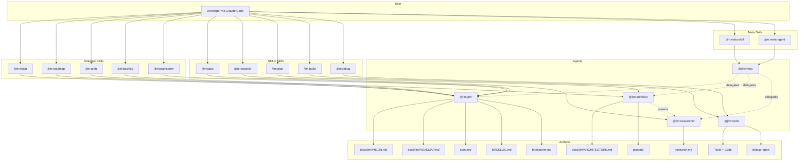

# Architecture — Jim

*Last updated: 2026-04-11*

> This document is generated and maintained by `/jim:arch`. Edit via the skill to preserve consistency.

---

## Project Structure

```
jim/
├── .claude-plugin/
│   └── plugin.json          # Plugin manifest — name, version, description
├── .claude/
│   └── settings.local.json  # Local permission allowlists (WebFetch domains, etc.)
├── agents/                  # Agent definitions — one .md per agent persona
│   ├── pm.md                # @jim:pm — product manager
│   ├── architect.md         # @jim:architect — technical architect
│   ├── researcher.md        # @jim:researcher — codebase investigator
│   ├── coder.md             # @jim:coder — TDD implementer
│   └── meta.md              # @jim:meta — plugin developer (builds jim itself)
├── skills/                  # Skill definitions — one directory per skill
│   ├── spec/                # /jim:spec — collaborative spec creation
│   ├── plan/                # /jim:plan — implementation planning
│   ├── research/            # /jim:research — codebase and landscape investigation
│   ├── build/               # /jim:build — TDD red-green-refactor execution
│   ├── debug/               # /jim:debug — structured failure diagnosis
│   ├── vision/              # /jim:vision — product vision and strategy
│   ├── roadmap/             # /jim:roadmap — execution milestones
│   ├── arch/                # /jim:arch — architecture document generation
│   ├── backlog/             # /jim:backlog — deferred work consolidation
│   ├── brainstorm/          # /jim:brainstorm — freeform ideation capture
│   ├── meta-skill/          # /jim:meta-skill — create/update jim skills
│   └── meta-agent/          # /jim:meta-agent — create/update jim agents
├── docs/
│   └── jim/                 # Jim project documentation
│       ├── specs/           # Numbered spec directories (001–007)
│       ├── prior-art/       # Reference material from other projects (gitignored downloads)
│       ├── notes/           # Personal development notes
│       ├── VISION.md        # Product vision — problem, solution, audience, north star
│       ├── ROADMAP.md       # Execution sequence
│       ├── WORKFLOW.md      # The SDLC process definition — commands, artifacts, philosophy
│       └── ARCHITECTURE.md  # This file
├── CLAUDE.md                # Claude Code project instructions
└── README.md                # Project readme
```

## High-Level System Diagram



## Core Components

### Agents

Agents are markdown files (`agents/*.md`) that define personas with frontmatter metadata. Each agent declares its name, description, skill bindings, tool permissions, and model preference.

- **Purpose:** Define the persona, responsibilities, and boundaries for each specialized role in the SDLC
- **Location:** `agents/` — `pm.md` (L1–75), `architect.md` (L1–81), `researcher.md` (L1–84), `coder.md` (L1–84), `meta.md` (L1–64)
- **Interfaces:** Frontmatter fields: `name`, `description`, `skills` (list), `tools` (list), `model` (string). Body contains persona instructions, context paths, core principles, process delegation, and constraints.
- **Dependencies:** Each agent references its bound skills in `skills/`. Agents may spawn other agents via the `Agent()` tool declaration (e.g., architect and PM can spawn researcher; meta can spawn PM, architect, researcher).
- **Key Constraints:** Agents do not cross domain boundaries — PM does not write code, coder does not modify specs, researcher does not make design decisions. All agents stop after producing an artifact and wait for human approval.

### Skills

Skills are SKILL.md files inside `skills/{name}/` directories, optionally accompanied by `assets/` (templates) and `references/` (methodology docs).

- **Purpose:** Provide the detailed process instructions that agents follow when a `/jim:{verb}` command is invoked
- **Location:** `skills/` — 12 skill directories (spec, plan, research, build, debug, vision, roadmap, arch, backlog, brainstorm, meta-skill, meta-agent)
- **Interfaces:** Frontmatter fields: `name`, `description`, `agent` (which agent runs this skill), `argument-hint`. Body contains step-by-step process, argument routing, validation checklists.
- **Dependencies:** Skills reference their `assets/` templates and `references/` docs. Skills are bound to agents via the `agent` frontmatter field (documentation convention, not runtime routing).
- **Key Constraints:** SKILL.md stays under 500 lines (progressive disclosure). Templates live in `assets/`, methodology in `references/`.

### Plugin Manifest

- **Purpose:** Declares jim as a Claude Code plugin with name, version, and metadata
- **Location:** `.claude-plugin/plugin.json` (L1–16)
- **Interfaces:** Standard Claude Code plugin JSON: `name`, `version`, `description`, `author`, `keywords`
- **Dependencies:** None — consumed by Claude Code's plugin loader
- **Key Constraints:** `name` must be `"jim"` — all skills and agents are namespaced under this

### WORKFLOW.md

- **Purpose:** Defines the entire SDLC process — command reference, artifact locations, agent-skill composition, lifecycle details, and philosophy
- **Location:** `docs/jim/WORKFLOW.md` (L1–431)
- **Interfaces:** Referenced by agents and skills as the canonical process definition
- **Dependencies:** None — upstream reference document
- **Key Constraints:** Single source of truth for the SDLC process. All agents and skills must be consistent with this document.

### Spec Archive

- **Purpose:** Living development artifacts — specs, research, and plans organized by group and sequential ID
- **Location:** `docs/jim/specs/{group}/{00X}-{name}/` — currently `docs/jim/specs/jim/001-meta/` through `008-backlog/`
- **Interfaces:** Each spec directory contains up to three files: `spec.md`, `research.md`, `plan.md`
- **Dependencies:** Produced by PM (spec), researcher (research), and architect (plan) agents
- **Key Constraints:** IDs are 3-digit zero-padded, sequential within each group. Groups are noun-based directories. Specs must be `approved` before plans can be created.

## Data Stores

| Store | Type | Location | Purpose | Owned By |
| :--- | :--- | :--- | :--- | :--- |
| Spec Archive | Markdown files | `docs/jim/specs/` | Persistent development artifacts — specs, research, plans | PM, Architect, Researcher |
| Strategic Docs | Markdown files | `docs/jim/` (`VISION.md`, `ROADMAP.md`, `ARCHITECTURE.md`) | Project-level strategy and constraints | PM, Architect |
| Backlog | Markdown file | `docs/jim/BACKLOG.md` | Consolidated deferred work — sourced items, user-authored ad-hoc items, cross-cutting themes | PM |
| Brainstorms | Markdown files | `docs/jim/brainstorms/` | Freeform ideation capture | PM |
| Debug Reports | Markdown files | `docs/jim/debug/` | Structured failure diagnosis | Coder |

## External Integrations

| Integration | Type | Auth Method | Rate Limits | Failure Mode |
| :--- | :--- | :--- | :--- | :--- |
| Claude Code | Host platform | N/A (plugin loaded by Claude Code) | N/A | Plugin not available if not installed |
| WebFetch/WebSearch | Claude Code tools | Domain allowlist in `.claude/settings.local.json` | Subject to provider limits | Stop and ask user to fetch manually (per CLAUDE.md policy) |

## Deployment & Infrastructure

- **Runtime:** Claude Code plugin — no standalone runtime. Requires Claude Code CLI with plugin support.
- **Entry point:** `.claude-plugin/plugin.json` — Claude Code discovers and loads the plugin from this manifest
- **Configuration:** `.claude/settings.local.json` for permission allowlists. No other configuration files.
- **Distribution:** Git repository. Users install by cloning/adding the repo as a Claude Code plugin.
- **Environment requirements:** Claude Code CLI. No build step, no dependencies, no package manager — pure markdown.

## Security Considerations

- **Trust boundary:** All input comes from the human developer via Claude Code. Agents do not accept external input. WebFetch/WebSearch results are the only external data — handled by stopping on failure per CLAUDE.md policy.
- **Secrets management:** No secrets are stored or managed. `.claude/settings.local.json` contains domain allowlists only.
- **File system access:** Agents declare tool permissions in frontmatter. Coder agent has Bash access. All agents are prohibited from writing to `.git/`, `~/.ssh/`, `node_modules/`, `.venv/`, `.env`, `.env-*`. The `.gitignore` excludes `docs/jim/prior-art/github.com/` (downloaded references) and `Z_*` files (personal notes).
- **Auth:** None — the plugin runs within the user's Claude Code session with their permissions.
- **Known risks:** No automated validation that agents respect their declared tool boundaries — enforcement depends on Claude Code's agent tool declarations and the model following instructions.

## Development & Testing

- **Setup:** Clone the repository and configure it as a Claude Code plugin
- **Run tests:** No automated test suite — jim is a pure-markdown plugin with no executable code
- **Test framework:** N/A
- **Test conventions:** Jim validates its own output through validation checklists embedded in each skill's process section
- **Linting / formatting:** N/A — markdown only. Consistency enforced by templates in `skills/*/assets/`

## Plugin Conventions

Conventions that govern how jim's agents, skills, and tools interact with Claude Code's runtime. These are easy to get wrong because some are jim-specific conventions layered on top of Claude Code mechanics.

### Naming

- **Skills:** `name` in frontmatter must match the directory name exactly (kebab-case). Enforced by the agentskills.io open standard.
- **Agents:** `name` in frontmatter must match the filename exactly (kebab-case, without `.md`).
- **Namespacing:** All skills appear as `/jim:{name}`, all agents as `@jim:{name}`. The `jim` prefix comes from the plugin name in `plugin.json`.

### Skill Invocation

- **Description is the trigger surface.** Skill descriptions are always in Claude's context. The full SKILL.md body loads only when the skill is invoked. Write descriptions that answer *what* and *when* — vague descriptions cause undertriggering.
- **`$ARGUMENTS` substitution.** When a user types `/jim:spec my-feature`, the string `my-feature` replaces `$ARGUMENTS` in the SKILL.md body. Skills use the `argument-hint` frontmatter field to document expected arguments.
- **The `agent:` field in skill frontmatter is a jim documentation convention, not a Claude Code routing mechanism.** Claude Code only uses `agent:` natively when paired with `context: fork`. Jim uses it as metadata to record which agent runs the skill — routing happens because the skill's instructions direct Claude to the right agent.

### Agent Invocation

- **Agent markdown body = full system prompt.** Agents receive only their markdown body plus basic environment details. They do NOT inherit the parent Claude Code system prompt or conversation context. Agent definitions must be self-contained.
- **`model` defaults to `inherit`, not `sonnet`.** Must explicitly set `model: sonnet` (or `opus`, `haiku`) in agent frontmatter — omitting it inherits the parent's model.
- **`skills` field preloads full content.** Skills listed in an agent's `skills` frontmatter are injected into the agent's context at startup. Agents do NOT inherit skills from the parent conversation.
- **Plugin agents have lowest priority (4).** Project-level `.claude/agents/` overrides plugin agents of the same name. This means users can customize or override any jim agent locally.

### Subagent Delegation

- **`Agent(name1, name2)` syntax** in the `tools` field restricts which subagents an agent can spawn. Example: `tools: [Read, Write, Edit, Glob, Grep, Agent(pm, architect, researcher)]`.
- **One level only.** Subagents cannot nest — parent → child works, parent → child → grandchild does not. This is a Claude Code platform constraint.
- **Fresh context.** Subagents start with only the prompt passed via the Agent tool, not the parent's conversation history.

### Progressive Disclosure

- **SKILL.md ≤ 500 lines.** Templates go in `assets/`, methodology docs in `references/`.
- **Agent body ≤ 800 tokens.** Keep agent definitions tight — delegate detail to preloaded skills.
- **`references/` files > 300 lines should have a ToC** at the top to help Claude find relevant sections without loading everything.

### Anti-Patterns

These are documented failure modes from prior art research (`docs/jim/specs/jim/001-meta/research.md`):

- **Personality Soup:** "I am an AI assistant here to help" — use direct second-person voice instead ("You are the technical architect for jim").
- **Permission Creep:** Write/Bash in a read-only agent's tool list — follow least privilege.
- **Instruction Shadowing:** Repeating rules already in CLAUDE.md — agents don't inherit CLAUDE.md, but skills that run in the main context do.
- **Duplicate Logic:** Same instructions in 3+ agents — extract to a shared skill instead.

## Glossary

| Term | Definition |
| :--- | :--- |
| Skill | A `/jim:{verb}` command defined in `skills/{name}/SKILL.md` — provides process instructions for an agent |
| Agent | A `@jim:{role}` persona defined in `agents/{name}.md` — executes one or more skills |
| Spec | A structured work definition (feature, bug, or refactor) in `docs/jim/specs/` |
| Phase gate | A human approval checkpoint between SDLC phases (e.g., spec → plan → build) |
| Tidy First | Commit discipline where structural changes are separated from behavioral changes |
| Differential update | Reading an existing artifact before modifying it — never overwrite blindly |
| Progressive disclosure | Keeping SKILL.md concise (<500 lines) by delegating detail to `assets/` and `references/` |
| Meta | Jim developing Jim — using `@jim:meta` agent with `/jim:meta-skill` and `/jim:meta-agent` to build plugin components |
