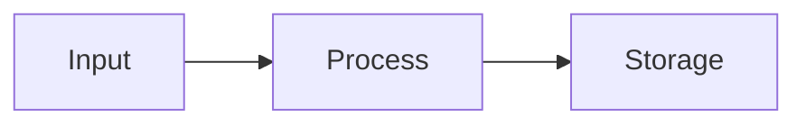
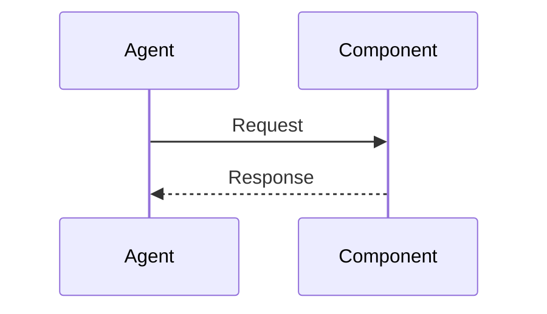

# [Title] — Plan

## Overview
[1-2 sentences summarizing the technical approach.]

## Design Decisions
*Documenting the 'Why' behind the 'How'.*

### [Decision 1: e.g., "Authentication Strategy"]
- **Chosen:** [What you selected]
- **Why:** [1 sentence rationale]
- **Rejected:** [Alternative] — [Why not, 1 sentence]

### [Decision 2]
- **Chosen:** [What you selected]
- **Why:** [1 sentence rationale]
- **Rejected:** [Alternative] — [Why not, 1 sentence]

## File Manifest
*The physical blueprint for the Coder agent.*

| Component | File Path | Action | Notes |
| :--- | :--- | :--- | :--- |
| [Model] | [path/to/file] | Create/Update | [e.g. "New User struct with email"] |
| [Service]| [path/to/file] | Create/Update | [e.g. "AuthService with Login method"] |

## Interface Contracts
*Define types, interfaces, or API shapes that implementation must follow.*

```[language]
// Define code interfaces or API schemas here to anchor the implementation
```

## Data Flow (System Level)
*Mermaid `flowchart` showing how data moves across components.*



## Logic & Process Flow (Component Level)
*Mermaid `sequenceDiagram` or `stateDiagram` for complex logic or timing-sensitive operations. Remove if trivial.*



## Task Breakdown
*Ordered by dependency. Each task is independently verifiable.*

1. [ ] [Task Description] — **Verify:** `[shell command]`
2. [ ] [Task Description] — **Verify:** `[shell command]`

## Out of Scope
*Technical items explicitly deferred to prevent scope creep.*

## Open Questions
- [ ] [Unresolved technical questions]
- [x] ~~[Resolved question]~~ → [Decision made]
