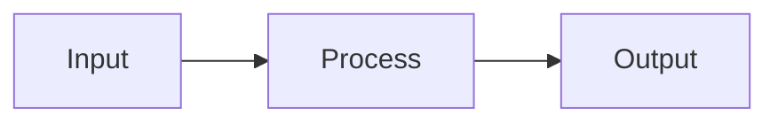

# [00X] [Title]

## Overview
[1-2 sentence description.]

<!-- For feature specs: include Problem Statement and User Stories -->
<!-- For bug specs: include Defect Profile -->
<!-- For refactor specs: include Refactor Rationale -->

## Problem Statement
[What user problem does this solve? Why does this need to exist?]

## User Stories
- As a [role], I can [action] so that [benefit]

## Defect Profile
- **Steps to Reproduce:** [1. Do x, 2. Do y...]
- **Actual Behavior:** [What is currently happening?]
- **Expected Behavior:** [What should happen?]

## Refactor Rationale
- **Motivation:** [Why now? What triggered this refactor?]
- **Current State:** [Technical debt or structural issue being addressed.]
- **Desired State:** [The architectural improvement target.]
- **Affected Systems:** [Subsystems touched by this change.]

## Acceptance Criteria
- [ ] [Specific, testable criterion]
- [ ] [Bug: "Regression test covers the reported scenario"]
- [ ] [Refactor: "Existing tests pass without modification"]

## UI Mockup
[ASCII wireframe. Remove if no UI changes.]

```
+----------------------------------+
| [Screen Title]                   |
+----------------------------------+
|                                  |
|   [Key elements here]            |
|                                  |
+----------------------------------+
```

## Data Flow
[Mermaid diagram. Remove if straightforward.]



## Out of Scope
[Explicit exclusions to prevent scope creep.]

- [Thing that might seem related but isn't included]

## Open Questions
[Unresolved questions. Write "None" if all questions resolved.]

- [ ] [Question that needs answering]
- [x] ~[Resolved question]~ → [Decision made]
