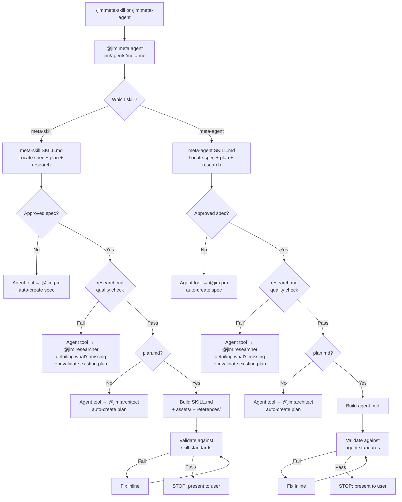

# Plan: @jim:meta Agent + /jim:meta-skill and /jim:meta-agent Skills

## Data Flow



## Design Decisions

### 1. Standards as inline references, not separate files (for now)

- **Chosen:** Embed the skill-standards and agent-standards validation checklists directly inside each SKILL.md (in a `## Validation Checklist` section) rather than in separate `references/skill-standards.md` and `references/agent-standards.md` files.
- **Why:** Both checklists are short (under 30 items each) and always needed during the build step -- no benefit to progressive disclosure at this size.
- **Rejected:** Separate `references/` files as shown in WORKFLOW.md directory tree. The overhead of loading a separate file is not justified when the checklist fits comfortably within the 500-line budget. We can extract later if the standards grow.

### 2. Agent body uses second-person voice ("You are...")

- **Chosen:** Follow the pattern from `~/.claude/agents/pm.md` and `~/.claude/agents/meta-architect.md` -- second-person "You are..." framing.
- **Why:** Consistent with every existing agent in the ecosystem and recommended by aitmpl.com research.
- **Rejected:** Third-person or role-card style. No precedent in this codebase.

### 3. Explicit `model: sonnet` for @jim:meta

- **Chosen:** Explicitly set `model: sonnet` in the agent frontmatter.
- **Why:** The Claude Code default is `inherit` (not `sonnet`), which makes the model unpredictable -- it depends on whatever the caller's session is using. Jim agents should pin their model explicitly so behavior is consistent regardless of invocation context. Sonnet is appropriate here because the meta agent produces structured markdown artifacts from specs (pattern-following, not novel reasoning). Opus would be justified only for complex architectural reasoning.
- **Rejected:** Omitting `model` (defaults to `inherit` -- unpredictable). Also rejected `model: opus` -- overkill for structured artifact generation.

### 4. Differential update strategy: read-then-diff

- **Chosen:** Both skills instruct the agent to read any existing artifact first, summarize proposed changes to the user, and apply via Edit (not Write) when updating.
- **Why:** Matches WORKFLOW.md Rule of Engagement #2 ("Differential Updates: never overwrite blindly") and the spec's acceptance criteria for differential updates.
- **Rejected:** Always Write (overwrite). Violates workflow conventions.

### 5. Delegation uses the Agent tool for automatic subagent spawning

- **Chosen:** Delegation to `@jim:pm`, `@jim:architect`, and `@jim:researcher` uses the Claude Code `Agent` tool for programmatic subagent spawning. The agent's `tools` field includes `Agent(pm, architect, researcher)` to scope which subagents can be spawned.
- **Why:** Claude Code natively supports agent-to-agent delegation via the `Agent` tool. This matches the spec's user story ("@jim:meta routes me to @jim:pm automatically"). The subagent receives a fresh context with only the prompt passed to it, and results return to the parent agent. Research is a prerequisite because it provides current platform documentation (e.g., Claude Code skill/agent capabilities) that directly informs how to build the artifact correctly.
- **Constraint:** Subagents cannot nest — only one level of delegation (meta → pm, meta → architect, meta → researcher). This is a Claude Code platform limitation, not a design choice.
- **Rejected:** Manual delegation ("tell the user to run `/jim:spec`"). This was the original plan but was based on incorrect research that Claude Code did not support subagent spawning. The spec explicitly says "automatic" routing.

### 6. `agent:` field in skill frontmatter is documentation-only

- **Chosen:** Include `agent: meta` in skill frontmatter as a jim convention for recording which agent runs the skill.
- **Why:** This is NOT a native Claude Code routing field. In official Claude Code docs, `agent:` only exists in skills when used with `context: fork` (isolated subagent execution). Jim uses it purely as metadata -- routing happens because the skill's description and instructions direct Claude to the right agent, not because Claude Code reads the `agent:` field. The coder must not implement any routing logic based on this field.
- **Rejected:** Using `context: fork` + `agent:` for actual routing. Unnecessary complexity -- jim agents and skills work within the same conversation context.

### 7. Skills accept `$ARGUMENTS` for spec/name hints

- **Chosen:** Both skills use `$ARGUMENTS` substitution and declare `argument-hint` in frontmatter so users can pass a skill/agent name directly (e.g., `/jim:meta-skill my-skill-name`).
- **Why:** `$ARGUMENTS` is the official Claude Code mechanism for passing user input to skills. Without it, the skill would have to ask the user what they want to build, adding an unnecessary round-trip.
- **Rejected:** Requiring users to always specify the spec path in conversation. Friction without benefit.

### 8. Agent body must be fully self-contained

- **Chosen:** The `meta.md` agent body includes all essential context: file path conventions, tool usage patterns, and reference to WORKFLOW.md. It does not assume any inherited system prompt.
- **Why:** Claude Code agents receive ONLY their markdown body as the system prompt, plus basic environment details (working directory, etc.). They do NOT inherit the full Claude Code system prompt. The agent must be self-contained to function correctly.
- **Rejected:** Assuming the agent inherits context from the parent conversation or Claude Code system prompt. This is factually incorrect per the official docs.

### 9. Research spot-check logic lives in skills

- **Chosen:** The 7-point quality spot-check for research.md is embedded in the meta-skill and meta-agent skill workflows, not in the agent body.
- **Why:** Protects @jim:meta's 800-token budget. The skills carry the detailed validation logic; the agent body just references the skills. Each skill specifies what domain knowledge it needs (meta-skill checks for skill docs, meta-agent checks for agent docs).
- **7-point check:**
  1. **Official Docs** — cites and summarizes Claude Code docs (skills and/or sub-agents as appropriate)
  2. **Platform Capabilities** — documents current frontmatter fields, mechanics, behavioral defaults
  3. **Prior Art** — includes 1-2+ concrete prior art examples with extracted patterns, not just links
  4. **Concrete Examples** — includes at least one real .md file to pattern-match against
  5. **Synthesis** — contains a "what to carry forward" section with actionable items
  6. **Freshness** — explicitly addresses current mechanics (no stale assumptions)
  7. **Spec Alignment** — frontmatter `spec:` field points to the correct spec

## File Manifest

| # | Component | File Path | Action | Notes |
|---|-----------|-----------|--------|-------|
| 1 | meta agent | `jim/agents/meta.md` | Update (currently empty placeholder) | Frontmatter: name, description, skills, tools (incl. `Agent(pm, architect, researcher)`), model. Body: role, methodology, process, constraints. Must stay under 800 tokens. |
| 2 | meta-skill skill | `jim/skills/meta-skill/SKILL.md` | Create | Frontmatter: name, description, agent. Body: trigger, spec/plan/research location logic, build instructions for skills, validation checklist, differential update process. Under 500 lines. |
| 3 | meta-agent skill | `jim/skills/meta-agent/SKILL.md` | Create | Frontmatter: name, description, agent. Body: trigger, spec/plan/research location logic, build instructions for agents, validation checklist, differential update process. Under 500 lines. |

No `assets/` or `references/` directories are needed for v1 -- the standards checklists fit within the SKILL.md body budget (see Design Decision #1).

## Interface Contracts

### Agent Frontmatter: `jim/agents/meta.md`

```yaml
---
name: meta
description: >
  Plugin developer for jim. Creates and maintains jim skills and agents
  from approved specs, plans, and research. Use when the user invokes /jim:meta-skill
  or /jim:meta-agent, or when discussing jim plugin component development.
skills: [meta-skill, meta-agent]
tools: [Agent(pm, architect, researcher), Read, Write, Edit, Glob, Grep]
model: sonnet
---
```

### Skill Frontmatter: `jim/skills/meta-skill/SKILL.md`

```yaml
---
name: meta-skill
description: >
  Create or update a jim plugin skill from an approved spec, plan, and research.
  Use when the user invokes /jim:meta-skill, asks to build a jim skill,
  or wants to create a SKILL.md for the jim plugin.
agent: meta                    # jim convention (documentation-only, not Claude Code routing)
argument-hint: "[skill-name]"
---
```

Note: `agent: meta` is a jim documentation convention recording which agent runs this skill. Claude Code does not use this field for routing. Routing works because the skill's description triggers in the right context and the agent's `skills` field preloads it.

### Skill Frontmatter: `jim/skills/meta-agent/SKILL.md`

```yaml
---
name: meta-agent
description: >
  Create or update a jim plugin agent from an approved spec, plan, and research.
  Use when the user invokes /jim:meta-agent, asks to build a jim agent,
  or wants to create an agent .md file for the jim plugin.
agent: meta                    # jim convention (documentation-only, not Claude Code routing)
argument-hint: "[agent-name]"
---
```

## Task Breakdown

### Task 1: Create `jim/skills/meta-skill/SKILL.md`

Write the meta-skill SKILL.md with:
- Frontmatter (name, description, agent, argument-hint) as specified in Interface Contracts above
- Note in the skill body that `agent: meta` is a documentation convention, not a Claude Code routing mechanism
- `$ARGUMENTS` handling: if the user passes a skill name (e.g., `/jim:meta-skill my-skill-name`), use `$ARGUMENTS` as a hint for which spec/skill to look for. If empty, ask the user or scan `docs/jim/specs/` for candidates.
- Trigger conditions section explaining when this skill activates
- Process section with 3-gate structure:
  - Gate 1 (Spec): Locate approved spec.md → if missing, delegate to @jim:pm
  - Gate 2 (Research Quality): Read research.md, evaluate against 7-point check → if missing or fails ANY check, delegate to @jim:researcher detailing exactly what is missing + invalidate existing plan (tell user to re-run @jim:architect after research is fixed)
  - Gate 3 (Plan): Locate plan.md → if missing, delegate to @jim:architect
  - After all gates pass: read spec + plan + research, build `jim/skills/{name}/SKILL.md` with proper frontmatter and structure, create `assets/` and `references/` subdirs if content would overflow 500 lines, validate, present to user
- Validation checklist for skills (from spec "Standards Applied" and research "Validation checklist"):
  - `name` matches directory name exactly -- this is an open-standard-level requirement (agentskills.io), not just a jim convention
  - Frontmatter fields present: name, description, agent
  - Body under 500 lines
  - `agent:` references a valid jim agent name
  - Description includes triggering conditions (when to use, not just what it does)
  - Instructions use imperative form
  - No anti-patterns (personality soup, permission creep, instruction shadowing, duplicate logic)
- Differential update instructions: if SKILL.md already exists, read it first, summarize proposed changes, use Edit not Write
- Reference to WORKFLOW.md for SDLC context

**Verify:**
```bash
test -f /home/adri/projects/JamSuite/repos/jim/skills/meta-skill/SKILL.md && head -10 /home/adri/projects/JamSuite/repos/jim/skills/meta-skill/SKILL.md | grep -q "name: meta-skill" && wc -l < /home/adri/projects/JamSuite/repos/jim/skills/meta-skill/SKILL.md | awk '{exit ($1 > 500)}'
```

### Task 2: Create `jim/skills/meta-agent/SKILL.md`

Write the meta-agent SKILL.md with:
- Frontmatter (name, description, agent, argument-hint) as specified in Interface Contracts above
- Note in the skill body that `agent: meta` is a documentation convention, not a Claude Code routing mechanism
- `$ARGUMENTS` handling: if the user passes an agent name (e.g., `/jim:meta-agent my-agent-name`), use `$ARGUMENTS` as a hint for which spec/agent to look for. If empty, ask the user or scan `docs/jim/specs/` for candidates.
- Trigger conditions section
- Process section with 3-gate structure:
  - Gate 1 (Spec): Locate approved spec.md → if missing, delegate to @jim:pm
  - Gate 2 (Research Quality): Read research.md, evaluate against 7-point check → if missing or fails ANY check, delegate to @jim:researcher detailing exactly what is missing + invalidate existing plan (tell user to re-run @jim:architect after research is fixed)
  - Gate 3 (Plan): Locate plan.md → if missing, delegate to @jim:architect
  - After all gates pass: read spec + plan + research, build `jim/agents/{name}.md` with proper frontmatter and structure, validate, present to user
- Validation checklist for agents (from spec "Standards Applied" and research):
  - `name` matches filename exactly (kebab-case) -- open-standard-level requirement (agentskills.io)
  - Frontmatter fields present: name, description, tools, model (plus skills if applicable)
  - `model` must be explicitly set (do not omit -- the Claude Code default `inherit` is unpredictable)
  - Body under 800 tokens
  - Second-person voice ("You are...")
  - Body is fully self-contained (it becomes the entire system prompt -- no Claude Code system prompt inheritance)
  - Description includes triggering conditions
  - Tools list follows least privilege
  - No anti-patterns (personality soup, permission creep, instruction shadowing, duplicate logic)
- Differential update instructions: same read-first-then-Edit approach
- Reference to WORKFLOW.md for SDLC context

**Verify:**
```bash
test -f /home/adri/projects/JamSuite/repos/jim/skills/meta-agent/SKILL.md && head -10 /home/adri/projects/JamSuite/repos/jim/skills/meta-agent/SKILL.md | grep -q "name: meta-agent" && wc -l < /home/adri/projects/JamSuite/repos/jim/skills/meta-agent/SKILL.md | awk '{exit ($1 > 500)}'
```

### Task 3: Write `jim/agents/meta.md`

Replace the empty placeholder with the full agent definition. **Critical constraint:** the agent markdown body becomes the ENTIRE system prompt. The agent does NOT inherit the Claude Code system prompt, CLAUDE.md, or any parent conversation context. It receives only its own markdown body plus basic environment details (working directory, OS). The body must be fully self-contained.

Contents:
- Frontmatter as specified in Interface Contracts above (note: `model: sonnet` is explicit because the Claude Code default `inherit` would be unpredictable)
- Role definition: "You are the plugin developer for jim..."
- Essential context the agent needs to function (since it has no inherited context):
  - Jim plugin root path convention: the plugin lives at the project root under `jim/`
  - Key file locations: `jim/skills/{name}/SKILL.md`, `jim/agents/{name}.md`, `docs/jim/specs/`, `docs/jim/WORKFLOW.md`
  - Tool usage: Read for loading specs/plans/research/existing artifacts, Glob for finding files, Grep for searching, Write for new files, Edit for updates, Agent for delegating to @jim:pm, @jim:architect, and @jim:researcher
- Methodology: how meta approaches building components (read spec + plan, match existing patterns, validate against standards)
- Process: ordered steps for handling a `/jim:meta-skill` or `/jim:meta-agent` invocation -- the skills contain the detailed instructions, so the agent body should focus on high-level orchestration and constraints
- Constraints: no Bash, no application code, stop after presenting artifact, differential updates only
- Must stay under 800 tokens in body (tight -- prioritize essential context over verbose instructions since the skills carry the detail)

**Verify:**
```bash
head -10 /home/adri/projects/JamSuite/repos/jim/agents/meta.md | grep -q "name: meta" && head -10 /home/adri/projects/JamSuite/repos/jim/agents/meta.md | grep -q "skills:.*meta-skill.*meta-agent\|skills: \[meta-skill, meta-agent\]"
```

### Task 4: Cross-validate all three artifacts

Read all three files and verify:
- `meta.md` frontmatter `skills` field lists exactly `[meta-skill, meta-agent]`
- `meta-skill/SKILL.md` frontmatter `agent` field is `meta`
- `meta-agent/SKILL.md` frontmatter `agent` field is `meta`
- `meta.md` frontmatter `tools` field is exactly `[Agent(pm, architect, researcher), Read, Write, Edit, Glob, Grep]` (no Bash)
- `meta.md` body is under 800 tokens (estimate: under ~200 lines of markdown)
- Both SKILL.md files are under 500 lines
- All `name` fields match their filename/directory (meta, meta-skill, meta-agent)
- No anti-patterns: no personality soup, no permission creep, no instruction shadowing of WORKFLOW.md content, no duplicate logic between the two skills

**Verify:**
```bash
grep -q "agent: meta" /home/adri/projects/JamSuite/repos/jim/skills/meta-skill/SKILL.md && grep -q "agent: meta" /home/adri/projects/JamSuite/repos/jim/skills/meta-agent/SKILL.md && grep -q "meta-skill" /home/adri/projects/JamSuite/repos/jim/agents/meta.md && grep -q "meta-agent" /home/adri/projects/JamSuite/repos/jim/agents/meta.md && echo "Cross-validation passed"
```

## Dependencies

```
Task 1 (meta-skill SKILL.md)  ──┐
                                 ├──► Task 3 (meta.md agent) ──► Task 4 (cross-validate)
Task 2 (meta-agent SKILL.md)  ──┘
```

Tasks 1 and 2 are independent and can be done in either order. Task 3 depends on 1 and 2 being complete so the agent can accurately reference its skills. Task 4 is the final validation pass.

## Notes

- **`@jim:architect` and `@jim:researcher` do not exist yet.** The spec references them for plan and research delegation. Their files `agents/architect.md` and `agents/researcher.md` are empty placeholders. The `Agent(pm, architect, researcher)` scoped tool in meta's frontmatter will attempt to spawn these agents — they must exist for automatic delegation to work. Until they are built, the Agent tool call will fail gracefully and @jim:meta should fall back to telling the user which command to run.
- **No `references/` or `assets/` subdirectories** are created in this plan. If the standards checklists grow beyond what fits in the SKILL.md body, a future iteration should extract them into `references/skill-standards.md` and `references/agent-standards.md`.
- **Acceptable duplication between skills.** The two skills share similar structure (locate spec, locate plan, delegate if missing, build, validate). Some duplication is acceptable because the build and validation logic differs meaningfully between skills and agents. Extracting a shared "locate-and-gate" skill would be premature.
- **`agent:` field is not routing.** Both skills include `agent: meta` in frontmatter. This is a jim documentation convention only. Claude Code does not read this field for routing purposes (see Design Decision #6). The coder must not build any routing logic around it.
- **`name` matching is standard-level.** The `name`-must-match-directory/filename constraint comes from the Agent Skills Open Standard (agentskills.io), not just jim convention. It is enforced by `skills-ref validate` and by Claude Code itself. Both validation checklists must treat this as a hard failure, not a warning.
- **Agent body = entire system prompt.** Per Claude Code docs, agents receive ONLY their markdown body plus basic environment info. No Claude Code system prompt, no CLAUDE.md, no parent conversation context is inherited. The `meta.md` body must be self-contained within its 800-token budget. The `skills` frontmatter field helps here -- it preloads the full content of `meta-skill` and `meta-agent` SKILL.md files into the agent's context at startup, so the agent body can stay lean and delegate detail to the skills.
