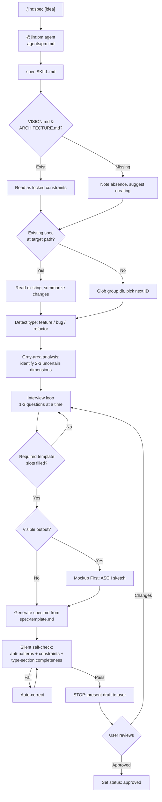

# Plan: @jim:pm Agent + /jim:spec Skill

## Overview

Deliver the PM agent (`agents/pm.md`) and its primary skill `/jim:spec` (`skills/spec/SKILL.md`) with supporting template and type reference. The skill drives a multi-turn interview that turns rough ideas into structured specs using gray-area analysis, type detection, and anti-pattern checking.

## Data Flow



## Design Decisions

### 1. Single template with type-conditional markers

- **Chosen:** One `spec-template.md` file with `<!-- feature only -->`, `<!-- bug only -->`, `<!-- refactor only -->` markers.
- **Why:** Matches the spec requirement ("covering all three types with clear section markers") and keeps maintenance to one file. The skill strips irrelevant sections during generation.
- **Rejected:** Three separate templates per type — triplicates shared sections (Overview, Acceptance Criteria, Out of Scope) and creates drift risk.

### 2. Gray-area dimensions as a concrete checklist

- **Chosen:** Define 6 fixed dimension categories the PM evaluates: scope boundaries, target user, edge cases, interaction model, data shape, acceptance criteria testability. The PM picks the 2-3 most uncertain and presents them with numbered options + escape hatch.
- **Why:** Turns the abstract "gray-area analysis" into a repeatable algorithm. Without concrete dimensions, the PM falls back to generic questions — exactly what the spec aims to fix.
- **Rejected:** Free-form uncertainty analysis — too dependent on LLM reasoning quality; produces inconsistent results across invocations.

### 3. Interview exit condition: answer-to-slot mapping

- **Chosen:** The spec is "writable" when the PM can meaningfully populate the required template sections for the detected type, having asked no more than 3-5 questions per topic area. No numeric confidence scores.
- **Why:** LLMs are unreliable self-scorers. Structural completeness (can I fill the template?) is observable and actionable. The bounded question count prevents infinite loops.
- **Rejected:** Confidence thresholds ("I'm 80% confident") — unverifiable and inconsistent.

### 4. Agent body stays lean, delegates to spec skill

- **Chosen:** The PM agent body focuses on identity, key paths, and constraints (~800 tokens). All methodology (interview technique, gray-area, anti-patterns, type detection) lives in the spec SKILL.md. Future skills (vision, roadmap, brainstorm) won't require a body rewrite.
- **Why:** The `skills` frontmatter field preloads full SKILL.md content at startup, so the agent body doesn't need to duplicate it. This also protects the 800-token budget when 003-pm-strategy adds 3 more skills.
- **Rejected:** Rich methodology in the agent body — would exceed 800 tokens and need rewriting when 003 adds skills.

### 5. Type reference in `references/` not inline

- **Chosen:** Anti-patterns, per-type required sections, and status lifecycle live in `skills/spec/references/spec-types.md` (~150-200 lines), not inline in SKILL.md.
- **Why:** SKILL.md has a 500-line budget. The interview process flow alone is substantial. Keeping reference material separate follows the progressive disclosure pattern from WORKFLOW.md and matches the `meta-skill` pattern of inline checklists only when they're short.
- **Rejected:** Inline in SKILL.md — would consume too much of the 500-line budget.

### 6. `origin:` as optional list in frontmatter

- **Chosen:** Add `origin:` as an optional frontmatter field (list of relative paths) to the spec template, linking to source brainstorms, debug docs, or other upstream artifacts.
- **Why:** Spec requires traceability back to source documents. A list supports multiple origins (e.g., a brainstorm + a debug doc that both feed into one spec).
- **Rejected:** Single string field — too limiting when multiple source documents exist.

### 7. ID assignment deferred to generation, not interview start

- **Chosen:** The skill Globs for existing specs in the target group and picks `max(existing IDs) + 1` immediately before writing the file, not at the start of the interview.
- **Why:** Prevents ID collision if two spec-creation runs happen concurrently in the same group. The ID is only meaningful at write time.
- **Rejected:** Assigning ID upfront — stale if another spec is created during the interview.

### 8. Explicit `model: sonnet` for @jim:pm

- **Chosen:** Pin `model: sonnet` in the PM agent frontmatter.
- **Why:** Same rationale as 001-meta: `inherit` is unpredictable. Sonnet is appropriate for conversational interview and structured markdown generation. The PM doesn't need Opus-level reasoning.
- **Rejected:** `model: inherit` (unpredictable) or `model: opus` (overkill for interview + markdown generation).

### 9. Mockup First for specs with visible output

- **Chosen:** PM produces ASCII wireframes during the interview before writing acceptance criteria for any spec with user-facing output.
- **Why:** Early visual alignment prevents spec-to-implementation drift. ASCII keeps fidelity low so it doesn't constrain the architect's layout decisions.
- **Rejected:** Deferring all UI to the architect/coder — delays alignment and risks the spec describing behavior the user didn't envision.

## File Manifest

| # | Component | File Path | Action | Notes |
|---|-----------|-----------|--------|-------|
| 1 | Spec template | `skills/spec/assets/spec-template.md` | Create | Output template with type-conditional markers, `origin:` frontmatter, all shared + type-specific sections |
| 2 | Type reference | `skills/spec/references/spec-types.md` | Create | Per-type required sections, interview focus, 6 anti-patterns with examples, status lifecycle. ~150-200 lines |
| 3 | Spec skill | `skills/spec/SKILL.md` | Create | Interview-driven spec creation workflow. Frontmatter + process flow + validation checklist. ≤500 lines |
| 4 | PM agent | `agents/pm.md` | Update (currently 1-line placeholder) | Full agent definition. Frontmatter with 4 skills listed + body ≤800 tokens |

## Interface Contracts

### Agent Frontmatter: `agents/pm.md`

```yaml
---
name: pm
description: >
  Product manager for jim. Turns rough ideas into structured specs through
  collaborative interview. Maintains strategic alignment with vision and
  roadmap. Use when the user invokes /jim:spec, asks to scope work, define
  requirements, or write a spec. Do not use for technical planning, code
  implementation, or building jim plugin components.

  Examples:

  <example>
  Context: The user has a rough idea for a new feature.
  user: "/jim:spec add a review step to the workflow"
  assistant: "I'll interview you to scope this feature. Let me check existing specs and strategic docs first."
  <commentary>
  Direct invocation of /jim:spec — @jim:pm handles spec creation.
  </commentary>
  </example>

  <example>
  Context: The user reports a bug.
  user: "the build command isn't running tests before committing"
  assistant: "That sounds like a bug. Let me scope this — I'll ask about reproduction steps and environment."
  <commentary>
  Bug description triggers @jim:pm for a bug spec. Type is inferred, not asked.
  </commentary>
  </example>

  <example>
  Context: The user wants to implement code.
  user: "build the login page from the spec"
  assistant: "That's implementation work — use /jim:build or @jim:coder for that."
  <commentary>
  @jim:pm scopes work, it doesn't build. Route to the right agent.
  </commentary>
  </example>
skills: [spec, vision, roadmap, brainstorm]
tools: [Read, Write, Edit, Glob, Grep, Agent(researcher)]
model: sonnet
---
```

### Skill Frontmatter: `skills/spec/SKILL.md`

```yaml
---
name: spec
description: >
  Create or update a feature, bug, or refactor spec through collaborative
  interview. Use when the user invokes /jim:spec, describes an idea they
  want scoped, reports a bug, or wants to refine an existing spec. Do not
  use for technical planning (/jim:plan) or implementation (/jim:build).
agent: pm
argument-hint: "[idea-or-name]"
---
```

#### `$ARGUMENTS` Behavior

| Input | Behavior |
|-------|----------|
| Empty | Prompt user for idea |
| String | Treat as idea/name hint, begin interview with it as seed |
| Path to existing spec | Enter differential update mode (step 11) |

### Spec Template Frontmatter: `skills/spec/assets/spec-template.md`

```yaml
---
title: "{title}"
type: feature | bug | refactor
group: "{group}"
id: "{00X}"
status: draft
origin:                           # optional — list of source documents
  - "{relative/path/to/source}"
---
```

## Task Breakdown

### Task 1: Create `skills/spec/assets/spec-template.md`

Write the spec output template. This is the artifact the skill generates — not the skill itself.

Contents:
- Frontmatter with all fields from Interface Contracts above, including optional `origin:` list
- Shared sections (all types): Overview, Acceptance Criteria, Out of Scope, Open Questions
- Feature-only sections: Problem Statement, User Stories
- Bug-only section: Defect Profile (Steps to Reproduce, Actual Behavior, Expected Behavior, Environment)
- Refactor-only section: Refactor Rationale (Motivation, Current State, Desired State, Affected Systems)
- Optional sections with guidance: UI Mockup (ASCII wireframe), Data Flow (Mermaid diagram)
- Type-conditional markers using `<!-- feature only -->` / `<!-- bug only -->` / `<!-- refactor only -->` comments
- Bug acceptance criteria always includes "Regression test covers the reported scenario"
- Refactor acceptance criteria always includes "Existing tests pass without modification"

Evolve from V1 template (`docs/jim/prior-art/V1SDLC/V1-SPEC_TEMPLATE.md`) — keep the same structure but add `origin:` frontmatter and clearer type-conditional markers.

**Verify:**
```bash
test -f skills/spec/assets/spec-template.md && grep -q "origin:" skills/spec/assets/spec-template.md && grep -q "feature only" skills/spec/assets/spec-template.md && grep -q "bug only" skills/spec/assets/spec-template.md && grep -q "refactor only" skills/spec/assets/spec-template.md
```

### Task 2: Create `skills/spec/references/spec-types.md`

Write the type reference document. This is read by the skill during interviews and self-checks.

Contents:
- **Per-type guidance** (3 sections: feature, bug, refactor):
  - Required template sections for each type
  - Interview focus areas (what to ask about)
  - Common pitfalls per type
- **Anti-patterns** (the 6 from the spec, each with a name, description, example, and remedy):
  1. Kitchen Sink — spec tries to do too much → suggest splitting
  2. Vague Criteria — untestable acceptance criteria → make measurable
  3. Solution Masquerading — describes solution not problem → reframe
  4. Empty Out of Scope — no exclusions → boundaries too soft
  5. Premature Tech — specifies DB schemas or APIs → that's the architect's job
  6. Wrong Type — using feature sections for a bug → switch type
- **Status lifecycle:** `draft → approved → in-progress → complete → deprecated`
- **Traceability guidance:** when and how to use the `origin:` field

Target ~150-200 lines. No table of contents needed (under 300 lines).

**Verify:**
```bash
test -f skills/spec/references/spec-types.md && grep -q "Kitchen Sink" skills/spec/references/spec-types.md && grep -q "Vague Criteria" skills/spec/references/spec-types.md && grep -q "status" skills/spec/references/spec-types.md && wc -l < skills/spec/references/spec-types.md | awk '{exit ($1 > 300)}'
```

### Task 3: Create `skills/spec/SKILL.md`

Write the spec skill — the core interview-driven workflow.

Frontmatter as specified in Interface Contracts above (name, description, agent, argument-hint).

Body structure, organized around the process flow from the spec:

1. **`$ARGUMENTS` handling** — use as idea/name hint. If empty, ask the user what they want to scope.

2. **Read strategic context** — Read docs/jim/VISION.md and docs/jim/ARCHITECTURE.md (if they exist). These are locked constraints. If missing, note conversationally and suggest creating them, but proceed. Read the `references/spec-types.md` for type guidance.

3. **Check existing specs** — Glob `docs/jim/specs/{group}/` to find existing specs. If `$ARGUMENTS` matches an existing spec name, ask: update existing or create new? Determine next available ID (max existing + 1) but don't assign it yet (deferred to generation).

4. **Detect spec type** — Infer from context: broken behavior → bug, new capability → feature, code quality/structure → refactor. If ambiguous, ask user to confirm. For bugs, ask if there's a debug document to link.

5. **Gray-area analysis** — Analyze the idea against 6 dimension categories: scope boundaries, target user, edge cases, interaction model, data shape, acceptance criteria testability. Present the 2-3 most uncertain dimensions with numbered options + "describe your own" escape hatch. Let user choose what to discuss first.

6. **Interview loop** — 1-3 questions at a time. Recursive drill-down on vague statements. Each question targets a specific template slot (answer-to-slot mapping). Cap at 3-5 questions per topic area. For specs with visible output, produce ASCII mockup before acceptance criteria (Mockup First). Flag anti-patterns as they arise (reference `spec-types.md`). If VISION.md exists and idea conflicts, raise conversationally — never block.

7. **Exit condition** — The spec is writable when the PM can meaningfully populate the required template sections for the detected type. No confidence scores.

8. **Generate spec.md** — Assign ID now (Glob for max + 1). Read `assets/spec-template.md`. Include only type-relevant sections. Reference vision/roadmap alignment if strategic docs exist. Populate `origin:` if source documents were referenced. Fill Open Questions with unresolved items.

9. **Silent self-check** — Before presenting, validate against: (a) 6 anti-patterns from `spec-types.md`, (b) locked constraints from VISION.md/ARCHITECTURE.md, (c) type-section completeness (right sections for right type). Auto-correct if violations found.

10. **Present and stop** — Show draft to user. Status is `draft`. Ask if they want changes or approval. Never auto-approve. If user approves, set `status: approved`.

11. **Differential update path** — If spec.md already exists at the target path: read it, summarize proposed changes by section, ask whether to update in place or create a new increment. Use Edit not Write.

Constraints:
- ≤500 lines total
- Imperative form throughout
- No personality soup
- No instruction shadowing of WORKFLOW.md
- Reference `assets/spec-template.md` and `references/spec-types.md` — don't inline their content

**Verify:**
```bash
test -f skills/spec/SKILL.md && head -10 skills/spec/SKILL.md | grep -q "name: spec" && grep -q "agent: pm" skills/spec/SKILL.md && grep -q "Gray-area\|gray-area\|gray area" skills/spec/SKILL.md && wc -l < skills/spec/SKILL.md | awk '{exit ($1 > 500)}'
```

### Task 4: Write `agents/pm.md`

Replace the 1-line placeholder with the full PM agent definition.

**Critical constraint:** the agent markdown body becomes the ENTIRE system prompt. No Claude Code system prompt, no CLAUDE.md, no parent conversation context is inherited. The body must be fully self-contained.

Frontmatter as specified in Interface Contracts above. Key points:
- `skills: [spec, vision, roadmap, brainstorm]` — all 4 listed even though only `spec` exists now
- `tools: [Read, Write, Edit, Glob, Grep, Agent(researcher)]` — no Bash. `Agent(researcher)` enables PM to delegate technical research during brainstorm or spec creation.
- `model: sonnet`
- Description includes 3 `<example>` blocks (positive, type-inferred, negative)

Body (~800 token budget):
- Role definition: "You are the product manager for jim..." Establish the PM as a collaborative conversational partner, not an autonomous gatekeeper.
- Essential context (since no inherited context):
  - Key paths: `docs/jim/specs/{group}/{00X}-{name}/`, `docs/jim/VISION.md`, `docs/jim/ARCHITECTURE.md`, `docs/jim/ROADMAP.md`
  - Spec groups are noun-based, IDs are 3-digit zero-padded
- Core principles (brief — detail lives in skills):
  - Collaborative partner, not gatekeeper — raise concerns, never block
  - Human approval required for status changes
  - Differential updates on existing artifacts
  - Strategic alignment when docs exist
- Reference to skills for methodology: "Follow the active skill's instructions for detailed process."
- Constraints: no technical solutions (that's architect), no implementation (that's coder), no effort estimates, stop and wait for human approval

**Verify:**
```bash
head -10 agents/pm.md | grep -q "name: pm" && grep -q "skills:.*spec" agents/pm.md && grep -q "model: sonnet" agents/pm.md && grep -q "tools:.*Read.*Write.*Edit.*Glob.*Grep" agents/pm.md
```

### Task 5: Cross-validate all four artifacts

Read all four files and verify:
- `agents/pm.md` frontmatter `skills` lists `[spec, vision, roadmap, brainstorm]`
- `agents/pm.md` frontmatter `tools` is `[Read, Write, Edit, Glob, Grep]` (no Bash, no Agent)
- `agents/pm.md` `model: sonnet`
- `agents/pm.md` body is under 800 tokens
- `agents/pm.md` body is self-contained (references key paths, doesn't assume inherited context)
- `skills/spec/SKILL.md` frontmatter `agent` is `pm`
- `skills/spec/SKILL.md` is under 500 lines
- `skills/spec/SKILL.md` references `assets/spec-template.md` and `references/spec-types.md`
- `skills/spec/assets/spec-template.md` has `origin:` field and type-conditional markers
- `skills/spec/references/spec-types.md` has all 6 anti-patterns and status lifecycle
- All `name` fields match their filename/directory (pm, spec)
- No anti-patterns: no personality soup, no permission creep, no instruction shadowing, no duplicate logic between agent body and SKILL.md

**Verify:**
```bash
grep -q "agent: pm" skills/spec/SKILL.md && grep -q "spec" agents/pm.md && grep -q "model: sonnet" agents/pm.md && grep -q "origin:" skills/spec/assets/spec-template.md && grep -q "Kitchen Sink" skills/spec/references/spec-types.md && ! grep -q "gray.area\|anti.pattern\|Kitchen Sink" agents/pm.md && echo "Cross-validation passed"
```

## Dependencies

```
Task 1 (spec-template.md)  ──┐
                              ├──► Task 3 (SKILL.md) ──┐
Task 2 (spec-types.md)     ──┘                         ├──► Task 5 (cross-validate)
                                                        │
                              Task 4 (pm.md agent)    ──┘
```

Tasks 1 and 2 are independent — the template and type reference have no dependencies on each other.

Task 3 depends on 1 and 2 because the skill references both files and needs to know their exact structure.

Task 4 is independent of tasks 1-3 (the agent body doesn't reference skill internals — it just lists `spec` in `skills` and delegates). However, it's sequenced here for clarity.

Task 5 validates the full set and depends on all prior tasks.

## Out of Scope

- **Strategic skills** — `/jim:vision`, `/jim:roadmap`, `/jim:brainstorm` skills are 003-pm-strategy deliverables. Only listed in `skills:` frontmatter, not built.
- **Automated spec validation tooling** — no scripts, no CI. Validation is inline in the skill.
- **Cross-spec dependency graphs** — the PM flags potential side effects but doesn't manage dependencies.
- **`@jim:architect`, `@jim:researcher`, `@jim:coder` agents** — separate specs.

## Open Questions

None — all questions resolved through spec discussion and research findings.

## Notes

- **3 of 4 skills don't exist yet.** The `agents/pm.md` frontmatter lists `skills: [spec, vision, roadmap, brainstorm]` but only `spec` is delivered here. Claude Code handles missing skills gracefully — they appear in the skills list but don't preload content.
- **VISION.md and ARCHITECTURE.md are empty.** The spec skill must handle their absence gracefully. This is tested by the current state of the repository.
- **ID collision risk is mitigated by design.** ID assignment is deferred to the moment of file creation (Design Decision #7), not the start of the interview.
- **`agent: pm` is documentation-only.** Same convention as 001-meta. Not a Claude Code routing field.
- **Agent body = entire system prompt.** Per Claude Code docs, agents receive only their markdown body. The PM agent body must be self-contained within 800 tokens. The `skills` field preloads `spec` SKILL.md content at startup, so the body stays lean.
