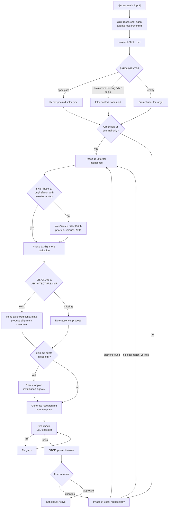

# Plan: Researcher Agent and Skill

## Overview

Deliver the researcher agent (`agents/researcher.md`) and its primary skill `/jim:research` (`skills/research/SKILL.md`) with a supporting research output template. The agent runs a tiered three-phase workflow — local archaeology, conditional external intelligence, mandatory alignment validation — producing a `research.md` grounded in codebase anchors rather than assumptions.

## Data Flow



## Design Decisions

### 1. Single agent with model tiering via skill instructions

- **Chosen:** Agent frontmatter sets `model: sonnet`. Skill instructions direct high-volume local scanning (Phase 0 Glob/Grep sweeps) to `Agent(Explore)` subagents which run on haiku. Final synthesis and alignment validation run on sonnet (the agent itself).
- **Why:** Claude Code only supports one `model:` field per agent. Tiering through delegation matches the spec requirement ("model tiering via skill instructions, not agent frontmatter") and keeps Phase 0 cost-effective while Phase 2 synthesis gets sonnet-level reasoning.
- **Rejected:** Two separate agents (researcher-local, researcher-web) — adds coordination overhead, doesn't match the spec's single-agent design.

### 2. Research template in `assets/`, not inline in SKILL.md

- **Chosen:** `skills/research/assets/research-template.md` provides the structural skeleton for `research.md`. The skill references it; the agent fills it.
- **Why:** The research.md output has 7+ sections with conditional inclusion logic. Inlining would consume ~100 lines of the 500-line SKILL.md budget. Matches the pattern from 002-pm-core (spec-template.md) and 003-pm-strategy (vision-template.md, roadmap-template.md).
- **Rejected:** Inline template — too large, violates progressive disclosure.

### 3. DoD checklist in `references/`, not inline

- **Chosen:** `skills/research/references/research-dod.md` contains the Definition of Done checklist adapted from V1's `v1-researcher-skill.md`. The skill references it for self-check.
- **Why:** The DoD has 10+ checkable items with examples. Keeping it in `references/` follows the pattern from 002-pm-core (`spec-types.md` in references) and keeps SKILL.md focused on process flow. Also serves as the basis for the existing `research:check` validation skill.
- **Rejected:** Inline in SKILL.md — would consume ~50-80 lines of the 500-line budget for reference material.

### 4. Phase 0 uses Agent(Explore) for bulk scanning

- **Chosen:** Phase 0 dispatches codebase archaeology to an `Agent(Explore)` subagent with a focused prompt: "find all files matching X, grep for Y patterns, read Z files." The researcher synthesizes the results.
- **Why:** Explore agents run on haiku and are optimized for high-volume Glob/Grep/Read operations. This is the model tiering mechanism — bulk scanning is cheap, synthesis is expensive. The spec explicitly calls for haiku-tier work delegated to subagents.
- **Rejected:** Direct Glob/Grep from the researcher agent — works but runs every operation at sonnet cost. The savings justify the delegation overhead.

### 5. Flexible input routing via $ARGUMENTS pattern matching

- **Chosen:** The skill checks `$ARGUMENTS` against a simple priority order: (1) file path ending in `spec.md` → spec mode, (2) file path ending in `.md` → read and infer context, (3) directory path → scan directory, (4) string → treat as topic. Each mode adjusts the Phase 0/1 balance but all converge on the same output structure.
- **Why:** The spec requires accepting spec paths, brainstorm paths, debug doc paths, directories, and arbitrary topics. A unified routing table keeps the skill simple while covering all inputs.
- **Rejected:** Separate sub-skills per input type — violates the single-skill design and creates maintenance overhead.

### 6. Peer Feedback as structured section, not separate artifact

- **Chosen:** Peer Feedback is a conditional section at the bottom of `research.md`, containing structured signals for PM (spec feasibility) or Architect (plan invalidation). The researcher also surfaces these conversationally when presenting the research.
- **Why:** The spec requires both passive (structured sections) AND active (conversational surfacing) notifications. Keeping feedback in `research.md` ensures it persists and is discoverable by downstream agents. Conversational surfacing happens at the presentation step.
- **Rejected:** Separate `feedback.md` artifact — adds file sprawl, doesn't match the spec's "section in research.md" design.

### 7. Non-spec output location confirmed with user

- **Chosen:** When invoked against a non-spec input (brainstorm, directory, topic), the researcher suggests `docs/jim/specs/{group}/{id}-{name}/research.md` if a related spec exists, or `docs/jim/research/{YYYYMMDD}-{topic}.md` for standalone research. Confirms with user before writing.
- **Why:** The spec explicitly requires "researcher suggests an output location and confirms with the user before writing" for non-spec inputs. The two-path suggestion covers both linked and standalone use cases.
- **Rejected:** Always writing to the spec directory — doesn't work for pre-spec exploratory research where no spec exists yet.

### 8. Greenfield auto-detection via directory emptiness check

- **Chosen:** Phase 0 starts with a quick Glob of the target group/directory. If no source files exist (only docs), or if the research topic has zero Grep hits across the entire codebase, Phase 0 produces a brief "greenfield" note and skips to Phase 1.
- **Why:** The spec requires greenfield auto-detection to avoid wasting time scanning an empty codebase. A failed Glob + Grep is the simplest, most reliable signal. The "audit trail" of attempted patterns satisfies the acceptance criteria.
- **Rejected:** User-specified greenfield flag — adds friction, the agent can detect this automatically.

## File Manifest

| # | Component | File Path | Action | Notes |
|---|-----------|-----------|--------|-------|
| 1 | Research template | `skills/research/assets/research-template.md` | Create | Output template with metadata, conditional sections, Peer Feedback, 20-line rule guidance |
| 2 | Research DoD | `skills/research/references/research-dod.md` | Create | Definition of Done checklist adapted from V1, updated for three-phase workflow. ~80-100 lines |
| 3 | Research skill | `skills/research/SKILL.md` | Create | Three-phase workflow, $ARGUMENTS routing, self-check. ≤500 lines |
| 4 | Researcher agent | `agents/researcher.md` | Update (currently empty) | Full agent definition. Frontmatter + self-contained body ≤800 tokens |

## Interface Contracts

### Agent Frontmatter: `agents/researcher.md`

```yaml
---
name: researcher
description: >
  Codebase investigator and technical landscape researcher for jim. Gathers
  anchors, patterns, and external knowledge to ground specs and plans in
  reality. Use when the user invokes /jim:research, when the architect needs
  codebase context for planning, or when the PM needs technical ground truth
  for scoping. Do not use for design decisions (/jim:plan), implementation
  (/jim:build), or spec creation (/jim:spec).

  Examples:

  <example>
  Context: The user wants to research before writing a spec.
  user: "/jim:research authentication libraries"
  assistant: "I'll investigate what auth patterns exist in the codebase and what libraries are available. Let me start with a local scan."
  <commentary>
  Direct invocation — exploratory research before spec creation.
  </commentary>
  </example>

  <example>
  Context: The architect needs codebase context for a plan.
  user: "/jim:research docs/jim/specs/004-researcher/spec.md"
  assistant: "I'll research the codebase for this spec — finding anchors, patterns, and integration points."
  <commentary>
  Standard spec-linked research for the planning phase.
  </commentary>
  </example>

  <example>
  Context: The user wants implementation help.
  user: "build the researcher from the plan"
  assistant: "That's implementation work — use /jim:build or the coder agent for that."
  <commentary>
  @jim:researcher gathers context, it doesn't build. Route to the right agent.
  </commentary>
  </example>
skills: [research]
tools: [Read, Glob, Grep, Write, Edit, WebFetch, WebSearch, Agent(Explore)]
model: sonnet
---
```

### Skill Frontmatter: `skills/research/SKILL.md`

```yaml
---
name: research
description: >
  Investigate codebase, external docs, and technical landscape to produce
  a grounded research.md. Use when the user invokes /jim:research, when
  exploring feasibility before a spec, or when gathering context for planning.
  Do not use for design decisions (/jim:plan), implementation (/jim:build),
  or spec creation (/jim:spec).
agent: researcher
argument-hint: "[spec-path | brainstorm-path | directory | topic]"
---
```

### Research Template Frontmatter: `skills/research/assets/research-template.md`

```yaml
---
spec: "{relative/path/to/spec.md}"    # or "standalone" for non-spec research
status: Active | Needs PM Review | Needs Architect Review
date: "{YYYY-MM-DD}"
---
```

### Research Template Sections

```markdown
# Research: {Title}

## Anchors
{File paths + line ranges for implementation and test locations. Both existing
files and new files to be created. For each anchor: 1-sentence explanation of
why it's an anchor. Up to 3 high-risk consumers/dependents per anchor.}

## Local Patterns
{Existing hooks, utilities, conventions the implementation should follow.
At least one existing test file identified as template for the coder —
including test framework, setup pattern, and mock conventions.}

## Prior Art
<!-- conditional: features with relevant external examples only -->
{Links + synthesis: what's relevant, why, what to ignore.}

## Libraries
<!-- conditional: new libraries needed or refactors touching dependencies -->
{Compare against existing dependency files. Flag library sprawl.}

## Security & Performance
{Tactical risks and guardrails: auth boundaries, rate limits, n+1 queries.}

## Recommendations
{Options and trade-offs for the architect (not decisions). When a
recommendation diverges from a locked constraint, note the divergence
and rationale.}

## Peer Feedback
<!-- conditional: only when research surfaces signals for PM or Architect -->
{Structured signals:
- For PM: spec feasibility concerns, better approaches
- For Architect: plan invalidation from updated research}
```

### `$ARGUMENTS` Behavior

| Input | Behavior |
|-------|----------|
| Empty | Prompt user for research target |
| Path ending in `spec.md` | Spec-linked research: read spec, infer type, output to same directory |
| Path ending in `.md` | Read file, infer context (brainstorm, debug doc), suggest output location |
| Directory path | Read README.md or spec.md in directory first for context, then scan directory, suggest output location |
| String | Treat as topic for exploratory research, suggest output location |

## Task Breakdown

### Task 1: Create `skills/research/assets/research-template.md`

Write the research output template. This is the artifact the skill generates — not the skill itself.

Contents:
- Frontmatter with `spec:` (relative path or "standalone"), `status:` (Active / Needs PM Review / Needs Architect Review), `date:`
- Always-present sections: Anchors, Local Patterns, Security & Performance, Recommendations
- Conditional sections with `<!-- conditional -->` markers: Prior Art (features with external examples), Libraries (new deps or dep-touching refactors), Peer Feedback (signals for PM or Architect)
- Each section has a 1-2 sentence description of what belongs there
- Anchors section guidance: file paths + line ranges, 1-sentence anchor explanation, up to 3 high-risk consumers
- Local Patterns section guidance: must identify at least one test file as template for coder
- Recommendations section guidance: options and trade-offs, divergence notes for locked constraints
- 20-line rule reminder at the top: "Never paste >20 lines of code. Use file:line-range + 1-sentence summary."
- Budget reminder: "<1500 words total"

**Verify:**
```bash
test -f skills/research/assets/research-template.md && grep -q "Anchors" skills/research/assets/research-template.md && grep -q "Peer Feedback" skills/research/assets/research-template.md && grep -q "1500" skills/research/assets/research-template.md && grep -q "20-line\|20 line" skills/research/assets/research-template.md
```

### Task 2: Create `skills/research/references/research-dod.md`

Write the Definition of Done reference document. This is read by the skill during self-checks and used by `research:check`.

Contents:
- **Definition of Done checklist** (adapted from V1 `v1-researcher-skill.md`, updated for three-phase design):
  1. **Linked:** Includes relative link to source document (spec, brainstorm, debug doc) or "standalone" marker
  2. **Anchored:** Lists all primary file paths + line ranges for integration points; includes 1-sentence explanation of why each is an anchor
  3. **Blast Radius (critical for Architect):** Each anchor identifies up to 3 high-risk consumers/dependents. This is the highest-value data point for the Architect when structuring plan tasks and ordering dependencies — missing blast radius data forces the Architect to re-research during planning
  4. **Test Template:** At least one existing test file identified with framework, setup pattern, and mock conventions
  5. **Local-First Verified:** Phase 0 completed before any web research; if no local match, audit trail of patterns attempted
  6. **No Library Sprawl:** New libraries flagged when existing ones suffice; compared against dependency files
  7. **Risk-Aware:** At least one breaking change, security concern, or performance risk identified
  8. **Aligned:** Alignment statement referencing VISION.md / ARCHITECTURE.md (or noting their absence)
  9. **Budget:** Under 1500 words total
  10. **20-Line Rule:** No code blocks exceed 20 lines; uses file:line-range + summary
  11. **No Assumptions:** Unreachable/confusing code listed under Open Questions or flagged in Peer Feedback
  12. **Peer Feedback:** If research invalidates spec requirements or plan assumptions, Peer Feedback section present

- **Phase-specific checks:**
  - Phase 0: At least one anchor OR explicit "no local implementation" with audit trail
  - Phase 1: Only triggered after Phase 0; skipped for bugs/refactors with no external deps
  - Phase 2: Alignment statement always present (even if strategic docs are missing)

- **Status assignment guide:**
  - `Active` — research is complete, no upstream concerns
  - `Needs PM Review` — Peer Feedback contains spec feasibility signals
  - `Needs Architect Review` — Peer Feedback contains plan invalidation signals

Target ~80-100 lines.

**Verify:**
```bash
test -f skills/research/references/research-dod.md && grep -q "Anchored" skills/research/references/research-dod.md && grep -q "Local-First" skills/research/references/research-dod.md && grep -q "Peer Feedback" skills/research/references/research-dod.md && grep -q "1500" skills/research/references/research-dod.md && wc -l < skills/research/references/research-dod.md | awk '{exit ($1 > 150)}'
```

### Task 3: Create `skills/research/SKILL.md`

Write the research skill — the three-phase workflow for producing grounded research.md artifacts.

Frontmatter as specified in Interface Contracts above (name, description, agent, argument-hint).

Body structure:

1. **Opening line** — "Investigate codebase, external docs, and technical landscape to produce a grounded research.md. Local evidence first, external knowledge second, strategic alignment always."

2. **`$ARGUMENTS` handling** — Route input based on the `$ARGUMENTS` Behavior table in Interface Contracts. If empty, ask: "What do you want to research? You can give me a spec path, brainstorm, directory, or topic." If a spec path is provided, read the spec and infer the type (feature/bug/refactor) — this affects Phase 0/1 behavior. If a directory path is provided, first check for a README.md or spec.md in that directory to gain context before starting Glob/Grep sweeps — this prevents blind scanning and focuses Phase 0 on what the directory is actually for.

3. **Determine output location** — If input is a spec path: output to the same directory (`docs/jim/specs/{group}/{id}-{name}/research.md`). If input is anything else: suggest a location and confirm with user. Two options: (a) if a related spec exists, suggest the spec directory; (b) otherwise suggest `docs/jim/research/{YYYYMMDD}-{topic}.md`.

4. **Check for existing research.md** — If research.md already exists at the target path, this is a differential update. Read it, summarize current state. Ask: "Want me to update the existing research, or start fresh?" If updating, use Edit to preserve sections the user didn't ask to change.

5. **Phase 0 — Local Archaeology** (default, skippable):
   - **Greenfield check:** Glob the target directory/group for source files. If empty (only docs) or Grep for the research topic returns zero hits across the codebase → produce a brief "greenfield — no local codebase to scan" note with the audit trail of patterns attempted. Skip to Phase 1.
   - **Delegate to Agent(Explore):** Dispatch an Explore subagent with a focused prompt: "Find files matching [patterns], grep for [terms], read [key files]." The Explore agent runs on haiku for cost efficiency.
   - **Synthesize findings:** From the Explore results, extract:
     - Anchor file paths with line ranges (implementation + test locations)
     - Up to 3 high-risk consumers/dependents per anchor (blast radius)
     - Existing test file as template for coder (framework, setup, mocks)
     - Local patterns, utilities, conventions
     - Existing specs in the same group
   - **Type-specific focus:**
     - Feature: integration points, existing patterns, conventions
     - Bug: trace reproduction steps through codebase, identify fault location, check related bugs in group
     - Refactor: map current state, document all callers/consumers, identify blast radius

6. **Phase 1 — External Intelligence** (conditional):
   - **Skip conditions:** (a) Phase 0 found sufficient local context AND spec is a bug or refactor with no external dependencies. (b) Spec doesn't reference external APIs, libraries, or examples.
   - **When triggered:** Search for prior art, library comparisons (against existing dependency files), external API docs. Follow WebFetch guardrails: only when spec references external examples, APIs, or knowledge bases, or code contains TODOs mentioning third-party migrations.
   - **Library analysis:** Compare requested libraries against project dependency files (package.json, go.mod, requirements.txt, etc.) to prevent library sprawl.
   - **20-line rule applies:** Link, don't paste. URL + 3 key constraints.

7. **Phase 2 — Alignment Validation** (mandatory):
   - Read VISION.md and ARCHITECTURE.md if they exist. These are locked constraints.
   - Produce an explicit alignment statement: "This approach aligns with [strategic goal] and follows the [architectural pattern]" — or flag divergence conversationally.
   - If strategic docs are missing, note their absence (don't block).
   - If research recommendations contradict a locked constraint, raise as a Peer Feedback item.

8. **Check for existing plan.md** — If a plan.md exists in the same spec directory and research findings would invalidate plan assumptions, add to Peer Feedback section: which plan sections may need revision and why.

9. **Generate research.md** — Read `assets/research-template.md`. Fill sections based on phase results. Include only conditional sections that have content (Prior Art, Libraries, Peer Feedback). Set status: Active (no concerns), Needs PM Review (spec feasibility signals), or Needs Architect Review (plan invalidation signals).

10. **Self-check** — Before presenting, validate against the Definition of Done in `references/research-dod.md`. Fix any gaps. This is the same checklist used by `research:check`.

11. **Present and stop** — Show the research.md to the user. If Peer Feedback section exists, surface the key signals conversationally: "Heads up: I found [concern] that may affect [spec/plan]. You may want to review before proceeding." Ask for approval. Use Edit for updates, Write for new files.

Constraints:
- ≤500 lines total
- Imperative form throughout
- No personality soup
- No instruction shadowing of WORKFLOW.md
- Reference `assets/research-template.md` and `references/research-dod.md` — don't inline their content
- No design decisions — surface options and trade-offs for the architect
- No code writing — research produces documentation only

**Verify:**
```bash
test -f skills/research/SKILL.md && head -10 skills/research/SKILL.md | grep -q "name: research" && grep -q "agent: researcher" skills/research/SKILL.md && grep -q "Phase 0\|Local Archaeology" skills/research/SKILL.md && grep -q "Phase 1\|External Intelligence" skills/research/SKILL.md && grep -q "Phase 2\|Alignment" skills/research/SKILL.md && wc -l < skills/research/SKILL.md | awk '{exit ($1 > 500)}'
```

### Task 4: Write `agents/researcher.md`

Replace the empty placeholder with the full researcher agent definition.

**Critical constraint:** the agent markdown body becomes the ENTIRE system prompt. No Claude Code system prompt, no CLAUDE.md, no parent conversation context is inherited. The body must be fully self-contained.

Frontmatter as specified in Interface Contracts above. Key points:
- `skills: [research]` — single skill
- `tools: [Read, Glob, Grep, Write, Edit, WebFetch, WebSearch, Agent(Explore)]` — read-heavy with web access and Explore delegation
- `model: sonnet` — synthesis and alignment validation need sonnet reasoning
- Description includes 3 `<example>` blocks (exploratory, spec-linked, negative)

Body (~800 token budget):
- Role definition: "You are the researcher for jim..." Establish the researcher as a codebase investigator and technical landscape analyst that grounds the SDLC in evidence.
- Essential context (since no inherited context):
  - Key paths: `docs/jim/specs/{group}/{00X}-{name}/`, `docs/jim/VISION.md`, `docs/jim/ARCHITECTURE.md`
  - Research output: `research.md` in spec directory or standalone location
  - Template: `skills/research/assets/research-template.md`
  - DoD: `skills/research/references/research-dod.md`
- Core principles (brief — detail lives in skill):
  - Local-first: always scan the codebase before web research
  - Evidence over assumptions: anchor findings in file paths and line ranges
  - Strategic alignment: validate against VISION.md and ARCHITECTURE.md
  - No decisions: surface options and trade-offs, don't choose
- **Peer Feedback responsibility (emphasize prominently):** When research reveals that a spec requirement is infeasible, or that a plan assumption is invalidated by new findings, the researcher MUST flag this via the Peer Feedback section AND surface it conversationally when presenting. This is not optional — the researcher is the early warning system for the PM and Architect. If you discover a requirement can't be met as specified, say so clearly and suggest alternatives.
- Reference to skill: "Follow the active skill's instructions for the detailed three-phase process."
- Constraints: no design decisions (that's architect), no implementation (that's coder), no spec changes (that's PM), stop and present research for human review

**Verify:**
```bash
head -10 agents/researcher.md | grep -q "name: researcher" && grep -q "skills:.*research" agents/researcher.md && grep -q "model: sonnet" agents/researcher.md && grep -q "tools:.*Read.*Glob.*Grep" agents/researcher.md && grep -q "Agent(Explore)" agents/researcher.md
```

### Task 5: Cross-validate all four artifacts

Read all four files and verify:
- `agents/researcher.md` frontmatter `skills` lists `[research]`
- `agents/researcher.md` frontmatter `tools` is `[Read, Glob, Grep, Write, Edit, WebFetch, WebSearch, Agent(Explore)]`
- `agents/researcher.md` `model: sonnet`
- `agents/researcher.md` body is under 800 tokens
- `agents/researcher.md` body is self-contained (references key paths, doesn't assume inherited context)
- `skills/research/SKILL.md` frontmatter `agent` is `researcher`
- `skills/research/SKILL.md` is under 500 lines
- `skills/research/SKILL.md` references `assets/research-template.md` and `references/research-dod.md`
- `skills/research/SKILL.md` covers all three phases (Local Archaeology, External Intelligence, Alignment Validation)
- `skills/research/assets/research-template.md` has all required sections (Anchors, Local Patterns, Security & Performance, Recommendations) and conditional sections (Prior Art, Libraries, Peer Feedback)
- `skills/research/references/research-dod.md` has all 12 checklist items and status assignment guide
- All `name` fields match their filename/directory (researcher, research)
- No anti-patterns: no personality soup, no permission creep, no instruction shadowing, no duplicate logic between agent body and SKILL.md
- WORKFLOW.md correctly references `/jim:research` in command table, agents table, and skipping phases table (already verified by prior plan)
- `agents/pm.md` has `Agent(researcher)` in tools (already applied)

**Verify:**
```bash
grep -q "agent: researcher" skills/research/SKILL.md && grep -q "research" agents/researcher.md && grep -q "model: sonnet" agents/researcher.md && grep -q "Anchors" skills/research/assets/research-template.md && grep -q "Local-First" skills/research/references/research-dod.md && ! grep -q "Phase 0\|Phase 1\|Phase 2\|Local Archaeology\|External Intelligence" agents/researcher.md && echo "Cross-validation passed"
```

## Dependencies

```
Task 1 (research-template.md)  ──┐
                                   ├──► Task 3 (SKILL.md) ──┐
Task 2 (research-dod.md)       ──┘                          ├──► Task 5 (cross-validate)
                                                              │
                                   Task 4 (researcher.md)  ──┘
```

Tasks 1 and 2 are independent — the template and DoD reference have no dependencies on each other.

Task 3 depends on 1 and 2 because the skill references both files and needs to know their exact structure.

Task 4 is independent of tasks 1-3 (the agent body doesn't reference skill internals — it just lists `research` in `skills` and delegates). However, it's sequenced here for clarity.

Task 5 validates the full set and depends on all prior tasks.

## Out of Scope

- **`research:check` validation skill** — exists as a separate skill, will be updated to reference the new `research-dod.md`. Not part of this deliverable.
- **Architect agent updates** — `@jim:architect` already delegates to `@jim:researcher` during `/jim:plan`. No agent file changes needed (architect.md is currently an empty stub).
- **Plan skill updates** — `/jim:plan` SKILL.md doesn't exist yet. When built, it will reference the researcher. Not part of this deliverable.
- **WORKFLOW.md updates** — Already applied in the 004-researcher integration pass (Research Engine section, command table, agents table, directory tree, skipping phases).
- **PM agent tools update** — Already applied (`Agent(researcher)` added to `agents/pm.md`).
- **Eval loop or quality scoring** — Explicitly out of scope per spec.
- **Multi-level subagent nesting** — The researcher does not spawn other jim agents. `Agent(Explore)` is a Claude Code built-in, not a jim agent.

## Open Questions

None — all questions resolved through spec and research.

## Notes

- **`agents/researcher.md` is currently empty.** Task 4 creates it from scratch using Write.
- **`skills/research/` directory doesn't exist.** Task 1 will create the directory structure.
- **`agent: researcher` is documentation-only.** Same convention as other jim skills. Not a Claude Code routing field.
- **Agent body = entire system prompt.** Per Claude Code docs, agents receive only their markdown body. The researcher body must be self-contained within 800 tokens. The `skills` field preloads `research` SKILL.md content at startup, so the body stays lean.
- **Model tiering is implicit.** The agent runs on sonnet. Phase 0 bulk scanning is delegated to `Agent(Explore)` which runs on haiku by default. No explicit model switching in the skill — just delegation to the right tool.
- **V1 patterns preserved where valuable.** The DoD checklist evolves from `v1-researcher-skill.md`. The anchor-first methodology and 20-line rule carry forward. Type-specific focus (feature/bug/refactor) carries forward from `v1-agent-researcher.md`.
