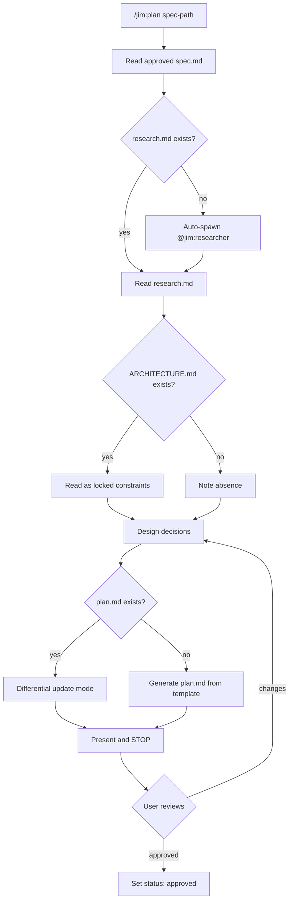

# 005 Architect Agent and Skills

## Overview

`@jim:architect` is the technical planning agent for jim — it reads approved specs and codebase research to produce implementation plans (`plan.md`) and maintains the project's technical architecture document (`ARCHITECTURE.md`). This spec delivers the agent definition and its two skills: `/jim:plan` (the core planning workflow) and `/jim:arch` (architecture document management).

## Problem Statement

Every approved spec needs an implementation plan before code is written — a breakdown of what files to create or modify, what interfaces to define, what design decisions to make, and in what order to build. Without structured planning, developers either start coding without a map (leading to rework and missed integration points) or spend planning time re-discovering codebase context that the researcher already gathered. The V1 architect addressed this but had three limitations: no automatic research integration (requiring manual `/jim:research` before planning), no feedback loop to upstream specs when planning reveals spec gaps, and no architecture document management — ARCHITECTURE.md had to be maintained manually, leading to drift between the documented architecture and the actual codebase.

## User Stories

- As the **coder agent**, I can read a plan.md with atomic tasks, exact file paths, interface contracts, and verification commands so that I implement without guessing at structure or sequencing.
- As a **developer**, I can run `/jim:plan` on an approved spec and get a complete implementation plan without having to manually run research first — the architect handles that automatically.
- As a **developer**, when the architect discovers during planning that the spec is wrong or incomplete, I get clear feedback about what needs to change in the spec before planning continues.
- As a **developer**, I can re-run `/jim:plan` on an existing plan to refine it based on new context (updated spec, updated research, implementation feedback) and the architect summarizes changes before applying them.
- As a **developer**, I can run `/jim:arch` to generate or update ARCHITECTURE.md from actual codebase analysis, aligned with the architecture.md standard, so the architecture document stays current.
- As the **PM agent**, I receive structured feedback when planning reveals that a spec requirement is technically infeasible or underspecified, so I can update the spec before implementation begins.
- As a **developer**, each task in the plan has a shell-executable verification command so I can confirm task completion independently.

## Data Flow

## Acceptance Criteria

### Agent (`@jim:architect`)

- [ ] Agent frontmatter includes `skills: [plan, arch]`
- [ ] Agent frontmatter includes `tools: [Read, Write, Edit, Glob, Grep, Agent(researcher)]`
- [ ] Agent frontmatter sets `model: sonnet`
- [ ] Agent body is self-contained system prompt (no inherited context assumption)
- [ ] Agent description includes triggering conditions and at least one example block per skill (plan, arch) plus one negative example
- [ ] Agent body is under 800 tokens
- [ ] Agent body references key paths: spec directory structure, ARCHITECTURE.md, plan template, plan DoD

### Skill — `/jim:plan`

- [ ] User-invocable skill at `skills/plan/SKILL.md`
- [ ] Accepts `$ARGUMENTS` as: spec path (primary), or empty (prompts user)
- [ ] Skill frontmatter declares `agent: architect` (documentation convention)
- [ ] Reads approved spec.md as primary input — rejects specs with `status: draft` (tells user to approve first)

### `/jim:plan` — Research Integration

- [ ] Checks for research.md in the spec directory
- [ ] If research.md exists: reads it and incorporates findings into design decisions
- [ ] If research.md is missing: auto-spawns `@jim:researcher` via `Agent(researcher)` with the spec path, waits for research completion, then continues planning
- [ ] If research.md exists but is stale (research was done against an older version of the spec): notes this and asks user whether to re-research or proceed

### `/jim:plan` — Design Process

- [ ] Reads ARCHITECTURE.md if it exists — treats architectural invariants as locked constraints
- [ ] Makes explicit design decisions with Chosen/Why/Rejected structure (carried from V1)
- [ ] Produces a File Manifest with component name, exact file path, action (Create/Update), and notes
- [ ] Defines Interface Contracts (types, interfaces, API shapes) before task breakdown
- [ ] Includes Mermaid diagrams for non-trivial data flows or state transitions
- [ ] Type-specific approach: features get standard task breakdown; bugs get Reproduce→Fix→Regression structure; refactors front-load structural changes with "existing tests pass" verification per task

### `/jim:plan` — Task Breakdown

- [ ] Tasks are atomic, ordered by dependency, and each independently verifiable
- [ ] Each task has a `**Verify:**` section with a shell-executable command
- [ ] Task dependencies are explicit (dependency graph or ordering with notes)
- [ ] Tasks reference Interface Contracts defined earlier in the plan

### `/jim:plan` — Feedback Loop

- [ ] If planning reveals the spec is wrong or incomplete, the architect flags specific gaps and asks the user whether to proceed or update the spec first
- [ ] If planning reveals research.md is insufficient (missing anchors for key integration points), the architect can re-invoke the researcher for targeted follow-up
- [ ] Feedback is conversational (not automated blockers) — the architect raises concerns, the human decides

### `/jim:plan` — Differential Updates

- [ ] Re-running `/jim:plan` on an existing plan.md reads it first, summarizes proposed changes, and uses Edit (not Write) to update
- [ ] Preserves sections the user didn't ask to change
- [ ] When re-planning due to spec changes, highlights which tasks are affected and which can be kept

### `/jim:plan` — Output

- [ ] Plan written to `docs/jim/specs/{group}/{id}-{name}/plan.md`
- [ ] Plan frontmatter includes `spec:` (relative path to spec), `type:` (feature/bug/refactor), `status:` (draft/approved)
- [ ] Plan template stored in `skills/plan/assets/plan-template.md` (evolved from V1-PLAN_TEMPLATE.md)
- [ ] Plan DoD checklist stored in `skills/plan/references/plan-dod.md`
- [ ] Human approves the plan — status stays `draft` until explicit confirmation

### Skill — `/jim:arch`

- [ ] User-invocable skill at `skills/arch/SKILL.md`
- [ ] Accepts `$ARGUMENTS` as: empty (creates/updates docs/jim/ARCHITECTURE.md), or directory path (creates for a subdirectory)
- [ ] Skill frontmatter declares `agent: architect`
- [ ] Scans the codebase to populate sections (not pure template fill — reads actual code)
- [ ] Aligned with the architecture.md standard, with sections adjusted for project needs: Project Structure, High-Level System Diagram, Core Components, Data Stores, External Integrations, Deployment & Infrastructure, Security Considerations, Development & Testing, Glossary
- [ ] Architecture template stored in `skills/arch/assets/architecture-template.md`
- [ ] When ARCHITECTURE.md already exists: differential update mode (read first, summarize changes, Edit not Write)
- [ ] Treats VISION.md as upstream context when it exists (architecture serves the vision)

### Cross-Agent Integration

- [ ] `@jim:architect` can spawn `@jim:researcher` via `Agent(researcher)` tool
- [ ] When research.md surfaces Peer Feedback with plan invalidation signals, the architect addresses each signal in the plan (accept, reject with rationale, or defer to user)
- [ ] Plan.md is consumable by `@jim:coder` — task format matches what the build skill expects

## Out of Scope

- No code writing or test writing — the architect produces plans and architecture docs only
- No spec modifications — the architect flags gaps conversationally; the PM decides whether to update
- No autonomous multi-phase execution — the architect STOPs after producing the plan for human review
- No `/jim:review` integration — review skill is not yet implemented
- No Claude Code plan mode integration — the architect uses its own SKILL.md workflow (plan mode integration is a future consideration). Agents and skills cannot invoke plan mode. EnterPlanMode and ExitPlanMode are main-session-only per https://github.com/anthropics/claude-code/issues/32731
  tools — they're stripped from both subagents and teammates at spawn time. 
- No eval loop or automated quality scoring of plan output
- No effort estimation or time predictions in plans
- No plan-to-plan dependencies (cross-spec orchestration)

## Open Questions

None — all questions resolved through interview.
