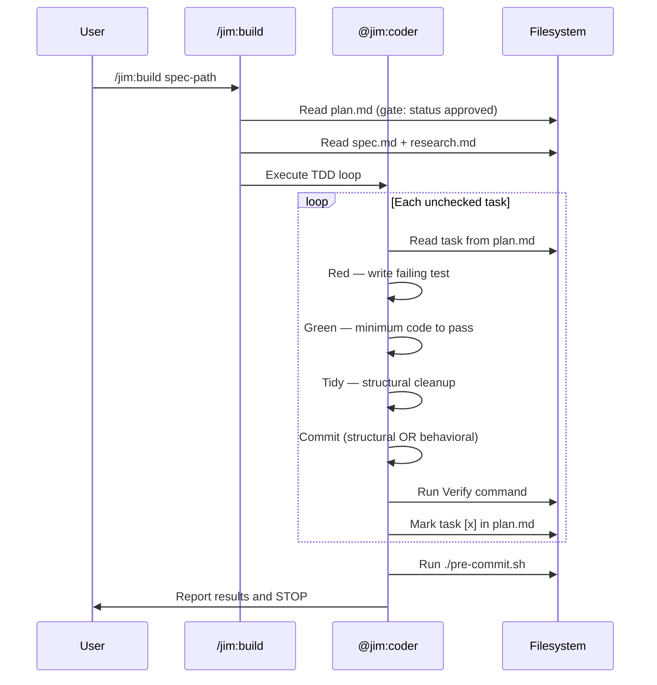
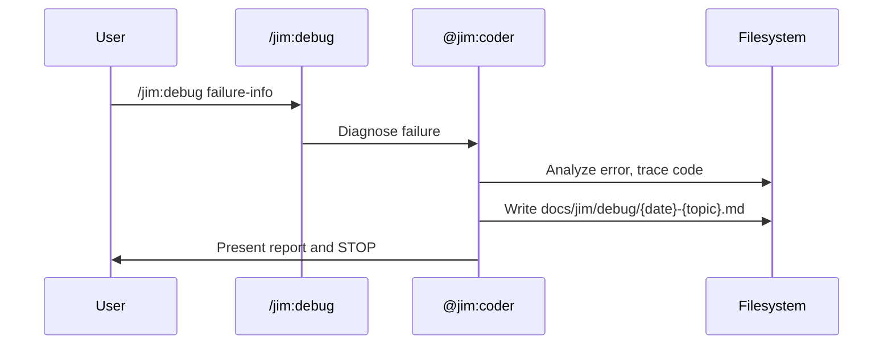

# Coder Agent and Skills — Plan

## Overview

Evolve the existing `agents/coder.md` with skills frontmatter and examples, then create two new skills (`/jim:build` at `skills/build/` and `/jim:debug` at `skills/debug/`) plus a TDD methodology reference doc. Each deliverable is a standalone markdown file following established jim plugin patterns — no code dependencies, no external libraries.

## Design Decisions

### 1. Evolve Existing Agent vs. Rewrite

- **Chosen:** Edit `agents/coder.md` in place — add `skills:` frontmatter, example blocks, and expand the body while preserving all V1 directives.
- **Why:** The existing agent (46 lines) already has the correct core loop, type-specific behavior, and constraints. The spec's additions (skills frontmatter, examples, debug awareness) are incremental. Editing preserves git history and avoids regressions.
- **Rejected:** Full rewrite — risks losing proven V1 language that already works in production.

### 2. Build Skill Phase Gate Language

- **Chosen:** Use explicit "Do NOT proceed" gating language in the build skill (e.g., "Do NOT proceed to Green phase until test failure is confirmed via Bash output").
- **Why:** Research (alexop.dev) proves this phrasing is the effective enforcement mechanism for TDD in Claude Code skill definitions. Without explicit gates, LLMs skip phases ~80% of the time.
- **Rejected:** Implicit ordering (just listing steps) — proven unreliable per research.

### 3. TDD Reference as Separate File vs. Inline in Skill

- **Chosen:** `skills/build/references/tdd-guide.md` as a standalone reference doc evolved from `v1-coder-skill.md`, referenced by the skill but not inlined.
- **Why:** Spec AC explicitly requires this separation. Keeps the skill focused on process orchestration while the reference covers methodology detail. Agent body stays under 800 tokens.
- **Rejected:** Inlining methodology in the skill — would bloat the skill and duplicate what the agent already references via `coder-skill`.

### 4. Existing Coder Skill Migration

- **Chosen:** Rename/move the existing top-level `coder-skill` (currently at skill level used by the agent) to `skills/build/references/tdd-guide.md`, evolving its content. Update the agent to reference the new location.
- **Why:** The spec says the TDD reference is "evolved from v1-coder-skill.md." The existing `coder-skill` IS the V1 content. Moving it to the new location under `skills/build/references/` follows jim's skill directory conventions and avoids duplicate methodology docs.
- **Rejected:** Keeping both old and new — creates divergent methodology sources.

### 5. Debug Skill Output Location

- **Chosen:** `docs/jim/debug/{YYYYMMDD}-{topic}.md` as specified in the spec.
- **Why:** Spec AC is explicit. Keeps debug reports separate from specs/plans, making them linkable from bug spec `origin:` fields.
- **Rejected:** Putting debug reports in the spec directory — would clutter spec directories with operational artifacts.

### 6. Addressing Peer Feedback: Task Decoupling

- **Chosen:** Accept. Each task in this plan targets a single file, includes all context needed to execute independently, and has a self-contained Verify command. No task assumes state from a prior task beyond the file it explicitly reads.
- **Why:** Research peer feedback warns that the coder subagent runs with fresh context and cannot rely on accumulated state between tasks. Each task must be independently executable.

## Constitution Check

*Gate: does this plan conflict with ARCHITECTURE.md?*

**ARCHITECTURE.md status:** Present but empty — no locked constraints to validate against.

## File Manifest

| Component | File Path | Action | Notes |
| :--- | :--- | :--- | :--- |
| Coder agent | `agents/coder.md` | Update | Add `skills:` frontmatter, example blocks, debug awareness, expand body (stay under 800 tokens) |
| Build skill | `skills/build/SKILL.md` | Create | TDD implementation workflow skill with argument routing, plan gating, TDD loop, failure handling, completion gate |
| TDD reference | `skills/build/references/tdd-guide.md` | Create | Evolved from V1 coder-skill — TDD cycle, gears, Tidy First, type-specific TDD, commit discipline, troubleshooting |
| Debug skill | `skills/debug/SKILL.md` | Create | Failure diagnosis skill with argument routing, structured report generation |
| Debug template | `skills/debug/assets/debug-template.md` | Create | Frontmatter + sections: Error Analysis, Reproduction Steps, Root Cause Hypothesis, Affected Specs/Plans, Recommended Next Step |

## Interface Contracts

### Agent Frontmatter Contract (`agents/coder.md`)

```yaml
---
name: coder
description: >
  TDD implementation agent. Executes plan.md via Red-Green-Refactor.
  (Tools: Read, Write, Edit, Glob, Grep, Bash)
tools: [Read, Write, Edit, Glob, Grep, Bash]
model: sonnet
skills: [build, debug]
---
```

Note: inline `[bracket]` array syntax is the established convention across all jim agents (see `agents/pm.md`, `agents/architect.md`, etc.). Do not use block sequences.

### Build Skill Frontmatter Contract (`skills/build/SKILL.md`)

```yaml
---
name: build
description: >
  Instructs the @coder to implement a spec from an approved plan using TDD.
agent: coder
argument-hint: "[spec-directory-path]"
---
```

### Debug Skill Frontmatter Contract (`skills/debug/SKILL.md`)

```yaml
---
name: debug
description: >
  Structured failure diagnosis. Produces a debug report — does not fix code.
agent: coder
argument-hint: "[failure-description | error-output | file-path]"
---
```

### Debug Report Frontmatter Contract (`docs/jim/debug/{YYYYMMDD}-{topic}.md`)

```yaml
---
title: "{topic}"
date: "{YYYYMMDD}"
spec: "{path/to/related/spec.md or 'none'}"
plan: "{path/to/related/plan.md or 'none'}"
---
```

### Agent Example Block Contract

Each example in the agent description follows this pattern:
```markdown
<example>
  Context: {when this agent is appropriate}
  user: "{user message}"
  assistant: "{what the agent does}"
  <commentary>{routing rationale}</commentary>
</example>
```

### Plan Task Format Contract (consumed by coder, produced by architect)

```markdown
N. [ ] {Task description}
   **Verify:** `{shell command}`
```

The coder marks completed tasks as `[x]`. This format is already established by `@jim:architect` and must be consumed as-is.

## Data Flow





## Task Breakdown

1. [x] Create `skills/build/references/tdd-guide.md` — evolve from V1 `v1-coder-skill.md` content. Must cover: TDD cycle with explicit phase gates ("Do NOT proceed to Green until failure confirmed"), implementation gears (obvious/fake-it/triangulate), Tidy First rules (structural vs behavioral commit separation), type-specific TDD (feature/bug/refactor), commit discipline (prefixes: `test:`, `feat:`, `fix:`, `refactor:`), troubleshooting. Source: `docs/jim/prior-art/V1SDLC/v1-coder-skill.md`.
   **Verify:** `grep -iq "Do NOT proceed" skills/build/references/tdd-guide.md && grep -iq "Implementation Gears" skills/build/references/tdd-guide.md && grep -iq "Tidy First" skills/build/references/tdd-guide.md && echo "PASS"`

2. [x] Create `skills/build/SKILL.md` — the `/jim:build` skill. Frontmatter per Build Skill Frontmatter Contract. Body includes: argument routing (accepts spec directory path or empty/prompts), plan gating (reject `status: draft`), context loading (read spec.md + research.md), TDD loop orchestration (sequential tasks, Red→Green→Tidy→Commit→Verify→Mark per task), type-specific behavior section (feature: standard RGR; bug: reproduction test on Red; refactor: no Red, existing tests stay green), failure handling (ambiguous plan → STOP; test passes on Red → STOP; 3 failed Green attempts → STOP; stuck → STOP; report which task/what failed/next steps), scope discipline (no extras beyond plan, no spec/plan modification except `[x]`, no next-phase auto-invoke), completion gate (run `./pre-commit.sh`, report, STOP, update plan status to `complete` only after human confirmation). Reference `references/tdd-guide.md` for methodology detail. Follow structural patterns from `skills/research/SKILL.md` and `skills/plan/SKILL.md`.
   **Verify:** `grep -q "status: draft" skills/build/SKILL.md | head -5; grep -q "agent: coder" skills/build/SKILL.md && grep -q "STOP" skills/build/SKILL.md && grep -q "pre-commit" skills/build/SKILL.md && echo "PASS"`

3. [x] Create `skills/debug/assets/debug-template.md` — the debug report template. Frontmatter per Debug Report Frontmatter Contract. Sections: Error Analysis, Reproduction Steps, Root Cause Hypothesis, Affected Specs/Plans, Recommended Next Step (with explicit guidance to use `/jim:spec` when diagnosis reveals fundamental requirements flaws).
   **Verify:** `grep -q "Error Analysis" skills/debug/assets/debug-template.md && grep -q "Root Cause" skills/debug/assets/debug-template.md && grep -q "Recommended Next Step" skills/debug/assets/debug-template.md && grep -q "/jim:spec" skills/debug/assets/debug-template.md && echo "PASS"`

4. [x] Create `skills/debug/SKILL.md` — the `/jim:debug` skill. Frontmatter per Debug Skill Frontmatter Contract. Body includes: argument routing (accepts failure description, error output, or file path; prompts if empty), diagnosis process (analyze error, attempt reproduction, identify root cause, check for related specs/plans), report generation (write to `docs/jim/debug/{YYYYMMDD}-{topic}.md` using `assets/debug-template.md`), scope discipline (diagnosis only — does NOT fix code; fixes flow through spec/plan cycle), feedback loop guidance (when diagnosis reveals requirements flaw, advise `/jim:spec`). Follow structural patterns from existing skills.
   **Verify:** `grep -q "agent: coder" skills/debug/SKILL.md && grep -q "debug-template" skills/debug/SKILL.md && grep -q "does NOT fix" skills/debug/SKILL.md && echo "PASS"`

5. [x] Update `agents/coder.md` — evolve the existing V1 agent. Changes: add `skills: [build, debug]` to frontmatter; add description with triggering conditions; add example blocks (one for `/jim:build`, one for `/jim:debug`, one negative example); expand body to reference both skills; preserve all V1 directives (sequential plan execution, TDD methodology, stop-and-escalate); preserve type-specific behavior section; keep body under 800 tokens — if nearing the limit, ruthlessly tighten V1 prose rather than dropping required sections. Agent description must follow the Example Block Contract. Source: current `agents/coder.md` (read before editing).
   **Verify:** `grep -q "skills: \[build, debug\]" agents/coder.md && grep -q "<example>" agents/coder.md && grep -q "STOP" agents/coder.md && wc -w < agents/coder.md | awk '{if ($1 < 850) print "PASS: " $1 " words"; else print "FAIL: " $1 " words (target under ~800 tokens)"}'`

## Requirements Coverage Summary

| Spec Acceptance Criterion | Addressed In Task(s) |
| :--- | :--- |
| Agent frontmatter includes `skills: [build, debug]` | 5 |
| Agent frontmatter includes `tools: [Read, Write, Edit, Glob, Grep, Bash]` | 5 |
| Agent frontmatter sets `model: sonnet` | 5 |
| Agent body is a self-contained system prompt | 5 |
| Agent description includes triggering conditions and examples | 5 |
| Agent body is under 800 tokens | 5 |
| Agent preserves V1 directives | 5 |
| Agent includes type-specific behavior section | 5 |
| User-invocable skill at `skills/build/SKILL.md` | 2 |
| Accepts `$ARGUMENTS` as spec directory path or empty | 2 |
| Skill frontmatter declares `agent: coder` | 2 |
| Reads plan.md, rejects `status: draft` | 2 |
| Reads spec.md and research.md for context | 2 |
| Executes tasks sequentially | 2 |
| Per task: Red → Green → Tidy → Commit → Verify → Mark `[x]` | 2 |
| Commit discipline: structural OR behavioral, conventional prefixes | 1, 2 |
| All test runs via Bash with visible output | 2 |
| Runs each task's Verify command | 2 |
| Feature: Standard Red-Green-Refactor | 1, 2 |
| Bug: Reproduction test on Red | 1, 2 |
| Refactor: No Red, existing tests stay green | 1, 2 |
| Ambiguous plan → STOP | 2 |
| Test passes on Red → STOP | 2 |
| 3 failed Green attempts → STOP | 2 |
| Stuck → STOP | 2 |
| On stop: report task, attempts, failure, next steps | 2 |
| Does NOT add beyond plan | 2 |
| Does NOT modify spec/plan content (only marks `[x]`) | 2 |
| Does NOT proceed to next SDLC phase | 2 |
| After all tasks, runs `./pre-commit.sh` | 2 |
| Reports pre-commit results and STOPs | 2 |
| Updates plan status to `complete` only after human confirmation | 2 |
| TDD reference at `skills/build/references/tdd-guide.md` | 1 |
| Reference covers TDD cycle, gears, Tidy First, type-specific, commits, troubleshooting | 1 |
| Skill references the TDD doc | 2 |
| Debug skill at `skills/debug/SKILL.md` | 4 |
| Debug accepts failure description, error output, or path | 4 |
| Debug frontmatter declares `agent: coder` | 4 |
| Debug report at `docs/jim/debug/{YYYYMMDD}-{topic}.md` | 4 |
| Debug report includes required sections | 3, 4 |
| Debug template at `skills/debug/assets/debug-template.md` | 3 |
| Debug does NOT fix code | 4 |
| Plan task format matches architect output | Interface Contracts (verified by existing plan format) |
| Debug reports linkable from bug specs via `origin:` | 3 (frontmatter includes spec field) |
| Coder stop output is actionable for architect/PM | 2 |
| Debug advises `/jim:spec` when requirements flaw found | 3, 4 |

## Out of Scope

- Hook-based activation for `/jim:build` — research notes skills activate inconsistently without hooks, but hooks are a future iteration (not in this spec).
- Per-task subagent spawning (GSD-style) — research identifies this as a future escalation path for long plans, but the spec calls for single-subagent sequential execution.
- Automated tests for agent/skill execution — the project validates through manual invocation and `pre-commit.sh`.
- Removal or deprecation of the existing top-level `coder-skill` skill entry — only the reference content moves; any top-level skill routing changes are out of scope.

## Open Questions

None — all spec questions were resolved through interview, and research provided sufficient anchors for all design decisions.
