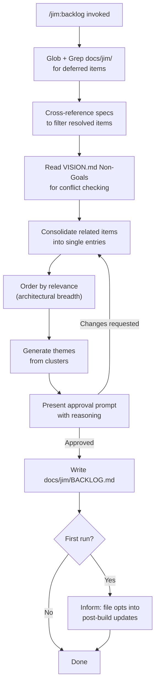
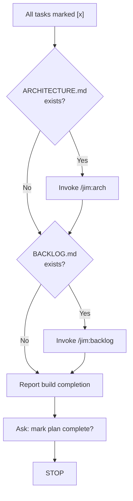

# Backlog Skill — Plan

## Overview

Create a `/jim:backlog` skill owned by the PM agent that scans `docs/jim/` for deferred and out-of-scope work, consolidates related items, and writes `docs/jim/BACKLOG.md`. Integrate into the build completion gate using the same conditional pattern as the ARCHITECTURE.md feedback loop.

## Design Decisions

### 1. Scanning approach — Glob + Grep for structured sources, full read for unstructured

- **Chosen:** Use Grep for `## Out of Scope` and `## Later` headings in specs, plans, and ROADMAP.md to identify files with deferred items, then read only those sections. Read research and brainstorm files in full since deferred items are embedded in prose without standard headings.
- **Why:** Minimizes context consumption for projects with large spec archives. Structured sources have predictable headings; unstructured sources require LLM judgment to identify deferred items (per research recommendation #4).
- **Rejected:** Read all files in full — wasteful for large projects where most files may have no deferred items.

### 2. Output template — skeletal structure with section markers, not item-level

- **Chosen:** A `backlog-template.md` that defines the overall document structure (header, items area, themes area) but not individual item format. Item format is documented in the SKILL.md process instructions.
- **Why:** The number of items and themes varies each run. A template with placeholder items would fight the LLM's synthesis. The spec's mockup already defines the item format clearly — the skill instructions are the right place for that, not the template.
- **Rejected:** Detailed template with example items — would constrain the LLM's consolidation judgment and create template-fighting artifacts in output.

### 3. Post-build integration — same conditional pattern as arch feedback

- **Chosen:** Add a step to the build completion gate that checks if `docs/jim/BACKLOG.md` exists and invokes `/jim:backlog` if so. File existence is the opt-in signal.
- **Why:** Running `/jim:backlog` manually is the opt-in gesture. This avoids forcing token cost on users who don't want backlog tracking. Mirrors the arch feedback pattern exactly — no new concepts for users to learn (per research recommendation #1).
- **Rejected:** Always invoke regardless of file existence — consumes tokens for users who haven't opted in. Unconditional was considered during spec interviews but rejected in favor of opt-in via file existence.

### 4. Skill presents approval prompt before writing

- **Chosen:** The skill scans, consolidates, and presents a summary of proposed items and themes to the user. It waits for approval before writing `BACKLOG.md`.
- **Why:** Spec requires human-in-the-loop approval. Consolidation involves LLM judgment (grouping, ordering, narrative synthesis) — the user should validate these choices before they're committed to file.
- **Rejected:** Write immediately and show diff — harder to review consolidation decisions after the fact.

### 5. First-run guidance — inform user about opt-in behavior

- **Chosen:** On first run (no existing `BACKLOG.md`), the skill mentions that creating the file opts into post-build updates, and that deleting the file opts out.
- **Why:** Users should understand the token cost implication before the feedback loop activates. This was a specific concern raised during spec interviews.
- **Rejected:** Silent opt-in — user may not realize post-build updates are happening until they notice increased token usage.

## Constitution Check

**ARCHITECTURE.md status:** Present — constraints noted below

| Constraint from ARCHITECTURE.md | Honored? | Notes |
| :--- | :--- | :--- |
| Skills are SKILL.md files in `skills/{name}/` with frontmatter `name`, `description`, `agent`, `argument-hint` | Yes | New skill at `skills/backlog/SKILL.md` follows convention |
| SKILL.md stays under 500 lines | Yes | Skill process is straightforward — estimated ~150 lines |
| Agent body stays under 800 tokens | Yes | Only adding `backlog` to PM agent's `skills:` list — no body changes |
| Agents do not cross domain boundaries | Yes | PM agent scans docs and synthesizes — no code writing, no architectural decisions |
| All agents stop after producing an artifact and wait for human approval | Yes | Skill presents approval prompt before writing |
| `agent:` field is documentation convention, not routing | Yes | Frontmatter `agent: pm` follows convention |
| Templates in `assets/`, methodology in `references/` | Yes | Template in `skills/backlog/assets/backlog-template.md` |

## File Manifest

| Component | File Path | Action | Notes |
| :--- | :--- | :--- | :--- |
| Backlog template | `skills/backlog/assets/backlog-template.md` | Create | Skeletal output structure: header with date, items area, themes area |
| Backlog skill | `skills/backlog/SKILL.md` | Create | Full skill process: scan, filter, consolidate, present, write |
| PM agent | `agents/pm.md` | Update | Add `backlog` to `skills:` list |
| Build skill | `skills/build/SKILL.md` | Update | Add backlog feedback step to completion gate |
| Workflow docs | `docs/jim/WORKFLOW.md` | Update | Add `/jim:backlog` to command reference, artifacts table, agents table, PM skill composition example, and plugin directory tree |

## Interface Contracts

### BACKLOG.md output format

```markdown
# Backlog

*Generated by `/jim:backlog` — {YYYY-MM-DD}*

### {Item Title}

{Synthesized description — what the deferred work is, why it was deferred,
and what value it would deliver. Combines perspectives from all sources.}

**Sources:** `{spec-or-file-path}`, `{spec-or-file-path}`
**Vision conflict:** Conflicts with Non-Goal: {X}
<!-- Vision conflict line only present when a conflict exists -->

---

## Themes

### {Theme Name}

{1-2 sentence summary of what this cluster represents and why it recurs.
Insight only — no prescriptive recommendations.}

**Related items:** {Item Title 1}, {Item Title 2}
```

### Approval prompt format

```
I scanned {N} specs, {N} plans, {N} research docs, and {N} brainstorms.

Found {N} raw items → consolidated to {N}:

1. {Item Title} (from: {source1}, {source2})
   {One-line summary}

...

Themes identified:
- {Theme Name} (items {N}, {N})

Write this to docs/jim/BACKLOG.md?
```

## Data Flow



### Post-build integration



## Task Breakdown

1. [x] Create the backlog output template at `skills/backlog/assets/backlog-template.md`. The template defines the skeletal structure: YAML-free header with generation date, an items area (each item as `###` with description, sources, and optional vision conflict line), a horizontal rule separator, and a themes area (each theme as `###` under a `## Themes` heading with summary and related items list).
   **Verify:** `test -f skills/backlog/assets/backlog-template.md && grep -q '## Themes' skills/backlog/assets/backlog-template.md`

2. [x] Create the backlog skill at `skills/backlog/SKILL.md` with frontmatter (`name: backlog`, `description`, `agent: pm`). The skill process covers: (1) scan sources via Glob + Grep, (2) read VISION.md Non-Goals for conflict checking, (3) filter resolved items by cross-referencing spec statuses and later specs, (4) consolidate related items from multiple sources into single entries, (5) order by relevance with broader architectural impact first, (6) generate themes, (7) present approval prompt with item count, consolidation summary, and theme list, (8) wait for approval, (9) write `docs/jim/BACKLOG.md` using the template structure. Include first-run guidance about opt-in behavior. Skill must stay under 500 lines.
   **Verify:** `test -f skills/backlog/SKILL.md && grep -q 'name: backlog' skills/backlog/SKILL.md && grep -q 'agent: pm' skills/backlog/SKILL.md && wc -l < skills/backlog/SKILL.md | awk '{exit ($1 > 500)}'`

3. [x] Update `agents/pm.md` to add `backlog` to the `skills:` list in frontmatter. No body changes.
   **Verify:** `grep -q 'backlog' agents/pm.md`

4. [x] Update `skills/build/SKILL.md` completion gate (section 5) to add a backlog feedback step after the architecture step. The new step: check if `docs/jim/BACKLOG.md` exists; if yes, invoke `/jim:backlog` to regenerate it; if no, skip. Insert between the existing arch step and the completion report. Renumber existing steps as needed.
   **Verify:** `grep -q 'BACKLOG.md' skills/build/SKILL.md && grep -q '/jim:backlog' skills/build/SKILL.md`

5. [x] Update `docs/jim/WORKFLOW.md` to document `/jim:backlog`. Add to: (1) Command Reference table — command, description, agent (`@jim:pm`), output (`BACKLOG.md`); (2) Project Artifacts table — Backlog artifact at `docs/jim/BACKLOG.md`; (3) Agents table — add `/jim:backlog` to `@jim:pm` "Used By" column; (4) PM agent skill composition example — add `backlog` to the `skills:` list; (5) Plugin Directory tree — add `backlog/` under the Strategic skills section with `SKILL.md` and `assets/backlog-template.md`.
   **Verify:** `grep -q '/jim:backlog' docs/jim/WORKFLOW.md && grep -q 'BACKLOG.md' docs/jim/WORKFLOW.md`

## Requirements Coverage Summary

| Spec Acceptance Criterion | Addressed In Task(s) |
| :--- | :--- |
| Scans all sources: specs, plans, research, brainstorms, notes, ROADMAP.md Later | 2 |
| Items delivered by later specs are detected and excluded | 2 |
| Related items consolidated into single entries with synthesized descriptions | 2 |
| Each item includes provenance links to source file(s) | 1, 2 |
| Each item checked against VISION.md Non-Goals — conflict only displayed when present | 2 |
| Items ordered by relevance — broader architectural impact first | 2 |
| Themes section groups related items with summary — no prescriptive recommendations | 1, 2 |
| Skill presents proposed consolidation with reasoning and waits for approval | 2 |
| Output is complete replacement of BACKLOG.md each run | 2 |
| Post-build feedback loop: BACKLOG.md regenerated after build if file exists | 4 |
| Skill owned by PM agent | 3 |
| WORKFLOW.md documents the new skill | 5 |

## Out of Scope

- Updating `docs/jim/ARCHITECTURE.md` — handled by the build's existing arch feedback loop, which will pick up the new skill directory.
- Adding the backlog skill to the `@jim:meta` agent's skill list — meta builds jim plugin components, not project artifacts.

## Open Questions

None.
