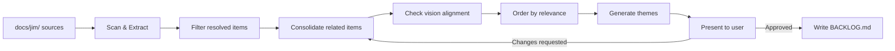

# 008 Backlog Skill

## Overview

A `/jim:backlog` skill that scans `docs/jim/` for deferred and out-of-scope work, consolidates related items, and produces a living `docs/jim/BACKLOG.md`. A post-build feedback loop keeps the file current as specs evolve.

## Problem Statement

Deferred work and out-of-scope decisions are scattered across specs, plans, research docs, and brainstorms. There is no single view of what was explicitly set aside, why it was deferred, or whether it has since been addressed. Developers must manually grep through dozens of files to understand the full landscape of deferred work, and stale items (things deferred in early specs but delivered in later ones) create noise that obscures genuinely open items.

## User Stories

- As a developer, I can run `/jim:backlog` so that I get a consolidated view of all deferred work across the project without manually searching through specs and plans.
- As a developer, I can read `BACKLOG.md` so that I understand what was set aside, where it came from, and whether it aligns with the product vision.
- As a developer, I can trust that `BACKLOG.md` stays current after builds so that I don't act on stale information.

## Acceptance Criteria

- [ ] `/jim:backlog` scans all sources: `specs/*/spec.md`, `specs/*/plan.md`, `specs/*/research.md`, `brainstorms/*.md`, `notes/*.md`, `ROADMAP.md` (Later bucket)
- [ ] Items delivered by later specs are detected and excluded — only current items appear
- [ ] Related items from multiple sources are consolidated into single entries with synthesized descriptions
- [ ] Each item includes provenance links back to source file(s)
- [ ] Each item is checked against `VISION.md` Non-Goals — vision alignment is only displayed when an item conflicts with a Non-Goal
- [ ] Items are ordered by relevance — broader architectural impact first, narrow items last
- [ ] A Themes section at the end groups related items with a summary of what the cluster represents — no prescriptive recommendations
- [ ] The skill presents proposed consolidation with reasoning to the user and waits for approval before writing `BACKLOG.md`
- [ ] Output is a complete replacement of `docs/jim/BACKLOG.md` each run — no incremental appending
- [ ] Post-build feedback loop: after `/jim:build` completes, BACKLOG.md is regenerated to reflect any changes from the build
- [ ] The skill is owned by the PM agent (`agents/pm.md`)

## UI Mockup

### Approval prompt (console)

```
I scanned 7 specs, 3 plans, 2 research docs, and 1 brainstorm.

Found 18 raw items → consolidated to 9:

1. Meta-Eval Capabilities (from: 001-meta/spec.md, 001-meta/research.md)
   Behavioral testing, eval loops, description optimization — deferred from
   meta skill.

2. Plugin Packaging and Distribution (from: 001-meta/spec.md)
   Producing .skill files for sharing.

3. ...

Themes identified:
- Testing & Validation (items 1, 5, 7)
- Configuration & Extensibility (items 3, 4, 8)

Write this to docs/jim/BACKLOG.md?
```

### BACKLOG.md output

```markdown
# Backlog

*Generated by `/jim:backlog` — 2026-03-31*

### Meta-Eval Capabilities

Multiple specs defer evaluation and behavioral testing for skills and agents.
The meta spec (001) defers eval loops, browser-based eval viewers, and
description optimization. The researcher spec (004) also explicitly excludes
quality scoring. This represents a recurring gap in the ability to validate
that produced artifacts work as intended.

**Sources:** `001-meta/spec.md`, `001-meta/research.md`, `004-researcher/plan.md`

### Plugin Packaging and Distribution

The meta spec defers producing `.skill` files for distribution. Currently
skills are shared as raw markdown files within the repository.

**Sources:** `001-meta/spec.md`

---

## Themes

### Testing & Validation

Several specs defer evaluation, quality scoring, and behavioral testing.
The project currently validates through manual invocation and pre-commit
hooks but has no automated way to verify that skills and agents behave
as intended.

**Related items:** Meta-Eval Capabilities, ...
```

## Data Flow



## Out of Scope

- **Prioritization** — the backlog does not rank items by priority. That is the roadmap's job. Relevance ordering is based on architectural breadth, not priority.
- **Prescriptive recommendations** — themes summarize patterns but do not suggest what to do about them. No "consider prioritizing X" or "this should be Phase 3."
- **Spec creation from backlog items** — the skill surfaces work, it does not create specs. Users route to `/jim:spec` manually if they want to act on an item.
- **Tracking item state over time** — each run is a complete replacement. There is no diff tracking, changelog, or historical comparison within the file itself.
- **Scanning non-jim docs** — only `docs/jim/` is scanned. Application-level TODOs, GitHub issues, or external trackers are not in scope.

## Open Questions

None
