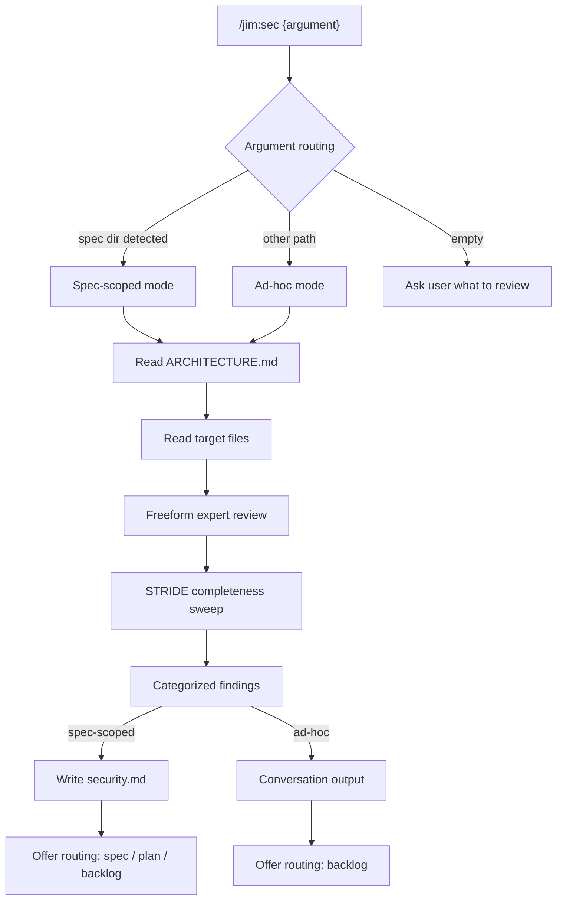
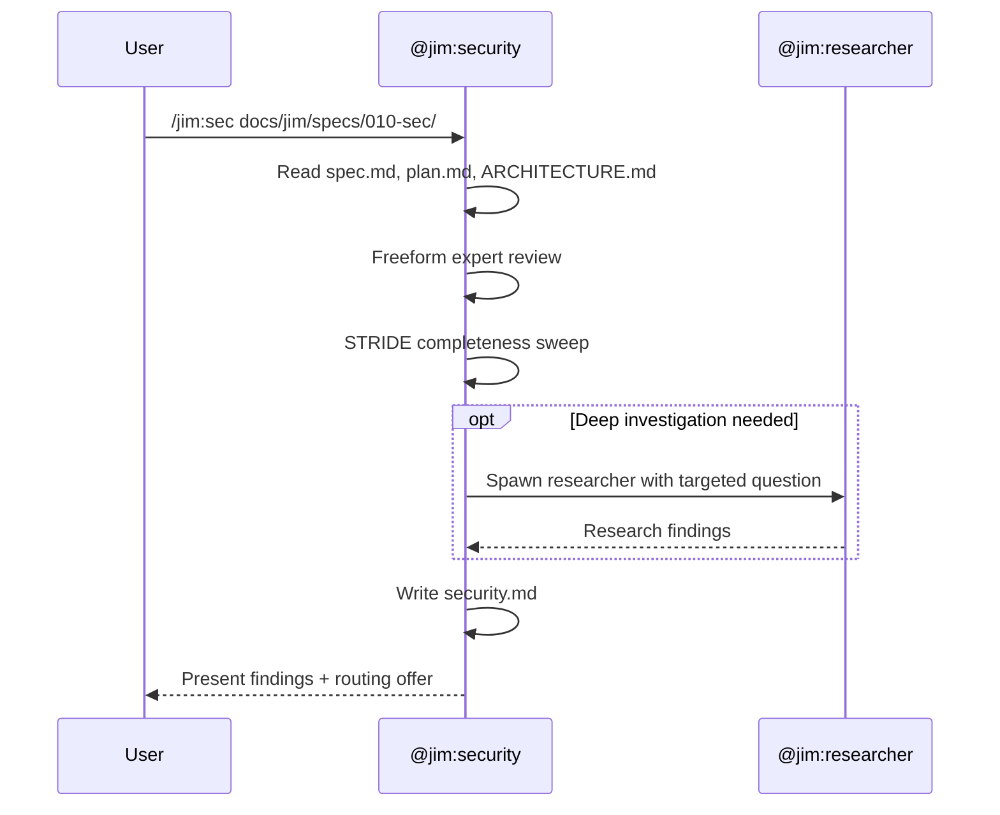

# Security Agent and Skill — Plan

## Overview

Build `@jim:security` agent and `/jim:sec` skill following the established agent/skill conventions, with two supporting assets (template + DoD). The skill detects spec-scoped vs ad-hoc mode from the argument path, runs a hybrid freeform + STRIDE analysis, and produces either a `security.md` sibling artifact or conversation output.

## Design Decisions

### 1. Skill process modeled on debug + research hybrid

- **Chosen:** Debug's analytical flow (read artifact → analyze → produce findings) combined with research's input routing (detect mode from argument type)
- **Why:** Debug is the closest process analogue (analytical, produces structured findings). Research demonstrates the argument routing pattern for multi-mode skills. Together they provide a proven template.
- **Rejected:** Modeling on spec skill — too interview-heavy; `/jim:sec` is analytical, not conversational.

### 2. Agent tool set matches pm/architect pattern

- **Chosen:** `[Read, Write, Edit, Glob, Grep, Agent(researcher)]`
- **Why:** The security agent produces artifacts (`security.md`) and may need to spawn the researcher for deeper investigation. This is the same permission set as pm and architect — artifact producers that can delegate research.
- **Rejected:** Read-only tools (like researcher) — the agent needs Write/Edit for `security.md`. Adding Bash — unnecessary; security analysis is document review, not code execution.

### 3. Single skill handles both modes

- **Chosen:** One `/jim:sec` skill with argument routing to detect spec-scoped vs ad-hoc mode
- **Why:** The analysis framework is identical in both modes — same hybrid approach, same severity model, same STRIDE sweep. Only the output destination and routing options differ. Two skills would duplicate the core process.
- **Rejected:** Separate `/jim:sec` and `/jim:sec-adhoc` skills — unnecessary duplication; the mode difference is output routing, not analysis.

### 4. STRIDE categories are selectively applied

- **Chosen:** The skill evaluates which STRIDE categories are relevant to the target and skips categories that clearly don't apply
- **Why:** Applying all six STRIDE categories to every spec generates noise. A pure UI refactor doesn't need Repudiation analysis. Selective application keeps findings actionable.
- **Rejected:** Full STRIDE every time — noisy, reduces signal-to-noise ratio on simple specs.

### 5. security-template.md defines finding structure

- **Chosen:** A template asset with frontmatter, summary, findings list (each with severity/suggestion/route), and STRIDE coverage section
- **Why:** Follows the convention established by `spec-template.md`, `plan-template.md`, `research-template.md`. Gives the skill a consistent output format and the coder a clear build target.
- **Rejected:** Freeform output — inconsistent, harder to route findings, breaks the template convention.

## Constitution Check

**`docs/jim/ARCHITECTURE.md` status:** Present — constraints noted below

| Constraint from `docs/jim/ARCHITECTURE.md` | Honored? | Notes |
| :--- | :--- | :--- |
| Agent frontmatter: `name`, `description`, `skills`, `tools`, `model` fields required | Yes | Follows pm.md/architect.md pattern exactly |
| Skill naming: must match directory name (kebab-case) | Yes | Directory `skills/sec/`, frontmatter `name: sec` |
| Agent naming: must match filename (kebab-case, no .md) | Yes | File `agents/security.md`, frontmatter `name: security` |
| Agent body ≤ 800 tokens | Yes | Kept concise; process detail lives in the skill |
| SKILL.md ≤ 500 lines | Yes | Core process + validation; methodology in references/ |
| Templates in assets/, methodology in references/ | Yes | `security-template.md` in assets/, `security-dod.md` in references/ |
| No sensitive path writes | Yes | Agent writes only to `docs/jim/specs/` and `skills/sec/` |
| Subagents cannot nest (one level only) | Yes | Security spawns researcher; researcher does not spawn further |
| No personality soup | Yes | Second-person imperative voice |

## File Manifest

| Component | File Path | Action | Notes |
| :--- | :--- | :--- | :--- |
| Security template | `skills/sec/assets/security-template.md` | Create | Output format for security.md findings |
| Security DoD | `skills/sec/references/security-dod.md` | Create | Validation checklist for security reviews |
| Security skill | `skills/sec/SKILL.md` | Create | Process instructions, argument routing, validation |
| Security agent | `agents/security.md` | Create | Persona, tools, constraints, context paths |
| Spec skill | `skills/spec/SKILL.md` | Update | Add security review offer before approval prompt |
| Plan skill | `skills/plan/SKILL.md` | Update | Add security review offer before approval prompt |

## Interface Contracts

### security.md frontmatter

```yaml
---
spec: "{relative/path/to/spec.md}"   # Links to source spec
status: "Active"                      # Active | Needs Spec Review | Needs Plan Review
date: "{YYYY-MM-DD}"
---
```

### Finding structure (within security.md body)

```markdown
### {N}. {Finding title}

- **Severity:** Critical | Notable | Advisory
- **Description:** {What the issue is}
- **Suggestion:** {Concrete actionable recommendation}
- **Route:** Spec | Plan | Backlog
```

### STRIDE coverage section

```markdown
## STRIDE Coverage

| Category | Relevant? | Findings |
| :--- | :--- | :--- |
| Spoofing | Yes/No/N/A | {Finding refs or "No issues found"} |
| Tampering | Yes/No/N/A | {Finding refs or "No issues found"} |
| Repudiation | Yes/No/N/A | {Finding refs or "No issues found"} |
| Information Disclosure | Yes/No/N/A | {Finding refs or "No issues found"} |
| Denial of Service | Yes/No/N/A | {Finding refs or "No issues found"} |
| Elevation of Privilege | Yes/No/N/A | {Finding refs or "No issues found"} |
```

### Agent frontmatter contract

```yaml
---
name: security
description: >
  {Triggering description with examples}
skills: [sec]
tools: [Read, Write, Edit, Glob, Grep, Agent(researcher)]
model: sonnet
---
```

### Skill frontmatter contract

```yaml
---
name: sec
description: >
  {Triggering description with when/when-not guidance}
agent: security
argument-hint: "[spec-dir | file-path | directory]"
---
```

## Data Flow





## Task Breakdown

1. [x] Create `skills/sec/assets/security-template.md` with the security.md output format: frontmatter (spec, status, date), summary section, findings list (each with severity/description/suggestion/route), STRIDE coverage table, and routing recommendations section. Follow the interface contracts defined above.
   **Verify:** `test -f skills/sec/assets/security-template.md && head -5 skills/sec/assets/security-template.md | grep -q "spec:"`

2. [x] Create `skills/sec/references/security-dod.md` with the validation checklist: every finding has all four fields (severity/description/suggestion/route), STRIDE sweep completed with relevant categories evaluated, no duplication of ARCHITECTURE.md security considerations, alignment with locked constraints checked, findings are actionable (not vague), ad-hoc mode produces conversation output only.
   **Verify:** `test -f skills/sec/references/security-dod.md && grep -c "^\d\+\." skills/sec/references/security-dod.md | xargs test 5 -le`

3. [x] Create `skills/sec/SKILL.md` with: frontmatter (name: sec, description with trigger/anti-trigger guidance, agent: security, argument-hint), argument routing table (spec-dir → spec-scoped, other path → ad-hoc, empty → ask), process steps (read context → read target → freeform review → STRIDE sweep → generate findings → present → routing offer), differential update handling for existing security.md, and validation checklist referencing security-dod.md.
   **Verify:** `test -f skills/sec/SKILL.md && grep -q "name: sec" skills/sec/SKILL.md && wc -l < skills/sec/SKILL.md | xargs test 500 -ge`

4. [x] Create `agents/security.md` with: frontmatter (name: security, description with 3 examples including negative example, skills: [sec], tools: [Read, Write, Edit, Glob, Grep, Agent(researcher)], model: sonnet), body with role definition, context paths, core principles, process delegation to active skill, and constraints. Follow pm.md and architect.md patterns.
   **Verify:** `test -f agents/security.md && grep -q "name: security" agents/security.md && grep -q "Agent(researcher)" agents/security.md`

5. [x] Update `skills/spec/SKILL.md` step 10 (present and stop) to offer a security review before the approval prompt: "Want to run a security review before approving? (`/jim:sec`)"
   **Verify:** `grep -q "jim:sec" skills/spec/SKILL.md`

6. [x] Update `skills/plan/SKILL.md` step 8 (present and stop) to offer a security review before the approval prompt: "Want to run a security review before approving? (`/jim:sec`)"
   **Verify:** `grep -q "jim:sec" skills/plan/SKILL.md`

## Requirements Coverage Summary

| Spec Acceptance Criterion | Addressed In Task(s) |
| :--- | :--- |
| `@jim:security` agent exists at `agents/security.md` with persona, tools, model | 4 |
| `/jim:sec` skill exists at `skills/sec/SKILL.md` with process, validation, arguments | 3 |
| Running `/jim:sec {spec-dir}` produces `security.md` sibling artifact | 3 |
| Adapts analysis lens based on available artifacts (spec-phase vs plan-phase) | 3 |
| Notes absence and proceeds if only spec or only plan exists | 3 |
| Each finding includes severity, description, suggestion, route | 1, 3 |
| Hybrid approach: freeform review + STRIDE sweep | 3 |
| Reads `ARCHITECTURE.md` for grounding | 3 |
| Can spawn `@jim:researcher` | 4 |
| Differential update of existing `security.md` | 3 |
| End-of-review routing offer (spec/plan/backlog) | 3 |
| Available at any time — no phase-gating | 3 |
| Ad-hoc mode with conversation output for non-spec paths | 3 |
| Ad-hoc mode offers routing to `/jim:backlog` | 3 |
| Agent tool permissions allow project-wide file access | 4 |
| `/jim:spec` offers security review before approval | 5 |
| `/jim:plan` offers security review before approval | 6 |

## Out of Scope

- ARCHITECTURE.md update to reflect the new agent/skill — deferred to a separate `/jim:arch` run after build
- Integration with `/jim:review` for post-build security scanning — future spec
- Integration with plan DoD to reference security.md during planning — future enhancement

## Open Questions

None
