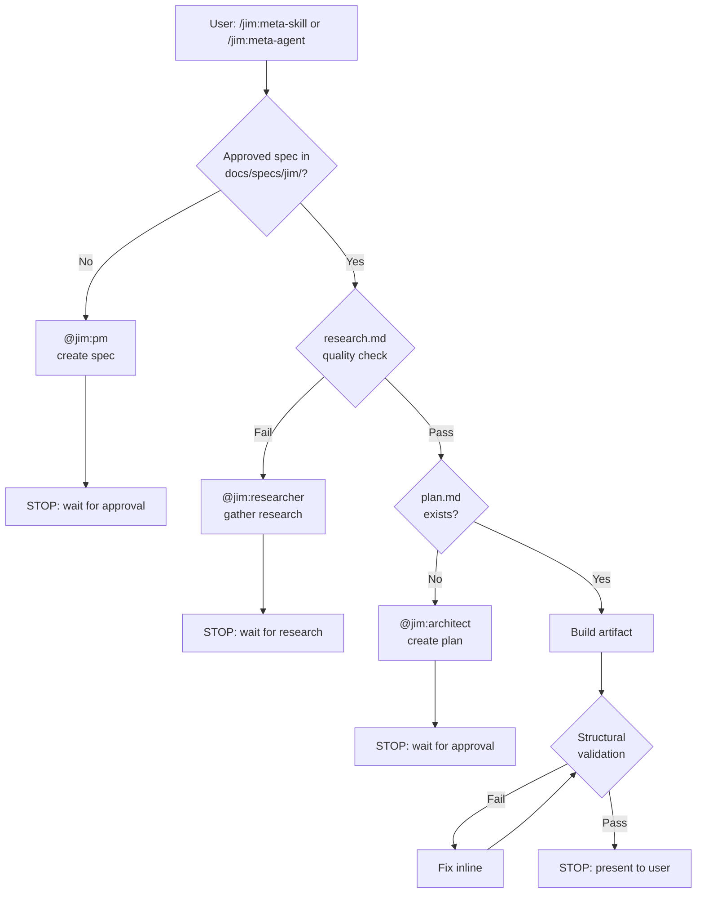

# 001 @jim:meta Agent + /jim:meta-skill and /jim:meta-agent Skills

## Overview

`@jim:meta` is the plugin developer agent for jim — responsible for building and maintaining jim's own skills and agents. It exposes two skills: `/jim:meta-skill` (creates/updates a skill) and `/jim:meta-agent` (creates/updates an agent), both following the full jim SDLC: spec → plan → build → validate.

## Problem Statement

Jim needs a way to develop itself. Building a skill or agent for the jim plugin is a non-trivial change that deserves the same spec-driven rigour as any other feature. Without a dedicated meta agent, jim components are written ad hoc, inconsistently structured, and untested against the plugin's own conventions. `@jim:meta` closes this loop: Jim builds Jim through Jim.

## User Stories

- As a developer, I can run `/jim:meta-skill` and be guided through the full spec → plan → build flow so that jim skills are produced consistently from clear requirements.
- As a developer, I can run `/jim:meta-agent` and be guided through the full spec → plan → build flow so that jim agents are produced consistently from clear requirements.
- As a developer, if I invoke `/jim:meta-skill` without an approved spec, `@jim:meta` routes me to `@jim:pm` automatically so I don't skip the thinking phase.
- As a developer, if I invoke `/jim:meta-skill` with a spec but no plan, `@jim:meta` routes me to `@jim:architect` automatically so I don't skip the planning phase.
- As a developer, if I invoke `/jim:meta-skill` or `/jim:meta-agent` and research.md is missing or lacking necessary context (like Claude Code skill/agent documentation, prior art), `@jim:meta` delegates to `@jim:researcher` automatically to gather that context before building.
- As a developer, `@jim:meta` validates the artifact it produces against jim's structural standards before stopping, so I receive a known-good component ready for review.

## Flow

Both `/jim:meta-skill` and `/jim:meta-agent` follow this sequence:

```
User invokes /jim:meta-skill [optional: spec path or skill name]
  │
  ├─ Locate approved spec in docs/specs/jim/
  │     └─ None found → delegate to @jim:pm → STOP (wait for approved spec)
  │
  ├─ Check research.md quality (7-point spot-check)
  │     └─ Missing or fails check → delegate to @jim:researcher
  │       + invalidate existing plan → STOP (wait for research)
  │
  ├─ Locate plan.md alongside spec
  │     └─ None found → delegate to @jim:architect → STOP (wait for approved plan)
  │
  ├─ Build artifact from spec + plan + research
  │     ├─ /jim:meta-skill → jim/skills/{name}/SKILL.md (+ assets/, references/ as needed)
  │     └─ /jim:meta-agent → jim/agents/{name}.md
  │
  ├─ Validate artifact (structural checks — see Acceptance Criteria)
  │     └─ Failures → fix inline, re-validate
  │
  └─ STOP → present artifact to user for review
```

## Output Artifacts

| Skill | Primary Output | Supporting Dirs |
|-------|---------------|-----------------|
| `/jim:meta-skill` | `jim/skills/{name}/SKILL.md` | `assets/` (templates), `references/` (long-form docs) |
| `/jim:meta-agent` | `jim/agents/{name}.md` | — |

## Standards Applied

`@jim:meta` enforces the following conventions when producing and validating artifacts.

### Skill Standards (`SKILL.md`)

**Frontmatter (required):**
```yaml
---
name: {skill-name}        # kebab-case, matches directory name
description: {when to trigger + what it does — primary trigger mechanism}
agent: {agent-name}       # which @jim: agent runs this skill
---
```

**Structure:** Frontmatter + trigger conditions + instructions + references to assets/references as needed.

**Budget:** SKILL.md body ≤ 500 lines. Overflow goes into `assets/` or `references/`.

**Progressive disclosure:**
- `assets/` — templates and files used in output
- `references/` — long-form reference docs (include a ToC if >300 lines)

### Agent Standards (`{name}.md`)

**Frontmatter (required):**
```yaml
---
name: {agent-name}        # kebab-case, matches filename
description: {one-line purpose with triggering conditions}
skills: [skill-a, skill-b] # skills this agent composes (if any)
tools: [Read, Write, ...]  # only tools actually needed
model: sonnet              # default; opus only if justified
---
```

**Structure:** Frontmatter + role definition + methodology + process + constraints.

**Budget:** Agent body ≤ 800 tokens.

### Shared Conventions

- **Kebab-case** naming. `name` frontmatter field must match filename/directory exactly.
- **Least privilege:** tools list contains only what the component actually uses.
- **Description as trigger:** description must state *when to use* (triggering conditions), not just *what it does*.
- **Explain the why:** instructions explain reasoning, not just directives. Avoid heavy-handed ALL-CAPS MUSTs where a clear rationale will do.
- **No anti-patterns:**
  - Personality soup ("I am an AI here to help")
  - Permission creep (Write/Bash for read-only agents)
  - Instruction shadowing (repeating rules already in CLAUDE.md or WORKFLOW.md)
  - Duplicate logic (same instructions in 3+ places → extract to shared skill)

## Acceptance Criteria

### /jim:meta-skill
- [ ] Given an approved spec + plan + research, produces `jim/skills/{name}/SKILL.md` with correct frontmatter (name, description, agent).
- [ ] `name` field matches directory name exactly (kebab-case).
- [ ] SKILL.md body does not exceed 500 lines.
- [ ] `agent:` field references a valid jim agent.
- [ ] Description includes triggering conditions (when to use), not just what it does.
- [ ] Creates `assets/` and/or `references/` subdirectories when content would overflow 500 lines.
- [ ] No anti-patterns present (personality soup, permission creep, instruction shadowing, duplicate logic).
- [ ] If no approved spec exists, delegates to `@jim:pm` and stops.
- [ ] If spec exists but no plan, delegates to `@jim:architect` and stops.
- [ ] If research.md is missing or fails quality spot-check, delegates to `@jim:researcher` with details of what's missing.
- [ ] Differential update: if SKILL.md already exists, refines rather than overwrites. Summarises changes before applying.

### /jim:meta-agent
- [ ] Given an approved spec + plan + research, produces `jim/agents/{name}.md` with correct frontmatter (name, description, tools, model).
- [ ] `name` field matches filename exactly (kebab-case).
- [ ] Agent body does not exceed 800 tokens.
- [ ] Tools list follows least privilege — only tools the agent actually needs.
- [ ] Description includes triggering conditions.
- [ ] No anti-patterns present.
- [ ] If no approved spec exists, delegates to `@jim:pm` and stops.
- [ ] If spec exists but no plan, delegates to `@jim:architect` and stops.
- [ ] If research.md is missing or fails quality spot-check, delegates to `@jim:researcher` with details of what's missing.
- [ ] Differential update: if agent file already exists, refines rather than overwrites. Summarises changes before applying.

### @jim:meta Agent
- [ ] `jim/agents/meta.md` exists with valid frontmatter (name, description, skills, tools, model).
- [ ] Agent body ≤ 800 tokens.
- [ ] Composes `meta-skill` and `meta-agent` skills.
- [ ] Tools: Agent(pm, architect, researcher), Read, Write, Edit, Glob, Grep (no Bash — meta does not run code).

## Data Flow



## Out of Scope

- **Behavioral/eval testing** — running the produced skill/agent against test prompts to verify it works as intended. Future: `/jim:meta-eval`.
- **Description optimization** — automated triggering accuracy loop (Anthropic skill-creator style). Future capability.
- **`/jim:meta-audit`** — auditing the full jim plugin ecosystem for drift, bloat, or inconsistency. Future spec.
- **Packaging** — producing `.skill` files. Future capability.
- **The Anthropic skill-creator eval pipeline** — Python scripts, eval-viewer, grader subagents.

## Open Questions

- [x] ~Should @jim:meta use the Anthropic skill-creator as a dependency?~ → No. Too much unknown infrastructure. Adopt its principles; don't depend on its tooling.
- [x] ~Should validation be inline or a separate /jim:meta-review skill?~ → Inline validation in both skills. /jim:meta-audit (full ecosystem audit) is a future spec.
- [x] ~Should /jim:meta-skill support differential updates?~ → Yes. Per workflow Rules of Engagement: never overwrite blindly, always refine.
- [x] ~Should /jim:meta include behavioral testing in v1?~ → No. Structural validation only in v1. Behavioral testing is a future capability.
