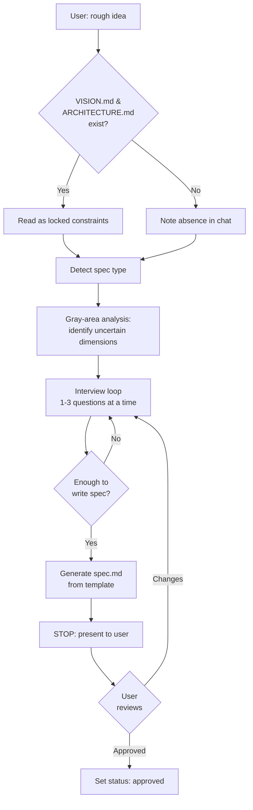

# 002 @jim:pm Agent + /jim:spec Skill

## Overview

`@jim:pm` is the product manager agent for jim — a conversational partner that turns rough ideas into clear, actionable specs through collaborative dialogue. This spec delivers the agent definition and its primary skill `/jim:spec`, which produces `spec.md` artifacts for features, bugs, and refactors.

## Problem Statement

Jim's SDLC starts at `/jim:spec` — every feature, bug fix, and refactor enters the pipeline through the PM. Without this agent and skill, there is no structured entry point into the development workflow. The PM must be a skilled interviewer that surfaces ambiguity, identifies scope risks, and produces specs that downstream agents (architect, coder) can execute against without guessing.

The V1 PM workflow relies on a basic "ask 1-2 questions" loop that can feel like an interrogation and lacks deep strategic alignment. Agents often guess at ambiguous requirements or ignore upstream constraints, leading to specs that require heavy manual correction. Jim needs a PM partner that analyzes uncertainty, respects existing architectural and vision decisions as constraints, explicitly links specs to overarching goals, and collaborates with the human through targeted conversation rather than generic questioning.

## User Stories

- As a developer, I can describe a rough idea to `/jim:spec` and be guided through a focused interview so that my idea becomes a clear, structured spec without me having to know the template by heart.
- As a developer, I can describe a rough idea to `/jim:spec` and be presented with a gray-area analysis of my idea — identifying which specific dimensions are uncertain — so I can choose what to discuss first rather than answering generic questions.
- As a developer, when I describe a bug, `/jim:spec` detects the type automatically and asks me about reproduction steps and environment rather than user stories, so the interview fits the problem.
- As a developer, when VISION.md exists, `/jim:spec` treats it as a constraint and raises alignment concerns conversationally ("This seems to diverge from the vision's focus on X...") so I can make informed decisions about scope.
- As a developer, when VISION.md or ARCHITECTURE.md are missing, `/jim:spec` notes this and suggests I create them, but proceeds with the spec if I choose to continue.
- As a developer, I can re-run `/jim:spec` on an existing spec to refine it based on new context, and the PM summarizes proposed changes before applying them.
- As a developer, the PM never finalizes a spec without my explicit approval — the status stays `draft` until I confirm.
- As a developer, when I ask `/jim:spec` to formalize a feature from a brainstorm or a bug from a debug document, the resulting spec.md includes a direct link back to that source file so the original diagnostic or exploratory context is preserved.

## Deliverables

| Artifact | Path | Purpose |
|----------|------|---------|
| PM Agent | `agents/pm.md` | `@jim:pm` agent definition |
| Spec Skill | `skills/spec/SKILL.md` | `/jim:spec` skill instructions |
| Spec Template | `skills/spec/assets/spec-template.md` | Output template for spec.md |
| Type Reference | `skills/spec/references/spec-types.md` | Feature/bug/refactor type guidance |

## Methodology

The V2 PM adopts proven patterns from prior art, evolved from the v1-pm approach.

### Type Detection

Infer the spec type from context without requiring the user to specify it:
- Descriptions of broken behavior → **bug**
- Descriptions of new capabilities → **feature**
- Descriptions of code quality or structural issues → **refactor**

If ambiguous, ask to confirm. Never guess silently.

### Gray-Area Analysis

Adapted from GSD's discuss-phase pattern. Instead of asking generic clarifying questions, the PM:

1. Analyzes the rough idea
2. Identifies which specific dimensions are uncertain (scope, target user, edge cases, interaction model, data shape, etc.)
3. Presents the 2-3 most uncertain dimensions and lets the user choose what to discuss first

This replaces v1's "ask 1-2 questions" with targeted uncertainty reduction.

### Recursive Interview

Carried forward from v1. Drill into vague statements:
- "Add logging" → "What log level? What destination? What format?"
- "It should be fast" → "What's the current latency? What's the target? Under what load?"

Ask 1-3 questions at a time, never a wall of questions.

### Mockup First

For any spec with visible output (UI, CLI output, file format), sketch an ASCII mockup before writing acceptance criteria. This forces concrete thinking and catches misunderstandings early. Omit for purely internal changes.

### Locked Decisions

Adapted from GSD's locked-decisions pattern. When VISION.md or ARCHITECTURE.md exist, their contents are constraints — the PM does not re-litigate strategic decisions made upstream. If the user's idea conflicts with a strategic doc, the PM raises it conversationally:

> "I notice the vision focuses on X, but this feature seems to pull toward Y. Want to discuss whether this is an intentional pivot, or should we scope this differently?"

The PM never blocks. It surfaces tensions and lets the human decide.

### Anti-Pattern Detection

Carried forward and expanded from v1. The PM watches for and flags:

- **Kitchen Sink** — spec tries to do too much (suggest splitting)
- **Vague Criteria** — untestable acceptance criteria ("works well", "clean")
- **Solution Masquerading** — spec describes a solution, not a problem ("add a cache" vs. "page takes 8s")
- **Empty Out of Scope** — no exclusions means boundaries are too soft
- **Premature Tech** — specifying DB schemas or APIs (that's the architect's job)
- **Wrong Type** — using feature sections for a bug, or vice versa

### Traceability

Adapted from CCPM's "no vibe coding" principle. When strategic docs exist, the spec body references which vision goal or roadmap milestone it serves. This creates a traceable chain: vision → roadmap → spec → plan → code.

If the spec originated from a `/jim:brainstorm` session or a debug document, the PM includes a relative link to the source file (e.g., `docs/brainstorms/{file}.md` or `docs/debug/{file}.md`) in the spec's `origin:` frontmatter. This creates a traceable chain from initial exploration or diagnosis through to the final codebase.

## Collaborative Validation Model

The PM agent operates as a conversational partner, not an autonomous gatekeeper.

- **No automated blocking.** The PM never refuses to proceed based on its own assessment. It raises concerns, then defers to the human.
- **Gentle alignment checks.** If the PM detects potential misalignment with VISION.md, ARCHITECTURE.md, or existing specs, it raises the observation in chat to prompt discussion — not to halt progress.
- **Explicit human approval.** The spec stays `draft` until the user explicitly approves. The PM asks "Should I mark this as approved?" — it never auto-approves.
- **Living documents.** Specs are refined through continuous feedback. Re-running `/jim:spec` on an existing spec is a normal workflow, not an error condition.

## Process Flow

```
User describes idea (or invokes /jim:spec [name])
  │
  ├─ Read VISION.md + ARCHITECTURE.md (if they exist)
  │    └─ Missing? Note conversationally, proceed
  │
  ├─ Check docs/specs/{group}/ for existing specs
  │    └─ Name collision? Ask: update existing or create new?
  │
  ├─ Determine spec type (feature / bug / refactor)
  │    └─ Ambiguous? Ask user to confirm
  │
  ├─ Gray-area analysis: identify uncertain dimensions
  │
  ├─ Interview loop (1-3 questions at a time)
  │    ├─ Recursive drill-down on vague statements
  │    ├─ Mockup First for visible output
  │    ├─ Anti-pattern flags as they arise
  │    └─ Continue until spec is writable
  │
  ├─ Generate spec.md from template
  │    ├─ Include only type-relevant sections
  │    ├─ Reference vision/roadmap alignment (if docs exist)
  │    └─ Fill Open Questions with any unresolved items
  │
  └─ STOP → present spec to user for review
       ├─ User requests changes → refine and re-present
       └─ User approves → set status: approved
```

## @jim:pm Agent Composition

The agent declares all skills it will eventually compose. Only `/jim:spec` is delivered in this spec; the others are built in 003-pm-strategy.

```yaml
# agents/pm.md frontmatter
---
name: pm
description: >
  Product manager agent. Turns rough ideas into structured specs through
  collaborative interview. Maintains strategic alignment with vision and
  roadmap. Use when the user wants to scope work, define requirements,
  brainstorm, or update strategic documents.
skills: [spec, vision, roadmap, brainstorm]
tools: [Read, Write, Edit, Glob, Grep]
model: sonnet
---
```

## Acceptance Criteria

### /jim:spec Skill
- [ ] `skills/spec/SKILL.md` exists with correct frontmatter (name, description, agent: pm).
- [ ] `skills/spec/assets/spec-template.md` provides the output template for spec.md, covering all three types (feature, bug, refactor) with clear section markers for type-specific content.
- [ ] `skills/spec/references/spec-types.md` documents the three spec types, their required sections, anti-patterns, and status lifecycle.
- [ ] Given a rough idea, the skill guides the user through a focused interview using gray-area analysis (identifying uncertain dimensions) rather than generic questions.
- [ ] The skill infers spec type (feature/bug/refactor) from context and asks for confirmation when ambiguous.
- [ ] For specs with visible output, the skill produces an ASCII mockup before writing acceptance criteria (Mockup First).
- [ ] The skill reads VISION.md and ARCHITECTURE.md when they exist and treats their content as locked constraints, raising alignment concerns conversationally.
- [ ] When VISION.md or ARCHITECTURE.md are missing, the skill notes their absence and suggests creating them, but proceeds if the user chooses to continue.
- [ ] The skill checks existing specs in the target group to determine the next available ID and to flag potential cross-spec side effects.
- [ ] The skill produces spec.md using the template, including only the sections relevant to the detected type.
- [ ] The skill never sets status to `approved` without explicit human confirmation.
- [ ] Differential update: if a spec.md already exists at the target path, the skill summarizes proposed changes before applying them and asks whether to update in place or create a new increment.
- [ ] skills/spec/assets/spec-template.md includes an optional origin: frontmatter field (list) to link back to source brainstorms, debug docs, or other upstream artifacts.
- [ ] When /jim:spec is invoked with a reference to a source document, the skill automatically populates the origin: link in the generated spec.md frontmatter.
- [ ] For bug specs specifically, the skill asks if there is an existing debug document to link before generating the spec.

### @jim:pm Agent
- [ ] `agents/pm.md` exists with valid frontmatter (name, description, skills, tools, model).
- [ ] Agent body is fully self-contained (no assumed inherited context).
- [ ] Agent body ≤ 800 tokens.
- [ ] `skills:` field lists all four composed skills: spec, vision, roadmap, brainstorm.
- [ ] `tools:` field follows least privilege (Read, Write, Edit, Glob, Grep — no Bash).
- [ ] `model:` explicitly set to sonnet.
- [ ] Agent role definition establishes the PM as a collaborative conversational partner, not an autonomous gatekeeper.
- [ ] No anti-patterns: no personality soup, no permission creep, no instruction shadowing, no duplicate logic.

## Data Flow



## Out of Scope

- **Strategic skills** — `/jim:vision`, `/jim:roadmap`, `/jim:brainstorm` are delivered in 003-pm-strategy.
- **Automated spec validation** — no scoring, confidence thresholds, or automated gates. Validation is human-in-the-loop.
- **Cross-spec dependency resolution** — the PM flags potential side effects but does not manage a dependency graph.
- **Plan or build phases** — the PM produces specs, not plans or code.
- **Review/ship phases** — not yet implemented in jim.

## Open Questions

None — all questions resolved through pre-spec discussion.
