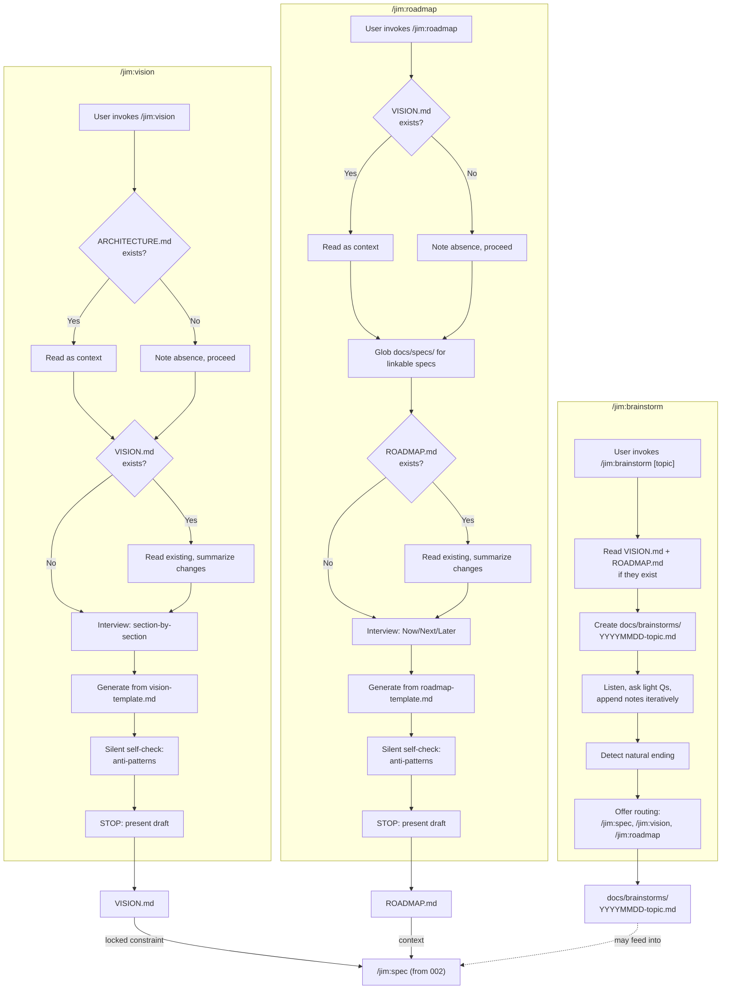

# Plan: PM Strategic Skills — /jim:vision, /jim:roadmap, /jim:brainstorm

## Overview

Deliver the three strategic skills for `@jim:pm`: vision (product direction), roadmap (execution sequence), and brainstorm (freeform ideation). Each skill produces a standalone strategic artifact. The PM agent already declares these skills in its `skills:` frontmatter (from 002-pm-core) — this spec only creates the skill files and templates.

## Data Flow



## Design Decisions

### 1. Section-by-section interview for vision, not all-at-once

- **Chosen:** The vision skill walks through the 7 template sections sequentially. For each section: ask 1-2 bounded questions, summarize the answer, fill the slot, move to the next. Critical sections (Problem Statement, Target Audience, Non-Goals) get deeper questioning; lighter sections (Roadmap Trajectory) can be drafted with reasonable defaults.
- **Why:** The research identifies a fatigue risk — 7 sections × 3-5 questions = 20+ questions. The section-by-section approach with answer-to-slot mapping (from deanpeters positioning-workshop) keeps each mini-interview focused and gives the user progress signals. The PM can draft sections with defaults and ask the user to refine, rather than interviewing every detail.
- **Rejected:** All-at-once interview then generate — overwhelms the user and delays any visible output.

### 2. Anti-patterns defined inline per skill, not in a shared reference file

- **Chosen:** Each skill defines its own small set of anti-patterns relevant to its artifact (vision: 3, roadmap: 3). These are inline in the SKILL.md within the self-check section.
- **Why:** The anti-patterns are artifact-specific (vision anti-patterns differ from roadmap anti-patterns) and short enough to fit inline. A shared `references/` file would add indirection for ~10 lines of content each. The 500-line budget has room. The spec skill (002) has its own anti-patterns in `references/spec-types.md` because it has 6 anti-patterns plus extensive per-type guidance — the strategic skills don't need that volume.
- **Rejected:** Shared `references/pm-anti-patterns.md` — overkill for 3 items per skill, adds a file read before every self-check.

### 3. Brainstorm uses iterative appending, not end-of-session dump

- **Chosen:** The brainstorm skill creates the file upfront and appends notes using Edit as the conversation progresses, rather than holding everything in context and writing once at the end.
- **Why:** Research2 recommendation #3 flags context window risk for long brainstorm sessions. Iterative appending prevents data loss if the session runs long and reduces cognitive load on the context window. The file is the working document, not just the final output.
- **Rejected:** Single write at session end — risks data loss and context overflow.

### 4. Roadmap uses Glob + Grep for spec linking, never Read

- **Chosen:** When auto-linking roadmap items to existing specs, use `Glob docs/specs/**/*.md` to find candidates, then `Grep` frontmatter `title:` fields to match. Never Read full spec contents during roadmap creation.
- **Why:** Research flags context window crash risk (research.md line 196, research2.md line 85). Glob returns paths; Grep extracts titles. The PM presents matches as suggestions — the user decides which links to keep.
- **Rejected:** Reading each spec to understand content — context bomb in repos with many specs.

### 5. Templates are structural skeletons, not tutorials

- **Chosen:** Vision and roadmap templates contain section headers, 1-2 sentence descriptions of what belongs in each section, and placeholder markers. Guidance on *how* to fill them lives in the SKILL.md process flow.
- **Why:** Templates are output artifacts the user will edit and maintain. Tutorial content in templates creates clutter that users must delete. The SKILL.md is the instruction surface; the template is the output surface.
- **Rejected:** Rich guidance in templates — produces output files full of instructions the user has to clean up.

### 6. Brainstorm has no template file

- **Chosen:** No `assets/brainstorm-template.md`. The skill creates a file with a title and date, then captures in whatever structure emerges.
- **Why:** The spec is explicit: "No template. The PM captures ideas in whatever structure emerges naturally from the conversation" (spec line 91). A template would contradict this design intent. The only imposed structure is the filename convention.
- **Rejected:** Minimal template with just headers — even minimal structure constrains freeform ideation.

## File Manifest

| # | Component | File Path | Action | Notes |
|---|-----------|-----------|--------|-------|
| 1 | Vision template | `skills/vision/assets/vision-template.md` | Create | Output template with 7 sections: Problem Statement, Solution Statement, Target Audience, Competitive Landscape, Product North Star, Roadmap Trajectory, Non-Goals |
| 2 | Roadmap template | `skills/roadmap/assets/roadmap-template.md` | Create | Output template with Last Updated, Now/Next/Later buckets, version anchors, goal-oriented framework (Objective/Deliverables/Success Metrics), simple list alternative |
| 3 | Vision skill | `skills/vision/SKILL.md` | Create | Section-by-section interview, differential updates, self-check. ≤500 lines |
| 4 | Roadmap skill | `skills/roadmap/SKILL.md` | Create | Now/Next/Later interview, spec auto-linking, conciseness enforcement. ≤500 lines |
| 5 | Brainstorm skill | `skills/brainstorm/SKILL.md` | Create | Freeform capture, iterative appending, end-of-session routing. ≤500 lines |

## Interface Contracts

### Skill Frontmatter: `skills/vision/SKILL.md`

```yaml
---
name: vision
description: >
  Create or update the project VISION.md — problem statement, target audience,
  competitive landscape, non-goals, and product north star. Use when the user
  invokes /jim:vision, asks about product direction, or wants to define what
  the project is and isn't. Do not use for technical architecture (/jim:arch),
  execution sequencing (/jim:roadmap), or scoping individual work items (/jim:spec).
agent: pm
---
```

### Skill Frontmatter: `skills/roadmap/SKILL.md`

```yaml
---
name: roadmap
description: >
  Create or update the project ROADMAP.md — Now/Next/Later execution buckets
  with version anchors. Use when the user invokes /jim:roadmap, wants to
  organize priorities, or asks what's coming next. Do not use for product
  direction (/jim:vision), technical architecture (/jim:arch), or scoping
  individual work items (/jim:spec).
agent: pm
---
```

### Skill Frontmatter: `skills/brainstorm/SKILL.md`

```yaml
---
name: brainstorm
description: >
  Capture freeform ideation and exploratory thinking to
  docs/brainstorms/{YYYYMMDD}-{topic}.md. Use when the user invokes
  /jim:brainstorm, wants to think through ideas, or explore options without
  committing to a spec. Do not use when the user wants a structured spec
  (/jim:spec) or strategic document (/jim:vision, /jim:roadmap).
agent: pm
argument-hint: "[topic]"
---
```

### Vision Template: `skills/vision/assets/vision-template.md`

Structural skeleton with these sections:
```
# {Project Name} — Vision

## Problem Statement
{~50 words max. The specific user pain. No solution language, no technical framing.}
* **The Ideal:** {Desired state.}
* **The Reality / Friction:** {Specific pain or gap.}
* **The Consequence:** {Cost of inaction.}

## Solution Statement
{What we're building and the core benefit.}
* **The Mechanism:** {High-level approach.}
* **The Function:** {Workflow or capability.}
* **The Result:** {Outcome for the user.}

## Target Audience
{Who has this pain. Include who this is NOT for.}

## Competitive Landscape
<!-- Table only. No summary paragraphs beneath the table. -->
| Approach | Pros | Cons |
|----------|------|------|

## Product North Star
{Long-term end state. How we measure success.}

## Roadmap Trajectory
{High-level phases — Phase 1 / Phase 2 / Phase 3. Overview only.}

## Non-Goals
{Hard boundaries. What the product will not do.}
```

### Roadmap Template: `skills/roadmap/assets/roadmap-template.md`

Structural skeleton with:
```
# {Project Name} — Roadmap

*Last updated: {YYYY-MM-DD}*

## Now — {version anchor, e.g., v0.1}
{Active work.}

## Next — {version anchor}
{Committed but not started.}

## Later
{Future ideas. Acknowledged but not committed.}
```

Each bucket supports two detail levels:
- **Goal-oriented** (for mature phases): Objective / Deliverables / Success Metrics
- **Simple list** (for tactical items): bullet list of deliverables

## Task Breakdown

### Task 1: Create `skills/vision/assets/vision-template.md`

Write the vision output template. This is the artifact the skill generates — not the skill itself.

Contents:
- Project name placeholder in the title
- All 7 sections as `##` headers: Problem Statement, Solution Statement, Target Audience, Competitive Landscape, Product North Star, Roadmap Trajectory, Non-Goals
- Each section has a 1-2 sentence description of what belongs there (in placeholder syntax, e.g., `{The specific user pain...}`)
- Problem Statement uses structured sub-bullets: **The Ideal** / **The Reality / Friction** / **The Consequence**, with a ~50 word summary paragraph
- Solution Statement uses structured sub-bullets: **The Mechanism** / **The Function** / **The Result**, with a summary paragraph
- Competitive Landscape uses table-only format (Approach / Pros / Cons) with an HTML comment: no summary paragraphs beneath the table
- No tutorial content, no examples, no guidance — that lives in the SKILL.md
- Problem Statement and Non-Goals are the two most critical sections — mark them with brief emphasis (e.g., "This is the foundation all specs trace back to")

**Verify:**
```bash
test -f skills/vision/assets/vision-template.md && grep -q "Problem Statement" skills/vision/assets/vision-template.md && grep -q "Non-Goals" skills/vision/assets/vision-template.md && grep -q "Solution Statement" skills/vision/assets/vision-template.md && grep -q "Target Audience" skills/vision/assets/vision-template.md && grep -q "Competitive Landscape" skills/vision/assets/vision-template.md && grep -q "Product North Star" skills/vision/assets/vision-template.md && grep -q "Roadmap Trajectory" skills/vision/assets/vision-template.md
```

### Task 2: Create `skills/roadmap/assets/roadmap-template.md`

Write the roadmap output template.

Contents:
- Project name placeholder in the title
- `*Last updated: {YYYY-MM-DD}*` date marker at the top
- Three `##` buckets: Now, Next, Later — each with a version anchor placeholder
- Under each bucket, show both detail levels:
  - Goal-oriented example block: `### Objective` / `### Deliverables` / `### Success Metrics`
  - Simple list alternative: bullet list of deliverables
  - Brief note: "Use goal-oriented framework for mature phases with clear objectives. Use simple lists for tactical items or early ideas."
- Linking guidance: "Link items to specs, debug docs, or issues when relevant: `[003-pm-strategy](docs/specs/jim/003-pm-strategy/spec.md)`"
- No prioritization frameworks (RICE, ICE, Kano) — the spec explicitly excludes these

**Verify:**
```bash
test -f skills/roadmap/assets/roadmap-template.md && grep -q "Last updated" skills/roadmap/assets/roadmap-template.md && grep -q "Now" skills/roadmap/assets/roadmap-template.md && grep -q "Next" skills/roadmap/assets/roadmap-template.md && grep -q "Later" skills/roadmap/assets/roadmap-template.md && grep -q "Objective" skills/roadmap/assets/roadmap-template.md && grep -q "Deliverables" skills/roadmap/assets/roadmap-template.md && grep -q "Success Metrics" skills/roadmap/assets/roadmap-template.md
```

### Task 3: Create `skills/vision/SKILL.md`

Write the vision skill — the interview-driven workflow for creating/updating VISION.md.

Frontmatter as specified in Interface Contracts above (name, description, agent).

Body structure:

1. **Opening line** — one-sentence purpose: "Create or update the project's VISION.md through a section-by-section collaborative interview."

2. **`$ARGUMENTS` handling** — if provided, use as project name or topic hint. If empty, ask what project/product the user wants to define a vision for.

3. **Read context** — Read ARCHITECTURE.md from project root if it exists (locked constraint — don't contradict technical decisions already made). If missing, note conversationally: "No ARCHITECTURE.md yet — we can create one after this with `/jim:arch`." Do not block.

4. **Check for existing VISION.md** — Read VISION.md from project root.
   - **Exists:** This is a differential update. Read the existing content. Tell the user: "I see an existing VISION.md. I'll walk through each section and suggest changes based on our conversation. I'll summarize what's changing before applying." Identify which sections are already well-defined vs. which need work.
   - **Does not exist:** Fresh creation. Proceed to interview.

5. **Problem Statement & Solution Statement — wordsmith mode** — These two sections use structured sub-bullet formats. The wording matters:
   - Explain the structured format before interviewing (Problem: The Ideal / The Reality / The Consequence; Solution: The Mechanism / The Function / The Result)
   - Interview to understand the content, then draft the section with structured sub-bullets
   - Present the draft and iterate on exact wording with the user
   - Do not advance until the user approves the wording — multiple revision rounds are expected and by design

6. **Remaining sections — standard interview** — Walk through the remaining 5 template sections in order. For each section:
   - Explain what the section captures (one sentence)
   - Ask 1-2 bounded questions. Use numbered options where appropriate (3-5 options + "describe your own")
   - Recursive drill-down on vague statements. If the user says something generic like "for developers" → ask "which developers specifically? Frontend? Backend? DevOps? Junior? Senior?"
   - Once a clear answer emerges, draft the section content and move to the next

   **Section priorities:**
   - **Deep interview:** Target Audience, Non-Goals — critical strategic decisions
   - **Moderate interview:** Competitive Landscape — table-only format (Approach / Pros / Cons), no summary paragraphs
   - **Light interview:** Product North Star, Roadmap Trajectory — can be drafted with reasonable defaults from prior answers, refined by user

   If the user provides a context dump (pastes existing docs, PRDs, notes), skip redundant questions and extract answers from the provided context. Label any assumptions explicitly.

7. **Generate VISION.md** — Read `assets/vision-template.md`. Fill each section with the interview results. Keep it concise — the goal is clarity of direction, not exhaustive documentation.

8. **Silent self-check** — Before presenting, validate against these anti-patterns:
   - **"For everyone" targeting** — Target Audience is too broad or doesn't exclude anyone. Fix: narrow the audience, add explicit exclusions.
   - **Solution-first framing** — Problem Statement contains solution language ("we need to build X"). Fix: reframe around the user pain.
   - **Technical creep** — Any section contains implementation details (API specs, DB schemas, architecture). Fix: move to a note suggesting `/jim:arch`.

   Auto-correct violations before presenting.

9. **Present and stop** — Sections are approved individually during the interview (Problem/Solution via wordsmith mode, others as drafted). This step is the final full-document review. Show the drafted VISION.md to the user. If differential update, show a summary of changes by section before applying. Ask: "Want me to apply this, or would you like changes?" Use Edit for updates, Write for new files. Never auto-apply.

Constraints:
- ≤500 lines total
- Imperative form throughout
- No personality soup
- No instruction shadowing of WORKFLOW.md
- Reference `assets/vision-template.md` — don't inline the template
- Vision covers product direction only. Redirect technical specifics: "That sounds like an architecture decision — want to run `/jim:arch` after this?"

**Verify:**
```bash
test -f skills/vision/SKILL.md && head -10 skills/vision/SKILL.md | grep -q "name: vision" && grep -q "agent: pm" skills/vision/SKILL.md && grep -q "ARCHITECTURE.md" skills/vision/SKILL.md && grep -q "self-check\|Self-check\|anti-pattern" skills/vision/SKILL.md && wc -l < skills/vision/SKILL.md | awk '{exit ($1 > 500)}'
```

### Task 4: Create `skills/roadmap/SKILL.md`

Write the roadmap skill — the workflow for creating/updating ROADMAP.md.

Frontmatter as specified in Interface Contracts above (name, description, agent).

Body structure:

1. **Opening line** — "Create or update the project's ROADMAP.md — a concise Now/Next/Later execution sequence with version anchors."

2. **`$ARGUMENTS` handling** — if provided, use as a hint for what the user wants to add or update in the roadmap. If empty, start from scratch or review the existing roadmap.

3. **Read context** — Read VISION.md from project root if it exists (for strategic alignment). If missing, note: "No VISION.md yet — consider running `/jim:vision` first to establish product direction. I'll proceed without it." Do not block.

4. **Search for linkable specs** — Glob `docs/specs/**/*.md` to find existing specs. Grep frontmatter `title:` fields to build a list of linkable candidates. Hold this list for use during the interview — when the user mentions a deliverable that matches a known spec, offer the link.

5. **Check for existing ROADMAP.md** — Read ROADMAP.md from project root.
   - **Exists:** Differential update. Read existing content. Summarize current state to the user. Ask what they want to change — add items, move items between buckets, update version anchors, refine objectives.
   - **Does not exist:** Fresh creation. Proceed to interview.

6. **Interview** — Walk through the three time-horizon buckets:
   - **Now** — "What's actively being worked on? What version or milestone does this map to?"
   - **Next** — "What's committed but not started? When does this come after Now?"
   - **Later** — "What ideas are on the horizon but not committed?"

   For each item, determine the appropriate detail level:
   - If the user describes clear objectives and success criteria → use goal-oriented framework (Objective / Deliverables / Success Metrics)
   - If the user lists tactical items or early ideas → use simple bullet list

   When a deliverable matches a known spec from step 4, offer: "I found a spec for that — want me to link it? `[003-pm-strategy](docs/specs/jim/003-pm-strategy/spec.md)`"

7. **Conciseness enforcement** — If any bucket has more than 5-7 items, or any item description exceeds 3-4 lines, push back: "This is getting detailed — want to create a spec for this with `/jim:spec`? The roadmap works best as a big-picture view." The roadmap is a strategic communication tool, not a backlog.

8. **Generate ROADMAP.md** — Read `assets/roadmap-template.md`. Fill buckets with interview results. Set "Last updated" to today's date. Keep it concise.

9. **Silent self-check** — Before presenting, validate against these anti-patterns:
   - **Feature list, no outcomes** — Items are just feature names without strategic context. Fix: add objectives or group under meaningful themes.
   - **Backlog masquerading as roadmap** — More than ~7 items per bucket. Fix: consolidate or defer detail to specs.
   - **No version anchors** — Buckets have no version or milestone markers. Fix: ask the user for version targets.

   Auto-correct violations before presenting.

10. **Present and stop** — Show the drafted ROADMAP.md. If differential update, show change summary first. Ask for approval. Use Edit for updates, Write for new files.

Constraints:
- ≤500 lines total
- Imperative form throughout
- No personality soup
- No prioritization frameworks (RICE, ICE, Kano) — the user prioritizes, the PM organizes
- Reference `assets/roadmap-template.md` — don't inline the template
- Roadmap stays concise — push detail to specs

**Verify:**
```bash
test -f skills/roadmap/SKILL.md && head -10 skills/roadmap/SKILL.md | grep -q "name: roadmap" && grep -q "agent: pm" skills/roadmap/SKILL.md && grep -q "Now\|Next\|Later" skills/roadmap/SKILL.md && grep -q "self-check\|Self-check\|anti-pattern" skills/roadmap/SKILL.md && wc -l < skills/roadmap/SKILL.md | awk '{exit ($1 > 500)}'
```

### Task 5: Create `skills/brainstorm/SKILL.md`

Write the brainstorm skill — the freeform ideation capture workflow.

Frontmatter as specified in Interface Contracts above (name, description, agent, argument-hint).

Body structure:

1. **Opening line** — "Capture freeform ideation and exploratory thinking. No rigid structure — the goal is to think freely, not to produce a spec."

2. **`$ARGUMENTS` handling** — use as the topic for the brainstorm file. If empty, ask: "What do you want to brainstorm about?" Use the answer as the topic.

3. **Read context (light)** — Quickly read VISION.md and ROADMAP.md if they exist. Don't discuss them — just hold them as context so the end-of-session routing is informed.

4. **Create the brainstorm file** — Create `docs/brainstorms/{YYYYMMDD}-{topic}.md`. Use today's date and the topic slug (lowercase, hyphens, no spaces). Create the `docs/brainstorms/` directory if it doesn't exist. Write an initial title: `# Brainstorm: {Topic}` and `*{YYYY-MM-DD}*`.

5. **Listen and capture** — This is the core loop. The PM's role is active listener and synthesizer:
   - Ask light clarifying questions to flesh out the thinking. Not a full PM interview — just enough to deepen the ideas.
   - Capture ideas in whatever structure emerges: bullet lists, prose, questions, pros/cons, diagrams.
   - Use Edit to append notes to the brainstorm file as the conversation progresses (iterative appending, not end-of-session dump). This prevents data loss and keeps the file as the working document.
   - Do not push toward a spec. Do not impose frameworks (no RICE, no OST, no JTBD). Let the user think freely.
   - Do not critique or evaluate ideas — capture them. Evaluation happens later if the user decides to spec.

6. **Detect natural ending** — When the conversation reaches a natural stopping point (user says "I think that's it", "thanks", topic exhaustion, or long pause), move to routing.

7. **End-of-session routing** — Offer to route synthesized ideas into the formal workflow:
   - "Want me to route any of these ideas into the formal workflow?"
   - "I can create a spec (`/jim:spec`), update the vision (`/jim:vision`), add to the roadmap (`/jim:roadmap`), or run a technical investigation (`/jim:research`)."
   - This is an offer, not a push. If the user says no, close the session.
   - If the user says yes to a spec, suggest running `/jim:spec` with the brainstorm file as input context.

Constraints:
- ≤500 lines total (this skill should be short — minimal process, maximum capture)
- Imperative form
- No personality soup
- No template — explicitly resist imposing structure
- No anti-pattern self-check (brainstorms are freeform by design)
- The file is the working document — append iteratively, don't hold in context

**Verify:**
```bash
test -f skills/brainstorm/SKILL.md && head -10 skills/brainstorm/SKILL.md | grep -q "name: brainstorm" && grep -q "agent: pm" skills/brainstorm/SKILL.md && grep -q "YYYYMMDD\|brainstorms/" skills/brainstorm/SKILL.md && wc -l < skills/brainstorm/SKILL.md | awk '{exit ($1 > 500)}'
```

### Task 6: Cross-validate all five artifacts

Read all five files and verify:

- `skills/vision/SKILL.md` frontmatter: `name: vision`, `agent: pm`
- `skills/vision/SKILL.md` ≤ 500 lines
- `skills/vision/SKILL.md` references `assets/vision-template.md`
- `skills/vision/SKILL.md` has self-check with anti-patterns
- `skills/vision/assets/vision-template.md` has all 7 sections
- `skills/roadmap/SKILL.md` frontmatter: `name: roadmap`, `agent: pm`
- `skills/roadmap/SKILL.md` ≤ 500 lines
- `skills/roadmap/SKILL.md` references `assets/roadmap-template.md`
- `skills/roadmap/SKILL.md` has self-check with anti-patterns
- `skills/roadmap/assets/roadmap-template.md` has Now/Next/Later, Last Updated, goal-oriented framework
- `skills/brainstorm/SKILL.md` frontmatter: `name: brainstorm`, `agent: pm`, `argument-hint`
- `skills/brainstorm/SKILL.md` ≤ 500 lines
- `skills/brainstorm/SKILL.md` references `docs/brainstorms/{YYYYMMDD}-{topic}.md` filename convention
- `skills/brainstorm/SKILL.md` has no template, no anti-pattern self-check
- All three skills follow differential update pattern (read existing → summarize → ask → Edit)
- No anti-patterns across any skill: no personality soup, no permission creep, no instruction shadowing, no duplicate logic
- All `name` fields match their directory names
- No agent modification needed — `agents/pm.md` already lists all skills

**Verify:**
```bash
grep -q "agent: pm" skills/vision/SKILL.md && grep -q "agent: pm" skills/roadmap/SKILL.md && grep -q "agent: pm" skills/brainstorm/SKILL.md && grep -q "vision-template" skills/vision/SKILL.md && grep -q "roadmap-template" skills/roadmap/SKILL.md && grep -q "Problem Statement" skills/vision/assets/vision-template.md && grep -q "Now" skills/roadmap/assets/roadmap-template.md && echo "Cross-validation passed"
```

## Dependencies

```
Task 1 (vision-template.md)  ──► Task 3 (vision SKILL.md)  ──┐
                                                               │
Task 2 (roadmap-template.md) ──► Task 4 (roadmap SKILL.md) ──┼──► Task 6 (cross-validate)
                                                               │
                                  Task 5 (brainstorm SKILL.md)─┘
```

Tasks 1 and 2 are independent — the two templates have no dependencies on each other.

Task 3 depends on Task 1 — the vision skill references the vision template and needs to know its structure.

Task 4 depends on Task 2 — the roadmap skill references the roadmap template.

Task 5 is independent — the brainstorm skill has no template dependency.

Tasks 3, 4, and 5 are independent of each other — the three skills don't reference each other's internals.

Task 6 validates the full set and depends on all prior tasks.

## Out of Scope

- **PM agent (`agents/pm.md`)** — delivered in 002-pm-core. Already declares `skills: [spec, vision, roadmap, brainstorm]`. Tools list updated to include `Agent(researcher)` as part of 004-researcher integration.
- **Spec skill (`skills/spec/SKILL.md`)** — delivered in 002-pm-core.
- **Architecture skill (`skills/arch/SKILL.md`)** — owned by `@jim:architect`, not the PM.
- **Prioritization frameworks** (RICE, ICE, Kano) — explicitly excluded by the spec.
- **Automated roadmap updates from build/ship phases** — future capability.
- **Brainstorm template** — explicitly excluded by the spec ("No template").

## Open Questions

None — all questions resolved through spec and research.

## Notes

- **002-pm-core may not be built yet.** The PM agent and spec skill are defined in 002 but may not exist at build time. The three strategic skills are independent — they don't depend on the spec skill being present. They share the same agent but only cross-reference each other through routing suggestions (e.g., "want to run `/jim:spec`?").
- **VISION.md and ARCHITECTURE.md are empty placeholders.** The vision skill will write VISION.md for the first time. All skills handle missing strategic docs gracefully (note absence, suggest creating, proceed).
- **`docs/brainstorms/` directory doesn't exist.** The brainstorm skill creates it on first use.
- **`agent: pm` is documentation-only.** Same convention as 001-meta. Not a Claude Code routing field.
- **No agent body changes.** The PM agent body (from 002) says "Follow the active skill's instructions." Each 003 skill is self-contained with its own process flow. The agent just provides identity and paths.
