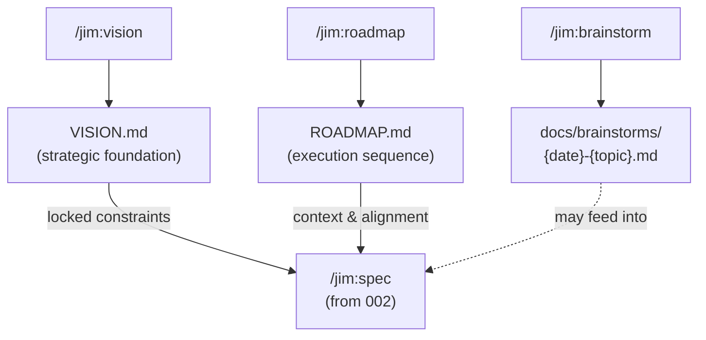

# 003 PM Strategic Skills: /jim:vision, /jim:roadmap, /jim:brainstorm

## Overview

The upstream strategic skills for `@jim:pm` — creating and maintaining the project's vision, roadmap, and freeform ideation notes. These skills produce the strategic documents that `/jim:spec` (002-pm-core) treats as locked constraints, establishing the "why" and "when" before individual specs define the "what."

## Problem Statement

Without structured strategic documents, specs are written in a vacuum. Developers make implicit assumptions about product direction, target audience, and prioritization that may conflict across specs. When a PM agent asks "does this align with the vision?" but no vision document exists, alignment checks become meaningless. Jim needs skills that guide the developer through creating concise, opinionated strategic artifacts — and that maintain them as living documents as the project evolves.

## User Stories

- As a developer starting a new project, I can run `/jim:vision` and be guided through defining my problem statement, target audience, and competitive landscape so that all future specs have a shared strategic foundation.
- As a developer, I can run `/jim:roadmap` and organize my planned work into Now/Next/Later buckets tied to version anchors so that priorities are clear without false precision on dates.
- As a developer, I can run `/jim:brainstorm` to capture freeform ideas and exploratory thinking without needing to structure them as specs, so that ideation isn't bottlenecked by formality.
- As a developer, I can re-run `/jim:vision` or `/jim:roadmap` on existing documents to refine them based on new context, and the PM summarizes proposed changes before applying them.
- As a developer, the PM never overwrites my strategic documents without showing me what's changing and getting my approval.

## Deliverables

| Artifact | Path | Purpose |
|----------|------|---------|
| Vision Skill | `skills/vision/SKILL.md` | `/jim:vision` skill instructions |
| Vision Template | `skills/vision/assets/vision-template.md` | Output template for VISION.md |
| Roadmap Skill | `skills/roadmap/SKILL.md` | `/jim:roadmap` skill instructions |
| Roadmap Template | `skills/roadmap/assets/roadmap-template.md` | Output template for ROADMAP.md |
| Brainstorm Skill | `skills/brainstorm/SKILL.md` | `/jim:brainstorm` skill instructions |

No agent file is delivered — `@jim:pm` (from 002-pm-core) already declares these skills in its `skills:` frontmatter.

## Skill Specifications

### /jim:vision — VISION.md

**Purpose:** Define where the project is going and why. The vision is the foundational strategic document — short, opinionated, and stable.

**Template sections:**

1. **Problem Statement** — The specific user pain point. Strictly user-focused — no solution language, no technical framing.
2. **Solution Statement** — What we're building and how it provides the core benefit that makes it indispensable.
3. **Target Audience** — Exactly who has the pain described in the problem statement. Include who this is *not* for.
4. **Competitive Landscape** — How this compares to current habits or tools. List specific competitors with pros/cons for this audience and problem. Where we are better and worse.
5. **Product North Star** — The long-term end state. How do we measure success?
6. **Roadmap Trajectory** — High-level phases of where the product is going (Phase 1 / Phase 2 / Phase 3). Overview only — detailed sequencing lives in ROADMAP.md.
7. **Non-Goals** — Hard boundaries on what the product will not do. These are locked decisions that `/jim:spec` treats as constraints.

**Interview approach:** The PM walks through each section conversationally, using recursive interview to drill into vague statements. The vision should be concise — the goal is clarity of direction, not exhaustive documentation.

**Output:** `VISION.md` at the project root (or plugin root for jim-developing-jim).

### /jim:roadmap — ROADMAP.md

**Purpose:** Organize planned work into a clear, concise execution sequence. The roadmap shows the big picture — it is not a detailed backlog.

**Template structure:**

- **Last Updated** date at the top (living document marker).
- **Time-horizon buckets:**
  - **Now** — In progress. Active work.
  - **Next** — Upcoming. Committed but not started.
  - **Later** — Future ideas. Acknowledged but not committed.
- **Version anchors** — Tie horizons to specific version numbers (e.g., v1.2, v2.0) where possible, creating clear release milestones.

**Item format — flexible detail levels:**

For mature phases with clear objectives, use the goal-oriented framework:
- **Objective** — What specific problem are we solving?
- **Deliverables** — The actual features or technical items being shipped.
- **Success Metrics** — How will we measure if this phase was successful?

For tactical phases or early ideas, a simple list of deliverables is fine. The goal is clarity, not forced complexity.

**Linking:** Link high-level items to specific spec.md, debug docs, brainstorm docs, or GitHub/GitLab issues when relevant and possible.

**Discipline:** The roadmap is a short, concise list that's easy to read and gives the big picture. It is not a detailed description of everything coming. If it's getting long, items should be specs, not roadmap entries.

**Output:** `ROADMAP.md` at the project root (or plugin root for jim-developing-jim).

### /jim:brainstorm — Freeform Ideation

**Purpose:** Capture exploratory thinking without the structure of a spec. Brainstorms are disposable — they may feed into specs later, or they may not.

**No template.** The PM captures ideas in whatever structure emerges naturally from the conversation — bullet lists, prose, diagrams, questions, pros/cons. The only structure imposed is the filename convention and a title.

**Filename:** `docs/brainstorms/{YYYYMMDD}-{topic}.md`

**Behavior:** The PM listens, asks light clarifying questions, captures the thinking, and writes it to a file. It does not push toward a spec — that's the user's decision. If the user says "this should be a spec," the PM suggests running `/jim:spec` with the brainstorm as input. At the end of a session, the PM offers to route synthesized ideas into the formal workflow — primarily `/jim:spec`, but also `/jim:vision`, `/jim:roadmap`, or `/jim:research` if relevant. The PM does not push, but offers.

## Collaborative Validation Model

Same model as 002-pm-core. The PM is a conversational partner:

- **No automated blocking.** The PM never refuses to proceed based on its own assessment.
- **Gentle observations.** If the PM notices the vision has gaps or the roadmap seems inconsistent, it raises the observation in chat.
- **Explicit human approval.** Strategic documents are finalized only when the user says so.
- **Living documents.** Re-running any strategic skill on an existing document refines it — never overwrites blindly. The PM summarizes proposed changes before applying.

## Acceptance Criteria

### /jim:vision
- [ ] `skills/vision/SKILL.md` exists with correct frontmatter (name, description, agent: pm).
- [ ] `skills/vision/assets/vision-template.md` provides the output template with all seven sections: Problem Statement, Solution Statement, Target Audience, Competitive Landscape, Product North Star, Roadmap Trajectory, Non-Goals.
- [ ] The skill guides the user through each section conversationally, using recursive interview for vague statements.
- [ ] The skill produces a concise VISION.md — clarity of direction, not exhaustive documentation.
- [ ] Differential update: if VISION.md already exists, the skill summarizes proposed changes before applying them.
- [ ] The skill never overwrites VISION.md without explicit human approval.

### /jim:roadmap
- [ ] `skills/roadmap/SKILL.md` exists with correct frontmatter (name, description, agent: pm).
- [ ] `skills/roadmap/assets/roadmap-template.md` provides the output template with Now/Next/Later buckets, version anchors, and the goal-oriented framework (Objective/Deliverables/Success Metrics).
- [ ] The template includes a "Last Updated" date marker.
- [ ] The skill supports flexible detail levels — goal-oriented framework for mature phases, simple lists for tactical items.
- [ ] The skill encourages linking items to specs, debug docs, brainstorms, or issue trackers when relevant.
- [ ] The skill keeps the roadmap concise — pushes back if entries are becoming too detailed (those should be specs).
- [ ] The skill actively searches for existing specs via docs/specs/ to auto-link deliverables where applicable.
- [ ] Differential update: if ROADMAP.md already exists, the skill summarizes proposed changes before applying them.
- [ ] The skill never overwrites ROADMAP.md without explicit human approval.

### /jim:brainstorm
- [ ] `skills/brainstorm/SKILL.md` exists with correct frontmatter (name, description, agent: pm).
- [ ] The skill produces files at `docs/brainstorms/{YYYYMMDD}-{topic}.md`.
- [ ] No rigid template — the skill captures ideas in whatever structure emerges from the conversation.
- [ ] The skill does not push toward creating a spec. If the user wants a spec, it suggests `/jim:spec`.
- [ ] The skill asks light clarifying questions to flesh out the thinking, without conducting a full PM interview.
- [ ] At the end of a session, the skill offers to route synthesized ideas into the formal workflow (/jim:spec primarily, or /jim:vision, /jim:roadmap, /jim:research if relevant).

### Shared
- [ ] All three skills follow the collaborative validation model (no automated blocking, explicit human approval, differential updates).
- [ ] No anti-patterns: no personality soup, no permission creep, no instruction shadowing, no duplicate logic.
- [ ] Each SKILL.md body ≤ 500 lines. Overflow into assets/ or references/.

## Data Flow

## Out of Scope

- **@jim:pm agent definition** — delivered in 002-pm-core. This spec only adds skills to the existing agent.
- **/jim:spec skill** — delivered in 002-pm-core.
- **Prioritization frameworks** (RICE, ICE, Kano) — the roadmap skill helps organize and sequence, but does not impose a scoring framework. Users prioritize; the PM helps articulate.
- **Architecture documents** — `/jim:arch` is owned by `@jim:architect`, not the PM.
- **Automated roadmap updates from build/ship phases** — future capability.

## Open Questions

None — all questions resolved through pre-spec discussion.
