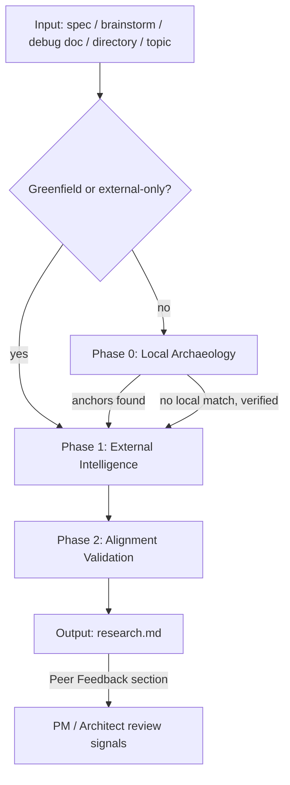

# 004 Researcher Agent and Skill

## Overview

A single-agent, tiered-phase researcher (`@jim:researcher`) that gathers codebase context and external knowledge to ground any phase of the jim SDLC — from pre-spec exploration through planning and implementation. Replaces the V1 researcher with local-first enforcement, strategic alignment validation, model tiering, and flexible invocation that supports research before, during, or after spec creation.

## Problem Statement

Every phase of the jim SDLC benefits from grounded technical knowledge — the PM needs landscape context to write realistic specs, the architect needs codebase anchors to plan against, and the coder needs conventions and test patterns to follow. Without structured research, agents plan against assumptions rather than evidence, and developers discover surprises mid-implementation that force costly rework. The V1 researcher addressed the planning gap but had three key limitations: no enforcement of local-first discovery (leading to generic web suggestions over project-specific patterns), no strategic alignment check (allowing research to recommend legacy patterns the project is moving away from), and no feedback mechanism to upstream agents when research invalidates existing specs or plans. Additionally, V1 only supported post-spec research — it couldn't help the PM explore a technical landscape before scoping work.

## User Stories

- As the **architect agent**, I can receive a research.md grounded in actual codebase anchors so that my plan targets real integration points rather than assumptions.
- As the **coder agent**, I can reference research.md for anchor file paths, test locations, and local patterns so that I follow project conventions without rediscovering them.
- As the **PM agent**, I can invoke the researcher during brainstorming or spec creation to get technical ground truth, so that specs are grounded in what actually exists rather than assumptions.
- As the **PM agent**, I receive structured feedback when research reveals that a spec requirement is infeasible or better achieved differently, so that I can update the spec before planning begins.
- As a **developer**, I can invoke `/jim:research` directly against a spec, brainstorm, debug doc, directory, or arbitrary topic so that I understand the technical landscape before committing to any phase.
- As a **developer**, I can run `/jim:research` before writing a spec to explore what libraries, patterns, or prior art exist, so that my spec is informed by evidence rather than guesswork.
- As a **developer**, I can run `/jim:research` as standalone exploratory research on a topic or library to understand the technical landscape without needing a spec.

## Data Flow

## Acceptance Criteria

### Agent (`@jim:researcher`)

- [ ] Single agent with `model: haiku` for local scanning phases; final synthesis and alignment validation use `model: sonnet` (model tiering via skill instructions, not agent frontmatter — agent sets `model: sonnet` and skill instructions direct haiku-appropriate work to Explore/Glob/Grep subagents)
- [ ] Agent frontmatter includes `tools` restricted to: Read, Glob, Grep, Write, Edit, WebFetch, WebSearch, Agent(Explore)
- [ ] Agent body is self-contained system prompt (no inherited context assumption per Claude Code agent mechanics)
- [ ] Agent description includes triggering conditions and at least one example block

### Skill (`/jim:research`)

- [ ] User-invocable skill at `skills/research/SKILL.md`
- [ ] Accepts `$ARGUMENTS` as: spec path, brainstorm path, debug doc path, directory path, arbitrary topic string, or empty (prompts user)
- [ ] Skill frontmatter declares `agent: researcher` (documentation convention)
- [ ] Can be invoked before spec creation (exploratory), between spec and plan (standard), or as standalone exploratory research (topic/library investigation)

### Phase 0 — Local Archaeology (Default, skippable for greenfield/external-only)

- [ ] **Default behavior**: Agent must complete a local codebase pass (Glob + Grep + Read) before any WebSearch or WebFetch call
- [ ] Must identify at least one local anchor OR explicitly document "no local implementation exists" with an audit trail of the specific Grep patterns and Glob patterns attempted (e.g., `grep "auth"`, `grep "login"`, `glob **/auth/**`) before proceeding to Phase 1
- [ ] Discovers: anchor file paths with line ranges, existing test paths and conventions, local patterns and utilities, existing specs in the same group
- [ ] **Greenfield auto-detection**: If the target group/directory has no existing code, or the research topic has no codebase analog (e.g., evaluating a library for a new project), Phase 0 produces a brief "greenfield — no local codebase to scan" note and proceeds directly to Phase 1
- [ ] **Hybrid handling**: For partially greenfield work (new subsystem integrating with existing code), Phase 0 still runs to find integration points, then Phase 1 fills knowledge gaps

### Phase 1 — External Intelligence (Conditional)

- [ ] Triggered only after Phase 0 completes
- [ ] Skipped entirely if the spec is a bug or a refactor with no external dependencies
- [ ] For features: searches for prior art, library comparisons (against existing dependencies), and external API docs only when the spec references them
- [ ] Follows existing WebFetch guardrails: only when spec references external examples, APIs, or knowledge bases; or code contains TODOs mentioning third-party migrations
- [ ] Library analysis compares requested libraries against what is already in the project's dependency files to prevent library sprawl

### Phase 2 — Alignment Validation (Mandatory)

- [ ] Reads VISION.md and ARCHITECTURE.md if they exist
- [ ] Produces an explicit alignment statement: "This approach aligns with [strategic goal] and follows the [architectural pattern]" — or flags divergence conversationally
- [ ] If strategic docs are missing, notes their absence (does not block)
- [ ] If research findings recommend a pattern that contradicts a locked constraint, the divergence is raised as a Peer Feedback item for the PM

### Output — research.md

- [ ] When invoked against a spec: written to the same directory (`docs/specs/{group}/{id}-{name}/research.md`)
- [ ] When invoked against a non-spec input: researcher suggests an output location and confirms with the user before writing
- [ ] Includes unified metadata: spec link (relative path), research status (Active / Needs PM Review / Needs Architect Review)
- [ ] **Anchors** section (always present): file paths + line ranges for implementation AND test locations; includes both existing files and new files to be created. Each anchor has a 1-sentence explanation of relevance.
- [ ] **Local Patterns** section (always present): existing hooks, utilities, conventions the implementation should follow. When tests exist in the project, must identify at least one existing test file as a template for the coder — including test framework, setup pattern, and mock conventions
- [ ] **Prior Art** section (conditional): only for features with relevant external examples; includes links + synthesis (what's relevant, why, what to ignore). Each entry should include a file-level table (File | What It Is | Why It Matters) when the repo is accessible (best-effort). When 5+ entries exist, organize into Tier 1 (Study Closely) / Tier 2 (Study for Specific Patterns) / Tier 3 (Reference Only)
- [ ] **Libraries** section (conditional): only when new libraries are needed or refactors touch dependencies; compares against existing dependency files
- [ ] **Security & Performance** section (always present): tactical risks and guardrails (auth boundaries, rate limits, n+1 queries, etc.)
- [ ] **Recommendations** section (always present): options and trade-offs for the architect (not decisions). When a recommendation diverges from a locked constraint in VISION.md or ARCHITECTURE.md, must explicitly note the divergence and the rationale for why the alternative is worth considering
- [ ] **Peer Feedback** section (conditional): specific signals for PM (spec feasibility, better approaches) or Architect (plan invalidation from updated research)
- [ ] Follows the 20-line rule: never paste >20 lines of code; use `file:line-range` + 1-sentence summary
- [ ] Budget: <1500 words total

### Cross-Agent Integration

- [ ] When invoked by the architect during `/jim:plan`: checks for existing research.md, generates or updates it, returns findings for plan consumption
- [ ] When invoked by the PM during `/jim:brainstorm` or `/jim:spec`: provides technical ground truth to inform scoping decisions. Requires `@jim:pm` to have `Agent(researcher)` in its tools.
- [ ] When research.md is updated and a plan.md already exists in the same spec directory: Peer Feedback section explicitly flags which plan sections may be invalidated
- [ ] When research discovers constraints that make a spec requirement infeasible: Peer Feedback section includes a structured suggestion for the PM, surfaced conversationally to the user
- [ ] Notifications are passive (structured sections in research.md) AND active (conversational surfacing when research is presented to the user)

### Differential Updates

- [ ] Re-running `/jim:research` on an existing research.md reads it first, summarizes proposed changes, and uses Edit (not Write) to update
- [ ] Preserves sections the user didn't ask to change

## Out of Scope

- No design decisions — the researcher surfaces options and trade-offs; the architect decides
- No code writing or test writing — research produces documentation only
- No spec modifications — the researcher suggests via Peer Feedback; the PM decides whether to update
- No plan generation or task breakdown — that is the architect's job
- No autonomous web research without completing the local pass first — unless greenfield/external-only is auto-detected or the input has no codebase analog
- No eval loop, benchmarking, or automated quality scoring of research output (future consideration)
- No multi-level subagent nesting — the researcher does not spawn other jim agents (Claude Code constraint: one level of delegation only)

## Open Questions

- [x] ~Should the research skill have a `research:check` validation skill?~ → Yes, retain and update to match the new research.md structure
- [x] ~Model tiering architecture~ → Researcher agent runs on sonnet; delegates high-volume local scanning to Explore subagents on haiku
- [x] ~Non-spec output location~ → Researcher suggests a location and confirms with user before writing

None remaining.
