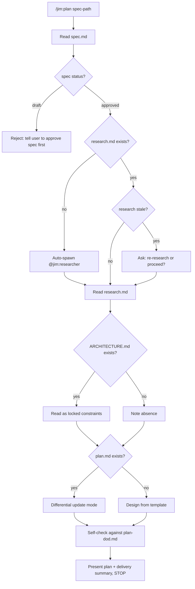
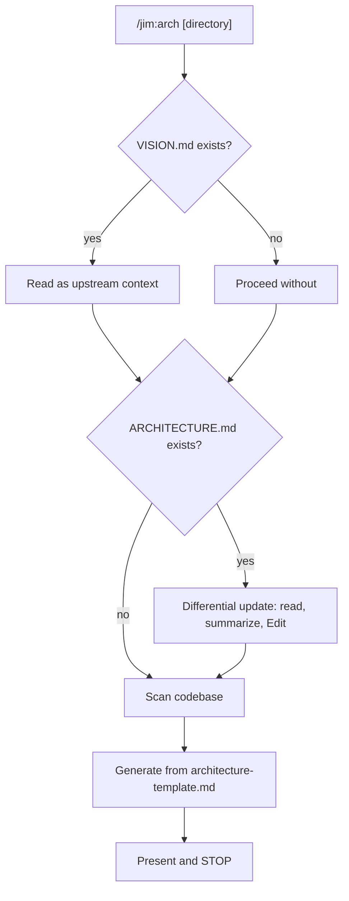

# 005 Architect Agent and Skills — Plan

## Overview

Deliver `@jim:architect` agent, `/jim:plan` skill, and `/jim:arch` skill following established jim patterns (pm.md, researcher.md, spec/SKILL.md, research/SKILL.md). The agent is lean (~800 tokens), delegates detail to preloaded skills, and auto-spawns `@jim:researcher` when research.md is missing. Both skills produce living documents via differential updates.

## Design Decisions

### 1. Agent body scope — lean delegation

- **Chosen:** Agent body contains role, context paths, core principles, process summary, and constraints only (~150-200 lines). All detailed workflow lives in the skills.
- **Why:** Skills are preloaded at agent startup via the `skills:` frontmatter field — duplicating instructions wastes the 800-token budget and creates instruction shadowing.
- **Rejected:** Fat agent with inline workflows — violates agent-standards anti-pattern "instruction shadowing" and exceeds 800-token budget.

### 2. Plan template — evolved from V1 with research-informed additions

- **Chosen:** Carry forward V1-PLAN_TEMPLATE.md structure (Design Decisions, File Manifest, Interface Contracts, Data Flow, Task Breakdown, Out of Scope) and add three sections from research: Requirements Coverage Summary (cc-sdd), Confidence Markers via `[NEEDS CLARIFICATION]` (Spec Kit), and Constitution Check gate against ARCHITECTURE.md (Spec Kit).
- **Why:** Research from both research.md and research2.md converge on these three patterns as high-value, low-cost additions that prevent downstream errors.
- **Rejected:** Pure V1 template unchanged — misses research recommendations that multiple frameworks validate independently.

### 3. Plan DoD — checklist-driven self-validation

- **Chosen:** Create `skills/plan/references/plan-dod.md` as a self-check checklist the architect validates against before presenting. Modeled after `skills/research/references/research-dod.md`.
- **Why:** Pimzino's "validator at each gate" pattern prevents low-quality plans from reaching the user. The research DoD already proves this pattern works in jim.
- **Rejected:** No self-check (rely on human review only) — wastes user review cycles on easily-caught structural issues.

### 4. Architecture template — sections from architecture.md standard

- **Chosen:** Template with sections: Project Structure, High-Level System Diagram (Mermaid), Core Components, Data Stores, External Integrations, Deployment & Infrastructure, Security Considerations, Development & Testing, Glossary. Adjusted per spec AC.
- **Why:** Spec explicitly calls for alignment with architecture.md standard. Sections are adjusted (not copied verbatim) for project needs.
- **Rejected:** Freeform ARCHITECTURE.md with no template — inconsistent output across runs.

### 5. Research auto-spawn — synchronous via Agent(researcher)

- **Chosen:** When research.md is missing, the architect spawns `@jim:researcher` via `Agent(researcher)` with the spec path and waits for completion before continuing.
- **Why:** The spec requires this exact behavior. The researcher agent already exists and handles research generation end-to-end.
- **Rejected:** Tell user to run `/jim:research` manually — adds friction and breaks the workflow; spec explicitly requires auto-spawn.

### 6. Stale research detection — frontmatter date comparison

- **Chosen:** Compare research.md frontmatter `date:` against spec file modification time. If research predates spec modification, flag as potentially stale and ask the user.
- **Why:** Simple heuristic that avoids complex content diffing. The user decides — consistent with human-in-the-loop principle.
- **Rejected:** Content-based staleness detection (diff spec changes against research coverage) — over-engineering for the first version.

## File Manifest

| Component | File Path | Action | Notes |
| :--- | :--- | :--- | :--- |
| Agent | `agents/architect.md` | Create | ~150-200 lines, ≤800 tokens, model: sonnet |
| Plan Skill | `skills/plan/SKILL.md` | Create | Core planning workflow, ≤500 lines |
| Plan Template | `skills/plan/assets/plan-template.md` | Create | Evolved from V1-PLAN_TEMPLATE.md |
| Plan DoD | `skills/plan/references/plan-dod.md` | Create | Self-check checklist |
| Arch Skill | `skills/arch/SKILL.md` | Create | Architecture doc management, ≤500 lines |
| Arch Template | `skills/arch/assets/architecture-template.md` | Create | architecture.md standard sections |

## Interface Contracts

### Plan frontmatter schema

```yaml
---
title: "{Title}"
spec: "docs/specs/{group}/{id}-{name}/spec.md"  # relative path to source spec
type: feature | bug | refactor                    # carried from spec
status: draft | approved                          # human-controlled gate
---
```

### Agent frontmatter schema

```yaml
---
name: architect
description: >
  {Purpose, triggering conditions, 2-3 examples with <example> blocks,
  negative example}
skills: [plan, arch]
tools: [Read, Write, Edit, Glob, Grep, Agent(researcher)]
model: sonnet
---
```

### Skill frontmatter schema (both skills)

```yaml
---
name: plan | arch
description: >
  {What it does AND when to trigger. When NOT to use.}
agent: architect
argument-hint: "[spec-path]" | "[directory-path]"
---
```

### Plan template output format

The plan template must produce these table formats in every plan:

```markdown
## Complexity Tracking
| Decision | Violation of Constraint? | Simpler Alternative Rejected | Rationale |
| :--- | :--- | :--- | :--- |
| ... | ... | ... | ... |

## Requirements Coverage
| Spec Requirement | Addressed In Task(s) |
| :--- | :--- |
| ... | ... |
```

## Data Flow

### /jim:plan Execution Flow



### /jim:arch Execution Flow



## Task Breakdown

### Phase 1: Templates and references (no dependencies)

1. [ ] Create plan template at `skills/plan/assets/plan-template.md` — evolve from V1-PLAN_TEMPLATE.md, adding Requirements Coverage Summary section, `[NEEDS CLARIFICATION]` marker convention, and Constitution Check section for ARCHITECTURE.md constraints.
   **Verify:** `test -f skills/plan/assets/plan-template.md && grep -q "Requirements Coverage" skills/plan/assets/plan-template.md && grep -q "NEEDS CLARIFICATION" skills/plan/assets/plan-template.md`

2. [ ] Create plan DoD at `skills/plan/references/plan-dod.md` — checklist covering: frontmatter completeness, design decisions documented, file manifest with exact paths, interface contracts before tasks, tasks atomic and verifiable, each task has `**Verify:**`, requirements coverage (every spec AC has a task), no file paths outside project directory — specifically exclude writes to `.git/`, `~/.ssh/`, `node_modules/`, `.venv/`, `.env`, `.env-*`, `key.txt`, or other sensitive system paths, security boundaries explicit for relevant specs.
   **Verify:** `test -f skills/plan/references/plan-dod.md && grep -q "Verify" skills/plan/references/plan-dod.md`

3. [ ] Create architecture template at `skills/arch/assets/architecture-template.md` — sections: Project Structure, High-Level System Diagram (Mermaid placeholder), Core Components, Data Stores, External Integrations, Deployment & Infrastructure, Security Considerations, Development & Testing, Glossary.
   **Verify:** `test -f skills/arch/assets/architecture-template.md && grep -q "Core Components" skills/arch/assets/architecture-template.md`

### Phase 2: Skills (depend on templates)

4. [ ] Create `/jim:plan` skill at `skills/plan/SKILL.md` — frontmatter with `name: plan`, `agent: architect`, `argument-hint: "[spec-path]"`. Body covers: argument routing (spec path / empty → prompt), spec status gate (reject draft), research.md check (exists → read, missing → auto-spawn researcher, stale → ask user), ARCHITECTURE.md as locked constraints, design process (Chosen/Why/Rejected, file manifest, interface contracts, Mermaid diagrams), type-specific approach (feature/bug/refactor), task breakdown rules, differential update mode (existing plan.md → read first, summarize changes, Edit), spec feedback loop (flag gaps conversationally), self-check against plan-dod.md, present and stop.
   **Verify:** `test -f skills/plan/SKILL.md && head -5 skills/plan/SKILL.md | grep -q "name: plan" && wc -l < skills/plan/SKILL.md | awk '{if ($1 > 500) {print "FAIL: " $1 " lines exceeds 500 limit"; exit 1}}'`

5. [ ] Create `/jim:arch` skill at `skills/arch/SKILL.md` — frontmatter with `name: arch`, `agent: architect`, `argument-hint: "[directory-path]"`. Body covers: argument routing (empty → project root ARCHITECTURE.md, directory → subdirectory), read VISION.md as upstream context, codebase scanning (Glob + Grep to populate sections from actual code), differential update mode (existing ARCHITECTURE.md → read, summarize, Edit), generate from architecture-template.md, present and stop.
   **Verify:** `test -f skills/arch/SKILL.md && head -5 skills/arch/SKILL.md | grep -q "name: arch" && wc -l < skills/arch/SKILL.md | awk '{if ($1 > 500) {print "FAIL: " $1 " lines exceeds 500 limit"; exit 1}}'`

### Phase 3: Agent (depends on skills)

6. [ ] Create `@jim:architect` agent at `agents/architect.md` — frontmatter: `name: architect`, description with 2 positive examples (/jim:plan, /jim:arch) and 1 negative example (implementation request → route to coder), `skills: [plan, arch]`, `tools: [Read, Write, Edit, Glob, Grep, Agent(researcher)]`, `model: sonnet`. Body: role definition ("You are the technical architect for jim..."), context section (key file paths), core principles (contracts first, codebase archaeology, human-in-the-loop, differential updates, strategic alignment), process summary (follow active skill), constraints (no code, no spec modifications, stop for approval).
   **Verify:** `test -f agents/architect.md && head -10 agents/architect.md | grep -q "name: architect" && grep -q "skills:.*plan.*arch" agents/architect.md`

### Phase 4: Validation

7. [ ] Validate all artifacts against their respective standards: agent against meta-agent checklist (frontmatter fields, ≤800 tokens, self-contained, examples, constraints), skills against meta-skill checklist (frontmatter fields, ≤500 lines, imperative form, no personality soup, no instruction shadowing). Fix any failures.
   **Verify:** `wc -l < skills/plan/SKILL.md | awk '{if ($1 > 500) {print "FAIL: " $1 " lines exceeds 500 limit"; exit 1}}' && wc -l < skills/arch/SKILL.md | awk '{if ($1 > 500) {print "FAIL: " $1 " lines exceeds 500 limit"; exit 1}}'`

## Requirements Coverage Summary

| Spec Acceptance Criteria | Task(s) |
| :--- | :--- |
| Agent frontmatter (skills, tools, model) | 6 |
| Agent body self-contained, ≤800 tokens | 6, 7 |
| Agent description with examples | 6 |
| Agent references key paths | 6 |
| `/jim:plan` skill at correct path | 4 |
| `/jim:plan` accepts spec path or empty | 4 |
| `/jim:plan` rejects draft specs | 4 |
| `/jim:plan` research integration (exists/missing/stale) | 4 |
| `/jim:plan` ARCHITECTURE.md as locked constraints | 4 |
| `/jim:plan` design decisions (Chosen/Why/Rejected) | 4 |
| `/jim:plan` file manifest | 4 |
| `/jim:plan` interface contracts before tasks | 4 |
| `/jim:plan` Mermaid diagrams | 4 |
| `/jim:plan` type-specific approach | 4 |
| `/jim:plan` atomic tasks with Verify | 4 |
| `/jim:plan` spec feedback loop | 4 |
| `/jim:plan` differential updates | 4 |
| `/jim:plan` output location and frontmatter | 1, 4 |
| `/jim:plan` plan template in assets/ | 1 |
| `/jim:plan` plan DoD in references/ | 2 |
| `/jim:arch` skill at correct path | 5 |
| `/jim:arch` accepts directory or empty | 5 |
| `/jim:arch` codebase scanning | 5 |
| `/jim:arch` architecture.md standard sections | 3, 5 |
| `/jim:arch` architecture template in assets/ | 3 |
| `/jim:arch` differential update mode | 5 |
| `/jim:arch` VISION.md as upstream context | 5 |
| Cross-agent: architect spawns researcher | 4, 6 |
| Cross-agent: plan.md consumable by coder | 1, 4 |
| Cross-agent: peer feedback handling | 4 |

## Out of Scope

- No code execution or test writing — this plan produces markdown artifacts only
- No WORKFLOW.md updates — the command reference already lists `/jim:plan` and `/jim:arch`
- No eval loop or automated quality scoring
- No effort estimation
- No `/jim:review` integration (not yet implemented)
- No Claude Code plan mode integration (EnterPlanMode/ExitPlanMode not available to subagents)

## Open Questions

- [x] ~~Should plan template include complexity tracking table (Spec Kit pattern)?~~ → Yes, folded into the Constitution Check section — violations of ARCHITECTURE.md constraints are documented with rationale.
