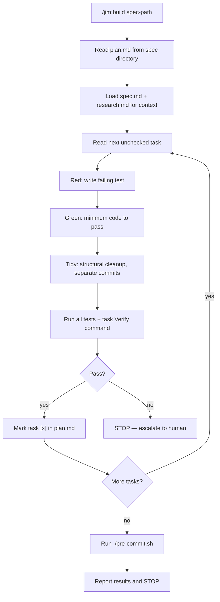

# 006 Coder Agent and Skills

## Overview

`@jim:coder` is the TDD implementation agent for jim — it reads approved plans and executes them task-by-task using Red-Green-Refactor and Tidy First commit discipline. This spec delivers the agent definition and its two skills: `/jim:build` (the core implementation workflow) and `/jim:debug` (failure diagnosis and reporting).

## Problem Statement

Approved plans need disciplined execution: one task at a time, test-first, with structural and behavioral changes separated into distinct commits. Without a dedicated implementation agent, developers either hand-code without following the plan (leading to drift between intent and implementation) or manually enforce TDD discipline on every task (tedious and error-prone). The V1 coder agent proved this model works — sequential plan execution with strict TDD and stop-on-failure escalation. Jim needs that same proven loop, adapted to the plugin architecture with the addition of a debug skill for structured failure diagnosis.

## User Stories

- As a **developer**, I can run `/jim:build` with a spec path and have the coder execute each plan task via TDD so that I get verified, incremental implementation without manually enforcing methodology.
- As a **developer**, when a task fails (ambiguous plan, unexpected test behavior, or I'm stuck), the coder stops and escalates clearly so that I can decide whether to fix the plan, debug, or adjust course.
- As a **developer**, I can see each commit follow Tidy First discipline (structural OR behavioral, never mixed) so that the git history remains clean and reviewable.
- As a **developer**, I can run `/jim:debug` when something fails and get a structured diagnosis report so that I have actionable context to feed back into the spec/plan cycle.
- As the **architect agent**, the coder marks tasks `[x]` in plan.md and runs verification commands so that plan progress is tracked and each task is independently confirmed.
- As a **developer**, after all tasks complete the coder runs `./pre-commit.sh`, reports results, and stops — so I have a clean gate before review.

## Data Flow

## Acceptance Criteria

### Agent (`@jim:coder`)

- [ ] Agent frontmatter includes `skills: [build, debug]`
- [ ] Agent frontmatter includes `tools: [Read, Write, Edit, Glob, Grep, Bash]`
- [ ] Agent frontmatter sets `model: sonnet`
- [ ] Agent body is a self-contained system prompt (no inherited context assumption)
- [ ] Agent description includes triggering conditions and at least one example block per skill (build, debug) plus one negative example
- [ ] Agent body is under 800 tokens
- [ ] Agent preserves V1 directives: follow plan sequentially, use TDD methodology for every task, stop-and-escalate on ambiguity or failure
- [ ] Agent includes type-specific behavior section (feature: standard RGR; bug: reproduction test on Red; refactor: existing tests stay green, one structural move at a time)

### Skill — `/jim:build`

- [ ] User-invocable skill at `skills/build/SKILL.md`
- [ ] Accepts `$ARGUMENTS` as: spec directory path (primary), or empty (prompts user)
- [ ] Skill frontmatter declares `agent: coder` (documentation convention)
- [ ] Reads `plan.md` from the spec directory — rejects plans with `status: draft` (tells user to approve first)
- [ ] Reads `spec.md` and `research.md` from the same directory for context

### `/jim:build` — TDD Loop

- [ ] Executes tasks sequentially — loops through all unchecked tasks without stopping between them (V1 style)
- [ ] Per task: Red (write failing test, run it, confirm failure) → Green (minimum code, run all tests) → Tidy (one structural move at a time, re-run tests) → Commit → Verify → Mark `[x]`
- [ ] Commit discipline: one logical unit per commit, structural OR behavioral never mixed, conventional prefixes (`test:`, `feat:`, `fix:`, `refactor:`)
- [ ] All test runs executed via Bash with visible output — never assumes a test passes
- [ ] Runs each task's `Verify` command from the plan after the task's tests pass

### `/jim:build` — Type-Specific Behavior

- [ ] **Feature:** Standard Red-Green-Refactor. Red writes a new test for new behavior.
- [ ] **Bug:** Red writes a reproduction test that MUST fail (confirming the defect exists). Green fixes with minimal change. The reproduction test becomes the regression guard.
- [ ] **Refactor:** No Red phase needed. Existing tests must pass before AND after each structural change. One move at a time; re-run all tests between moves.

### `/jim:build` — Failure Handling

- [ ] If the plan is ambiguous: STOP, report the ambiguity, wait for human guidance
- [ ] If a test unexpectedly passes on Red: STOP, report that the behavior may already exist or the test is wrong
- [ ] If the coder fails to pass the same test after 3 consecutive attempts on the Green phase: STOP, report the retry limit was hit, and wait for human
- [ ] If the coder is stuck (can't pass Green, can't figure out the right approach): STOP, report status, wait for human
- [ ] On stop, the coder reports: which task, what was attempted, what failed, and suggests next steps (update plan, debug, or adjust)

### `/jim:build` — Scope Discipline

- [ ] Does NOT add functionality, error handling, or optimizations beyond the plan
- [ ] Does NOT modify spec.md or plan.md content (only marks tasks `[x]`)
- [ ] Does NOT proceed to the next SDLC phase (no auto-review, no auto-ship)

### `/jim:build` — Completion Gate

- [ ] After all tasks are marked complete, runs `./pre-commit.sh`
- [ ] Reports pre-commit results and STOPs — human decides next step
- [ ] Updates plan status to `complete` only after human confirmation

### `/jim:build` — TDD Reference

- [ ] TDD/Tidy First methodology reference doc at `skills/build/references/tdd-guide.md` (evolved from v1-coder-skill.md)
- [ ] Covers: TDD cycle, implementation gears (obvious/fake-it/triangulate), Tidy First rules, type-specific TDD, commit discipline, troubleshooting
- [ ] The skill references this doc; the agent does not need to internalize all methodology detail

### Skill — `/jim:debug`

- [ ] User-invocable skill at `skills/debug/SKILL.md`
- [ ] Accepts `$ARGUMENTS` as: description of the failure, error output, or path to failing code
- [ ] Skill frontmatter declares `agent: coder`
- [ ] Produces a structured debug report at `docs/debug/{YYYYMMDD}-{topic}.md`
- [ ] Debug report includes: error analysis, reproduction steps, root cause hypothesis, affected specs/plans (if identifiable), and recommended next step (spec update, plan update, or direct fix)
- [ ] Debug template stored in `skills/debug/assets/debug-template.md`
- [ ] Does NOT fix the code — diagnosis only. Fixes flow through the spec/plan cycle.

### Cross-Agent Integration

- [ ] Plan.md task format consumed by `@jim:coder` matches what `@jim:architect` produces (task checkboxes with `**Verify:**` commands)
- [ ] Debug reports are linkable from bug specs via the `origin:` field
- [ ] When the coder stops on failure, the output is actionable for the architect (to update the plan) or the PM (to update the spec)
- [ ] When `/jim:debug` diagnosis reveals a fundamental flaw in the original requirements, the debug report explicitly advises using `/jim:spec` to update the scope — closing the feedback loop with the PM

## Out of Scope

- No plan creation or modification — the coder executes plans, does not design them (that's `@jim:architect`)
- No spec creation or modification — the coder flags gaps conversationally; the PM decides
- No autonomous multi-phase execution — the coder does not auto-invoke review or ship after completion
- No `/jim:review` integration — review skill is not yet implemented
- No parallel task execution — tasks are sequential per the plan's dependency order
- No automatic retry of failed tasks — the coder stops and escalates, the human decides
- No code generation without a plan — hotfix mode (skipping spec/plan) is a future consideration, not part of this spec

## Open Questions

None — all questions resolved through interview.
