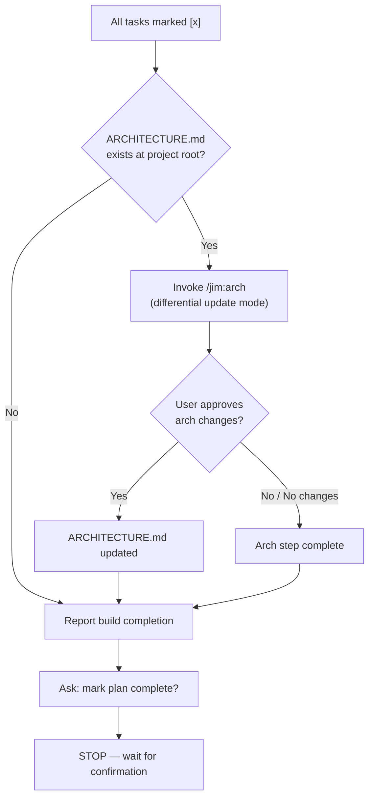

# Post-build ARCHITECTURE.md feedback loop — Plan

## Overview

Add a single step to `/jim:build`'s completion gate that checks for ARCHITECTURE.md and invokes `/jim:arch` in differential update mode if it exists. The change is entirely within `skills/build/SKILL.md` — no new files, no changes to the arch skill or architect agent.

## Design Decisions

### 1. Invoke `/jim:arch` directly vs. build a staleness heuristic

- **Chosen:** Invoke `/jim:arch` in its existing differential update mode
- **Why:** `/jim:arch` already scans the codebase, diffs against the existing document, and presents changes for human approval. A heuristic would be a worse version of the same analysis with a second maintenance surface.
- **Rejected:** Signal-matching heuristic — fragile, false positives/negatives, duplicates logic already in `/jim:arch`

### 2. Unconditional invocation vs. skip when ARCHITECTURE.md is absent

- **Chosen:** Skip when ARCHITECTURE.md does not exist
- **Why:** Creating an architecture document for the first time is a deliberate decision, not a side effect of completing a build. The spec explicitly scopes this to keeping an existing document current.
- **Rejected:** Always invoke (would create ARCHITECTURE.md on first build) — outside spec scope, surprising behavior

### 3. Placement in completion gate: before vs. after the completion report

- **Chosen:** Before the completion report and "mark complete?" prompt
- **Why:** The arch update is part of the build's wrap-up work. Presenting it before asking about plan completion gives the user a single decision point: they see the arch diff, approve/reject it, then decide on plan completion.
- **Rejected:** After marking plan complete — the user has already mentally moved on; arch update feels like an afterthought

## Constitution Check

**ARCHITECTURE.md status:** Present — constraints noted below

| Constraint from ARCHITECTURE.md | Honored? | Notes |
| :--- | :--- | :--- |
| Skills are SKILL.md files in `skills/{name}/` with frontmatter `name`, `description`, `agent`, `argument-hint` | Yes | We modify an existing skill, not create a new one |
| SKILL.md stays under 500 lines | Yes | Addition is ~6 lines to an existing 111-line file |
| Agents do not cross domain boundaries | Yes | The coder agent's build skill tells the user about `/jim:arch` — it does not itself perform architectural analysis |
| All agents stop after producing an artifact and wait for human approval | Yes | `/jim:arch` already has this gate; we rely on it |

## File Manifest

| Component | File Path | Action | Notes |
| :--- | :--- | :--- | :--- |
| Build skill | `skills/build/SKILL.md` | Update | Add arch feedback step to completion gate (section 5) |

## Interface Contracts

No new interfaces. The build skill's completion gate gains a new step that checks for the existence of `ARCHITECTURE.md` and tells the user to consider running `/jim:arch`. The `/jim:arch` skill's interface is unchanged.

## Data Flow

## Task Breakdown

1. [x] Add architecture feedback step to the completion gate in `skills/build/SKILL.md`. Insert a new step 1 before the existing steps (which become steps 2 and 3). The new step: check if `ARCHITECTURE.md` exists at the project root; if yes, invoke `/jim:arch` to run a differential update; if no, skip and continue. The existing steps shift down by one.
   **Verify:** `grep -q 'ARCHITECTURE.md' skills/build/SKILL.md && grep -q '/jim:arch' skills/build/SKILL.md`

## Requirements Coverage Summary

| Spec Acceptance Criterion | Addressed In Task(s) |
| :--- | :--- |
| Arch check runs after all tasks marked `[x]`, before reporting build completion | 1 |
| Skip if ARCHITECTURE.md does not exist | 1 |
| Invoke `/jim:arch` in differential update mode if ARCHITECTURE.md exists | 1 |
| Uses same `/jim:arch` flow — no special post-build mode | 1 |
| User approves/rejects through `/jim:arch`'s existing approval gate | 1 |
| After arch step resolves, build completion gate continues normally | 1 |
| Implemented as new step in completion gate section 5 | 1 |
| Completion gate becomes: (1) arch check, (2) report, (3) STOP | 1 |
| No changes to `/jim:arch`, architect agent, or architecture template | 1 |
| No new skill or agent introduced | 1 |

## Out of Scope

- Creating ARCHITECTURE.md if absent
- Pre-plan staleness checks
- Modifying `/jim:arch` behavior
- Feedback loops for VISION.md or ROADMAP.md

## Open Questions

None.
