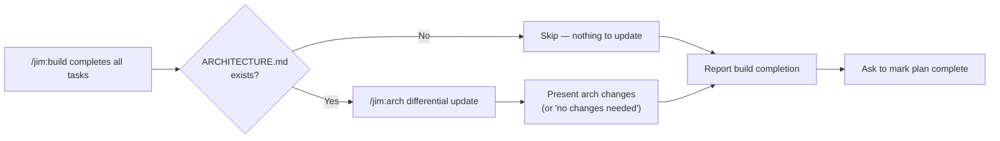

# 007 Post-build ARCHITECTURE.md feedback loop

## Overview

After `/jim:build` completes all plan tasks, automatically invoke `/jim:arch` in differential update mode so that ARCHITECTURE.md stays current with what was just built. This closes the feedback loop between implementation and the architecture document that every other skill treats as ground truth.

## Problem Statement

ARCHITECTURE.md is treated as a locked constraint by `/jim:spec`, `/jim:plan`, `/jim:research`, and `/jim:vision` — but nothing in the workflow signals when it has drifted from reality. After `/jim:build` changes the codebase, new components, dependencies, entry points, or data flows may exist that ARCHITECTURE.md doesn't mention. Downstream skills then enforce stale constraints or miss new architectural elements entirely.

The gap is silent: no skill fails, no gate catches it. The architecture document degrades gradually until someone notices manually.

## User Stories

- As a **developer**, I want the workflow to keep ARCHITECTURE.md current after builds so that the next planning cycle isn't constrained by stale architecture.
- As a **PM**, I want confidence that the architecture document downstream skills reference reflects the actual codebase so that specs and plans are grounded in reality.

## Data Flow

## Acceptance Criteria

### Trigger

- [ ] The architecture check runs after all plan tasks are marked `[x]`, as a new step in the completion gate before reporting build completion to the user
- [ ] If ARCHITECTURE.md does not exist at the project root, skip the check entirely and proceed to the completion report — nothing to go stale, and creating a first ARCHITECTURE.md is a separate decision
- [ ] If ARCHITECTURE.md exists at the project root, invoke `/jim:arch` in its standard differential update mode (codebase scan → compare to existing doc → summarize changes → present and wait for approval)

### Behavior

- [ ] The `/jim:arch` invocation uses the same flow it always does — no special "post-build" mode. The architect reads the codebase, compares to the existing document, and presents proposed changes (or reports no changes needed)
- [ ] The user approves or rejects the architecture update through `/jim:arch`'s existing approval gate — no new approval mechanism is introduced
- [ ] After the arch step resolves (updated, no changes, or user declined), the build completion gate continues: report to the user and ask to mark the plan complete

### Integration

- [ ] Implemented as a new step in `/jim:build`'s completion gate (section 5), inserted before the existing step 1 ("Report to the user")
- [ ] The completion gate becomes: (1) check for ARCHITECTURE.md and invoke `/jim:arch` if present, (2) report to the user and ask to mark plan complete, (3) STOP and wait for confirmation
- [ ] No changes to the `/jim:arch` skill, architect agent, or architecture template are required
- [ ] No new skill or agent is introduced — this is a build skill enhancement

## Out of Scope

- Creating ARCHITECTURE.md if it doesn't exist — that's a deliberate `/jim:arch` invocation
- Checking staleness at any point other than post-build (pre-plan staleness checks are a separate concern)
- Modifying `/jim:arch`'s behavior, template, or approval flow
- Adding feedback loops for VISION.md or ROADMAP.md
- Heuristic-based staleness detection — we use the real `/jim:arch` scan, not pattern matching

## Open Questions

None.
