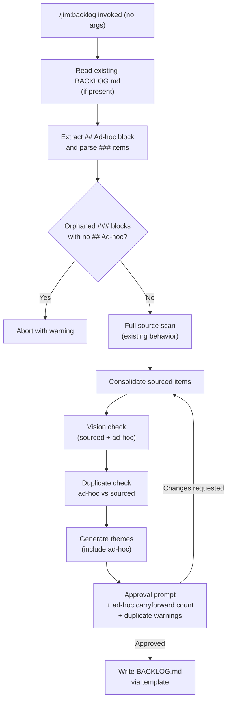
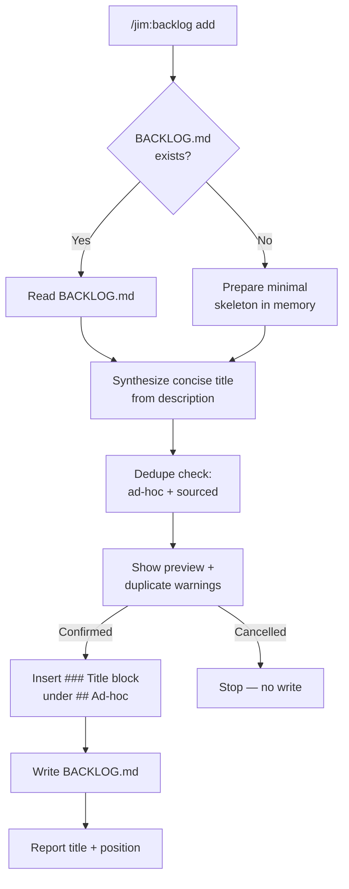

# Ad-hoc Backlog Items & Append Mode — Plan

## Overview

Extend `/jim:backlog` with two coupled capabilities: a preserved `## Ad-hoc` section that survives regeneration, and an `add <description>` subcommand for in-conversation capture. Both are implemented as edits to `skills/backlog/SKILL.md` and its template — no new files, no new agents, no runtime code.

## Design Decisions

### 1. Argument routing — prefix-token subcommand detection

- **Chosen:** The skill inspects `$ARGUMENTS`. If the first whitespace-delimited token is literally `add`, the skill enters append mode and treats the remainder as the description. Otherwise, it enters regeneration mode (the existing behavior). No argument = regeneration.
- **Why:** Matches the spec decision (`/jim:backlog add <description>`), is unambiguous, and keeps a single skill file. Establishes an explicit-subcommand precedent for jim since no prior art exists.
- **Rejected:** Shape inference (treat any multi-word argument as a description) — too ambiguous, would collide with any future positional argument. Separate `/jim:backlog-add` skill — doubles the skill surface and splits related logic.

### 2. Ad-hoc section is always present in the template

- **Chosen:** `backlog-template.md` gains a literal `## Ad-hoc` heading between the items area and the `## Themes` heading, with a placeholder HTML comment explaining the section is preserved across runs and documenting the `### Title` format.
- **Why:** Discoverability (users see where to append), simplicity (no conditional emission logic), and satisfies the spec AC that the section always exists even on first run.
- **Rejected:** Conditional emission (only when content exists) — hurts discoverability, adds conditional complexity, and means regenerations could silently change the structural shape of the file.

### 3. Ad-hoc preservation via differential read-then-write

- **Chosen:** Regeneration mode reads the existing `BACKLOG.md` *before* writing. It extracts the raw markdown between the `## Ad-hoc` heading and the next `## ` heading, parses `### Title` sub-blocks, and re-emits them in the new file. First run (file missing) emits the template's empty Ad-hoc section.
- **Why:** The existing backlog skill explicitly uses `Write` (not `Edit`) because it's a full regeneration. Preserving a section requires reading state first. This is the minimal change: read → extract → regenerate → splice → write.
- **Rejected:** Sidecar file for ad-hoc items — the user explicitly rejected multi-file storage. In-place `Edit` of the Ad-hoc section only — doesn't match the regeneration model for sourced items.

### 4. Append mode does not run vision-conflict checking

- **Chosen:** Append mode skips the full source scan and skips vision-conflict checking against `VISION.md` Non-Goals. Conflict annotation is deferred to the next full regeneration.
- **Why:** Append is a fast path. Running the full scan or even loading VISION.md adds latency and context cost, and the spec AC explicitly defers conflict checking to regeneration. The next `/jim:backlog` invocation will annotate any conflicts inline.
- **Rejected:** Run a mini vision check against `VISION.md` only — partial parity with regeneration mode creates inconsistent user expectations.

### 5. Duplicate detection uses LLM judgment, not regex

- **Chosen:** During both regeneration (approval prompt) and append (preview prompt), the skill instructs Claude to compare the candidate ad-hoc item against (a) existing ad-hoc items and (b) sourced items, using title match (case-insensitive) and description semantic similarity. Flagged duplicates surface as warnings in the respective prompts.
- **Why:** Markdown-in-Claude-context is the runtime; there is no code path to implement regex or cosine similarity. LLM judgment is the available tool, and duplicate detection is inherently fuzzy.
- **Rejected:** Exact title match only — misses paraphrased duplicates. Strict similarity thresholds — not enforceable in a pure-markdown skill.

### 6. Append mode derives the `### Title` when not provided

- **Chosen:** When invoked as `/jim:backlog add <description>`, the skill instructs Claude to synthesize a concise title (≤ 10 words) from the description and render it as the `### Title` line. The description becomes the item body. The preview shows both so the user confirms or rejects the synthesis.
- **Why:** The user's stated use case is "tell Claude to backlog the item, which likely is a synthesized description pulled from complex context" — requiring an explicit title would break that flow. Preview-and-confirm is the safety net.
- **Rejected:** Require an explicit title argument — adds friction and a second positional arg to parse.

### 7. Minimal-file creation in append mode when `BACKLOG.md` is absent

- **Chosen:** If `BACKLOG.md` does not exist when append mode is invoked, the skill creates it with the minimum structure: header line, empty items area, `## Ad-hoc` section containing the new item, empty `## Themes` section. It does *not* trigger a full source scan.
- **Why:** Spec AC requires this. The alternative (auto-triggering a full scan) would convert append into a heavy operation and contradict the fast-path design intent.
- **Rejected:** Error out when `BACKLOG.md` is missing — hurts first-use ergonomics. Silently scan and regenerate — violates the fast-path principle.

## Constitution Check

**`ARCHITECTURE.md` status:** Present — constraints noted below

| Constraint from `ARCHITECTURE.md` | Honored? | Notes |
| :--- | :--- | :--- |
| Skills are SKILL.md files in `skills/{name}/` with frontmatter `name`, `description`, `agent`, `argument-hint` | Yes | Updating existing `skills/backlog/SKILL.md`; frontmatter preserved, `argument-hint` updated |
| SKILL.md stays under 500 lines | Yes | Current file is 148 lines; estimated post-change size ~260 lines |
| Templates live in `assets/`, methodology in `references/` | Yes | Template edit only touches `skills/backlog/assets/backlog-template.md` |
| `agent:` field is a documentation convention, not routing | Yes | `agent: pm` frontmatter unchanged |
| Agents do not cross domain boundaries — PM does not write code | Yes | PM continues to only scan/synthesize/write markdown artifacts |
| All agents stop after producing an artifact and wait for human approval | Yes | Both regeneration and append modes preserve the approval gate |
| Plugin agents have lowest priority — users can override | Yes | No agent changes |

## File Manifest

| Component | File Path | Action | Notes |
| :--- | :--- | :--- | :--- |
| Backlog template | `skills/backlog/assets/backlog-template.md` | Update | Insert `## Ad-hoc` section with placeholder comment between items area and `## Themes` |
| Backlog skill | `skills/backlog/SKILL.md` | Update | Add `## Argument Routing` section; add append-mode process; extend regeneration process with ad-hoc extraction, duplicate detection, and empty-section emission; update `argument-hint`; add missing-heading abort |
| Workflow doc | `WORKFLOW.md` | Update | Update the `/jim:backlog` command reference cell to mention the `add <description>` subcommand |

No changes to `agents/pm.md`, `skills/build/SKILL.md`, or `ARCHITECTURE.md`. The PM agent already owns `/jim:backlog`; the build completion gate already conditionally invokes `/jim:backlog` and the new behavior flows through transparently.

## Interface Contracts

### `BACKLOG.md` canonical structure

```markdown
# Backlog

*Generated by `/jim:backlog` — {YYYY-MM-DD}*

### {Sourced Item Title}

{Synthesized description.}

**Sources:** `{path}`, `{path}`
**Vision conflict:** Conflicts with Non-Goal: {X}
<!-- Vision conflict line only present when a conflict exists -->

---

## Ad-hoc

<!-- Items added here are preserved across /jim:backlog runs.     -->
<!-- Use `### Title` headings followed by a free-form description. -->
<!-- Add items manually or via `/jim:backlog add <description>`.   -->

### {Ad-hoc Item Title}

{Free-form description written by the user or synthesized from conversation.}

**Vision conflict:** Conflicts with Non-Goal: {X}
<!-- Only present after a full regeneration detects a conflict -->

---

## Themes

### {Theme Name}

{1-2 sentence summary.}

**Related items:** {Item Title 1}, {Item Title 2}
```

**Parse rules for the Ad-hoc block (regeneration mode):**
- Start marker: line matching exactly `## Ad-hoc`
- End marker: the next line starting with `## ` (typically `## Themes`), or end of file
- Item boundaries within the block: each `### ` heading starts a new item; body is every line until the next `### ` or the end marker
- Non-`### ` content directly after `## Ad-hoc` (HTML comments, whitespace) is preserved if no items exist; discarded/replaced with the template placeholder if items exist
- Empty Ad-hoc block (heading present, no `### ` items) → emit template placeholder comment verbatim

### Argument routing for `/jim:backlog`

| `$ARGUMENTS` shape | Mode | Behavior |
| :--- | :--- | :--- |
| Empty | Regeneration | Full source scan → consolidate → preserve Ad-hoc → approval → write |
| `add <description…>` (first token literally `add`) | Append | Read `BACKLOG.md` → synthesize title → dedupe check → preview → confirm → write |
| Anything else | Regeneration | Same as empty; non-`add` arguments are ignored with a warning line in the approval prompt |

### Append-mode invocation contract

The main-conversation Claude invokes the skill when the user says "backlog this" or equivalent. Claude is responsible for synthesizing a coherent description from the conversation context before invocation. The skill does not re-read conversation context — it works purely from the passed `$ARGUMENTS` string.

### Abort conditions (regeneration mode)

| Condition | Action |
| :--- | :--- |
| `BACKLOG.md` contains `### ` item blocks outside any `## ` section AND has no `## Ad-hoc` heading | Abort with warning; ask user to fix the file and re-run |
| `BACKLOG.md` has `## Ad-hoc` heading but malformed content below (e.g., no `### `, only prose) | Preserve verbatim; warn in approval prompt |
| `BACKLOG.md` has multiple `## Ad-hoc` headings | Use the first; warn that subsequent ad-hoc sections are out-of-scope per spec |

## Data Flow

### Regeneration mode



### Append mode



## Task Breakdown

1. [x] Update `skills/backlog/assets/backlog-template.md` to insert a `## Ad-hoc` section between the items area and `## Themes`. The new section contains three HTML-comment lines documenting: (a) preservation across runs, (b) the `### Title` format, (c) the `/jim:backlog add` subcommand as an alternate capture method. A horizontal rule separates it from `## Themes`.
   **Verify:** `grep -c '^## Ad-hoc$' skills/backlog/assets/backlog-template.md | grep -qx 1 && grep -c '^## Themes$' skills/backlog/assets/backlog-template.md | grep -qx 1`

2. [x] Update the frontmatter `argument-hint` in `skills/backlog/SKILL.md` from the current value to `"[add <description>]"` to advertise the new subcommand in autocomplete. Update the frontmatter `description` to briefly mention append mode.
   **Verify:** `grep -q 'argument-hint: "\[add <description>\]"' skills/backlog/SKILL.md`

3. [x] Insert a new `## Argument Routing` section in `skills/backlog/SKILL.md` immediately after the opening paragraph and before `## Process`. It contains the routing table from the Interface Contracts (empty → regeneration, `add …` → append, other → regeneration with warning).
   **Verify:** `grep -q '^## Argument Routing$' skills/backlog/SKILL.md`

4. [x] In `skills/backlog/SKILL.md`, rename the existing `## Process` to `## Process — Regeneration Mode` and add a preamble sentence explaining that this mode runs when no args (or non-`add` args) are passed.
   **Verify:** `grep -q '^## Process — Regeneration Mode$' skills/backlog/SKILL.md`

5. [x] In the regeneration-mode process, insert a new step before the existing "Scan structured sources" step: **Read and extract Ad-hoc block.** The step instructs the skill to (a) read existing `BACKLOG.md` if it exists, (b) locate the `## Ad-hoc` heading, (c) extract content between it and the next `## ` heading, (d) parse `### Title` sub-blocks, (e) abort with a warning (per the Abort Conditions table) if orphaned `### ` blocks are found with no `## Ad-hoc` heading. Renumber subsequent steps.
   **Verify:** `grep -q 'Read and extract Ad-hoc block' skills/backlog/SKILL.md && grep -q 'abort' skills/backlog/SKILL.md`

6. [x] In the regeneration-mode process, extend the vision-alignment step so ad-hoc items are checked against VISION.md Non-Goals the same way sourced items are, and conflict annotations are rendered as inline `**Vision conflict:**` lines inside the ad-hoc item's block.
   **Verify:** `grep -q 'ad-hoc' skills/backlog/SKILL.md && grep -q 'Vision conflict' skills/backlog/SKILL.md`

7. [x] In the regeneration-mode process, extend the theme-synthesis step to include ad-hoc items as candidates for cross-cutting themes alongside sourced items.
   **Verify:** `grep -q 'ad-hoc items' skills/backlog/SKILL.md`

8. [x] In the regeneration-mode process, add a new duplicate-detection step after consolidation: compare each ad-hoc item against existing sourced items by title (case-insensitive) and description similarity; surface duplicates as warnings in the approval prompt with keep/remove/merge options.
   **Verify:** `grep -q 'duplicate' skills/backlog/SKILL.md`

9. [x] Update the approval-prompt description in the regeneration-mode process to include: (a) a "Carrying forward N ad-hoc items" line, (b) any duplicate warnings surfaced in task 8.
   **Verify:** `grep -q 'Carrying forward' skills/backlog/SKILL.md`

10. [x] Update the write step in regeneration mode to re-emit the `## Ad-hoc` section in its reserved position (between sourced items and `## Themes`). If the extracted block had items, re-emit them; otherwise emit the template placeholder comment. Explicitly document that reformatting (whitespace normalization) is permitted but no user-authored title or description may be lost.
   **Verify:** `grep -q 'reserved position' skills/backlog/SKILL.md || grep -q '## Ad-hoc' skills/backlog/SKILL.md`

11. [x] Add a new top-level section `## Process — Append Mode` to `skills/backlog/SKILL.md` after the regeneration process. The section contains numbered steps: (1) verify arguments start with `add`, extract description; (2) read existing `BACKLOG.md`, or prepare minimal skeleton if absent; (3) synthesize concise title (≤ 10 words) from description; (4) run duplicate check against both ad-hoc and sourced items in the existing file; (5) show preview of the `### Title` block plus any duplicate warnings; (6) wait for user confirmation; (7) insert into `## Ad-hoc` section; (8) write `BACKLOG.md`; (9) report title and position. Explicitly note that append mode does **not** load VISION.md and does **not** run a source scan.
    **Verify:** `grep -q '^## Process — Append Mode$' skills/backlog/SKILL.md && grep -q 'does not load VISION' skills/backlog/SKILL.md`

12. [x] Verify the updated `skills/backlog/SKILL.md` stays under 500 lines (ARCHITECTURE invariant).
    **Verify:** `awk 'END { exit (NR > 500) }' skills/backlog/SKILL.md`

13. [x] Update `WORKFLOW.md` command-reference row for `/jim:backlog` so the description mentions the `add <description>` subcommand (e.g., "Scan deferred work and produce BACKLOG.md; use `add <desc>` to append an ad-hoc item.").
    **Verify:** `grep -q 'add <' WORKFLOW.md && grep -q '/jim:backlog' WORKFLOW.md`

14. [x] End-to-end structural sanity check: confirm the skill file has both mode sections, the argument routing section, and a reference to the Ad-hoc block parse rules.
    **Verify:** `grep -q 'Argument Routing' skills/backlog/SKILL.md && grep -q 'Regeneration Mode' skills/backlog/SKILL.md && grep -q 'Append Mode' skills/backlog/SKILL.md`

## Requirements Coverage Summary

| Spec Acceptance Criterion | Addressed In Task(s) |
| :--- | :--- |
| `BACKLOG.md` always contains a `## Ad-hoc` section, even on first run | 1, 10 |
| Ad-hoc section positioned between sourced items and `## Themes` | 1, 10 |
| On regeneration, read existing file, extract Ad-hoc block, re-emit | 5, 10 |
| Relaxed item format: `### Title` + free prose, no `**Sources:**` required | 5, 11 |
| Ad-hoc items parsed as first-class entries; vision conflicts rendered inline | 6 |
| Ad-hoc items included in theme synthesis | 7 |
| Approval prompt includes count of ad-hoc items carried forward | 9 |
| Duplicate warning (ad-hoc vs sourced) at regeneration approval | 8, 9 |
| Abort with warning if orphaned `### ` blocks and no `## Ad-hoc` heading | 5 |
| Empty Ad-hoc section emits placeholder comment | 1, 10 |
| Reformatting permitted but no title/description lost | 10 |
| `/jim:backlog add <description>` routes to append mode, skips source scan | 2, 3, 11 |
| Description argument is free-form prose | 11 |
| Skill derives concise `### Title` from description when not provided | 11 |
| Preview + confirmation required before append writes | 11 |
| Append inserts into existing `## Ad-hoc` without regenerating sourced items | 11 |
| First-run append creates minimal `BACKLOG.md` skeleton | 11 |
| Append mode duplicate warning during preview | 11 |
| Append mode does not invoke vision-conflict checking | 11 |
| Append mode exits with title + position report | 11 |

## Out of Scope

- **Removing or editing ad-hoc items via the skill.** Append mode only adds. Removal and edits happen by directly editing `BACKLOG.md`. Explicit in spec Out of Scope.
- **Multiple `## Ad-hoc` sections.** Only the first is recognized; subsequent occurrences trigger a warning. Explicit in spec Out of Scope.
- **Alternative section names** (`## Unsourced`, `## Misc`, etc.). Only the literal `## Ad-hoc` heading is recognized. Explicit in spec Out of Scope.
- **Vision-conflict checking in append mode.** Deferred to the next full regeneration per spec AC.
- **Promoting ad-hoc items into specs.** No `/jim:spec`-from-backlog flow in this change. Explicit in spec Out of Scope.
- **New agent or skill directory.** This is a pure edit to the existing backlog skill; no changes to `agents/pm.md`, build completion gate, or ARCHITECTURE.md.
- **Automated tests.** Jim has no executable test suite; verification is structural grep checks plus manual end-to-end invocation after the change lands.

## Open Questions

None.
