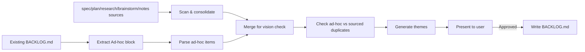
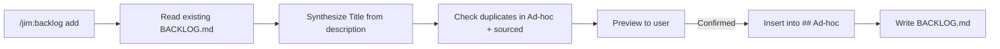

# 009 Ad-hoc Backlog Items & Append Mode

## Overview

Add an `## Ad-hoc` section to `BACKLOG.md` that `/jim:backlog` preserves across regenerations, plus a `/jim:backlog add <description>` subcommand for capturing items mid-conversation without a full rescan.

## Problem Statement

The `/jim:backlog` skill currently rebuilds `BACKLOG.md` as a complete replacement each run, sourced entirely from scanning docs/specs, docs/brainstorms, and docs/notes for deferred and out-of-scope work. This creates two related friction points:

1. **No persistent capture surface.** Any item hand-appended to the file gets wiped on the next invocation, because only items traceable to a source document survive regeneration.
2. **No in-the-moment capture.** When an issue surfaces mid-conversation — often a synthesized insight drawn from complex context — the user has no way to tell Claude "backlog this" without first routing the idea through `/jim:spec`, `/jim:brainstorm`, or another upstream artifact. Direct file editing defeats the purpose of a momentary capture and loses the contextual synthesis.

## User Stories

- As a developer deep in a conversation with Claude, I can say "backlog this" and have Claude invoke `/jim:backlog add <description>` so that an insight synthesized from the conversation context gets captured without breaking my flow.
- As a developer, I can re-run `/jim:backlog` to regenerate sourced items without losing ad-hoc items captured earlier so that regeneration is non-destructive to lightweight capture.
- As a developer, I can see ad-hoc items alongside sourced items in one file so that I do not have to check multiple places to review deferred work.
- As a developer, I can preview an ad-hoc item before it is written so that I can catch a bad synthesis before it pollutes the backlog.

## Acceptance Criteria

### Ad-hoc section preservation (regeneration mode)

- [ ] `BACKLOG.md` always contains an `## Ad-hoc` section, even on first run when no items exist — the section appears with a placeholder comment explaining it is preserved across runs.
- [ ] The Ad-hoc section is positioned between the sourced items and the `## Themes` section.
- [ ] On regeneration, the skill reads the existing `BACKLOG.md`, extracts the content between the `## Ad-hoc` heading and the next `## ` heading, and re-emits that content in the same position in the new file.
- [ ] Ad-hoc items use a relaxed format: any `### Title` heading, followed by free-form markdown prose, counts as an item. No `**Sources:**` line is required.
- [ ] Ad-hoc items are parsed as first-class entries and participate in vision-conflict checking — if an ad-hoc item conflicts with a `VISION.md` Non-Goal, the conflict is rendered as a `**Vision conflict:**` line appended inline inside that item's block, matching the sourced-item convention.
- [ ] Ad-hoc items are included in the theme synthesis step and may appear under cross-cutting themes alongside sourced items.
- [ ] The approval prompt shown before writing includes the count of ad-hoc items carried forward, so the user can confirm nothing was lost.
- [ ] If an ad-hoc item duplicates a sourced item (same title, or description that is a near-match), the approval prompt surfaces a duplicate warning and asks the user whether to keep, remove, or merge the ad-hoc item before writing.
- [ ] If the existing `BACKLOG.md` contains content that looks like items (e.g., `### Title` blocks) but no `## Ad-hoc` heading, the skill aborts with a warning and asks the user to fix the file before regenerating — it does not silently drop the orphaned content.
- [ ] When the existing `BACKLOG.md` has an `## Ad-hoc` heading but no items beneath it, regeneration emits the empty section with the placeholder comment unchanged.
- [ ] Reformatting ad-hoc content on write is permitted (e.g., whitespace normalization, reordering within the section) as long as no user-authored item titles or descriptions are lost.

### Append mode (`/jim:backlog add <description>`)

- [ ] Invoking `/jim:backlog add <description>` routes the skill into append mode and skips the full source scan entirely.
- [ ] The description argument is free-form prose — the user (or Claude on the user's behalf) may pass a synthesized summary drawn from the current conversation.
- [ ] The skill derives a concise `### Title` from the description if one is not explicitly provided, and renders the description as the item body.
- [ ] Before writing, the skill displays a preview of the synthesized `### Title` block and asks the user to confirm. No file change occurs without confirmation.
- [ ] Append mode inserts the new item into the existing `## Ad-hoc` section of `BACKLOG.md` without regenerating sourced items or themes.
- [ ] If `BACKLOG.md` does not yet exist, append mode creates it with a minimal structure: header, empty sourced area, `## Ad-hoc` section containing the new item, empty `## Themes` section.
- [ ] If the appended item duplicates an existing ad-hoc or sourced item, the skill warns during the preview and asks whether to continue, merge, or cancel.
- [ ] Append mode does not invoke vision-conflict checking against Non-Goals at capture time — conflict annotation is deferred until the next full regeneration. (Rationale: append is a fast path; the conflict check belongs with the full scan.)
- [ ] Append mode exits cleanly after writing, reporting the title of the item added and its position in the Ad-hoc section.

## UI Mockup

### BACKLOG.md structure

```markdown
# Backlog

*Generated by `/jim:backlog` — 2026-04-10*

### Sourced Item One
...
**Sources:** `001-meta/spec.md`

### Sourced Item Two
...
**Sources:** `004-researcher/plan.md`

---

## Ad-hoc

<!-- Items added here are preserved across /jim:backlog runs. -->
<!-- Use `### Title` headings followed by a description. -->

### Investigate slow plan generation
Noticed the architect takes a long time on large specs. Worth measuring
before deciding if anything needs changing.

### Consider a jim:status skill
One-shot summary of current specs, plans, and backlog state.

---

## Themes

### Performance & Ergonomics
...
**Related items:** Investigate slow plan generation, Sourced Item Two
```

### Approval prompt delta (regeneration)

```
I scanned 8 specs, 4 plans, 3 research docs, and 2 brainstorms.

Found 20 raw items → consolidated to 11.
Carrying forward 2 ad-hoc items from existing BACKLOG.md.

! Duplicate warning: ad-hoc item "Investigate slow plan generation"
  overlaps with sourced item "Plan generation performance" (004-researcher).
  Keep, remove, or merge?

Write this to BACKLOG.md?
```

### Append mode preview

```
$ /jim:backlog add "The architect takes a long time on large specs.
Worth measuring before deciding if anything needs changing."

Preview — this will be appended to ## Ad-hoc in BACKLOG.md:

  ### Investigate slow plan generation on large specs
  The architect takes a long time on large specs. Worth measuring
  before deciding if anything needs changing.

Confirm append? (y/n)
```

### Missing-heading abort

```
! BACKLOG.md contains `### ...` item blocks outside any recognized section,
  and no `## Ad-hoc` heading was found. This usually means the heading was
  deleted by accident.

  Please restore the `## Ad-hoc` heading above the orphaned items (or delete
  them if intentional) and re-run /jim:backlog.
```

## Data Flow

### Regeneration mode



### Append mode



## Out of Scope

- **Promoting ad-hoc items into specs.** There is no `/jim:spec`-from-backlog flow in this change. Users route to `/jim:spec` manually if they want to formalize an ad-hoc item.
- **Removing or editing ad-hoc items via the skill.** Append mode only adds. Removal and edits happen by directly editing `BACKLOG.md`.
- **Multiple ad-hoc sections.** Only one `## Ad-hoc` section is recognized. Nested sub-sections or multiple ad-hoc blocks are not supported.
- **Alternative section names.** The heading is literally `## Ad-hoc`. Aliases like `## Unsourced` or `## Misc` are not recognized.
- **Vision-conflict checking in append mode.** Append is a fast path; conflict annotation runs on the next full regeneration, not at capture time.
- **Preserving sourced items across regenerations.** This spec only changes handling of the Ad-hoc section. Sourced items continue to be fully regenerated each run.
- **Diff or history tracking for ad-hoc items.** The file remains a snapshot; there is no changelog of when ad-hoc items were added or removed.
- **Cross-file ad-hoc capture.** Ad-hoc items live only in `BACKLOG.md`. No sidecar files or alternate capture locations are introduced.

## Open Questions

None
