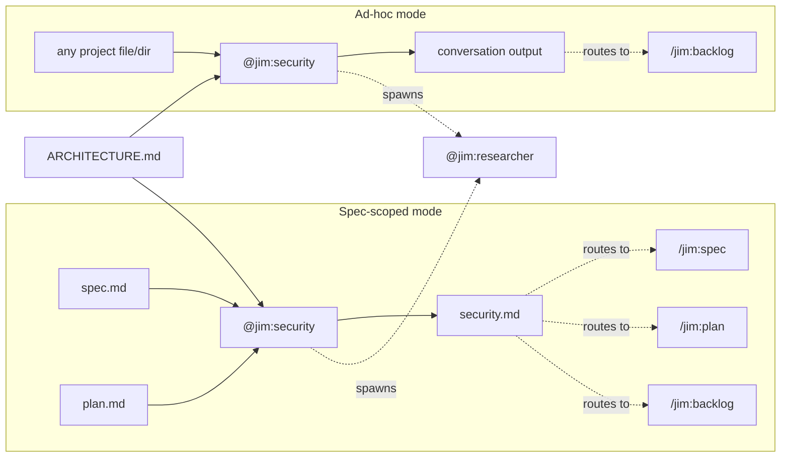

# 010 Security Agent and Skill

## Overview

Add a `@jim:security` agent and `/jim:sec` skill that performs security analysis of specs, plans, and arbitrary project files. In spec-scoped mode it produces a `security.md` artifact with actionable findings. In ad-hoc mode it delivers analysis directly in conversation.

## Problem Statement

Security gaps in specs and plans are often discovered late — during implementation or code review — when they are expensive to fix. Developers using jim's SDLC workflow have no structured way to surface threat model issues, missing security requirements, or flawed mitigations between the spec/plan phases and the build phase. Beyond the SDLC workflow, developers also want to perform ad-hoc security analysis of existing code, configs, or design docs at any time — but doing so manually is inconsistent, undocumented, and easy to skip.

## User Stories

- As a developer, I can run `/jim:sec` against a spec so that missing security requirements (authZ, data classification, retention policies) are surfaced before planning begins.
- As a developer, I can run `/jim:sec` against a plan so that design-level security flaws (trust boundary violations, crypto weaknesses, privilege issues) are caught before implementation.
- As a developer, I am offered a security review before approving a spec or plan so that security concerns are addressed before the draft becomes approved.
- As a developer, I can triage security findings and route them to the spec, plan, or backlog so that each issue is addressed in the appropriate place.
- As a developer, I can re-run `/jim:sec` after spec or plan changes so that the security review stays current with the evolving design.
- As a developer, I can run `/jim:sec` against any file or directory in my project so that I get a security analysis outside the jim spec/build workflow.
- As a developer, I can route ad-hoc findings to the backlog so that issues discovered outside the SDLC workflow are tracked.

## Acceptance Criteria

- [ ] `@jim:security` agent exists at `agents/security.md` with appropriate persona, tool permissions, and model declaration
- [ ] `/jim:sec` skill exists at `skills/sec/SKILL.md` with process instructions, validation checklist, and argument handling
- [ ] Running `/jim:sec {spec-dir}` reads the spec and/or plan in the target directory and produces `security.md` as a sibling artifact
- [ ] The skill adapts its analysis lens based on available artifacts: spec-phase lens for requirements gaps, plan-phase lens for design flaws
- [ ] If only a spec or only a plan exists, the skill notes the absence and proceeds with what is available
- [ ] Each finding includes: description, severity (critical/notable/advisory), concrete suggestion, and recommended route (spec/plan/backlog)
- [ ] The analysis uses a hybrid approach: freeform expert review followed by a STRIDE completeness sweep
- [ ] The agent reads `ARCHITECTURE.md` to ground analysis in existing trust boundaries, data flows, and security patterns
- [ ] The agent can spawn `@jim:researcher` for deeper investigation of specific security questions
- [ ] Re-running `/jim:sec` performs a differential update of existing `security.md` (edit-in-place, not append)
- [ ] At end of review, the skill offers routing: feed back into spec, modify the plan, or add to backlog
- [ ] The skill is available at any time — no phase-gating or ordering constraints
- [ ] `/jim:spec` offers a security review before the approval prompt: "Want to run a security review before approving? (`/jim:sec`)"
- [ ] `/jim:plan` offers a security review before the approval prompt: "Want to run a security review before approving? (`/jim:sec`)"
- [ ] Running `/jim:sec {path}` where the path is not a spec directory performs ad-hoc security analysis with output delivered in conversation (no file written)
- [ ] Ad-hoc mode offers routing to `/jim:backlog` at end of review
- [ ] The agent's tool permissions (Read, Glob, Grep) allow access to any file in the project

## Data Flow

## Out of Scope

- Runtime security scanning or SAST — this is design-time only
- Post-build security review — that is the domain of the planned `/jim:review` skill, which may call `@jim:security` as a lens
- Compliance frameworks or certification checklists (SOC2, HIPAA, etc.)
- Automated blocking gates — security.md is advisory; the human decides what to act on
- Automated file output for ad-hoc runs — analysis goes to conversation; the user can prompt to capture if needed

## Open Questions

None
