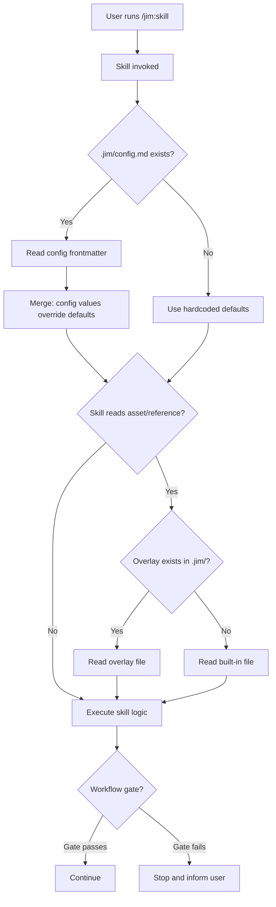

# Project Configuration and Overlay — Plan

## Overview

Add config reading and overlay resolution to jim's existing skills by (1) creating a `/jim:config` skill with a config template, (2) adding a config-reading instruction to each skill's strategic context step, (3) adding overlay resolution to skills that read assets/references, and (4) wiring configurable workflow gates into the build and plan skills.

## Design Decisions

### 1. Config reading placement

- **Chosen:** Add config reading to each skill's existing "read strategic context" step — one additional file read alongside VISION.md and ARCHITECTURE.md
- **Why:** Skills already have this step (12 of 13). Consistent pattern, minimal per-skill change, no new abstractions needed.
- **Rejected:** Shared reference doc with config-reading instructions — adds token cost without benefit; Claude reads YAML frontmatter natively. Plugin-level preamble — not supported by Claude Code's plugin system.

### 2. Config file format

- **Chosen:** Markdown with YAML frontmatter (`.jim/config.md`). Frontmatter holds config values, prose body documents defaults for humans.
- **Why:** Consistent with every other jim artifact. Agents read it with a standard `Read` call — no special parsing.
- **Rejected:** Pure YAML/TOML — would require different handling than other jim files. Commented YAML defaults in frontmatter — risk of Claude treating comments as set values.

### 3. Overlay resolution scope

- **Chosen:** Assets and references only. Overlay path: `.jim/skills/{skill}/assets/{file}` and `.jim/skills/{skill}/references/{file}`.
- **Why:** These are data files that skills read explicitly — overlay is a simple "check alternate path first" instruction. SKILL.md self-replacement is architecturally awkward. Agent overrides are already handled natively by Claude Code via `.claude/agents/`.
- **Rejected:** Full overlay of all plugin files — SKILL.md can't read its own replacement; agent overlay duplicates Claude Code's native `.claude/agents/` mechanism.

### 4. Scaffolding approach for `/jim:config`

- **Chosen:** Empty frontmatter with defaults documented in the prose body. Skills only read frontmatter — omitted keys use hardcoded defaults.
- **Why:** Eliminates ambiguity. Commented-out YAML values risk being misinterpreted as set values. Empty frontmatter = all defaults, no room for confusion.
- **Rejected:** Commented defaults in frontmatter (`# vision: VISION.md`) — Claude might treat these as configured values.

### 5. Workflow gate implementation

- **Chosen:** Config booleans checked at existing gate locations. `require-plan-approval` modifies existing build gate. `require-research` converts plan's soft auto-spawn to a hard stop. `require-security` adds a new check in build.
- **Why:** Reuses existing gate infrastructure where possible. New gates follow the same stop-and-inform pattern.
- **Rejected:** Per-spec-type rules (e.g., research required for features but not bugs) — spec explicitly scopes to simple checklist.

### 6. Skill modification order

- **Chosen:** Create new files first (config skill + template), then bulk-modify existing skills in two passes (config reading, then overlay), then targeted gate modifications.
- **Why:** New files have zero risk of regression. Bulk modifications use a single repeatable pattern. Targeted modifications are isolated to specific skills (build, plan, spec).

## Constitution Check

**`ARCHITECTURE.md` status:** Present — constraints noted below.

| Constraint | Honored? | Notes |
| :--- | :--- | :--- |
| Skills stay under 500 lines; templates in `assets/`, methodology in `references/` | Yes | `/jim:config` skill will be concise. Config template goes in `assets/`. |
| Agents do not cross domain boundaries | Yes | Config skill assigned to meta agent (plugin infrastructure). |
| All agents stop after producing an artifact and wait for human approval | Yes | `/jim:config` presents config and asks before writing. |
| `name` in skill frontmatter must match directory name | Yes | Skill directory: `skills/config/`, frontmatter `name: config`. |
| Plugin agents have lowest priority (4); `.claude/agents/` overrides them | Yes | Agent overlay explicitly left to Claude Code's native mechanism. |
| No writes to `.git/`, `~/.ssh/`, `node_modules/`, `.venv/`, `.env`, `.env-*` | Yes | All writes target `.jim/` and `skills/`. |

## File Manifest

| Component | File Path | Action | Notes |
| :--- | :--- | :--- | :--- |
| Config skill | `skills/config/SKILL.md` | Create | `/jim:config` skill definition |
| Config template | `skills/config/assets/config-template.md` | Create | Scaffolding template with empty frontmatter + documented defaults |
| Meta agent | `agents/meta.md` | Update | Add `config` to `skills:` list |
| Spec skill | `skills/spec/SKILL.md` | Update | Config reading, overlay resolution, spec ID format config |
| Plan skill | `skills/plan/SKILL.md` | Update | Config reading, overlay resolution, `require-research` gate |
| Research skill | `skills/research/SKILL.md` | Update | Config reading, overlay resolution |
| Build skill | `skills/build/SKILL.md` | Update | Config reading, `require-plan-approval` gate, `require-security` gate |
| Debug skill | `skills/debug/SKILL.md` | Update | Config reading (new lightweight step), overlay resolution |
| Arch skill | `skills/arch/SKILL.md` | Update | Config reading, overlay resolution |
| Vision skill | `skills/vision/SKILL.md` | Update | Config reading, overlay resolution |
| Roadmap skill | `skills/roadmap/SKILL.md` | Update | Config reading, overlay resolution |
| Brainstorm skill | `skills/brainstorm/SKILL.md` | Update | Config reading |
| Backlog skill | `skills/backlog/SKILL.md` | Update | Config reading, overlay resolution |
| Sec skill | `skills/sec/SKILL.md` | Update | Config reading, overlay resolution |
| Meta-skill skill | `skills/meta-skill/SKILL.md` | Update | Config reading |
| Meta-agent skill | `skills/meta-agent/SKILL.md` | Update | Config reading |

## Interface Contracts

The config "interface" is the YAML frontmatter schema for `.jim/config.md`:

```yaml
---
# All keys optional. Omitted keys use upstream defaults.

path:
  # Strategic documents (file paths relative to project root)
  vision: VISION.md
  architecture: ARCHITECTURE.md
  roadmap: ROADMAP.md
  workflow: WORKFLOW.md
  backlog: BACKLOG.md

  # Artifact directories (directory paths relative to project root)
  specs: docs/specs
  brainstorms: docs/brainstorms
  debug: docs/debug
  research: docs/research

# Spec ID format
specs:
  id-padding: 3          # zero-padded width (default: 3 → 001)
  id-prefix: ""          # optional prefix (e.g., "FE-" → FE-001)

# Workflow gates (boolean)
workflow:
  require-research: false
  require-security: false
  require-plan-approval: true
---
```

Skills reference this schema when reading config. Omitted sections or keys are ignored — the skill uses its hardcoded default.

## Data Flow



## Task Breakdown

### Phase 1: New files (no existing modifications)

1. [x] Create config template at `skills/config/assets/config-template.md`. Empty YAML frontmatter with a comment directing users to add overrides. Prose body documents all available config keys, their defaults, and their effects. Include a section on the overlay directory structure.
   **Verify:** `test -f skills/config/assets/config-template.md && head -5 skills/config/assets/config-template.md | grep -q '^\-\-\-'`

2. [x] Create `/jim:config` skill at `skills/config/SKILL.md`. Frontmatter: `name: config`, `description:` matching the spec's user story, `agent: meta`, `argument-hint: ""`. Process: (1) check for `.jim/config.md` existence, (2a) if missing: read `assets/config-template.md`, ask user about project layout preferences (path locations, workflow gates, spec ID format), generate `.jim/config.md` with only non-default values in frontmatter; (2b) if exists: read current config, present it, ask what the user wants to change, use Edit to update. Follow create-or-update pattern from `/jim:vision`.
   **Verify:** `test -f skills/config/SKILL.md && grep -q 'name: config' skills/config/SKILL.md`

3. [x] Update `agents/meta.md` to add `config` to the `skills:` list in frontmatter.
   **Verify:** `grep -q 'config' agents/meta.md`

### Phase 2: Config reading (bulk modification — all 13 skills)

4. [x] Add config-reading instruction to the "read strategic context" step of each skill that already has one (12 skills: spec, plan, research, build, arch, vision, roadmap, brainstorm, backlog, sec, meta-skill, meta-agent). The instruction reads: "Read `.jim/config.md` from the project root if it exists. Use any configured `path.*` values instead of the default paths in this skill. If the file doesn't exist or a key is omitted, use the defaults shown below." Place it as the first action in the existing strategic context step — before reading VISION.md or ARCHITECTURE.md — so configured paths are available for those reads. Update all hardcoded path references in each skill to note "(default: {path}, configurable via `.jim/config.md`)".
   **Verify:** `for s in spec plan research build arch vision roadmap brainstorm backlog sec meta-skill meta-agent; do grep -q '.jim/config.md' skills/$s/SKILL.md || echo "MISSING: $s"; done`

5. [x] Add a new lightweight "Read config" step to the debug skill (which has no existing strategic context step). Insert as Step 1, before the existing process. Same instruction as task 4.
   **Verify:** `grep -q '.jim/config.md' skills/debug/SKILL.md`

### Phase 3: Overlay resolution (10 skills with assets/references)

6. [x] Add overlay resolution instruction to every skill that reads asset or reference files (10 skills: spec, plan, research, build, debug, arch, vision, roadmap, sec, backlog). At each point where the skill says "Read `assets/{file}`" or "Read `references/{file}`", prepend: "First check `.jim/skills/{skill-name}/assets/{file}` (or `references/{file}`). If the overlay file exists, use it instead of the built-in. Otherwise read the built-in." Apply to every asset and reference read point identified in research.md.
   **Verify:** `for s in spec plan research build debug arch vision roadmap sec backlog; do grep -q '.jim/skills/' skills/$s/SKILL.md || echo "MISSING: $s"; done`

### Phase 4: Workflow gates

7. [x] Modify the build skill's existing plan-approval gate to check config. Currently hard-gates on `status: draft`. Change to: "If `.jim/config.md` sets `workflow.require-plan-approval: false`, proceed regardless of plan status. Otherwise (default), stop if plan status is `draft`."
   **Verify:** `grep -q 'require-plan-approval' skills/build/SKILL.md`

8. [x] Modify the plan skill's research handling to check config. Currently auto-spawns researcher if `research.md` is missing. Change to: "If `.jim/config.md` sets `workflow.require-research: true`, stop and inform the user that research is required before planning can proceed. Otherwise (default), offer to auto-spawn the researcher."
   **Verify:** `grep -q 'require-research' skills/plan/SKILL.md`

9. [x] Add a new security gate to the build skill. Before proceeding with build, check: "If `.jim/config.md` sets `workflow.require-security: true`, check for `security.md` in the spec directory. If missing, stop and inform the user that a security review is required before building. Otherwise (default), proceed without checking."
   **Verify:** `grep -q 'require-security' skills/build/SKILL.md`

### Phase 5: Spec ID format

10. [x] Modify the spec skill's ID assignment logic (currently in step 8: "zero-padded to 3 digits") to read `specs.id-padding` and `specs.id-prefix` from config. Change to: "Use the padding width from config `specs.id-padding` (default: 3) and prefix from `specs.id-prefix` (default: none). Example: with `id-padding: 4` and `id-prefix: FE-`, the ID would be `FE-0001`."
    **Verify:** `grep -q 'id-padding' skills/spec/SKILL.md && grep -q 'id-prefix' skills/spec/SKILL.md`

## Requirements Coverage Summary

| Spec Acceptance Criterion | Addressed In Task(s) |
| :--- | :--- |
| Skills read `.jim/config.md` during strategic context step | Tasks 4, 5 |
| Zero-config backward compatibility | Tasks 4, 5 (omitted keys use defaults) |
| Path config supports file and directory paths | Tasks 4, 5 (config schema includes both) |
| `require-research: true` stops plan skill | Task 8 |
| `require-security: true` stops build skill | Task 9 |
| `require-plan-approval: false` allows draft plan builds | Task 7 |
| Spec ID format configurable | Task 10 |
| Overlay checks `.jim/` first, falls back to built-in | Task 6 |
| Overlay applies only to assets and references | Task 6 (only applied to asset/reference reads) |
| `/jim:config` scaffolding mode | Task 2 |
| `/jim:config` update mode | Task 2 |
| `/jim:config` added to meta agent | Task 3 |
| All paths relative to project root | Tasks 1, 2, 4 (schema and instructions specify relative paths) |
| Workflow gate defaults match current behavior | Tasks 7, 8, 9 (defaults documented in each gate) |

## Out of Scope

- Effort and model configuration — platform-level settings, deferred per spec
- Config file validation or schema enforcement — agents read YAML natively
- Automated testing of config behavior — jim is a pure-markdown plugin with no test suite
- Updating ARCHITECTURE.md, WORKFLOW.md, or ROADMAP.md to reflect config support — separate follow-up

## Open Questions

None — all spec questions were resolved during the spec phase.
