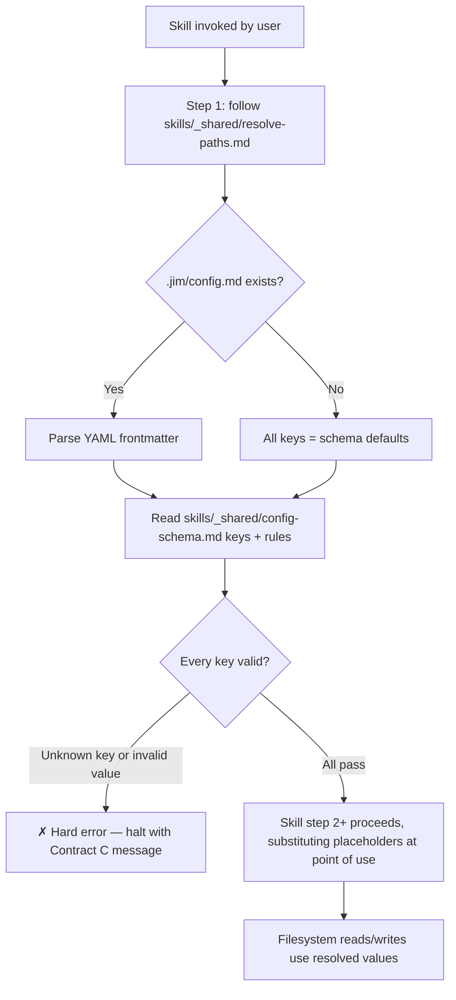
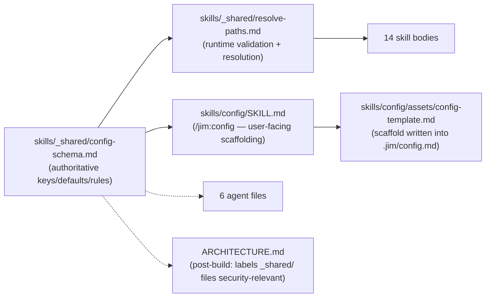

# Config adherence — Plan

## Overview

Introduce `skills/_shared/` as the first shared-primitives directory with two new files — `resolve-paths.md` (runtime preamble that reads config, validates, and resolves placeholders for substitution at point of use) and `config-schema.md` (authoritative keys, defaults, and value constraints, replacing the duplicated surface in `CONFIG.md` and `config-template.md`). Every skill body, every agent Context section, and two pre-existing config-adherence bugs are rewritten in one atomic pass to `{path.*}` placeholder form backed by the shared preamble.

## Design Decisions

### 1. Placeholder syntax: `{path.*}` single-brace, dot-namespaced

- **Chosen:** `{path.architecture}`, `{path.backlog}`, `{specs.id-padding}`, `{workflow.require-research}` — single curly braces, dot-namespaced keys matching the `.jim/config.md` YAML path.
- **Why:** Extends the existing `{curly-brace}` substitution convention already used throughout skill prose for runtime substitution (e.g., `{group}`, `{directory}`, `{YYYYMMDD}`). The dot-namespace is the discriminator: any placeholder containing `.` is a config placeholder resolved by the preamble; any placeholder without a dot is a runtime value (from `$ARGUMENTS`, dates, interview context, etc.). No new syntax to teach.
- **Rejected:** `{{path.architecture}}` double-brace — no local precedent, visual noise for no gain. `${path.architecture}` dollar-brace — reserved for shell/env contexts elsewhere in the ecosystem; confusing overlap. A non-brace sigil (`<path.architecture>`, `@path.architecture`) — breaks pattern continuity with runtime placeholders.

### 2. Preamble invocation syntax from each skill

- **Chosen:** Every skill's step 1 reads, verbatim: *"Resolve config — follow `skills/_shared/resolve-paths.md` before proceeding. Resolve every `{path.*}`, `{specs.*}`, or `{workflow.*}` placeholder before passing it to a tool call."*
- **Why:** Explicit, mechanical, one canonical phrase. The forcing function is the placeholder syntax itself: `{path.*}` strings are not valid tool arguments, so the agent must resolve them before any tool call.
- **Rejected:** Mirror the asset/reference overlay pattern ("First check `.jim/skills/_shared/...` — if it exists, use it instead of the built-in") — overlay semantics are wrong for shared primitives (users don't override `_shared/`; it's part of the plugin contract). A lightweight comment stub (`<!-- resolve paths -->`) — too easy for agents to skim.

### 3. `skills/_shared/config-schema.md` is the single source of truth

- **Chosen:** One file holds keys, defaults, value constraints, consuming-skills cross-reference, and user-facing documentation. `CONFIG.md` is deleted. `skills/config/assets/config-template.md` is reduced to the minimal frontmatter scaffolding `/jim:config` writes into `.jim/config.md`, with a prose body pointer to the schema.
- **Why:** Eliminates the three-way divergence risk researcher surfaced (schema vs. template vs. CONFIG.md). New keys touch one file. Matches the spec's stated preference (Open Question 3).
- **Rejected:** Keep `CONFIG.md` as a user-facing doc that references the schema — two files drift. Keep `config-template.md` carrying its own key list — same divergence problem. Machine-readable `.jim/schema.yaml` — no consumer beyond markdown-parsing agents; cost without payoff (confirmed during spec interview).

### 4. Schema file format

- **Chosen:** Markdown with YAML frontmatter listing each key's name, default, and type (for machine-friendly grep); prose body documenting value constraints per key in natural language; an explicit "validation rules" section defining the hard-error behavior the preamble must enforce.
- **Why:** Markdown-only matches the plugin. Prose handles nuance the YAML can't ("relative path, no `..` segments after normalization, no leading `/`, resolved absolute path within project root"). Frontmatter gives the preamble a stable structural anchor for key enumeration.
- **Rejected:** Pure-prose schema — no stable enumeration surface for the preamble to iterate. Pure-YAML schema — can't express the relative-path-plus-normalization rule concisely.

### 5. No external resolved-paths emission

- **Chosen:** The preamble does not emit a resolved-paths table or any other audit artifact to the conversation. Resolution happens internally; placeholders are substituted at point of use.
- **Why:** **Cleanup decision after dogfood.** The original design emitted a table on every skill invocation as a forcing function plus audit artifact. Dogfood feedback: the table was noisy across chained workflows (`/jim:spec → /jim:plan → /jim:build` showed 3+ identical tables, almost always all-defaults) and didn't materially help the agent. Re-analysis of the forcing function showed that the placeholder syntax itself does the work: `{path.*}` strings in skill bodies are not valid tool arguments, so the agent cannot proceed without resolving them. The table was downstream of that resolution, not what caused it. Audit needs are better served by the deferred persistent log (BACKLOG: "Resolved-paths audit log").
- **Rejected:** Compact-conditional emission (only when overrides exist) — preserves visibility but adds branching logic for marginal benefit. Inline emission on every invocation (the original design) — noise outweighs value once placeholder substitution is recognized as the actual forcing function.

### 6. Validation error message format

- **Chosen:** Multi-line structured stop message with three fields:
  ```
  ✗ Config validation failed.
  ✗ Key: path.architechture
  ✗ Reason: unknown key — not listed in skills/_shared/config-schema.md.
  ```
  For value violations, `Reason` names the violated constraint (e.g., "value must not contain `..` segments"). The raw offending value is **never** echoed in the error text. If an operator genuinely needs the raw value for diagnostics, the preamble's companion instruction is to print the contents of `.jim/config.md` inside a fenced code block in a *separate* message — not inside the error.
- **Why:** Satisfies the spec ACs (name the key, human-readable reason, no raw-value echo). The ✗ prefix matches jim's existing hard-stop convention. Fencing diagnostic values in a separate message preserves the error-message purity while allowing the user to ask for detail.
- **Rejected:** Echoing the raw value inline ("Value `../../../etc` is invalid for key `path.architecture`") — re-injects the payload into agent context. Bare error ("Config invalid") — no actionable information.

### 7. Agent rewrites: placeholders in prose only; tool calls never use unresolved placeholders

- **Chosen:** All six agent files (whole-file, not just Context sections) have their literal default filenames rewritten to `{path.*}` placeholders. Agents do not invoke the resolve-paths preamble. The Context paragraph that currently reads "Use any configured `path.*` values instead of the defaults listed below" is replaced with: "Resolved paths are provided by the skills you invoke. Use `{path.*}` placeholder names in your own reasoning and prose — never pass a placeholder string to a `Write`, `Edit`, `Read`, or `Glob` tool call. Before performing any direct filesystem operation on a configurable path (outside of an invoked skill), read `.jim/config.md` and resolve the placeholder inline; otherwise, invoke a skill whose preamble resolves the placeholder and use the resolved value."
- **Why:** Matches the spec's Out of Scope line (agents get placeholder rewrites but not preamble invocation). Closes the tool-call gap: if an agent writes `Write({path.specs}/foo.md, ...)` without prior resolution, it creates a literal-string file. The rule keeps placeholders useful for reasoning while forbidding them as tool arguments. Two resolution paths are permitted — skill-mediated (the normal flow) or inline-resolved (escape hatch for direct operations) — without mandating preamble machinery in agents.
- **Rejected:** Remove path references from agents entirely — the Context section genuinely benefits from naming the key artifacts. Add preamble invocation to agents — spec explicitly OOS. Prohibit direct agent tool calls on configurable paths — over-constrains agents that need narrow direct access (e.g., reading a spec to answer a question without running `/jim:spec`).

### 8. Pre-existing `skills/backlog/SKILL.md` L261 hardcoded `docs/BACKLOG.md`

- **Chosen:** Rewrite in the same task that applies placeholder treatment to the backlog skill. The line becomes `Write the updated content to {path.backlog} using Write.`
- **Why:** Same failure class the spec exists to fix; same file being touched; one line of incremental work. Ignoring it would leave a known config-bypass in the skill the refactor is supposed to harden.
- **Rejected:** Separate bug spec — unnecessary ceremony for a one-line fix inside a file already in scope.

### 9. `path.notes` key added to schema

- **Chosen:** The schema includes `path.notes` with default `docs/notes`, value constraints identical to other `path.*` directory keys. `skills/backlog/SKILL.md` L83 uses `{path.notes}` after rewrite.
- **Why:** Confirmed by user during planning. Backlog skill's current prose already claims the path is configurable; adding the key makes that prose truthful without carving a special case.
- **Rejected:** Remove the "configurable" hedge and hardcode `docs/notes` — creates a special-case path inconsistent with how every other directory is handled.

### 10. Static audit: grep invocation, not new tooling

- **Chosen:** The audit is a single `grep`/`rg` invocation asserting zero matches, run as a Verify command on the final audit task. No script, no lint CLI, no pre-commit hook.
- **Why:** One-time refactor-completion check, not ongoing tooling (per the spec's deferral of continuous enforcement to the self-test meta-skill). Matches jim's no-build-no-tests posture.
- **Rejected:** A committed audit script in `tools/` — adds a file jim has no precedent for and no runtime to execute outside refactor close-out.

### 11. Dogfood run: full cycle in a temporary project, with positive and negative cases

- **Chosen:** The dogfood exercises two tasks against a throwaway directory (under `$(mktemp -d)` or equivalent), seeded with minimal fixture `.jim/config.md` files. Task 26 runs the full `/jim:spec → /jim:plan → /jim:build` cycle with a valid override of `path.architecture`, verifying every skill in the chain honors the override and every artifact lands at the overridden location. Task 27 runs three negative-case invocations — unknown key, `..` traversal, absolute path — each expected to halt with a Contract C error and write no artifacts.
- **Why:** The spec AC reads "one full cycle" for a reason — each skill runs as its own agent invocation with its own step 1, so single-skill coverage doesn't prove that chained invocations each fire the forcing function and consistently resolve the same overrides. The original failure site (`/jim:build` completion gate) lives at the tail of a long chain; narrow scope would miss the analogous class of failure. Negative cases are needed because the schema validation is effectively untested without them — if the prose in `resolve-paths.md` is subtly wrong, the happy path keeps working while the hard-error ACs silently don't. Temp-directory isolation keeps verification hermetic and avoids contaminating jim's own artifacts (matches the global test-files-in-temp-dirs rule).
- **Rejected:** Single-skill scope — misses cross-skill resolution consistency and the tail-of-chain class that motivated the spec. Self-run against the jim repo — risks overwriting real artifacts. Automated negative-case test suite — no test infra precedent in jim; structured dogfood sub-steps are enough.

## Constitution Check

**`ARCHITECTURE.md` status:** Present — constraints noted below.

| Constraint from `ARCHITECTURE.md` | Honored? | Notes |
| :--- | :--- | :--- |
| SKILL.md ≤ 500 lines (progressive disclosure) | Yes | Preamble logic lives in `skills/_shared/resolve-paths.md`; per-skill step 1 remains a short delegation line. Schema content lives in `skills/_shared/config-schema.md`, not inline. |
| Agent body ≤ 800 tokens | Yes | Agent rewrites only substitute literals for placeholders; net token change is near zero. |
| Templates in `assets/`, methodology in `references/` | Yes | New files live in `skills/_shared/` which is a new shared-primitives location, parallel to but distinct from per-skill `assets/` and `references/`. This establishes a new sibling convention documented in the post-build ARCHITECTURE.md refresh. |
| No duplicate logic across 3+ agents/skills | Yes | Refactor actively reduces duplication — config-read boilerplate currently repeated in all 14 skills and 6 agents collapses to a single shared preamble referenced from skills. |
| All skills read `.jim/config.md` at step 1 | Yes, strengthened | Current pattern is preserved and now backed by a forcing function. |
| Asset/reference overlay via `.jim/skills/{skill}/...` | Yes | Overlay mechanism is untouched. `skills/_shared/` is not subject to user overlay (it is a plugin contract, not per-skill assets). |
| Plugin uses pure-markdown, no build step | Yes | All changes are markdown edits. |
| Agents prohibited from writing to `.git/`, `~/.ssh/`, `.env`, etc. | Yes | Schema's `path.*` value constraints actively enforce this class of restriction (no absolute paths, no `..`, resolved within project root). Refactor strengthens the invariant. |
| `$ARGUMENTS` is the only Claude Code-native substitution | Yes | `{path.*}` substitution is performed by the preamble at skill-run time, not by Claude Code's runtime. No conflict. |

## File Manifest

| Component | File Path | Action | Notes |
| :--- | :--- | :--- | :--- |
| Shared preamble | `skills/_shared/resolve-paths.md` | Create | Config read, schema validation, placeholder resolution, table emission, error format |
| Shared schema | `skills/_shared/config-schema.md` | Create | Authoritative keys, defaults, value constraints, consuming skills, user-facing docs |
| User-facing config doc | `CONFIG.md` | Delete | Superseded by `skills/_shared/config-schema.md` |
| Config template | `skills/config/assets/config-template.md` | Update | Reduce to minimal scaffolding + pointer to schema |
| `/jim:config` skill body | `skills/config/SKILL.md` | Update | Delegate default-list reads to the schema; placeholder rewrites where applicable |
| `/jim:spec` | `skills/spec/SKILL.md` | Update | 5 anchors + step 1 preamble reference |
| `/jim:plan` | `skills/plan/SKILL.md` | Update | 2 anchors + step 1 preamble reference |
| `/jim:research` | `skills/research/SKILL.md` | Update | 3 anchors + step 1 preamble reference |
| `/jim:build` | `skills/build/SKILL.md` | Update | 2 anchors (the primary failure site) + step 1 preamble reference |
| `/jim:debug` | `skills/debug/SKILL.md` | Update | 3 anchors + step 1 preamble reference |
| `/jim:vision` | `skills/vision/SKILL.md` | Update | 4 anchors + step 1 preamble reference |
| `/jim:roadmap` | `skills/roadmap/SKILL.md` | Update | 4 anchors + step 1 preamble reference |
| `/jim:arch` | `skills/arch/SKILL.md` | Update | 3 anchors + step 1 preamble reference; `{directory}/ARCHITECTURE.md` → `{directory}/{path.architecture}` at L34 |
| `/jim:backlog` | `skills/backlog/SKILL.md` | Update | 10 anchors + step 1 preamble reference + L261 hardcoded `docs/BACKLOG.md` → `{path.backlog}` + L83 `{path.notes}` |
| `/jim:brainstorm` | `skills/brainstorm/SKILL.md` | Update | 2 anchors + step 1 preamble reference |
| `/jim:sec` | `skills/sec/SKILL.md` | Update | 2 anchors + step 1 preamble reference |
| `/jim:meta-skill` | `skills/meta-skill/SKILL.md` | Update | 2 anchors + step 1 preamble reference |
| `/jim:meta-agent` | `skills/meta-agent/SKILL.md` | Update | 2 anchors + step 1 preamble reference |
| `@jim:pm` | `agents/pm.md` | Update | Context-section literal paths → placeholders; no preamble |
| `@jim:architect` | `agents/architect.md` | Update | Context-section literal paths → placeholders; no preamble |
| `@jim:researcher` | `agents/researcher.md` | Update | Context-section literal paths → placeholders; no preamble |
| `@jim:coder` | `agents/coder.md` | Update | Context-section literal paths → placeholders; no preamble |
| `@jim:security` | `agents/security.md` | Update | Context-section literal paths → placeholders; no preamble |
| `@jim:meta` | `agents/meta.md` | Update | Context-section literal paths → placeholders; no preamble |
| Architecture doc | `ARCHITECTURE.md` | Update (post-build, by `/jim:arch`) | Document `skills/_shared/` directory and label `resolve-paths.md` / `config-schema.md` as security-relevant files with named invariants |

## Interface Contracts

### Contract A — `skills/_shared/config-schema.md` structure

```markdown
---
keys:
  - name: path.vision
    default: VISION.md
    type: file-path
  - name: path.architecture
    default: ARCHITECTURE.md
    type: file-path
  - name: path.roadmap
    default: ROADMAP.md
    type: file-path
  - name: path.workflow
    default: WORKFLOW.md
    type: file-path
  - name: path.backlog
    default: BACKLOG.md
    type: file-path
  - name: path.specs
    default: docs/specs
    type: directory-path
  - name: path.brainstorms
    default: docs/brainstorms
    type: directory-path
  - name: path.debug
    default: docs/debug
    type: directory-path
  - name: path.research
    default: docs/research
    type: directory-path
  - name: path.notes
    default: docs/notes
    type: directory-path
  - name: specs.id-padding
    default: 3
    type: positive-integer
  - name: specs.id-prefix
    default: ""
    type: string
  - name: workflow.require-research
    default: false
    type: boolean
  - name: workflow.require-security
    default: false
    type: boolean
  - name: workflow.require-plan-approval
    default: true
    type: boolean
---

# Jim Config Schema

(body: per-key constraints, examples, value-shape rules, consuming-skills map)

## Validation Rules

- Unknown key (present in .jim/config.md but not in the keys list above) → hard error.
- `file-path` and `directory-path` values: must be relative, must not contain `..` segments after normalization, must not begin with `/`. Path normalization follows symlinks (realpath semantics). The final resolved target — after following any symlinks in the lexical path — must lie within the project root. Symlinks whose targets lie outside the project root are rejected with the `value must resolve within project root` reason, regardless of whether the lexical path contains `..`.
- `positive-integer`: must parse as an integer ≥ 1 → violations hard-error.
- `boolean`: must be the literal YAML `true` or `false`. Case variants and legacy YAML 1.1 forms (`yes`, `no`, `on`, `off`) are rejected with a `must be literal true or false` reason.
- `string`: any string accepted (no constraint beyond type).

## Overlay Boundary

`skills/_shared/` is part of the jim plugin contract and is **not** overlayable via `.jim/skills/_shared/`. A user who creates `.jim/skills/_shared/config-schema.md` expecting to add or loosen validation rules will find that file silently ignored. Per-skill asset and reference overlays under `.jim/skills/{skill-name}/assets/` and `.jim/skills/{skill-name}/references/` remain supported as documented in ARCHITECTURE.md; the shared-primitives directory is distinct from those surfaces.
```

### Contract B — `skills/_shared/resolve-paths.md` runtime contract

Per-invocation procedure, invoked by every skill's step 1 verbatim:

1. Read `.jim/config.md` if it exists. If absent, treat all keys as having their default values.
2. Enumerate every key declared in `skills/_shared/config-schema.md` frontmatter. For each:
   - If present in `.jim/config.md`: validate value against schema's validation rules. On violation → halt per Contract C.
   - If absent: use default.
3. For every key in `.jim/config.md` not declared in the schema → halt per Contract C.
4. Hold the resolved map internally for the rest of the invocation. No external emission. Throughout the invoking skill's subsequent steps, every `{path.*}`, `{specs.*}`, or `{workflow.*}` placeholder is substituted with its resolved value at the point of use.

### Contract C — Validation error format

Three-line structured halt. Key names are fenced in inline backticks so that markdown metacharacters or control content in a YAML-legal key cannot inject into agent context:

```
✗ Config validation failed.
✗ Key: `{offending key name}`
✗ Reason: {human-readable description — never echo the raw offending value}
```

After emitting, stop execution. Do not fall back to defaults.

### Contract D — Skill step 1 rewrite template

Every skill's current step 1 paragraph:

> "Read `.jim/config.md` from the project root if it exists. Use any configured `path.*` values instead of the default paths in this skill. If the file doesn't exist or a key is omitted, use the defaults shown below."

becomes:

> "Resolve config — follow `skills/_shared/resolve-paths.md` before proceeding. Resolve every `{path.*}`, `{specs.*}`, or `{workflow.*}` placeholder before passing it to a tool call."

### Contract E — Agent whole-file rewrite template

Each of the six agent files is swept in full — not just the Context section — for literal default-filename references, which become `{path.*}` placeholders. Agent files do not invoke the resolve-paths preamble.

The Context section's opening paragraph currently reads approximately:

> "Read `.jim/config.md` from the project root if it exists. Use any configured `path.*` values instead of the defaults listed below."

followed by a bulleted list of literal paths. The rewrite:

- The opening paragraph becomes: *"Resolved paths are provided by the skills you invoke. Use `{path.*}` placeholder names in your own reasoning and prose — never pass a placeholder string to a `Write`, `Edit`, `Read`, or `Glob` tool call. Before performing any direct filesystem operation on a configurable path (outside of an invoked skill), read `.jim/config.md` and resolve the placeholder inline; otherwise, invoke a skill whose preamble resolves the placeholder and use the resolved value."*
- The bulleted literal-path list becomes bulleted `{path.*}` placeholders (e.g. `{path.specs}`, `{path.vision}`, `{path.architecture}`).
- Any other prose in the agent file (process sections, constraints, examples) that references a literal configurable default is rewritten to the corresponding `{path.*}` placeholder.

## Data Flow

### Per-invocation resolution flow



### Authoring/editing flow (relationships between the shared files)



## Task Breakdown

*Refactor structure: front-load structural changes (new shared infra) before mechanical rewrites; every task ends with a grep-based "existing behavior preserved / change actually landed" verification.*

### Phase 1 — Shared infrastructure

1. [x] Create `skills/_shared/` directory and write `skills/_shared/config-schema.md` per Contract A, including every key from the researcher's authoritative list plus `path.notes`, with the Validation Rules section defining hard-error behavior per Contract C.
   **Verify:** `test -f skills/_shared/config-schema.md && grep -c "name: path\." skills/_shared/config-schema.md | grep -q '^10$'` (10 `path.*` keys expected).

2. [x] Write `skills/_shared/resolve-paths.md` implementing Contract B end-to-end: the step-by-step procedure (read config → validate → resolve → substitute at point of use, no external emission per Design Decision 5), the error format per Contract C, and a short rationale paragraph at the top explaining why the file exists.
   **Verify:** `grep -q "Resolved paths (from .jim/config.md):" skills/_shared/resolve-paths.md && grep -q "✗ Config validation failed\\." skills/_shared/resolve-paths.md`.

3. [x] Delete `CONFIG.md` from project root.
   **Verify:** `test ! -e CONFIG.md`.

4. [x] Update `skills/config/assets/config-template.md` to minimal scaffolding: frontmatter stub plus a prose body that points users to `skills/_shared/config-schema.md` as the authoritative key reference. No duplicated default list.
   **Verify:** `! grep -q "| path\.architecture" skills/config/assets/config-template.md && grep -q "skills/_shared/config-schema.md" skills/config/assets/config-template.md`.

5. [x] Update `skills/config/SKILL.md` to reference `skills/_shared/config-schema.md` as the source of valid keys/defaults at interview time, replacing any prior inline default list. Apply step 1 preamble reference per Contract D.
   **Verify:** `grep -q "skills/_shared/resolve-paths.md" skills/config/SKILL.md && grep -q "skills/_shared/config-schema.md" skills/config/SKILL.md`.

### Phase 2 — Skill rewrites (step 1 preamble + placeholder substitution)

Each of the following tasks applies two mechanical rewrites: the step 1 paragraph per Contract D, and every literal default-filename/default-directory anchor catalogued in the research becomes its `{path.*}`, `{specs.*}`, or `{workflow.*}` placeholder.

6. [x] Rewrite `skills/spec/SKILL.md`: step 1 preamble reference + 5 path anchors. Confirm `{specs.id-padding}` and `{specs.id-prefix}` placeholders appear where the skill assigns new IDs.
   **Verify:** `grep -q "skills/_shared/resolve-paths.md" skills/spec/SKILL.md && ! grep -E "\\\`(VISION\\.md|ARCHITECTURE\\.md|docs/specs)\\\`" skills/spec/SKILL.md`.

7. [x] Rewrite `skills/plan/SKILL.md`: step 1 preamble reference + 2 path anchors.
   **Verify:** `grep -q "skills/_shared/resolve-paths.md" skills/plan/SKILL.md && ! grep -E "\\\`(VISION\\.md|ARCHITECTURE\\.md)\\\`" skills/plan/SKILL.md`.

8. [x] Rewrite `skills/research/SKILL.md`: step 1 preamble reference + 3 path anchors.
   **Verify:** `grep -q "skills/_shared/resolve-paths.md" skills/research/SKILL.md && ! grep -E "\\\`(VISION\\.md|ARCHITECTURE\\.md|docs/research)\\\`" skills/research/SKILL.md`.

9. [x] Rewrite `skills/build/SKILL.md`: step 1 preamble reference + the two primary-failure-site anchors at L99–100.
   **Verify:** `grep -q "skills/_shared/resolve-paths.md" skills/build/SKILL.md && ! grep -E "\\\`(ARCHITECTURE\\.md|BACKLOG\\.md)\\\`" skills/build/SKILL.md`.

10. [x] Rewrite `skills/debug/SKILL.md`: step 1 preamble reference + 3 path anchors.
    **Verify:** `grep -q "skills/_shared/resolve-paths.md" skills/debug/SKILL.md && ! grep -E "\\\`docs/debug\\\`" skills/debug/SKILL.md`.

11. [x] Rewrite `skills/vision/SKILL.md`: step 1 preamble reference + 4 path anchors. Inline user-facing string "I see an existing VISION.md" (L38) rewritten to use the placeholder.
    **Verify:** `grep -q "skills/_shared/resolve-paths.md" skills/vision/SKILL.md && ! grep -E "\\\`(VISION\\.md|ARCHITECTURE\\.md)\\\`" skills/vision/SKILL.md`.

12. [x] Rewrite `skills/roadmap/SKILL.md`: step 1 preamble reference + 4 path anchors.
    **Verify:** `grep -q "skills/_shared/resolve-paths.md" skills/roadmap/SKILL.md && ! grep -E "\\\`(VISION\\.md|ROADMAP\\.md|docs/specs)\\\`" skills/roadmap/SKILL.md`.

13. [x] Rewrite `skills/arch/SKILL.md`: step 1 preamble reference + 3 path anchors. L34's `{directory}/ARCHITECTURE.md` becomes `{directory}/{path.architecture}` — the `{directory}` placeholder (runtime substitution from `$ARGUMENTS`) and `{path.architecture}` (config resolution) coexist, distinguished by the presence of a dot in the key.
    **Verify:** `grep -q "skills/_shared/resolve-paths.md" skills/arch/SKILL.md && grep -q "{directory}/{path.architecture}" skills/arch/SKILL.md && ! grep -E "\\\`(VISION\\.md|ARCHITECTURE\\.md)\\\`" skills/arch/SKILL.md`.

14. [x] Rewrite `skills/backlog/SKILL.md`: step 1 preamble reference + 10 path anchors, including the L261 hardcoded `docs/BACKLOG.md` → `{path.backlog}` fix and the L83 `docs/notes/` → `{path.notes}` substitution.
    **Verify:** `grep -q "skills/_shared/resolve-paths.md" skills/backlog/SKILL.md && ! grep -E "\\\`(VISION\\.md|ROADMAP\\.md|BACKLOG\\.md|docs/specs|docs/brainstorms|docs/notes)\\\`" skills/backlog/SKILL.md && ! grep -q "docs/BACKLOG\\.md" skills/backlog/SKILL.md`.

15. [x] Rewrite `skills/brainstorm/SKILL.md`: step 1 preamble reference + 2 path anchors.
    **Verify:** `grep -q "skills/_shared/resolve-paths.md" skills/brainstorm/SKILL.md && ! grep -E "\\\`(VISION\\.md|ROADMAP\\.md|docs/brainstorms)\\\`" skills/brainstorm/SKILL.md`.

16. [x] Rewrite `skills/sec/SKILL.md`: step 1 preamble reference + 2 path anchors.
    **Verify:** `grep -q "skills/_shared/resolve-paths.md" skills/sec/SKILL.md && ! grep -E "\\\`(VISION\\.md|ARCHITECTURE\\.md)\\\`" skills/sec/SKILL.md`.

17. [x] Rewrite `skills/meta-skill/SKILL.md`: step 1 preamble reference + 2 path anchors.
    **Verify:** `grep -q "skills/_shared/resolve-paths.md" skills/meta-skill/SKILL.md && ! grep -E "\\\`docs/specs\\\`" skills/meta-skill/SKILL.md`.

18. [x] Rewrite `skills/meta-agent/SKILL.md`: step 1 preamble reference + 2 path anchors.
    **Verify:** `grep -q "skills/_shared/resolve-paths.md" skills/meta-agent/SKILL.md && ! grep -E "\\\`docs/specs\\\`" skills/meta-agent/SKILL.md`.

### Phase 3 — Agent rewrites (whole-file sweep, placeholders only, no preamble)

19. [x] Sweep `agents/pm.md` in full: opening Context paragraph updated per Contract E (including the tool-call resolution rule), literal default-path bullets replaced with `{path.*}` placeholders, and any other literal-default reference elsewhere in the file rewritten similarly.
    **Verify:** `! grep -E "\\\`(VISION\\.md|ARCHITECTURE\\.md|ROADMAP\\.md|docs/specs)\\\`" agents/pm.md && grep -q "{path\\." agents/pm.md && grep -q "never pass a placeholder string to a" agents/pm.md`.

20. [x] Sweep `agents/architect.md` in full per Contract E.
    **Verify:** `! grep -E "\\\`(VISION\\.md|ARCHITECTURE\\.md|docs/specs)\\\`" agents/architect.md && grep -q "{path\\." agents/architect.md && grep -q "never pass a placeholder string to a" agents/architect.md`.

21. [x] Sweep `agents/researcher.md` in full per Contract E.
    **Verify:** `! grep -E "\\\`(VISION\\.md|ARCHITECTURE\\.md|docs/specs)\\\`" agents/researcher.md && grep -q "{path\\." agents/researcher.md && grep -q "never pass a placeholder string to a" agents/researcher.md`.

22. [x] Sweep `agents/coder.md` in full per Contract E.
    **Verify:** `! grep -E "\\\`(docs/specs|docs/debug)\\\`" agents/coder.md && grep -q "{path\\." agents/coder.md && grep -q "never pass a placeholder string to a" agents/coder.md`.

23. [x] Sweep `agents/security.md` in full per Contract E.
    **Verify:** `! grep -E "\\\`(VISION\\.md|ARCHITECTURE\\.md|docs/specs)\\\`" agents/security.md && grep -q "{path\\." agents/security.md && grep -q "never pass a placeholder string to a" agents/security.md`.

24. [x] Sweep `agents/meta.md` in full per Contract E.
    **Verify:** `! grep -E "\\\`(WORKFLOW\\.md|docs/specs)\\\`" agents/meta.md && grep -q "{path\\." agents/meta.md && grep -q "never pass a placeholder string to a" agents/meta.md`.

### Phase 4 — Acceptance verification

25. [x] Run the static audit. Across `skills/` and `agents/`, assert that no literal default filenames for configurable keys appear in **agent-procedural prose**. Exclusions carved out during the build: `skills/_shared/**` (the preamble and schema are defined by describing defaults), `skills/config/**` (config scaffolding necessarily names defaults to the user), `skills/*/assets/**` (output templates describe the files they generate), `skills/*/references/**` (methodology/DoD docs reference constraints rather than drive procedure), frontmatter `description:` fields (Claude Code metadata surfaced in the invocation surface, read-only at skill load), and `<example>` blocks within those descriptions (user-voice examples, not agent instructions). After these exclusions, no matches remain.
    **Verify:** `rg -n 'ARCHITECTURE\\.md|VISION\\.md|ROADMAP\\.md|WORKFLOW\\.md|BACKLOG\\.md|docs/specs|docs/brainstorms|docs/debug|docs/research|docs/notes' --glob '!skills/_shared/**' --glob '!skills/config/**' --glob '!skills/*/assets/**' --glob '!skills/*/references/**' skills/ agents/` — any remaining matches must be inspected and shown to reside inside a frontmatter `description:` block or an `<example>` block. As of task close-out, the 14 remaining matches are all in those two non-procedural locations.

26. [x] Dogfood happy-path full cycle. Create a temporary directory (under `$(mktemp -d)`), seed it with a minimal `.jim/config.md` that sets `path.architecture: docs/custom/ARCH.md` and `path.specs: docs/features` (two overrides, two different path types). Inside the temp project, run the full `/jim:spec → /jim:plan → /jim:build` cycle for a trivial throwaway spec, then invoke `/jim:arch` to produce the architecture doc. Confirm every invocation in the chain honored both overrides and the on-disk artifacts landed at the overridden paths: spec at `docs/features/{group}/{id}-{name}/spec.md`, architecture at `docs/custom/ARCH.md`, and no artifacts at default locations (no `ARCHITECTURE.md` at temp-dir root, no `docs/specs/` directory).
    **Verify:** `test -f docs/custom/ARCH.md && test ! -f ARCHITECTURE.md && test -d docs/features && test ! -d docs/specs` (evaluated inside the temp directory after the cycle completes).

27. [x] Dogfood negative cases. Run four additional invocations, each against a fresh temp directory seeded with a deliberately malformed `.jim/config.md` or layout. Each invocation uses `/jim:arch` (representative skill, fast). Each must halt with a Contract C error naming the offending key (fenced in backticks) and a human-readable reason, and must write no artifacts.
    - **27.1 Unknown key.** Config contains `path.architechture: docs/ARCH.md` (typo). Expected reason: "unknown key — not listed in skills/_shared/config-schema.md."
    - **27.2 Path traversal.** Config contains `path.architecture: ../../../tmp/evil.md`. Expected reason: "value must not contain `..` segments."
    - **27.3 Absolute path.** Config contains `path.architecture: /etc/evil.md`. Expected reason: "value must be relative (no leading `/`)."
    - **27.4 Symlink escape.** Config contains a valid-looking `path.architecture: docs/link/ARCH.md`. Before the run, create `docs/link` as a symlink pointing to `/tmp` (or another directory outside the temp project root). Expected reason: "value must resolve within project root" — the containment check follows the symlink and sees that the final resolved target lies outside the project root.
    **Verify:** For each sub-case: `test ! -f docs/ARCH.md && test ! -f ARCHITECTURE.md && test ! -f ../../../tmp/evil.md && test ! -f /etc/evil.md && test ! -f /tmp/ARCH.md` (evaluated after the halt). Supplemental: conversation log for each invocation contains the `✗ Config validation failed.` prefix and names the correct key inside inline backticks.

28. [x] Existing behavior preserved. With no `.jim/config.md` present (delete any test-artifact configs), run `/jim:spec`, `/jim:plan`, and `/jim:backlog add foo` against the jim repo itself and confirm each writes to default locations. Required by the mandatory refactor acceptance "existing behavior preserved."
    **Verify:** `git status` after each skill run shows only expected artifacts at default paths.

29. [x] Post-build ARCHITECTURE.md refresh. After the refactor commits, invoke `/jim:arch` to regenerate `ARCHITECTURE.md`. Confirm the output documents the `skills/_shared/` directory under Project Structure, adds an entry under Plugin Conventions describing the resolve-paths preamble as the single path-resolution surface, and explicitly labels `skills/_shared/config-schema.md` and `skills/_shared/resolve-paths.md` as security-relevant files with their invariants named.
    **Verify:** `grep -q "skills/_shared" ARCHITECTURE.md && grep -q "security-relevant" ARCHITECTURE.md && grep -q "resolve-paths" ARCHITECTURE.md`.

## Requirements Coverage Summary

| Spec Acceptance Criterion | Addressed In Task(s) |
| :--- | :--- |
| Every configurable path reference in skill bodies uses `{path.*}` placeholder syntax; no literal default filenames in skill procedural prose. | 6–18, 25 |
| Every configurable path reference in agent files uses `{path.*}` placeholder syntax; no literal default filenames in agent procedural prose. | 19–24, 25 |
| `skills/_shared/resolve-paths.md` exists and defines resolution, table format, and emit-before-filesystem-call instruction. | 2 |
| `skills/_shared/config-schema.md` exists and documents every valid key with default + value shape. | 1 |
| Every skill's step 1 references `skills/_shared/resolve-paths.md`. | 5, 6–18 |
| Unknown key in `.jim/config.md` → hard error naming the offending key; no fallback. | 2 (Contract C in resolve-paths.md), 27.1 (negative-case test) |
| `skills/_shared/config-schema.md` defines per-key value constraints including `path.*` rules (relative, no `..`, no leading `/`, resolved within project root). | 1 (schema Validation Rules section), 27.2 (traversal), 27.3 (absolute) |
| Validation error messages name the offending key and a human-readable reason; raw offending value is not echoed; diagnostic values fenced. | 2 (Contract C in resolve-paths.md), 27.1–27.3 (all negative cases verify the error format) |
| Every skill invocation runs the resolve-paths preamble before any tool call; no unresolved placeholder flows into a tool argument. | 2, 5, 6–18, 26, 28 |
| Agents do not invoke the resolve-paths preamble directly. | 19–24 (Contract E: placeholder-only rewrites, no preamble reference) |
| Static audit: zero literal default filenames outside schema and `/jim:config` user-facing scaffolding. | 25 |
| Dogfood run: full cycle honors overrides; verified by inspecting commits/diffs. | 26 (full `/jim:spec → /jim:plan → /jim:build` cycle plus `/jim:arch`) |
| Post-build ARCHITECTURE.md refresh labels `_shared/` files as security-relevant with named invariants. | 29 |
| Existing workflow commands continue to function against projects without `.jim/config.md` and produce same artifacts at default paths. | 28 |

## Out of Scope

- **Completion-gate extraction (`/jim:complete`).** Deferred per spec.
- **`jim_path` shell helper.** Deferred per spec.
- **Self-test meta-skill.** Deferred per spec; its enforcement requirements are already in `BACKLOG.md`.
- **Persistent resolved-paths audit log** (`.jim/logs/resolved-paths.jsonl` or similar). Deferred per spec.
- **Ongoing enforcement that future skills invoke the preamble.** Snapshot-audited via Task 25; continuous enforcement belongs to the deferred self-test meta-skill.
- **Changes to `.jim/config.md` file format or key set beyond adding `path.notes`.** The format from spec 011-config is preserved; only the missing `path.notes` key is added.
- **Migration tooling for existing projects.** Validation runs at read time on every invocation; no one-shot migration needed. Existing `.jim/config.md` files are either already schema-conformant or fail loudly on first run post-upgrade (user edits to fix).
- **Agent resolve-paths preamble.** Spec OOS: agents get placeholder rewrites but not preamble invocation.
- **Tests / CI integration.** Jim has no automated test suite; verification is grep-based + manual dogfood per `ARCHITECTURE.md`'s stated no-test posture.

## Open Questions

- [x] ~Dogfood scope — single skill vs full cycle~ → Resolved: Task 26 executes the full `/jim:spec → /jim:plan → /jim:build` cycle plus `/jim:arch` in a temp project with two overrides. Chained-invocation consistency and tail-of-chain behavior matter and cannot be proven by a single-skill run.

- [x] ~Negative-case validation coverage~ → Resolved: Task 27 splits into three sub-cases (unknown key, `..` traversal, absolute path) against fresh temp directories. Each verifies halt behavior and the Contract C error format. Exercises the schema validation paths that motivated the security findings.

- [x] ~`path.notes` schema membership~ → Added to schema with default `docs/notes` per user confirmation during planning.

- [x] ~Placeholder syntax for `{path.*}` vs. `{directory}` coexistence~ → Resolved by Design Decision 1: the dot namespace in `{path.*}` / `{specs.*}` / `{workflow.*}` distinguishes config placeholders from runtime placeholders.

- [x] ~Resolved-paths table format~ → Resolved by Design Decision 5: markdown table, inline-code fencing per value, `Key / Default / Resolved` columns.

- [x] ~Schema file as single source of truth~ → Resolved by Design Decision 3: schema is the single source; `CONFIG.md` deleted; `config-template.md` reduced to scaffolding.
