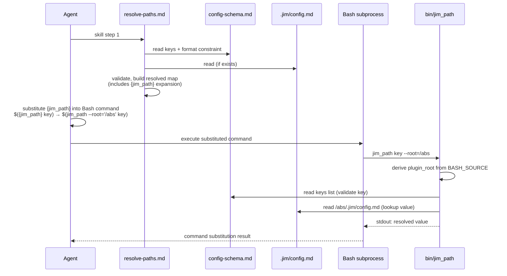

# jim_path helper — Plan

## Overview

Ship `bin/jim_path` as a thin bash script that reads `skills/_shared/config-schema.md` for valid keys, resolves a requested key against `<root>/.jim/config.md` (falling back to schema defaults), and prints the resolved value. Skills invoke it via a new `{jim_path}` placeholder that the resolve-paths preamble expands to `jim_path --root='<absolute-project-root>'`; helper discovery is delegated to Claude Code's plugin `bin/` PATH convention rather than to a custom plugin-root mechanism.

## Design Decisions

### 1. Helper-discovery mechanism

- **Chosen:** Rely on Claude Code's documented plugin convention — `<plugin>/bin/` is auto-added to the Bash tool's `PATH` while the plugin is enabled. Skills invoke `jim_path` by name with no absolute-path computation.
- **Why:** Stable platform feature, documented contract, zero code in jim. Avoids re-inventing path discovery and minimizes the substituted-token surface (only the project root needs quoting). Aligns with the user directive: leverage stable Claude Code features rather than custom solutions.
- **Rejected:** Multi-token expansion `bash <abs-helper-path> --root=<abs-root>` (the spec's pre-amendment shape) — required a plugin-root discovery mechanism that does not exist in jim today and added a second value-substitution slot. Now redundant under `bin/` PATH convention.

### 2. Plugin-root derivation inside the helper

- **Chosen:** Helper computes its own plugin root from `BASH_SOURCE[0]` via `dirname` twice (`<plugin>/bin/jim_path` → `<plugin>`). Schema lives at `<plugin>/skills/_shared/config-schema.md`, derived from this anchor.
- **Why:** Helper's location relative to the plugin layout is plugin contract. `BASH_SOURCE` is POSIX-portable and resolves through symlinks via `readlink -f` if needed. No env var, no CLI flag, no caller responsibility.
- **Rejected:** `${CLAUDE_SKILL_DIR}` (only set in skill-bash-injection contexts, not when the helper runs as a Bash tool subprocess); env var like `JIM_PLUGIN_ROOT` (user vetoed env vars in the spec interview); CLI flag (would burden every caller).

### 3. YAML parsing strategy

- **Chosen:** Restrict `skills/_shared/config-schema.md` frontmatter and `.jim/config.md` to a grep-line-readable form — single-line `name: value` entries within the `keys:` sequence, no multi-line scalars, no anchors, no aliases, no merge tags. Parse via awk.
- **Why:** Preserves jim's no-dependency stance (no `yq`, no `python`). Audit surface is <20 lines of awk. Removes the YAML edge-case attack surface (security finding 4). Current schema already conforms; the constraint is documented going forward.
- **Rejected:** `yq` (violates ARCHITECTURE.md's no-dependency posture); `python` (introduces runtime dependency, varies by system); hand-rolled full YAML parser in bash (large code, parser bugs, attack surface).

### 4. Schema-key validation in the helper

- **Chosen:** Helper validates the requested key name against the schema's `keys:` frontmatter on every invocation. Trusts values without re-validation.
- **Why:** Key typos are the common failure mode and not caught by the preamble's value validation alone (a typo'd key never enters the resolved map). Value validation is the preamble's job; duplicating it in the helper is the drift risk security finding 4 and the spec's hybrid design both rejected.
- **Rejected:** Trust-and-print (drops typo detection); full schema validation in helper (drift risk, two implementations).

### 5. Single-quote escaping algorithm

- **Chosen:** Single-quote wrap with `'\''` for embedded single-quotes. Algorithm: replace every `'` in the value with `'\''`, then surround the whole result with `'…'`.
- **Why:** POSIX-portable, no special characters need additional escaping inside single-quotes (bash treats `\` and `$` literally), and the result is unambiguously parsed by any POSIX shell. Only edge case is the null byte, which the preamble halts on.
- **Rejected:** Double-quote wrap (`$`, `` ` ``, `\` would still need escaping; broader attack surface); `printf %q` (bash-specific, not portable across all environments where Claude Code runs Bash).

### 6. Missing-config and unreadable-config handling

- **Chosen:**
  - Missing `.jim/config.md` (file does not exist at resolved root): silently print schema default, exit 0. No stderr emission.
  - Present but unreadable (`.jim/config.md` exists, `read` fails — permissions, etc.): exit 1 with stderr `jim_path: cannot read .jim/config.md`.
  - Present but malformed (config exists, key syntactically extracted but value missing or schema mismatched): exit 1 with stderr `jim_path: malformed config`.
- **Why:** Distinguishes "intentional zero-config" (common path, defaults are correct) from "config exists but cannot be honored" (something is wrong, fail loud). Resolves the two open questions from the spec.
- **Rejected:** Silent fallback in all cases (hides legitimate errors); error on missing config (breaks zero-config projects, which are the default case).

### 7. Preamble integration: where `{jim_path}` is computed

- **Chosen:** Extend `resolve-paths.md` step 4 (Build the resolved map) to compute `{jim_path}` alongside config-key resolution. The map gains one derived entry whose value is the multi-token expansion string. Substitution at point of use (step 5) is unchanged in mechanics.
- **Why:** Reuses existing placeholder lifecycle. No new conceptual model for skills or agents. The only structural change is that one map entry now expands to a multi-token string — documented explicitly so the pattern is reusable.
- **Rejected:** New preamble step dedicated to `{jim_path}` (over-engineered); inline computation in skill prose (defeats the forcing-function purpose).

### 8. PATH precedence assumption for plugin `bin/`

- **Chosen:** Assume Claude Code prepends plugin `bin/` to the Bash tool's PATH — i.e., the plugin's helper takes precedence over any same-named binary already on the user's PATH. Document the assumption explicitly; verify in dogfood that `which jim_path` resolves to the plugin's helper.
- **Why:** Matches the platform documentation cited in `research.md` (plugin `bin/` is "added to the Bash tool's PATH while the plugin is enabled"). Documenting the assumption surfaces it for future skills and creates a checkable verify if the platform behavior ever changes. Failure mode under wrong precedence is loud (different output, missing keys, "command not found"), not silent — diagnostic effort is the only cost.
- **Rejected:** Defensive self-check inside the helper (verify `$0` matches the expected plugin-relative path) — adds runtime cost on every invocation for a low-probability misinstall scenario; assumption-documentation + dogfood verify is sufficient. Re-evaluate if dogfood surfaces a precedence anomaly.

## Constitution Check

**`ARCHITECTURE.md` status:** Present — constraints noted below.

| Constraint | Honored? | Notes |
| :--- | :--- | :--- |
| Skill bodies use `{path.*}` placeholders, never literal default filenames | Yes | Plan adds `{jim_path}` placeholder; introduces no literal defaults to skill prose. |
| `skills/_shared/` is plugin contract, not overlayable | Yes | Plan modifies `_shared/resolve-paths.md` and `_shared/config-schema.md` — both plugin contract, intentional. |
| SKILL.md ≤ 500 lines | Yes | No skill body changes in this plan beyond preamble extension (<50 lines). |
| Pure-markdown plugin, no executable code | **Amended** | This plan introduces `bin/jim_path` as the first executable artifact. ARCHITECTURE.md update (Task 6) records the amendment and explicitly frames this as adoption of Claude Code's documented plugin `bin/` convention, not jim invention. The "no build step, no dependencies, no package manager" property remains honored — the helper is a single bash script with no build and no deps. |
| Agents/skills do not write to `.git/`, `~/.ssh/`, `node_modules/`, `.venv/`, `.env`, `.env-*` | Yes | Helper reads only `skills/_shared/config-schema.md` and `<root>/.jim/config.md`. No writes anywhere. |
| `.jim/skills/_shared/` overlay path is silently ignored | Yes | Helper reads schema from the plugin's own `_shared/` only, never from `.jim/`. |

## File Manifest

| Component | File Path | Action | Notes |
| :--- | :--- | :--- | :--- |
| Helper script | `bin/jim_path` | Create | Bash script implementing Contract A. Executable bit set. |
| Config schema | `skills/_shared/config-schema.md` | Update | Add Derived Placeholders section documenting `{jim_path}`; add Schema Format Constraint section documenting the line-readable form per Contract B. Existing keys frontmatter unchanged. |
| Resolve-paths preamble | `skills/_shared/resolve-paths.md` | Update | Extend step 4 to compute `{jim_path}` per Contract C. Document the multi-token-expansion pattern. Document the explicit non-use of the system-reminder line and the `${CLAUDE_SKILL_DIR}` fallback for any future plugin-root need. |
| Architecture document | `ARCHITECTURE.md` | Update | Build-completion gate update per Task 6 — see spec AC under "Architecture and documentation". |

No files are deleted. No skills are modified (the static-audit AC is preventative — the baseline is clean per `research.md`).

## Interface Contracts

### Contract A — Helper CLI

```
# Invocation
jim_path <key> [--root <absolute-path>]

# Arguments
#   <key>            One of the keys defined in skills/_shared/config-schema.md
#                    frontmatter `keys:` list. Full-key form required:
#                    "path.architecture", "workflow.require-research", etc.
#                    Bare suffixes ("architecture") are rejected as unknown keys.
#   --root <path>    Absolute filesystem path to the project root containing
#                    .jim/config.md. When omitted, defaults to $PWD.

# Stdout
#   On success: exactly the resolved value, followed by a single trailing newline.
#   The resolved value is the configured value from <root>/.jim/config.md, or
#   the schema default if the key is absent from config (or config is missing).

# Stderr
#   Empty on success. On error, exactly one of the following one-line messages:
#     "jim_path: unknown key (see .jim/config.md)"
#     "jim_path: cannot read .jim/config.md"
#     "jim_path: cannot read schema"
#     "jim_path: malformed schema"
#     "jim_path: malformed config"
#     "jim_path: not a jim plugin install"
#   No raw key or value content appears in stderr.

# Exit codes
#   0   success (value printed)
#   2   unknown key
#   1   other error (unreadable/malformed config or schema)
```

### Contract B — Schema format constraint

The frontmatter of `skills/_shared/config-schema.md` and the frontmatter of any `.jim/config.md` must conform to a restricted YAML subset, parseable by `awk` without a YAML library:

- Single YAML document (no `---` mid-document separators inside frontmatter).
- For schema: `keys:` is a sequence of mappings, each with exactly three fields: `name`, `default`, `type`.
- For config: top-level scalar mappings only — `key.name: value` per line.
- All scalar values are single-line. No `|`, `>`, or implicit multi-line continuation.
- No anchors (`&`), aliases (`*`), merge tags (`<<:`), or explicit type tags (`!!str`, etc.).
- Quoting permitted: empty string `""`, integers, booleans `true`/`false`. Otherwise unquoted plain scalars.

The `Schema Format Constraint` section added to `config-schema.md` documents this contract. Future schema additions must conform.

### Contract C — Placeholder expansion

```
# Source token (in skill prose)
{jim_path}

# Substitution form (computed by resolve-paths.md, applied at point of use)
jim_path --root='<absolute-project-root-quoted>'

# Quoting algorithm (single-quote wrap with '\'' escape)
def quote(s):
    if "\0" in s:
        halt("project root contains null byte")
    return "'" + s.replace("'", "'\\''") + "'"

# <absolute-project-root> source
# Claude Code's session-level primary working directory, captured by the
# preamble at skill-invocation time. The preamble does NOT parse the
# system-reminder line. If a future change forces plugin-root computation,
# the preamble derives it from ${CLAUDE_SKILL_DIR} (documented stable env var)
# by stripping the trailing "/skills/<skill-name>" segment.
```

### Contract D — Helper-internal plugin-root derivation

```bash
# bin/jim_path derives its own canonical location, from there computes the
# plugin root, then verifies the derived path is actually a jim plugin.
# This is a plugin-internal computation; callers do not pass plugin paths.

# Step 1 — Portable symlink resolution.
# `readlink -f` is a GNU-only flag; macOS BSD readlink does not support it.
# Manual loop is POSIX-portable across BSD and GNU.
helper_path="$0"
while [ -L "$helper_path" ]; do
    target="$(readlink "$helper_path")"
    case "$target" in
        /*) helper_path="$target" ;;
        *)  helper_path="$(dirname -- "$helper_path")/$target" ;;
    esac
done

# Step 2 — Canonicalize directory and derive plugin root.
helper_dir="$(cd -P -- "$(dirname -- "$helper_path")" && pwd -P)"
plugin_root="$(dirname -- "$helper_dir")"
schema_path="$plugin_root/skills/_shared/config-schema.md"

# Step 3 — Plausibility check.
# Verify the derived plugin root is actually a jim plugin. Closes the
# misinstall-or-relocation gap (helper copied to ~/.local/bin/, symlinked
# into a different plugin's bin/, etc.) which would otherwise silently
# resolve attacker-controlled keys against an unrelated config-schema.md.
manifest="$plugin_root/.claude-plugin/plugin.json"
if ! grep -q '"name"[[:space:]]*:[[:space:]]*"jim"' "$manifest" 2>/dev/null; then
    echo "jim_path: not a jim plugin install" >&2
    exit 1
fi

# Invariant: the helper's installed location is always
# "<plugin_root>/bin/jim_path" — guaranteed by the plugin layout contract
# documented in ARCHITECTURE.md and verified by Step 3.
```

## Data Flow



## Task Breakdown

1. [x] **Constrain schema format and document `{jim_path}`.** Edit `skills/_shared/config-schema.md`: (a) add a "Schema Format Constraint" section documenting Contract B verbatim; (b) add a "Derived Placeholders" section documenting `{jim_path}` as a non-configurable, preamble-computed value with the expansion form from Contract C; (c) verify the existing `keys:` frontmatter already conforms to Contract B (it does — every entry is three single-line scalars).
   **Verify:**
   ```
   grep -q '## Derived Placeholders' skills/_shared/config-schema.md &&
   grep -q '## Schema Format Constraint' skills/_shared/config-schema.md &&
   [ "$(grep -cE '^  - name: ' skills/_shared/config-schema.md)" -ge 15 ]
   ```

2. [x] **Implement `bin/jim_path`.** Create the file with `#!/usr/bin/env bash` shebang, `set -euo pipefail`, and the helper logic per Contract A:
   - Parse arguments (positional `<key>`, optional `--root <path>`).
   - Derive `plugin_root` per Contract D using the portable symlink-resolution loop (no `readlink -f` — GNU-only). Run the plausibility check against `<plugin_root>/.claude-plugin/plugin.json`; exit 1 with `jim_path: not a jim plugin install` if absent or not jim.
   - Read schema; awk-extract the `keys:` list.
   - Validate the requested key is in the list. On miss, stderr the exact unknown-key message and exit 2.
   - Look up the schema default for the key (column lookup).
   - Read `<root>/.jim/config.md` if present; awk-extract the value for the key. Use the default if absent. Exit 0 with stdout = value + newline.
   - Handle unreadable schema/config and malformed-schema/malformed-config cases per Contract A.
   - `chmod +x bin/jim_path` so the executable bit is committed.
   **Verify:** Run a battery of cases from project root:
   ```
   # Core CLI contract
   ./bin/jim_path path.architecture | diff - <(echo ARCHITECTURE.md) &&
   ./bin/jim_path workflow.require-plan-approval | diff - <(echo true) &&
   (./bin/jim_path bogus.key 2>&1 1>/dev/null | grep -q "unknown key (see .jim/config.md)") &&
   (./bin/jim_path bogus.key; test $? -eq 2) &&
   test -x bin/jim_path &&
   # Empty-string default (specs.id-prefix: "" in current schema)
   [ "$(./bin/jim_path specs.id-prefix | wc -c)" -eq 1 ] &&
   # Misinstall / non-jim plugin root → exit 1, "not a jim plugin install"
   scratch="$(mktemp -d)" &&
   mkdir -p "$scratch/bin" "$scratch/skills/_shared" "$scratch/.claude-plugin" &&
   cp bin/jim_path "$scratch/bin/jim_path" &&
   printf '{"name": "other"}\n' > "$scratch/.claude-plugin/plugin.json" &&
   ( "$scratch/bin/jim_path" path.architecture 2>&1 1>/dev/null | grep -q "not a jim plugin install" ) &&
   ( "$scratch/bin/jim_path" path.architecture; test $? -eq 1 ) &&
   # Malformed schema → exit 1, "malformed schema" (also exercises Contract D plausibility check passing)
   printf '{"name": "jim"}\n' > "$scratch/.claude-plugin/plugin.json" &&
   printf -- '---\nkeys:\n  - bogus\n---\n' > "$scratch/skills/_shared/config-schema.md" &&
   ( "$scratch/bin/jim_path" path.architecture 2>&1 1>/dev/null | grep -q "malformed schema" ) &&
   ( "$scratch/bin/jim_path" path.architecture; test $? -eq 1 ) &&
   # Symlinked invocation → portable readlink loop resolves it correctly
   ln -s "$PWD/bin/jim_path" "$scratch/bin/jim_path_link" &&
   "$scratch/bin/jim_path_link" path.architecture | diff - <(echo ARCHITECTURE.md) &&
   rm -rf "$scratch"
   ```

3. [ ] **Extend `resolve-paths.md` preamble.** Edit `skills/_shared/resolve-paths.md`: (a) add `{jim_path}` to step 4's resolved-map population, with the expansion algorithm from Contract C; (b) document the single-quote escape rule and the null-byte halt; (c) document the multi-token-expansion pattern as a reusable shape; (d) document the explicit non-use of the system-reminder line and the `${CLAUDE_SKILL_DIR}` fallback if plugin-root computation is ever needed; (e) ensure step 5 (substitution at point of use) explicitly mentions `{jim_path}` alongside the existing placeholder set.
   **Verify:** `grep -q "{jim_path}" skills/_shared/resolve-paths.md && grep -q "single-quote" skills/_shared/resolve-paths.md && grep -q "CLAUDE_SKILL_DIR" skills/_shared/resolve-paths.md && grep -q "primary working directory" skills/_shared/resolve-paths.md`. Plus a manual read-through to confirm the multi-token-expansion pattern is documented in prose.

4. [ ] **Static audit baseline.** Run a grep across `skills/**/SKILL.md` for literal default filenames inside Bash code blocks or `Bash(...)` invocations. Confirm zero matches outside the expected exceptions (`skills/_shared/config-schema.md`, `skills/config/`).
   **Verify:**
   ```
   ! grep -l '^```bash' skills/*/SKILL.md 2>/dev/null
   ```
   Per `research.md` Phase 0, no skill body currently contains a ```bash code block — so the grep should find nothing and `!` flips the exit to 0. If any future skill introduces a ```bash block, this verify fails and a follow-up sweep is required.

5. [ ] **Dogfood cycle.** Set up a temporary test project at `/tmp/jim-013-dogfood` containing: (a) `.jim/config.md` with `path.architecture: docs/jim/ARCHITECTURE.md` (path override) and `workflow.require-research: true` (non-path override); (b) a non-trivial subdirectory like `subprojects/foo/`. Manually execute `/jim:spec` → `/jim:plan` → `/jim:build` against this project, invoking at least one skill from `subprojects/foo/` (cwd != project root). Inspect the resulting commits/diffs.
   **Verify:**
   ```
   # PATH precedence assumption (Decision 8): plugin bin/ takes precedence
   which jim_path | xargs -I{} dirname {} | xargs -I{} dirname {} | xargs -I{} basename {} | grep -q '^jim$' &&
   # Override applied where expected
   test -f /tmp/jim-013-dogfood/docs/jim/ARCHITECTURE.md &&
   ! test -f /tmp/jim-013-dogfood/ARCHITECTURE.md &&
   git -C /tmp/jim-013-dogfood log --oneline | head -5
   ```
   Plus manual inspection: every Bash invocation in the cycle's transcript that resolved a configurable path used `$(jim_path …)` substitution; the resolved values match the override.

6. [ ] **Update `ARCHITECTURE.md`.** As part of the build completion gate, edit `ARCHITECTURE.md`:
   - Add `bin/` to the Project Structure tree, noting it ships under Claude Code's documented plugin `bin/` convention (auto-added to Bash tool's PATH).
   - Add a Core Components subsection (or extend Shared Primitives) describing `bin/jim_path` with its CLI contract, its plugin-root-derivation invariant, and its security-relevant invariants (never validates values, never echoes raw values in stderr).
   - Document the `{jim_path}` placeholder alongside the existing placeholder discussion.
   - Amend the "no executable code, pure markdown" claim to reflect the helper, while preserving the "no build step, no dependencies, no package manager" property.
   - Flag `bin/jim_path` and the existing `_shared/` files as the security-relevant trio for config-mediated filesystem safety.
   **Verify:** `grep -q "bin/jim_path" ARCHITECTURE.md && grep -q "{jim_path}" ARCHITECTURE.md && grep -q "executable" ARCHITECTURE.md`.

## Requirements Coverage Summary

| Spec Acceptance Criterion | Addressed In Task(s) |
| :--- | :--- |
| `bin/jim_path` exists with `#!/usr/bin/env bash` shebang | 2 |
| Helper accepts full-key positional argument; bare suffixes rejected | 2 |
| Helper accepts `--root <abs-path>` flag; falls back to `$PWD` | 2 |
| Helper resolves all `path.*`, `specs.*`, `workflow.*` keys | 2 |
| Helper validates key against schema `keys:` frontmatter; unknown-key stderr `jim_path: unknown key (see .jim/config.md)`; key never echoed | 2 |
| Helper does not validate config values | 2 |
| Missing config or absent key → schema default to stdout, exit 0 | 2 |
| Helper prints exactly the value + trailing newline; nothing else to stdout | 2 |
| Exit codes 0 / 2 / 1 | 2 |
| Trust contract documented (helper trusts preamble validation) | 1, 2 (schema doc + helper code comment) |
| `resolve-paths.md` extended with `{jim_path}` placeholder; expansion `jim_path --root=<abs-root>`; helper discovery via `bin/` PATH | 3 |
| Quoting: single-quote project root with `'\''` escape; halt on unquotable | 3 |
| Project root from session primary working directory; no system-reminder parsing; `${CLAUDE_SKILL_DIR}` is fallback | 3 |
| `{jim_path}` is first multi-token placeholder; pattern documented | 3 |
| `config-schema.md` documents `{jim_path}` in Derived Placeholders section | 1 |
| Baseline preserved: zero current Bash literal-default violations | 4 |
| Bash invocations use `$({jim_path} <key>)` substitution | 3 (preamble enables); 4 (audit gate) |
| Static audit grep finds zero hits in skill bodies | 4 |
| No skill prose contains absolute path to `bin/jim_path` | 4 (audit confirms) |
| Dogfood cycle with `path.*` override, non-`path.*` override, non-default cwd | 5 |
| Dogfood verified by commits/diffs, not transcript alone | 5 |
| `ARCHITECTURE.md` updated to document helper, placeholder, executable-code amendment, plugin convention adoption | 6 |
| `_shared/*` files + `bin/jim_path` flagged security-relevant in architecture | 6 |
| Existing workflow commands work for default-config projects | 5 (dogfood implicitly exercises default behavior for non-overridden keys) |
| Skill sweep does not change behavior under default config | 4 (no skills modified); 5 (dogfood confirms) |

Every spec AC maps to at least one task. No `[NEEDS CLARIFICATION]` markers.

## Out of Scope

- **Performance benchmarking of the helper.** Bash subprocess overhead (~3–10ms cold) is acceptable; no target latency or throughput measurement is required.
- **CI integration for the static audit.** This plan executes the audit once at refactor close-out (task 4). Continuous static-audit enforcement is the backlog item "shellcheck CI for jim's executable artifacts" (which can extend to add the literal-default audit) and the future Self-test meta-skill.
- **Test harness for the helper.** The helper's test surface is exercised by task 2's verify battery and the dogfood cycle. A persistent test harness is a future addition that aligns with the backlog Self-test meta-skill.
- **Helper invocation from non-Bash-tool contexts.** Spec excludes interactive shell use (fish/zsh) — plan does not introduce fish/zsh wrappers.
- **`{plugin.root}` general-purpose placeholder.** Spec excludes this; plan does not introduce it.
- **Migration script for existing custom configs.** Config format is unchanged; no migration needed.

## Open Questions

- [x] ~Missing-`.jim/config.md` behavior (silent vs. stderr)~ → Resolved in Decision 6: silent fallback to defaults, exit 0.
- [x] ~Stderr format for unknown-key errors~ → Resolved in spec AC: `jim_path: unknown key (see .jim/config.md)`, no key echo.
- [x] ~Executable bit on `bin/jim_path`~ → Resolved by adoption of `bin/` PATH convention: bit must be set.
- [x] ~Unreadable-config behavior~ → Resolved in Decision 6: exit 1, stderr `jim_path: cannot read .jim/config.md`.
- [x] ~YAML parsing strategy~ → Resolved in Decision 3: line-readable restricted form, awk parser.
