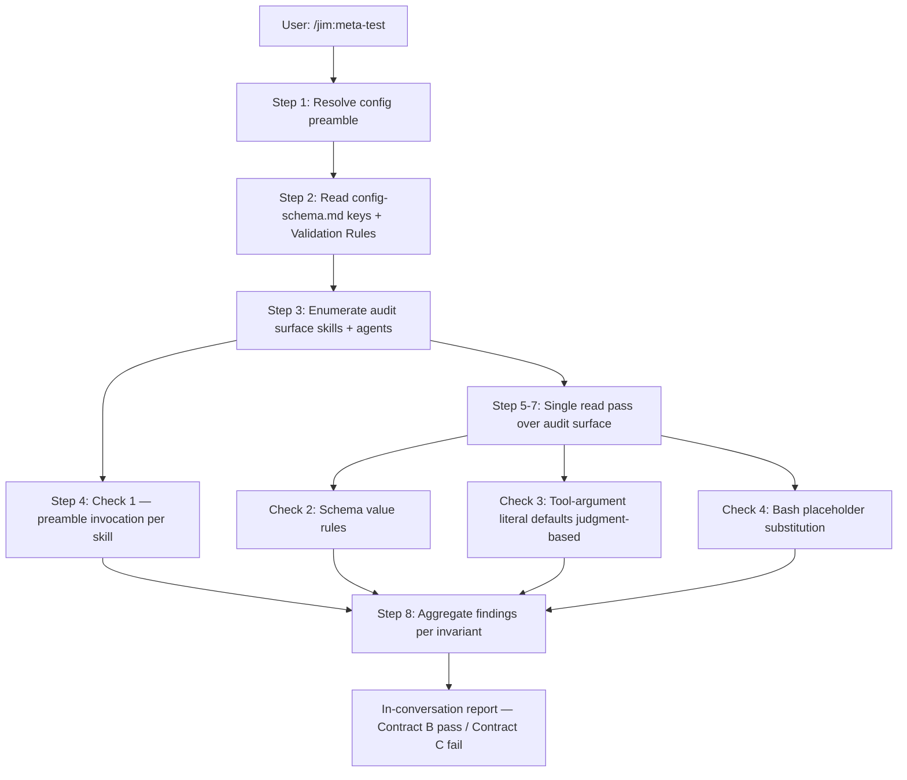

# Meta-test skill — Plan

## Overview

Ship `skills/meta-test/SKILL.md` as a read-only judgment-based audit skill — same shape as `/jim:sec` — that walks four invariant checks over `skills/*/SKILL.md` and `agents/*.md`, deriving its literal-default search corpus and validation-rule list from `skills/_shared/config-schema.md` at runtime so the audit grows automatically as the schema evolves. Register the new skill on `@jim:meta` so `/jim:meta-test` dispatches there alongside the existing meta-skill / meta-agent verbs.

## Design Decisions

### 1. Skill structure mirrors `/jim:sec`

- **Chosen:** Read-heavy, judgment-based skill that emits an in-conversation pass/fail report and writes nothing to disk. Per-check sections inside the skill body define each invariant, anchor examples, and exemption boundaries.
- **Why:** `skills/sec/SKILL.md` is the closest existing peer — same runtime shape (read context, apply judgment per category, present structured findings, stop). Mirroring its structure gives the coder a working template, keeps the skill body concise, and matches the user mental model already established by `/jim:sec`.
- **Rejected:** `skills/meta-skill/SKILL.md` shape (gate → build → validate cycle) — wrong shape for an audit skill that doesn't produce an artifact. Standalone bash script under `bin/` — explicit Out of Scope per spec; in-conversation slash-command was confirmed during interview.

### 2. Schema-derived corpus, not hardcoded literal list

- **Chosen:** Skill body instructs the agent to read `skills/_shared/config-schema.md`'s `keys:` frontmatter at runtime to build the list of literal-default search terms (Check 3) and read its `## Validation Rules` section to build the list of type rules whose presence Check 2 verifies.
- **Why:** The schema is the authority for what counts as a configurable path and what the type rules are. Hardcoding the list inside the skill body would be a second source of truth — drift inevitable. Reading the schema mirrors how `resolve-paths.md` consumes the same surface.
- **Rejected:** Hardcoded list of defaults inside the meta-test skill body — drifts the moment the schema gets a new key, exactly the failure mode this skill is supposed to detect.
- **Trust boundary:** The meta-test treats `skills/_shared/config-schema.md` as authoritative input. Tampering with the schema (removing a key, weakening or deleting a rule, corrupting the `keys:` frontmatter) effectively disables the corresponding part of the audit. Schema modifications therefore carry the same review weight as modifications to `bin/jim_path` or `resolve-paths.md` — they are part of the security-relevant trio per `ARCHITECTURE.md`. Defense-in-depth follows from the fail-loud semantics in task 3 (halt on missing/malformed schema rather than silently passing or falling back to a hardcoded list). Future contributors editing the schema should treat the change as a security-relevant edit, not a configuration change.

### 3. Single-pass audit surface walk for Checks 3 + 4

- **Chosen:** Check 1 is a per-skill file-path grep. Check 2 is one schema read. Checks 3 and 4 share a single read pass over the audit surface (`skills/*/SKILL.md` ∪ `agents/*.md`) — both inspect the same prose, so there's no reason to read each file twice.
- **Why:** Minimizes read tool calls, keeps the skill body's audit-procedure section compact, and produces a coherent per-file finding sequence in the report (each file's preamble, literal-default, and bash-substitution findings are emitted contiguously).
- **Rejected:** Four independent passes (one per check) — duplicated I/O, redundant prose in the skill body. Loading every file into a single context blob and running checks against it — bad for large repos and unnecessary given the read-once pattern.

### 4. `/jim:config` exemption pinned to step anchors

- **Chosen:** The exemption boundary is `skills/config/SKILL.md` steps 3 and 4 — the interview ("Where do your strategic docs live? `VISION.md`, `ARCHITECTURE.md`, etc.") and the scaffolding-generation step. Steps 2 (check for existing config) and 5 (present and stop) are subject to normal Check 3 rules. The skill body documents this explicitly with section numbers.
- **Why:** Research found exactly one current literal-default mention in `skills/config/SKILL.md` — the L37 interview question inside step 3. That's the prose the exemption was designed for. Pinning to step anchors keeps the exemption narrow per security finding 5; loosening to "anywhere in `skills/config/SKILL.md`" would let a future contributor introduce real leaks under the exemption umbrella.
- **Rejected:** Whole-file exemption for `skills/config/SKILL.md` — too broad. Wildcard exemption ("any literal default in an interview question regardless of file") — would extend the carve-out to skills that haven't requested it.

### 5. Anchor examples avoid self-flagging

- **Chosen:** The skill body's negative anchor examples (the "what a violation looks like" snippets) use a fictional skill name (e.g., `skills/example/SKILL.md`) and a non-default illustrative path (e.g., `docs/example/CUSTOM.md`) instead of real default values. Positive anchors quote actual file:line references from existing skills.
- **Why:** The meta-test audits its own SKILL.md (self-audit by inclusion, spec AC). If the anchor examples used real default values like `ARCHITECTURE.md` in tool-argument-shaped positions, the meta-test would flag its own examples as violations on first run. Using non-default illustrative values keeps the examples instructive without tripping the audit.
- **Rejected:** Disable Check 3 for the meta-test's own examples via a code-fence escape — adds a parser surface the spec deliberately rejected. Inline the anchor examples inside `<!-- example -->` HTML comments — comments are part of the file content, would still be matched.

### 6. Self-audit by inclusion, no self-exclusion mechanism

- **Chosen:** `skills/meta-test/SKILL.md` is part of the `skills/*/SKILL.md` glob. The audit-surface enumeration step has no exclusion clause for the meta-test itself. The skill body's first instruction inside Check 1 explicitly notes that the meta-test verifies its own preamble invocation alongside every other skill.
- **Why:** Spec AC requires self-audit; security finding 4 requires no self-exclusion. The simplest enforcement is the absence of any exclusion code path. Calling out the property in prose anchors it for future contributors.
- **Rejected:** Explicit `if file == 'skills/meta-test/SKILL.md': skip` clause — opens the exact backdoor finding 4 warned against.

### 7. Report ordering: per-invariant grouping with file:line bullets

- **Chosen:** Pass-case report lists per-invariant counts only. Fail-case report groups violations by invariant first, then by file:line within each invariant. Matches the spec's UI Mockup verbatim.
- **Why:** Contributors fix violations by category — "I missed the preamble in this new skill" or "I left a literal default in a Bash block." Grouping by invariant matches how a contributor reads the report and decides where to look. File-then-invariant ordering would scatter the same fix across multiple sections.
- **Rejected:** Flat list of findings ordered by file path — harder to scan for systemic issues. JSON output with structured nesting — explicitly out of scope per Open Question resolution (human-readable markdown only).

### 8. No `references/` or `assets/` subdirectory

- **Chosen:** The entire skill body fits in `skills/meta-test/SKILL.md` under the 500-line progressive-disclosure budget. No `references/` methodology doc, no `assets/` template.
- **Why:** Research confirmed the audit logic is small (~4 checks × ~20 lines each + framing). A separate methodology doc would be over-disclosure for a skill this compact. The skill body holds anchor examples inline because they are the primary calibration signal for the judgment-based check (Check 3).
- **Rejected:** Split anchor examples into `references/anchor-examples.md` — fragments the skill across two files for no reader-benefit gain at this size.

## Constitution Check

**`ARCHITECTURE.md` status:** Present — constraints noted below.

| Constraint from `ARCHITECTURE.md` | Honored? | Notes |
| :--- | :--- | :--- |
| SKILL.md ≤ 500 lines (progressive disclosure) | Yes | Plan task 11 verifies; estimate ~250–350 lines based on `/jim:sec` peer (180 lines, simpler shape). |
| Skills bound to agents via `agent` frontmatter (documentation convention) | Yes | New skill sets `agent: meta`; agent registration via task 1. |
| `skills/_shared/` is plugin contract, not overlayable | Yes | Skill reads schema and preamble; does not modify them. |
| Configurable paths appear as `{path.*}` placeholders, never as literal default filenames in procedural prose | Yes | Skill follows the same discipline it audits. Task 12 verifies via grep on its own body. |
| Agent body ≤ 800 tokens | Yes | `agents/meta.md` update adds ~30 tokens (one entry to skills list, one example block, one rules-of-engagement clause); task 1's verify includes a token-budget check. |
| Security-relevant trio (`config-schema.md`, `resolve-paths.md`, `bin/jim_path`) — read-only consumers preserve invariants | Yes | Skill reads but does not modify these files. |
| Skills' step 1 invokes `skills/_shared/resolve-paths.md` (canonical preamble) | Yes | Task 2 places the reference in step 1 of the new skill. |

## File Manifest

| Component | File Path | Action | Notes |
| :--- | :--- | :--- | :--- |
| Meta-test skill body | `skills/meta-test/SKILL.md` | Create | Full skill body — frontmatter, 8 process steps, validation checklist. |
| Meta agent registration | `agents/meta.md` | Update | Add `meta-test` to `skills:` list, extend `description:` to mention `/jim:meta-test`, add an `<example>` block, extend Rules of Engagement clause for the new verb. |

## Interface Contracts

### Contract A — Frontmatter shape for `skills/meta-test/SKILL.md`

```yaml
---
name: meta-test
description: >
  Statically audit jim's own skills and agents for config-adherence
  invariants — preamble invocation, schema value rules, literal default
  filenames in tool-argument positions, and `$({jim_path} <key>)`
  placeholder substitution in Bash invocations. Use when the user invokes
  /jim:meta-test, before committing changes to skills or agents, or to
  verify the audit surface is clean. Do not use for runtime exercise of
  skills, behavioral evaluation, or auditing files outside the consumer
  surface (skills/_shared/, references/, assets/, bin/, root strategic
  docs are out of scope).
agent: meta
argument-hint: ""
---
```

### Contract B — Pass-case report shape

```
✓ /jim:meta-test — all invariants satisfied

  Audited <N> skills, <M> agents.

  - Preamble invocation: <N>/<N> ✓
  - Schema value rules: 5/5 type rules preserved ✓
  - Tool-argument literal defaults: 0 violations ✓
  - Bash $({jim_path} <key>) placeholder substitution: <K>/<K> invocations ✓
```

`<N>` = count of `skills/*/SKILL.md` files. `<M>` = count of `agents/*.md` files. `<K>` = count of Bash invocations encountered in the audit surface (today: 0; report shows `0/0 ✓`).

### Contract C — Fail-case report shape

```
✗ /jim:meta-test — <V> violations across <F> files

  Audited <N> skills, <M> agents.

  <Invariant name>: <pass>/<total> (<violations> violation(s))
    - <file:line> — <one-line description>; <fix hint>

  <Invariant name>: <pass>/<total> ✓
```

Per-invariant blocks emitted in fixed order: Preamble invocation → Schema value rules → Tool-argument literal defaults → Bash placeholder substitution. Sections that pass cleanly are listed at the bottom in `<pass>/<total> ✓` form. Each violation bullet includes a fix hint pointing to the placeholder or substitution form the contributor should use.

### Contract D — Audit surface specification

```
In scope (audited):
  - skills/*/SKILL.md
  - agents/*.md

Out of scope (not audited):
  - skills/_shared/                 (plugin contract, source of truth)
  - skills/*/references/            (methodology, may legitimately mention paths)
  - skills/*/assets/                (templates, may legitimately mention paths)
  - bin/                            (executable artifacts, parsed by helper not skill)
  - .claude-plugin/                 (manifest)
  - VISION.md, ARCHITECTURE.md,     (root strategic docs)
    ROADMAP.md, BACKLOG.md,
    WORKFLOW.md, CLAUDE.md
```

The skill enumerates the in-scope surface via Glob; out-of-scope paths are listed in skill prose for documentation but are never globbed.

### Contract E — `/jim:config` exemption boundary

```
Exempt from Check 3 (literal default filenames in tool-argument positions):
  - skills/config/SKILL.md, step 3 (interview / discover paths)
  - skills/config/SKILL.md, step 4 (generate config / scaffolding)

Subject to Check 3 normally:
  - skills/config/SKILL.md, step 1 (resolve config — preamble)
  - skills/config/SKILL.md, step 2 (check for existing config)
  - skills/config/SKILL.md, step 5 (present and stop)
  - All other audited files (no exemption)
```

The skill body documents this with literal step numbers so the boundary is unambiguous to both Claude (at audit time) and human reviewers.

## Data Flow



## Task Breakdown

1. [x] **Update `agents/meta.md` to register `meta-test`.** Add `meta-test` to the `skills:` list. Extend the agent's `description:` block to mention `/jim:meta-test` alongside `/jim:meta-skill` and `/jim:meta-agent`. Add an `<example>` block illustrating direct invocation. Extend the Rules of Engagement clause "When invoked with `/jim:meta-skill` or `/jim:meta-agent`…" to include `/jim:meta-test`.
   **Verify:** `grep -q "meta-test" agents/meta.md && grep -qE "skills:[[:space:]]*\[[^]]*meta-test" agents/meta.md && grep -q "/jim:meta-test" agents/meta.md`

2. [x] **Create `skills/meta-test/SKILL.md` skeleton.** Write the frontmatter per Contract A, the H1 heading, a one-paragraph purpose statement, and step 1 (`### 1. Resolve config`) with the canonical reference to `skills/_shared/resolve-paths.md`. No other content yet.
   **Verify:** `test -f skills/meta-test/SKILL.md && grep -q "^name: meta-test$" skills/meta-test/SKILL.md && grep -q "^agent: meta$" skills/meta-test/SKILL.md && grep -q "skills/_shared/resolve-paths.md" skills/meta-test/SKILL.md`

3. [x] **Add Step 2 — read schema with fail-loud semantics.** Append `### 2. Read the config schema` instructing the agent to Read `skills/_shared/config-schema.md`, parse the `keys:` frontmatter to derive the configurable-key list and per-key default values (the literal-default search corpus for Check 3), and parse the `## Validation Rules` section to build the type-rule list (the presence checklist for Check 2). Document that Check 4's "configurable path" definition uses the same key list. Specify schema-read failure semantics:
   - **Schema file missing or unreadable:** halt with `✗ /jim:meta-test — cannot read skills/_shared/config-schema.md`. Do not proceed to Checks 1–4.
   - **`keys:` frontmatter missing or unparseable as a mapping sequence:** halt with `✗ /jim:meta-test — schema keys: section is missing or malformed`. Do not proceed.
   - **`## Validation Rules` section missing:** halt with `✗ /jim:meta-test — schema Validation Rules section is missing`. Do not proceed.
   - **Schema readable, `keys:` empty (no path keys present):** Check 3 reports `0/0` legitimately; do not halt.

   The skill body explicitly states that fallback to a hardcoded corpus or silent ✓ on schema failure is prohibited — defense-in-depth for the trust boundary documented in Decision 2.
   **Verify:** `grep -q "skills/_shared/config-schema.md" skills/meta-test/SKILL.md && grep -q "Validation Rules" skills/meta-test/SKILL.md && grep -qiE "keys:[[:space:]]*frontmatter|keys frontmatter" skills/meta-test/SKILL.md && grep -qiE "halt|fail.loud|cannot read" skills/meta-test/SKILL.md && grep -q "schema Validation Rules section is missing" skills/meta-test/SKILL.md`

4. [x] **Add Step 3 — enumerate audit surface.** Append `### 3. Enumerate the audit surface` per Contract D. The step instructs the agent to Glob `skills/*/SKILL.md` and `agents/*.md` for the in-scope file set, lists the out-of-scope paths in prose for reference, and notes that `skills/meta-test/SKILL.md` is included in its own audit (no self-exclusion).
   **Verify:** `grep -qF 'skills/*/SKILL.md' skills/meta-test/SKILL.md && grep -qF 'agents/*.md' skills/meta-test/SKILL.md && grep -qiE "self-audit|own audit|audits itself" skills/meta-test/SKILL.md && grep -qF 'skills/_shared/' skills/meta-test/SKILL.md`

5. [x] **Add Step 4 — Check 1 (preamble invocation).** Append `### 4. Check 1 — Preamble invocation`. The step describes the structural rule: every `skills/*/SKILL.md`'s step 1 must contain a literal reference to the file path `skills/_shared/resolve-paths.md`. Include one positive anchor (point to an existing skill) and one negative anchor (fictional skill where the reference is in step 2 not step 1). Specify the per-finding line shape per Contract C. Note that agents are excluded from Check 1 (they don't invoke the preamble directly).
   **Verify:** `grep -q "Preamble invocation" skills/meta-test/SKILL.md && grep -q "skills/_shared/resolve-paths.md" skills/meta-test/SKILL.md && grep -qiE "step 1|step one" skills/meta-test/SKILL.md`

6. [x] **Add Step 5 — Check 2 (schema value rules).** Append `### 5. Check 2 — Schema value rules`. The step lists the five type rules whose presence in `config-schema.md`'s `## Validation Rules` section is verified: unknown-key hard-error, file-path/directory-path constraints, positive-integer (≥ 1), boolean (literal `true`/`false` only — case variants and YAML 1.1 forms rejected), string. Specify that the check verifies presence of each rule, not specific wording. Include the per-rule fail-line shape ("missing rule: <rule name>").
   **Verify:** `grep -q "Schema value rules" skills/meta-test/SKILL.md && grep -q "unknown-key" skills/meta-test/SKILL.md && grep -q "positive-integer" skills/meta-test/SKILL.md && grep -q "boolean" skills/meta-test/SKILL.md && grep -q "file-path" skills/meta-test/SKILL.md`

7. [x] **Add Step 6 — Check 3 (tool-argument literal defaults, judgment-based).** Append `### 6. Check 3 — Tool-argument literal defaults`. Document: (a) the rule — no literal default filename from the schema's `keys:` list appears in a tool-argument position; (b) what counts as a tool-argument position (function-call syntax `Read(...)` / `Write(...)` / `Glob(...)`, inline backticks governed by a tool-call verb in a procedural step, fenced bash/shell code blocks); (c) what doesn't count (frontmatter `description:`, headings, prose, `<example>` blocks, documentation tables); (d) the false-positive bias rule: when ambiguous, flag it; (e) the `/jim:config` exemption per Contract E (steps 3 and 4 of `skills/config/SKILL.md` are exempt). Include positive (clear-prose) and negative (clear-violation) anchor examples using a fictional skill name and non-default illustrative values per Decision 5.
   **Verify:** `grep -q "Tool-argument literal defaults" skills/meta-test/SKILL.md && grep -qiE "false[- ]positive" skills/meta-test/SKILL.md && grep -q "skills/config/SKILL.md" skills/meta-test/SKILL.md && grep -qE "step 3|steps 3" skills/meta-test/SKILL.md && grep -qE "step 4|steps 4" skills/meta-test/SKILL.md`

8. [x] **Add Step 7 — Check 4 (Bash placeholder substitution).** Append `### 7. Check 4 — Bash placeholder substitution`. Document: (a) the rule — every Bash invocation in the audit surface that references a configurable path uses the placeholder form `$({jim_path} <key>)`; (b) what is flagged — raw `$(jim_path <key>)` invocations (loses spec 013's `--root=` flag), hardcoded path values, alternative resolution mechanisms like inline `awk` parsing of `.jim/config.md`; (c) "configurable path" scope — only paths corresponding to a schema-declared `path.*` key, not arbitrary unrelated paths; (d) the empty-corpus case — if no Bash blocks exist in the audit surface, the check reports `0/0 ✓` and does not omit the line. Include one positive form and two negative forms as anchor examples.
   **Verify:** `grep -qF '$({jim_path} <key>)' skills/meta-test/SKILL.md && grep -qF '$(jim_path' skills/meta-test/SKILL.md && grep -qiE "0/0|empty corpus|no .* bash" skills/meta-test/SKILL.md`

9. [ ] **Add Step 8 — compile and present report.** Append `### 8. Compile and present the report`. Embed the Contract B (pass-case) and Contract C (fail-case) report templates verbatim as fenced text blocks. Specify that the report stays in conversation only — no Write call, no artifact. Specify the per-invariant fixed ordering. Specify the file-line excerpt requirement for fail-case violations (file path, invariant violated, quoted excerpt, fix hint).
   **Verify:** `grep -qF '✓ /jim:meta-test' skills/meta-test/SKILL.md && grep -qF '✗ /jim:meta-test' skills/meta-test/SKILL.md && grep -qiE "in.conversation|no artifact|no.* file" skills/meta-test/SKILL.md`

10. [ ] **Add Validation Checklist.** Append a `## Validation Checklist` section before the skill ends, covering: every audited file was read; every check produced a count or finding list; report follows the contract templates; no artifacts written; self-audit is included; `/jim:config` exemption is applied only to steps 3 and 4 of `skills/config/SKILL.md`.
    **Verify:** `grep -qE "## Validation Checklist|^## Validation" skills/meta-test/SKILL.md`

11. [ ] **Confirm progressive-disclosure budget.** Skill stays at or under 500 lines per ARCHITECTURE.md constraint.
    **Verify:** `[ "$(wc -l < skills/meta-test/SKILL.md)" -le 500 ]`

12. [ ] **Self-lint sanity pass.** Run grep-based simulations of each invariant against the meta-test's own SKILL.md to confirm the skill passes its own checks. Specifically: (Check 1) the file-path reference to `skills/_shared/resolve-paths.md` appears in step 1; (Check 3) no literal default filename from the schema appears in a tool-argument position in the meta-test's body — anchor examples must use non-default values per Decision 5; (Check 4) any Bash blocks in the meta-test body use `$({jim_path} <key>)` form (today: zero Bash blocks expected — the skill body documents bash discipline but contains no executable Bash).
    **Verify:**
    ```
    # Check 1: preamble reference appears within the first ~30 lines (step 1 region)
    head -40 skills/meta-test/SKILL.md | grep -q "skills/_shared/resolve-paths.md" &&
    # Check 3 sanity: no schema-default appears as a tool-call argument like Read(VISION.md)
    ! grep -qE '(Read|Write|Edit|Glob|Grep)\([^)]*\b(VISION|ARCHITECTURE|ROADMAP|WORKFLOW|BACKLOG)\.md' skills/meta-test/SKILL.md &&
    # Check 4 sanity: any bash block uses {jim_path} placeholder, not raw jim_path
    ! grep -E '\$\(jim_path[[:space:]]' skills/meta-test/SKILL.md
    ```

13. [ ] **Self-exercise smoke test on the live corpus.** Run grep-based simulations of Checks 1 and 4 against the current audit surface to confirm zero violations on the live repo (Checks 2 and 3 require Claude's judgment and are exercised via the manual invocation below). Then, the coder invokes `/jim:meta-test` in this build session and confirms the skill emits ✓ for all four invariants in the report.
    **Verify:**
    ```
    # Check 1 simulation: every skill references resolve-paths.md
    for f in skills/*/SKILL.md; do grep -q "skills/_shared/resolve-paths.md" "$f" || { echo "MISS: $f"; exit 1; }; done &&
    echo "Check 1: $(ls skills/*/SKILL.md | wc -l) skills pass" &&
    # Check 4 simulation: no fenced bash blocks exist in audit surface
    ! grep -lE '^```(bash|sh|shell)' skills/*/SKILL.md agents/*.md 2>/dev/null &&
    echo "Check 4: 0/0 ✓ (no bash blocks in audit surface)"
    ```
    Plus manual confirmation: the coder invokes `/jim:meta-test` and observes the in-conversation report shows ✓ for Preamble invocation, Schema value rules, Tool-argument literal defaults, and Bash placeholder substitution.

## Requirements Coverage Summary

| Spec Acceptance Criterion | Addressed In Task(s) |
| :--- | :--- |
| `/jim:meta-test` slash-command exists, dispatches to `@jim:meta` | 1, 2 |
| Audit surface is exactly `skills/*/SKILL.md` and `agents/*.md`; explicit excludes documented | 4 (Contract D) |
| Check 1 — preamble invocation: structural file-path reference in step 1; positive + negative anchors | 5 |
| Check 2 — schema value rules: all five type rules (path, positive-integer, boolean, string, unknown-key) verified for presence | 6 |
| Check 3 — tool-argument literal defaults: judgment-based, false-positive bias, `/jim:config` exemption pinned to steps 3-4 | 7 (Contract E) |
| Check 4 — Bash `$({jim_path} <key>)` placeholder substitution; raw `$(jim_path …)`, hardcoded paths, alternative resolution mechanisms all flagged | 8 |
| `/jim:config` scaffolding exemption narrow (steps 3-4 only) | 7 (Contract E) |
| Output is in-conversation pass/fail report; per-invariant counts on pass; file:line + excerpt + fix hint on fail | 9 (Contracts B, C) |
| No artifacts written to disk | 9 |
| Skill is non-mutating | 2 (skill design — no Write/Edit calls in skill body), 9 |
| Standard skill structure: step 1 invokes resolve-paths.md preamble; ≤ 500-line budget; methodology to `references/` if needed | 2, 11 (≤500); Decision 8 (no references/ needed) |
| Self-audit by inclusion; self-exclusion prohibited | 4, 12 |

Every spec AC maps to at least one task. No `[NEEDS CLARIFICATION]` markers.

## Out of Scope

- **Runtime exercise / fixture-project dogfood** — invoking actual skills against a fixture project with non-default `.jim/config.md`. Spec Out of Scope. The spec 013 verify battery covers helper-side runtime; the placeholder mechanism is the runtime forcing function for native tool calls.
- **LLM-as-judge / behavioral evaluations** (promptfoo, DeepEval, Ragas) — spec Out of Scope. Invariants are structural facts about markdown source; behavioral evals would test a different question.
- **CI integration** — spec Out of Scope. In-conversation slash-command only.
- **Auditing files outside the consumer surface** — `skills/_shared/`, `skills/*/references/`, `skills/*/assets/`, `bin/`, `.claude-plugin/`, root strategic docs all excluded per Contract D.
- **Anti-pattern lint beyond config adherence** — personality soup, instruction shadowing, line-count limits, frontmatter consistency, file-reference existence, prose anti-patterns are separate concerns. The `## Validation Checklist` in each skill body, plus existing skill-creation discipline via `/jim:meta-skill`, cover those.
- **Auto-fix** — spec Out of Scope. Reports findings; never modifies files.
- **Self-modification** — spec Out of Scope. The meta-test never writes back to its own SKILL.md or any other audited file.
- **Schema-vs-skill cross-reference** (every schema key has at least one consumer; every consumer-referenced key exists in the schema) — spec Out of Scope; `/jim:config` and `/jim:meta-skill` concerns.
- **Schema restricted-YAML format constraint check** — security finding 7, routed to BACKLOG.md as "Meta-test verifies schema restricted-YAML format constraint." Runtime defense in `bin/jim_path` already handles malformed schema.
- **References/methodology document** — Decision 8: skill body fits the 500-line budget without disclosure. If future check additions push past the budget, methodology can be split out then.

## Open Questions

- [x] ~Audit-surface includes/excludes for the four checks~ → Resolved: in-scope is exactly `skills/*/SKILL.md` ∪ `agents/*.md` per Contract D; agents are excluded from Check 1 (no preamble step), in scope for Checks 2-4.
- [x] ~How to derive the literal-default search corpus~ → Resolved per Decision 2: read `skills/_shared/config-schema.md`'s `keys:` frontmatter at runtime.
- [x] ~`/jim:config` exemption boundary~ → Resolved per Decision 4 + Contract E: steps 3-4 of `skills/config/SKILL.md` only.
- [x] ~Anchor example self-flagging risk~ → Resolved per Decision 5: negative anchors use fictional skill names and non-default illustrative values.
- [x] ~Empty-corpus case for Check 4~ → Resolved per task 8: report `0/0 ✓` rather than omitting the line.
- [x] ~Need for `references/` or `assets/` subdirectory~ → Resolved per Decision 8: not needed at this size.
