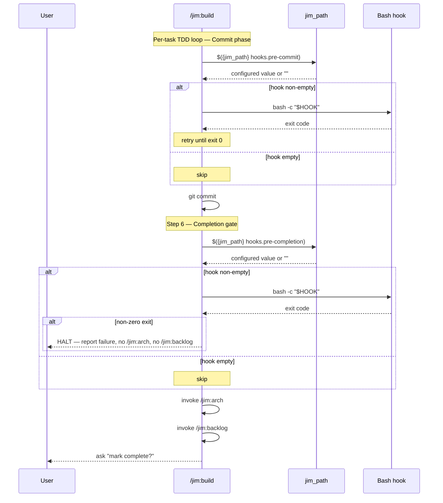

# 015 Configurable build hooks (pre-commit and pre-completion) — Plan

## Overview

Add two `string`-typed schema keys (`hooks.pre-commit`, `hooks.pre-completion`) under a new `hooks.*` namespace, then rewire `/jim:build`'s Commit phase and step 6 (Completion gate) to invoke the resolved values via Bash with a skip-if-empty idiom. The five additional touch sites (`agents/coder.md`, `WORKFLOW.md`, `skills/debug/SKILL.md`, `ARCHITECTURE.md`'s Security Considerations) update in parallel.

## Design Decisions

### 1. Bash invocation idiom for skip-if-empty

- **Chosen:** Two-line idiom in skill prose — `HOOK="$({jim_path} hooks.pre-commit)"` then `if [ -n "$HOOK" ]; then bash -c "$HOOK"; fi`. The `{jim_path}` placeholder substitutes to `jim_path --root='<abs>'` per `skills/_shared/resolve-paths.md:47-56`. `bin/jim_path:183-188` prints `printf '%s\n' "$value"` — empty configured value yields a single newline, which `$()` strips, so `[ -n "$HOOK" ]` is the disabled-check.
- **Why:** Spec 015 introduces the first live `$({jim_path} <key>)` invocations; this idiom becomes the canonical pattern other skills will mirror. The if-form is more readable in skill prose than a `&&`-chain one-liner. `bash -c "$HOOK"` over `eval` so the hook runs in a subshell and can't mutate the agent's shell environment.
- **Rejected:** `eval "$HOOK"` — runs in current shell, leaks env-var changes upstream. `[ -n "$HOOK" ] && bash -c "$HOOK"` one-liner — slightly less obvious that the empty branch is a no-op, harder to extend if future hooks need pre/post logging.

### 2. ARCHITECTURE.md update is an explicit task, not a `/jim:arch` differential outcome

- **Chosen:** Task 8 directly edits `ARCHITECTURE.md`'s Security Considerations to name `.jim/config.md` as a shell-execution authority. The build's completion-gate `/jim:arch` invocation then differentially verifies consistency.
- **Why:** Spec criterion 6 requires the security note to land. Trusting `/jim:arch` to infer the security implication from a schema-diff alone is non-deterministic — the architect agent may add it, may phrase it differently, or may miss it entirely. Pre-emptive edit makes the criterion observable in this plan, then `/jim:arch` is a verification pass rather than an authoring pass.
- **Rejected:** Trust `/jim:arch` to author the change — non-deterministic. Defer the architecture update to a follow-on spec — defeats criterion 6's intent.

### 3. WORKFLOW.md and skills/debug/SKILL.md updates are scoped to the build path's gate description and debug's Scope Discipline bullet

- **Chosen:** WORKFLOW.md L400 changes from `**Gate:** All tests pass. \`./pre-commit.sh\` is green.` to `**Gate:** All tests pass. The configured \`hooks.pre-commit\` is green, when set.` debug/SKILL.md L81 generalizes to `Does NOT execute tests beyond what is needed to confirm reproduction` (literal `./pre-commit.sh` example removed entirely — the bullet's intent doesn't depend on the specific script name).
- **Why:** Both bullets carry intent that survives the literal removal; the literal was always incidental. WORKFLOW.md keeps the empty-default semantics visible via "when set." debug/SKILL.md's intent (no side-effecting tests during diagnosis) is preserved without naming any specific script.
- **Rejected:** Replacing debug's literal with `the configured pre-commit hook` — adds tokens for no benefit. The bullet describes debug's posture, not build's hook flow.

### 4. Verify-command form: literal-absence + placeholder-presence + jim_path resolution

- **Chosen:** Each prose-edit task verifies via `! grep -q '\\./pre-commit\\.sh' <file>` (literal absent) plus `grep -q '<expected substitute>' <file>` (replacement present). Schema-add task chains `jim_path` invocations with `&&` so any non-zero exit (malformed config, schema-read failure) propagates to verify failure; the captured output is then checked against the empty-string default.
- **Why:** Jim has no automated test framework; verify commands are observable shell signals. Grep-based verifies match `/jim:meta-test`'s static-audit posture (`skills/meta-test/SKILL.md:201-242`) and exercise the same predicates the meta-test will check. The `&&`-chained jim_path verify enforces the same fail-loud posture as the production idiom (Decision 5) — `output="$(jim_path hooks.pre-commit)"`'s exit code is jim_path's exit code, so a chained `&&` propagates failures correctly.
- **Rejected:** Manual "run `/jim:meta-test` and read output" — not shell-executable, fails DoD. Fixture-based test battery for `.jim/config.md` configurations — duplicates `bin/jim_path`'s existing verify battery (013-jim-path-helper plan Task 2); this spec's surface is the schema additions and skill prose, not the helper's parser. Inline `[ "$(jim_path hooks.X)" = "" ]` form (initial draft) — fail-open: jim_path failure produces empty output and the equality test spuriously passes; rejected after security review Finding 5.

### 5. Fail-loud posture for `$({jim_path} <key>)` Bash compositions

- **Chosen:** Every Bash composition that reads a config value via `$({jim_path} <key>)` captures the helper's exit code and halts on non-zero. The hook idiom uses the form `HOOK="$({jim_path} hooks.X)" || { echo "jim_path failed; aborting" >&2; exit 1; }; [ -n "$HOOK" ] && bash -c "$HOOK"`. Verify commands chain assignments with `&&` to propagate jim_path failures into verify failures.
- **Why:** Spec 015 introduces the first live consumers of `$({jim_path} <key>)` substitution; downstream skills will mirror the pattern, so the discipline set here propagates. Without explicit exit-code capture, `$()` silently swallows jim_path failures (malformed `.jim/config.md`, schema-read failure, plugin-root plausibility check failure per `bin/jim_path:22-27`, `command not found` if the plugin is unloaded mid-build), `$HOOK` becomes empty, and the `[ -n "$HOOK" ]` guard short-circuits — a hook that the user *thinks* is configured silently disables. From a tampering perspective: a corrupted `.jim/config.md` would silently disable the pre-commit gate, allowing commits to proceed without quality enforcement. Fail-loud preserves the security signal.
- **Rejected:** Inline `$()` capture without exit-code check — fail-open posture, security anti-pattern, propagates to mirror skills. `set -e` at the top of each Bash invocation — possible but brittle; doesn't compose cleanly with the `[ -n "$HOOK" ]` guard, and changes the semantics of every line in the Bash block. Capturing jim_path's exit code in a separate variable then checking — more verbose without functional gain; the `||` chain gives the same fail-loud behavior in two lines.

## Constitution Check

**`ARCHITECTURE.md` status:** Present — constraints noted below.

| Constraint from `ARCHITECTURE.md` | Honored? | Notes |
| :--- | :--- | :--- |
| Schema is the authority — new keys flow through `skills/_shared/config-schema.md` (L168, L237) | Yes | Tasks 1–2 add keys + section to the schema; no out-of-band declarations |
| Resolve-before-tool-call — placeholders never flow into tool calls unresolved (L237) | Yes | Tasks 3–4 use `$({jim_path} hooks.*)` Bash form per the documented pattern |
| Schema format constraint — single-line scalars, no anchors/aliases (L237, schema L110-121) | Yes | New keys use `string` type with quoted empty-string default `""` matching `specs.id-prefix` precedent |
| `_shared/` is plugin contract, not overlayable (L170, L292) | Yes | Schema additions to `skills/_shared/config-schema.md`; not introducing overlays |
| Plugin Conventions — Bash uses `$({jim_path} <key>)` form for cd-safe path resolution (L286-289) | Yes | Tasks 3–4 follow this pattern; Task 9 verifies it |
| SKILL.md ≤ 500 lines (L280) | Yes | `skills/build/SKILL.md` is currently 119 lines; tasks 3–4 add ~10 lines |
| Agent body ≤ 800 tokens (L281) | Yes | `agents/coder.md` change is one-line edit |
| Anti-patterns: no Personality Soup, no Permission Creep, no Instruction Shadowing, no Duplicate Logic (L296-302) | Yes | Hook documentation lives in one place (the schema); skill bodies reference the keys |

## File Manifest

| Component | File Path | Action | Notes |
| :--- | :--- | :--- | :--- |
| Schema (frontmatter) | `skills/_shared/config-schema.md` | Update | Append two `keys:` entries between `workflow.require-plan-approval` and the `---` close (L46) |
| Schema (body) | `skills/_shared/config-schema.md` | Update | Append "Hook keys" section after Workflow gate keys section (after L88), before Derived Placeholders (L90) |
| Build skill — Commit phase | `skills/build/SKILL.md` | Update | Replace L73's `./pre-commit.sh` literal with the fail-loud + skip-if-empty idiom (Decision 5) |
| Build skill — Completion gate | `skills/build/SKILL.md` | Update | Prepend a new step 1 in the section 6 numbered list at L99-102 using the fail-loud + skip-if-empty idiom; renumber existing steps to 2–5 |
| Coder agent | `agents/coder.md` | Update | L82 — generalize `./pre-commit.sh` reference to "the configured pre-commit hook" |
| Workflow doc | `WORKFLOW.md` | Update | L400 — rephrase the build gate description |
| Debug skill | `skills/debug/SKILL.md` | Update | L81 — remove `./pre-commit.sh` literal example; preserve bullet intent |
| Architecture doc | `ARCHITECTURE.md` | Update | Security Considerations section (L232-239) — add `.jim/config.md` as a shell-execution authority alongside path-tampering mitigations |

No files created. No files deleted.

## Interface Contracts

### Schema additions — frontmatter `keys:` entries

Append to `skills/_shared/config-schema.md` frontmatter (between `workflow.require-plan-approval` at L45-47 and the closing `---` at L48):

```yaml
  - name: hooks.pre-commit
    default: ""
    type: string
  - name: hooks.pre-completion
    default: ""
    type: string
```

Indentation matches existing entries (two-space sequence indent, four-space mapping field indent). `default: ""` quoting matches `specs.id-prefix` precedent (L36-38).

### Schema additions — Hook keys section

Append after `## Workflow gate keys` section (after L88, before `## Derived Placeholders` at L90):

```markdown
### Hook keys

| Key | Default | Type | Purpose |
| :--- | :--- | :--- | :--- |
| `hooks.pre-commit` | `""` | string | Shell command run before each commit in `/jim:build`'s TDD loop. Empty disables. |
| `hooks.pre-completion` | `""` | string | Shell command run at the start of `/jim:build`'s completion gate, before `/jim:arch` and `/jim:backlog`. Empty disables. |

**Empty-default posture.** Both hooks default to the empty string. An empty value disables the hook entirely — `/jim:build` skips the corresponding step without error. The empty default provides no automated quality signal; projects opt in by configuring a value in `.jim/config.md`.

**Embedded-quote limitation.** `bin/jim_path` strips only the outermost `"..."` from a configured value. Complex shell logic with pipes or nested quotes (e.g., `bash -c "a && b | c"`) does not survive round-trip through the YAML parser. Package complex commands as a script file (e.g., `./ci.sh`) and configure the script path as the hook value: `hooks.pre-completion: ./ci.sh`.

**Trust model.** `hooks.*` values are arbitrary shell commands executed by Bash with the invoking user's privileges. `.jim/config.md` is therefore a shell-execution authority equivalent to a committed script file. The schema's `string` type rule ("any string accepted") defers all validation to the user. PR reviewers must scrutinize `hooks.*` changes the same way they scrutinize script-file content — a one-line config change can introduce arbitrary code execution on next `/jim:build` invocation.

**Agent-context exposure.** Hook stdout and stderr are captured into the agent's conversation context via the Bash tool. Avoid hook commands that echo untrusted file contents, environment variables, or other attacker-controllable bytes — those bytes flow into the agent's subsequent decisions during the same `/jim:build` invocation, including the `/jim:arch` and `/jim:backlog` differential updates that fire immediately after `hooks.pre-completion`.
```

### Build skill — Commit phase rewrite

Current `skills/build/SKILL.md:72-76`:

```markdown
**Commit**
- Run `./pre-commit.sh` via Bash before committing. If it fails: show the error output, fix the issues, re-run all tests, and re-run `./pre-commit.sh` until it passes. Do NOT commit until `./pre-commit.sh` is green.
- Follow Tidy First: one commit per logical unit, structural OR behavioral, never mixed.
- Use conventional prefixes: `test:` (Red), `feat:` / `fix:` (Green), `refactor:` (Tidy).
- First check `.jim/skills/build/references/tdd-guide.md` — if it exists, use it instead of the built-in. See `references/tdd-guide.md` — Commit Discipline section.
```

Target:

````markdown
**Commit**
- Resolve `hooks.pre-commit` via Bash before committing:

  ```bash
  HOOK="$({jim_path} hooks.pre-commit)" || { echo "jim_path failed; aborting commit" >&2; exit 1; }
  [ -n "$HOOK" ] && bash -c "$HOOK"
  ```

  If `jim_path` itself exits non-zero (malformed config, schema-read failure, plugin not loaded), abort the commit and surface the error — fail-loud, not silent-skip. If the configured hook exits non-zero: show the error output, fix the issues, re-run all tests, and re-run the hook until it passes. Do NOT commit until the hook is green. If `hooks.pre-commit` is empty (default), the second line's `[ -n "$HOOK" ]` guard short-circuits and the build proceeds directly to commit.
- Follow Tidy First: one commit per logical unit, structural OR behavioral, never mixed.
- Use conventional prefixes: `test:` (Red), `feat:` / `fix:` (Green), `refactor:` (Tidy).
- First check `.jim/skills/build/references/tdd-guide.md` — if it exists, use it instead of the built-in. See `references/tdd-guide.md` — Commit Discipline section.
````

### Build skill — Completion gate rewrite

Current `skills/build/SKILL.md:95-103`:

```markdown
### 6. Completion gate

After all tasks are marked `[x]`:

1. Check if `{path.architecture}` exists. If it does, invoke `/jim:arch` to run a differential update — the architect will scan the codebase, compare against the existing document, and present any changes for your approval. If it does not exist, skip this step.
2. Check if `{path.backlog}` exists. If it does, invoke `/jim:backlog` to regenerate it — the PM will scan for deferred work, consolidate items, and present the updated backlog for your approval. If it does not exist, skip this step.
3. Report to the user and ask: "Should I mark the plan status as `complete`?"
4. STOP. Wait for the human to confirm. Do not proceed to the next SDLC phase, do not auto-invoke review. Update the plan frontmatter to `status: complete` only after explicit confirmation.
```

Target:

````markdown
### 6. Completion gate

After all tasks are marked `[x]`:

1. Resolve `hooks.pre-completion` via Bash:

   ```bash
   HOOK="$({jim_path} hooks.pre-completion)" || { echo "jim_path failed; aborting completion gate" >&2; exit 1; }
   [ -n "$HOOK" ] && bash -c "$HOOK"
   ```

   If `jim_path` itself exits non-zero (malformed config, schema-read failure, plugin not loaded), STOP the completion gate immediately and surface the error — fail-loud, not silent-skip. If the configured hook exits non-zero: STOP the completion gate immediately. Report the failure output. Do NOT invoke `/jim:arch`, do NOT invoke `/jim:backlog`, do NOT prompt for plan completion. The user can re-invoke `/jim:build` to retry — step 6 re-enters because all tasks are already `[x]`. If `hooks.pre-completion` is empty (default), the second line's `[ -n "$HOOK" ]` guard short-circuits and the gate proceeds.
2. Check if `{path.architecture}` exists. If it does, invoke `/jim:arch` to run a differential update — the architect will scan the codebase, compare against the existing document, and present any changes for your approval. If it does not exist, skip this step.
3. Check if `{path.backlog}` exists. If it does, invoke `/jim:backlog` to regenerate it — the PM will scan for deferred work, consolidate items, and present the updated backlog for your approval. If it does not exist, skip this step.
4. Report to the user and ask: "Should I mark the plan status as `complete`?"
5. STOP. Wait for the human to confirm. Do not proceed to the next SDLC phase, do not auto-invoke review. Update the plan frontmatter to `status: complete` only after explicit confirmation.
````

### Coder agent — Constraints rewrite

Current `agents/coder.md:82`:

```markdown
- No next-phase auto-invocation — STOP after all tasks and `./pre-commit.sh`; the human decides what is next.
```

Target:

```markdown
- No next-phase auto-invocation — STOP after all tasks and the configured pre-commit hook; the human decides what is next.
```

### WORKFLOW.md gate rewrite

Current `WORKFLOW.md:400`:

```markdown
**Gate:** All tests pass. `./pre-commit.sh` is green.
```

Target:

```markdown
**Gate:** All tests pass. The configured `hooks.pre-commit` is green, when set.
```

### Debug skill — Scope Discipline rewrite

Current `skills/debug/SKILL.md:81`:

```markdown
- Does NOT run `./pre-commit.sh` or execute tests beyond what is needed to confirm reproduction.
```

Target:

```markdown
- Does NOT execute tests beyond what is needed to confirm reproduction.
```

### ARCHITECTURE.md — Security Considerations addendum

Within the existing Security Considerations section (`ARCHITECTURE.md:232-239`), append to the "Security-relevant files" paragraph (after the existing schema-invariants prose) a new sentence covering shell-execution authority. The exact insertion follows the existing prose style — no heading change, no restructure. The added prose names `.jim/config.md` as a shell-execution authority via the new `hooks.*` keys, references the trust model documented in the schema's Hook keys section, and notes that PR-review scrutiny applies.

## Data Flow



## Task Breakdown

1. [x] Add `hooks.pre-commit` and `hooks.pre-completion` entries to `skills/_shared/config-schema.md` frontmatter `keys:` list, between the existing `workflow.require-plan-approval` entry and the closing `---`. Match existing two-space indent and `default: ""` quoting (`specs.id-prefix` precedent at schema L36-38).
   **Verify:** `output="$(jim_path hooks.pre-commit)" && [ "$output" = "" ] && output="$(jim_path hooks.pre-completion)" && [ "$output" = "" ]`

2. [x] Add the "Hook keys" section to `skills/_shared/config-schema.md` body, between `## Workflow gate keys` (L82-88) and `## Derived Placeholders` (L90). Include all four documentation paragraphs from Interface Contracts: Empty-default posture, Embedded-quote limitation, Trust model, Agent-context exposure. Include the per-key purpose table.
   **Verify:** `grep -q '^### Hook keys' skills/_shared/config-schema.md && grep -q 'shell-execution authority' skills/_shared/config-schema.md && grep -q 'embedded-quote' skills/_shared/config-schema.md && grep -q "agent's conversation context" skills/_shared/config-schema.md && grep -q 'empty default' skills/_shared/config-schema.md`

3. [x] Replace the Commit-phase bullet in `skills/build/SKILL.md` (L72-76) with the fail-loud + skip-if-empty idiom from Interface Contracts (the two-line bash block plus the failure-handling prose). Preserve the unbounded retry-until-green semantics for hook failures, Tidy First and conventional-prefix bullets, and the `references/tdd-guide.md` overlay-then-built-in reference. Depends on task 1 (schema key must exist before placeholder resolves).
   **Verify:** `! grep -q '\./pre-commit\.sh' skills/build/SKILL.md && grep -q '{jim_path} hooks.pre-commit' skills/build/SKILL.md`

4. [x] Prepend a new step 1 to `skills/build/SKILL.md` step 6 (Completion gate, L95-103) using the fail-loud + skip-if-empty idiom from Interface Contracts. Halt the gate immediately on non-zero exit from `jim_path` itself OR from the configured hook. Renumber the existing steps to 2–5 (arch invocation, backlog invocation, mark-complete prompt, STOP). Depends on task 1.
   **Verify:** `grep -q '{jim_path} hooks.pre-completion' skills/build/SKILL.md && [ "$(grep -n 'hooks\.pre-completion' skills/build/SKILL.md | head -1 | cut -d: -f1)" -lt "$(grep -n '/jim:arch' skills/build/SKILL.md | head -1 | cut -d: -f1)" ]`

5. [x] Generalize `agents/coder.md` L82 — replace `\`./pre-commit.sh\`` with `the configured pre-commit hook`. Preserve the bullet's structural shape (leading dash, trailing semicolon clause, "the human decides what is next" tail).
   **Verify:** `! grep -q '\./pre-commit\.sh' agents/coder.md && grep -q 'configured pre-commit hook' agents/coder.md`

6. [x] Rewrite `WORKFLOW.md` L400 from `**Gate:** All tests pass. \`./pre-commit.sh\` is green.` to `**Gate:** All tests pass. The configured \`hooks.pre-commit\` is green, when set.`
   **Verify:** `! grep -q '\./pre-commit\.sh' WORKFLOW.md && grep -q 'configured \`hooks.pre-commit\` is green' WORKFLOW.md`

7. [x] Generalize `skills/debug/SKILL.md` L81 — remove the `\`./pre-commit.sh\` or` literal segment. Preserve the bullet's intent: debug runs no side-effecting tests beyond minimum reproduction. New text: `- Does NOT execute tests beyond what is needed to confirm reproduction.`
   **Verify:** `! grep -q '\./pre-commit\.sh' skills/debug/SKILL.md && grep -q 'NOT execute tests beyond' skills/debug/SKILL.md`

8. [ ] Update `ARCHITECTURE.md` Security Considerations (L232-239) to name `.jim/config.md` as a shell-execution authority via `hooks.*` keys. Append to the existing Security-relevant files paragraph; do not restructure the section. Cross-reference the schema's Hook keys section. Depends on task 2 (schema section must exist before architecture references it).
   **Verify:** `awk '/## Security Considerations/,/^## /' ARCHITECTURE.md | grep -q 'shell-execution authority' && awk '/## Security Considerations/,/^## /' ARCHITECTURE.md | grep -q 'hooks\.'`

9. [ ] Final meta-test invariant sweep across all touched files. Verify that `skills/build/SKILL.md` retains its step-1 preamble reference (Check 1), the Bash blocks use `$({jim_path} hooks.*)` form (Check 4), and no literal `./pre-commit.sh` survives in the audit surface (skills/, agents/). Depends on tasks 1–8.
   **Verify:** `grep -q 'skills/_shared/resolve-paths.md' skills/build/SKILL.md && grep -qE '\$\(\{jim_path\} hooks\.(pre-commit|pre-completion)\)' skills/build/SKILL.md && ! grep -rq '\./pre-commit\.sh' skills/ agents/`

## Requirements Coverage Summary

| Spec Acceptance Criterion | Addressed In Task(s) |
| :--- | :--- |
| Schema declares `hooks.pre-commit` and `hooks.pre-completion` (string, default `""`) | 1 |
| "Hook keys" section documents purpose, when-fires, empty-disabled posture | 2 |
| Hook keys section documents embedded-quote limitation | 2 |
| Hook keys section documents trust model (shell-execution authority, PR-review parity) | 2 |
| Hook keys section documents agent-context exposure | 2 |
| ARCHITECTURE.md reflects new shell-execution surface | 8 |
| Build Commit phase invokes resolved `hooks.pre-commit` placeholder; no literal `./pre-commit.sh` | 3 |
| Build step 6 prepends pre-completion hook before `/jim:arch` | 4 |
| `agents/coder.md` Constraints generalized | 5 |
| `WORKFLOW.md` rephrased; literal removed | 6 |
| `skills/debug/SKILL.md` L81 generalized or literal removed | 7 |
| Empty `hooks.pre-commit` skips Commit hook step (no error) | 3 (skip-if-empty idiom) |
| Non-empty `hooks.pre-commit` runs and retries until pass (unbounded) | 3 (prose preserves retry semantics) |
| Empty `hooks.pre-completion` skips step 6 hook (no error) | 4 (skip-if-empty idiom) |
| Non-empty `hooks.pre-completion` runs; non-zero exit halts gate (no arch, no backlog, no mark-complete prompt) | 4 (halt prose) |
| Multi-token commands work via existing schema string-quoting rules | 2 (Hook keys docs cover this); jim_path L160-162 already supports it |
| `/jim:meta-test` audit passes — placeholders resolved, no literal default leaks | 9 |

## Out of Scope

Items beyond what spec.md already excludes:

- Automated test fixtures for `/jim:build` hook invocation behavior. Jim has no automated test framework; runtime-behavioral correctness is verified via grep-based static asserts (tasks 3–7) plus `/jim:meta-test` (task 9). Behavioral verification in the wild happens on the next `/jim:build` invocation.
- A `bin/jim_path` change to support multi-line or unrestricted-quote string values. Embedded-quote handling is documented in the schema's Hook keys section as a usage limitation (script-file workaround); modifying the parser is a separate concern.
- A migration script to rename existing `./pre-commit.sh` references in user projects to `hooks.pre-commit`. Per spec Out of Scope: users restore prior behavior by configuring `hooks.pre-commit: "./pre-commit.sh"` in `.jim/config.md`.
- A `/jim:config` scaffolding update to prompt for `hooks.*` values during config initialization. Surfaced in security review Finding 4 as a follow-on concern; out of scope for 015 itself.

## Open Questions

None — all design decisions resolved.
