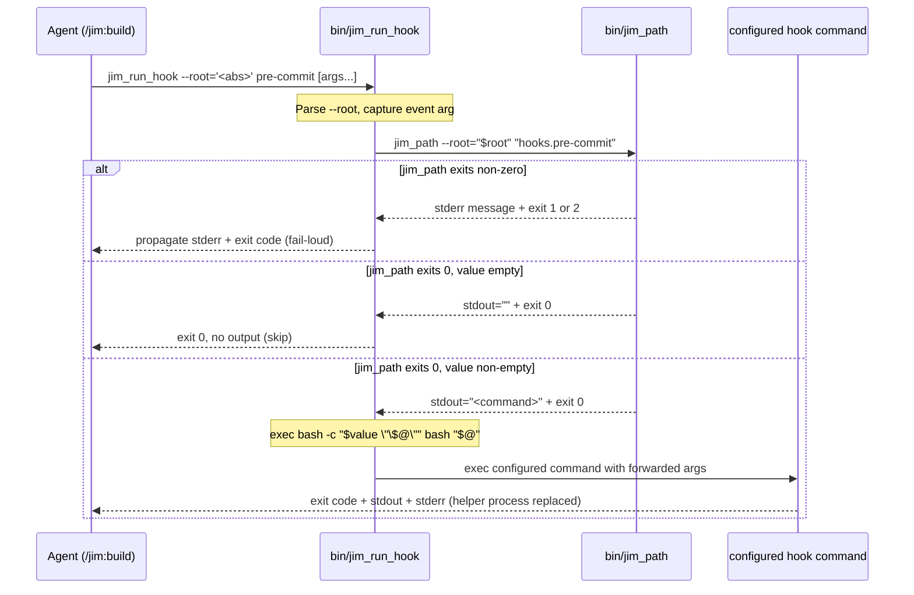

# 016 bin/jim_run_hook — single-call hook dispatcher — Plan

## Overview

Create `bin/jim_run_hook` as a bash helper parallel to `bin/jim_path` that resolves a `hooks.<event>` key via `jim_path` and execs the configured value through `bash -c` with positional args forwarded; introduce the `{jim_run_hook}` derived placeholder; and replace the multi-line bash-idiom blocks in `skills/build/SKILL.md` with single-line helper invocations. ARCHITECTURE.md gains parallel entries naming the helper as load-bearing for the spec 015 shell-execution-authority trust model.

## Design Decisions

### 1. Helper exec form — `exec bash -c "$value \"\$@\"" bash "$@"`

- **Chosen:** On non-empty configured value, `exec bash -c "$value \"\$@\"" bash "$@"`. Outer `"..."` lets bash assemble the first `bash -c` argument as `<configured-value> "$@"` (literal `"$@"` text), which the inner bash then parses as shell code. Forwarded positional args flow via `bash "$@"` becoming `$0=bash` and `$1..$n` for the inner bash.
- **Why:** Spec 015's embedded-quote note explicitly relies on `bash -c` semantics for complex shell logic (pipes, `&&`, redirects). The fork-replace via `exec` propagates the configured command's exit code as the helper's own exit code with no PID intermediation. The configured value is by trust model arbitrary shell code (security finding F1 explicitly distinguishes value-content trust from CLI-arg trust), so it is not double-quoted at assembly time — that would defeat shell parsing.
- **Rejected:** `eval "$value \"\$@\""` — runs in the helper's current shell rather than fork-replacing; arg-forwarding quoting is more fragile under eval. `exec $value "$@"` (direct exec) — drops shell metacharacter support; configured value would have to be a single executable path, breaking spec 015's documented `make test` / `bash -c "a && b"` use cases. Two-Bash-call form (already considered upstream) — defeats the spec's premise of single-call invocation.

### 2. Helper-internal arg quoting discipline (security F1)

- **Chosen:** All caller-provided args (`--root` value, `<event>` positional) are double-quoted when passed to subprocesses. The helper's invocation of `jim_path` is exactly `jim_path --root="$root" "hooks.$event"`.
- **Why:** Spec AC L32 (added by security F1 routing) makes this a hard requirement. Without quoting, shell metacharacters in `<event>` execute *before* `jim_path`'s schema-driven allowlist runs — bypassing the validation that interview Q2 designated as the single source of truth. Double-quoting is the standard shell idiom and is already enforced by `set -u` (helper inherits `set -euo pipefail` from the jim_path template).
- **Rejected:** Whitelist-validate `<event>` against `[a-z-]+` regex before passing — duplicates schema validation in two places (anti-pattern per ARCHITECTURE Duplicate Logic and interview Q2). Pass `<event>` as `--key=hooks.$event` — same quoting concern, no benefit.

### 3. Skip plugin-root plausibility re-check

- **Chosen:** The helper does NOT replicate `bin/jim_path:7-27`'s symlink-resolution and `plugin.json` plausibility check. Its only IO is the `jim_path` invocation; if the plugin is misinstalled, `jim_path` exits 1 with `not a jim plugin install` and the helper's fail-loud propagates that.
- **Why:** Duplicating the check adds ~20 lines (including the portable readlink loop) and a second filesystem traversal for zero functional gain — the protection is transitive. Helper stays minimal, which matches the spec's "short and readable" mitigation for the audit-transparency tradeoff acknowledged in interview.
- **Rejected:** Re-implement the check inline — premature defensive coding; jim_path is the single point of plausibility enforcement.

### 4. `--root` defaulting — mirror jim_path's `$PWD` fallback

- **Chosen:** When `--root` is omitted, default to `$PWD` (matches `bin/jim_path:31`). Skill prose always provides `--root` via the `{jim_run_hook}` substitution, so the default is a defensive fallback for ad-hoc CLI invocations (debugging, `dogfood` scripts).
- **Why:** Surface symmetry with `jim_path` reduces cognitive load. Skill prose discipline (always-substitute the `{jim_run_hook}` placeholder) is enforced by `/jim:meta-test`, not by the helper's CLI.
- **Rejected:** Require `--root` (exit non-zero if absent) — breaks ad-hoc invocations and adds no security value (jim_path's `$PWD` fallback is the same posture).

### 5. Empty-value detection idiom — `[ -z "$value" ]` after `value=$(jim_path ...)`

- **Chosen:** Capture jim_path's stdout into `$value`; check `[ -z "$value" ]` for the skip condition. `printf '%s\n'` in `bin/jim_path:185-188` always emits a trailing newline; `$()` strips it. An empty configured value (or empty schema default) yields `$value=""` cleanly.
- **Why:** Matches the round-trip semantics already proven by `bin/jim_path` (verified in spec 013's verify battery). Helper does not need to distinguish "configured value is empty string" from "schema default is empty string" — both should skip identically per spec AC L34.
- **Rejected:** Length-counting via `wc -c` — fragile across newline conventions. `[ -n "$value" ]` and inverted branching — readable but matches the canonical jim idiom less directly.

### 6. Exit-code propagation — pass through unchanged

- **Chosen:** On jim_path failure, helper inherits jim_path's exit code (1 or 2) via the assignment-with-`||` idiom. On successful exec, the configured command's exit code becomes the helper's exit code via `exec`'s PID replacement.
- **Why:** Preserves spec 015 Decision 5's fail-loud posture without introducing a translation layer. Security finding F3 (sysexits-style disambiguation) is explicitly routed to backlog, not to this spec — adding it here would expand scope.
- **Rejected:** Sysexits ranges (70 EX_SOFTWARE, 78 EX_CONFIG) — F3 hardening, deferred. Always exit 0 on jim_path failure (silent skip) — defeats spec 015 Decision 5; security-critical regression.

### 7. ARCHITECTURE.md updates as explicit tasks, not `/jim:arch` differential outcomes

- **Chosen:** Tasks 7, 8, 9 directly edit ARCHITECTURE.md's Plugin Executables, Configuration-and-Overlay, and Security Considerations sections. The build's completion-gate `/jim:arch` invocation then differentially verifies consistency.
- **Why:** Three spec ACs (L41, L42 = security F2) require specific ARCHITECTURE updates; trusting `/jim:arch` to infer all three from the schema/skill diff is non-deterministic. Pre-emptive edits make the criteria observable in this plan; `/jim:arch` becomes verification, not authoring. This mirrors spec 015's Decision 2 (already an established pattern).
- **Rejected:** Trust `/jim:arch` to author the changes — non-deterministic, especially for the Security Considerations paragraph wording. Defer the architecture updates to a follow-on spec — defeats spec ACs L40-L42.

### 8. Failure-mode discrimination via `jim_path:` stderr prefix (security F5)

- **Chosen:** Task 4's Commit-phase prose distinguishes two failure modes by stderr-prefix detection: (a) stderr starts with `jim_path:` → resolution failure (helper exit 1 or 2 from jim_path), STOP, do not commit, do not retry — this is a `.jim/config.md` problem; (b) stderr without the `jim_path:` prefix → hook execution failure, standard retry-until-green loop. `bin/jim_path:25,37,46,53,61,67,113,117,124,136,171` consistently prefix every stderr message with `jim_path: `, so the discriminator is reliable.
- **Why:** Spec 015 Decision 5 established fail-loud as a security signal — a corrupted `.jim/config.md` should HALT the build, not silently disable. The helper preserves fail-loud at the *exit-code* layer (Decision 6), but the skill prose translates exit codes into agent behavior. Without explicit failure-mode discrimination, the agent's retry-until-green loop would mask jim_path failures by repeatedly re-running the hook (which keeps failing the same way), burying the underlying config issue and burning iteration cycles. Security review F5 surfaced this as a Notable plan-level finding; this decision routes the amendment.
- **Rejected:** Single retry-until-green loop for all non-zero exits — masks jim_path failures (F5 root cause). Single STOP for all non-zero exits — defeats the recoverable retry-until-green semantics that hook-failure debugging needs. Discriminate by exit code (1/2 = jim_path; other = hook) — fragile because hooks can legitimately exit 1 or 2 (`jq`, `shellcheck`); F3 sysexits-style disambiguation would fix this but is backlog-deferred. Stderr-prefix is the most reliable available signal.

## Constitution Check

**`ARCHITECTURE.md` status:** Present — constraints noted below.

| Constraint from `ARCHITECTURE.md` | Honored? | Notes |
| :--- | :--- | :--- |
| Schema is the authority — `hooks.<event>` validation flows through `jim_path` (`L237`, `L170`) | Yes | Decision 2 trusts jim_path's schema lookup; helper does no parallel validation |
| Plugin Executables convention — `bin/` PATH discovery, no library deps, fail-loud stderr (`L172-180`) | Yes | Helper is bash, depends only on jim_path + POSIX builtins; matches jim_path conventions |
| Resolve-before-tool-call — placeholders never flow into tool calls unresolved (`L237`) | Yes | New `{jim_run_hook}` placeholder follows the documented multi-token derived-placeholder pattern (Task 3) |
| `_shared/` is plugin contract, not overlayable (`L170`, `L292`) | Yes | Tasks 3-4 update `skills/_shared/` files in-place; not introducing overlays |
| `{jim_path}` multi-token expansion pattern documented as reusable (`resolve-paths.md:56`) | Yes | `{jim_run_hook}` is the first follow-on use; mirrors the source/expansion-form/quoting/halt structure exactly |
| SKILL.md ≤ 500 lines (`L280`) | Yes | `skills/build/SKILL.md` is currently 134 lines; tasks 5-6 SHRINK it (multi-line block → one-liner) |
| Plugin Conventions — Bash uses `$({jim_path} <key>)` form for cd-safe path resolution (`L286-289`) | Yes | New `{jim_run_hook}` placeholder maintains the same cd-safety via `--root='<abs>'` injection |
| Anti-patterns: no Personality Soup, no Permission Creep, no Instruction Shadowing, no Duplicate Logic (`L296-302`) | Yes | Helper has no persona, no extra permissions, no shadowed instructions; allowlist lives only in schema (Decision 2) |
| Shell-execution authority documented in Security Considerations (`L237`, added by spec 015) | Yes | Task 9 explicitly extends the paragraph to name the helper as load-bearing alongside jim_path (security F2) |

## File Manifest

| Component | File Path | Action | Notes |
| :--- | :--- | :--- | :--- |
| Helper | `bin/jim_run_hook` | Create | Bash script implementing Contract A |
| Preamble | `skills/_shared/resolve-paths.md` | Update | Add `{jim_run_hook}` to Step 4's derived-placeholder section, mirroring the existing `{jim_path}` paragraph (L47-57) |
| Schema docs | `skills/_shared/config-schema.md` | Update | (a) Add `{jim_run_hook}` row to Derived Placeholders table (L115-117); (b) Add one-line note to Hook keys section (L96-109) pointing to the helper as canonical invoker |
| Build skill — Commit phase | `skills/build/SKILL.md` | Update | Replace L72-78 bash idiom with single-line `{jim_run_hook} pre-commit` invocation; remove fail-loud + skip-if-empty paragraph |
| Build skill — Completion gate | `skills/build/SKILL.md` | Update | Replace L106-111 bash idiom with single-line `{jim_run_hook} pre-completion` invocation; remove paragraph |
| Architecture — Plugin Executables | `ARCHITECTURE.md` | Update | Add `bin/jim_run_hook` entry parallel to `bin/jim_path` (after L180) |
| Architecture — Configuration & Overlay | `ARCHITECTURE.md` | Update | Rewrite "Build hooks" bullet (L291) to describe the helper as the dispatcher |
| Architecture — Security Considerations | `ARCHITECTURE.md` | Update | Extend Shell-execution authority paragraph (L237) to name `bin/jim_run_hook` alongside `bin/jim_path` (security F2) |

No files deleted.

## Interface Contracts

### Contract A — `jim_run_hook` CLI

- **Signature:** `jim_run_hook [--root <abs-path>] [--root=<abs-path>] <event> [args...]`
- **Stdin:** not consumed.
- **Stdout:** passes through the configured command's stdout. Empty (no output) when configured value is the empty string.
- **Stderr:** passes through jim_path's stderr on jim_path failure; passes through the configured command's stderr otherwise.
- **Exit codes:**
  - `0` — empty configured value (skip) OR successful execution of a hook command that itself exits 0.
  - `1` or `2` — propagated from jim_path on resolution failure (`1` = malformed/cannot-read; `2` = unknown key).
  - Any other code — propagated unchanged from the configured hook command.
- **Cwd safety:** When `--root='<abs>'` is supplied, the helper resolves correctly regardless of the invoking shell's CWD. Without `--root`, defaults to `$PWD` (mirrors `bin/jim_path:31`).

### Contract B — Internal `jim_path` invocation

- Helper invokes exactly: `value="$(jim_path --root="$root" "hooks.$event")"` followed by `|| exit $?` to propagate failure.
- All caller-provided args (`$root`, `$event`) are double-quoted at expansion (security F1).
- Helper performs NO validation of `<event>` against an allowlist; jim_path's schema lookup is the single source of truth.

### Contract C — Exec form on non-empty value

- Helper invokes exactly: `exec bash -c "$value \"\$@\"" bash "$@"`.
- Configured value is interpreted as shell code by the inner `bash -c` (supports pipes, `&&`, redirects per spec 015's embedded-quote note).
- Forwarded positional args become `$1..$n` inside the inner bash via `"$@"`.
- `exec` replaces the helper process; configured command's exit code becomes the helper's exit code.

### Contract D — Derived placeholder `{jim_run_hook}`

- **Substitution form:** `jim_run_hook --root='<absolute-project-root>'` (multi-token shell command).
- **Source:** Claude Code's session-level primary working directory (same as `{jim_path}`).
- **Quoting algorithm:** single-quote wrap with the `'\''` escape idiom — replace every embedded `'` with `'\''` and surround with single quotes.
- **Halt condition:** if the project root contains a null byte, halt via the standard config-validation error format (same as `{jim_path}`).
- **Discovery:** helper found via Claude Code's plugin `bin/` PATH convention; placeholder injects only `--root='<abs>'`, not the helper path.

## Data Flow



## Task Breakdown

1. [x] **Create `bin/jim_run_hook`** with the structure: `#!/usr/bin/env bash` shebang, `set -euo pipefail`, arg parser mirroring `bin/jim_path:29-63` (positional `<event>`, optional `--root <path>` and `--root=<path>` forms, `$PWD` default), `value="$(jim_path --root="$root" "hooks.$event")" || exit $?` for resolution (Contracts B + Decision 6), `[ -z "$value" ] && exit 0` for skip (Decision 5), `exec bash -c "$value \"\$@\"" bash "$@"` for non-empty exec (Contract C + Decision 1). All caller-provided args double-quoted (Decision 2 + security F1). `chmod +x bin/jim_run_hook` so the executable bit is committed.
   **Verify:** Run a battery from project root:
   ```
   chmod +x bin/jim_run_hook && test -x bin/jim_run_hook &&
   HELPER="$PWD/bin/jim_run_hook" &&
   export PATH="$PWD/bin:$PATH" &&
   # Case 1: empty schema default → exit 0, no output
   out="$("$HELPER" pre-commit)" && [ -z "$out" ] &&
   # Case 2: configured non-empty value runs the command
   scratch="$(mktemp -d)" && mkdir -p "$scratch/.jim" &&
   printf -- '---\nhooks.pre-commit: "echo configured"\n---\n' > "$scratch/.jim/config.md" &&
   "$HELPER" --root="$scratch" pre-commit | grep -q '^configured$' &&
   # Case 3: shell metacharacters in value (&&) propagate to bash -c
   printf -- '---\nhooks.pre-commit: "echo a && echo b"\n---\n' > "$scratch/.jim/config.md" &&
   [ "$("$HELPER" --root="$scratch" pre-commit | wc -l)" -eq 2 ] &&
   # Case 4: forwarded positional args reach the configured command
   printf -- '---\nhooks.pre-commit: "echo args:"\n---\n' > "$scratch/.jim/config.md" &&
   "$HELPER" --root="$scratch" pre-commit foo bar | grep -q 'args: foo bar' &&
   # Case 5: jim_path failure (unknown event) propagates exit code + stderr
   ( "$HELPER" --root="$scratch" bogus_event 2>&1 1>/dev/null | grep -q "unknown key" ) &&
   ( "$HELPER" --root="$scratch" bogus_event; test $? -eq 2 ) &&
   # Case 6: --root works from a subdirectory (cd-safety)
   mkdir -p "$scratch/sub" &&
   printf -- '---\nhooks.pre-commit: "echo subdir-ok"\n---\n' > "$scratch/.jim/config.md" &&
   ( cd "$scratch/sub" && "$HELPER" --root="$scratch" pre-commit | grep -q '^subdir-ok$' ) &&
   # Case 7 (security F1): metacharacter in <event> arg is NOT shell-evaluated
   canary="$scratch/canary-not-touched" &&
   ( "$HELPER" --root="$scratch" '; touch '"$canary" 2>&1 1>/dev/null | grep -q "unknown key" ) &&
   ! test -e "$canary" &&
   # Case 7b (security F1): command-substitution metacharacter in <event> arg is NOT shell-evaluated
   ( "$HELPER" --root="$scratch" '$(touch '"$canary"')' 2>&1 1>/dev/null | grep -q "unknown key" ) &&
   ! test -e "$canary" &&
   rm -rf "$scratch"
   ```

2. [x] **Update `skills/_shared/resolve-paths.md`.** Edit Step 4 (L47-57): add a `{jim_run_hook}` paragraph immediately after the existing `{jim_path}` paragraph, mirroring the four bullet structure (Source / Expansion form / Quoting algorithm / Halt). The Source bullet is identical to `{jim_path}`; the Expansion form is `jim_run_hook --root='<absolute-project-root>'`; the Quoting algorithm and Halt bullets are referenced by parity rather than re-stated. Update Step 5 (L60) so the placeholder list explicitly includes `{jim_run_hook}` alongside `{jim_path}`. The Step 4 closing paragraph (L56 — "The resolved map gains one entry...") generalizes from singular to "The resolved map gains entries for any helper that resolves to a multi-token shell command" so the precedent is explicit.
   **Verify:** `grep -q '{jim_run_hook}' skills/_shared/resolve-paths.md && grep -q "jim_run_hook --root=" skills/_shared/resolve-paths.md && [ "$(grep -c "single-quote wrap" skills/_shared/resolve-paths.md)" -ge 1 ]`

3. [x] **Update `skills/_shared/config-schema.md`.** (a) Add a `{jim_run_hook}` row to the Derived Placeholders table (after L117). The Substitution-form column reads `jim_run_hook --root='<absolute-project-root>'`; the Purpose column describes "Single-call invocation of a configured `hooks.<event>` shell command — replaces the in-prose resolve-and-exec idiom from spec 015." (b) In the Hook keys section (L96-109), add a one-line note immediately after the per-key purpose table: "**Canonical invoker.** Configured `hooks.<event>` values are dispatched by `bin/jim_run_hook` (skill prose uses the `{jim_run_hook}` derived placeholder). Per-skill in-prose composition is no longer used — see `docs/specs/jim/016-jim-run-hook-helper/spec.md`." Depends on Task 1 (helper must exist before being referenced) and Task 2 (placeholder must be defined in preamble before being documented in schema).
   **Verify:** `grep -q '{jim_run_hook}' skills/_shared/config-schema.md && grep -q 'Canonical invoker' skills/_shared/config-schema.md && grep -q 'bin/jim_run_hook' skills/_shared/config-schema.md`

4. [x] **Replace BOTH bash-idiom blocks in `skills/build/SKILL.md` — Commit phase (L72-78) AND Completion gate sub-step 1 (L106-111).** Tasks were merged because their original verify commands globally grep the file for `bash -c "$HOOK"` absence — neither could pass independently while the other's idiom remained. (a) Commit phase replacement (failure-mode discrimination per Decision 8 / security F5): "Run `{jim_run_hook} pre-commit` via Bash before committing. The helper resolves `hooks.pre-commit` from `.jim/config.md`, skips silently if unset, and runs the configured command otherwise. **Two failure modes:** (a) If stderr starts with `jim_path:` (resolution failure — malformed config, schema-read error, plugin not loaded), STOP. Do NOT commit. Surface the message to the user — this is a `.jim/config.md` problem, not a code problem. (b) If the configured hook itself exits non-zero (hook stderr without the `jim_path:` prefix): show the error output, fix the issues, re-run all tests, and re-run the hook until it passes. Do NOT commit until the hook is green." (b) Completion gate sub-step 1 replacement: "Run `{jim_run_hook} pre-completion` via Bash. The helper resolves `hooks.pre-completion`, skips silently if unset, runs the configured command otherwise, and exits non-zero on resolution or hook failure. On non-zero exit: STOP the completion gate immediately. Report the failure output. Do NOT invoke `/jim:arch`, do NOT invoke `/jim:backlog`, do NOT prompt for plan completion. The user can re-invoke `/jim:build` to retry — step 6 re-enters because all tasks are already `[x]`." Preserve all surrounding bullets (Tidy First, conventional-prefix, references/tdd-guide.md for Commit; arch/backlog/mark-complete/STOP sub-steps 2-5 for Completion gate). Depends on Tasks 1-3.
   **Verify:** `! grep -qE 'bash -c "\$HOOK"' skills/build/SKILL.md && ! grep -qE 'HOOK="\$\(\{jim_path\} hooks\.(pre-commit|pre-completion)\)"' skills/build/SKILL.md && grep -q '{jim_run_hook} pre-commit' skills/build/SKILL.md && grep -q '{jim_run_hook} pre-completion' skills/build/SKILL.md && grep -q 'Two failure modes' skills/build/SKILL.md && grep -q 'jim_path:' skills/build/SKILL.md`

5. [x] **Add `bin/jim_run_hook` entry to `ARCHITECTURE.md` Plugin Executables section (after L180).** The new entry mirrors the structure of the existing `bin/jim_path` entry: Purpose (single-call hook dispatcher; replaces in-prose idiom from 015), Location (`bin/jim_run_hook`; same plugin `bin/` PATH convention as jim_path), Interfaces (CLI signature from Contract A; exit-code semantics; stderr passthrough), Dependencies (jim_path; no library deps; POSIX bash + `printf`), Key Constraints (no schema parsing in helper; trusts jim_path allowlist; fail-loud on jim_path failure; skip-only-on-empty-value). Depends on Task 1 (so the entry's interface bullets can reference real implementation).
   **Verify:** `grep -q 'bin/jim_run_hook' ARCHITECTURE.md && awk '/### Plugin Executables/,/### Plugin Manifest/' ARCHITECTURE.md | grep -q 'bin/jim_run_hook'`

6. [x] **Update `ARCHITECTURE.md` Configuration and Overlay section's Build hooks bullet (L291).** Replace the current bullet's `$({jim_path} hooks.X)` substitution + `||`-chain prose with: "**Build hooks:** `hooks.pre-commit` and `hooks.pre-completion` (added in spec 015) configure shell commands run by `/jim:build`. Skill prose dispatches via `{jim_run_hook} <event>` (added in spec 016 — see `bin/jim_run_hook` in Plugin Executables); the helper resolves the configured value through `bin/jim_path`, skips silently on empty, exits non-zero on resolution failure, and execs the configured command on non-empty. See Security Considerations for the trust model." Depends on Task 5 (Plugin Executables entry must exist before being referenced).
   **Verify:** `[ "$(awk '/^### Configuration and Overlay/,/^### Anti-Patterns/' ARCHITECTURE.md | grep -c '\$({jim_path} hooks\.X)')" -eq 0 ] && grep -q 'Skill prose dispatches via .{jim_run_hook} <event>.' ARCHITECTURE.md`

7. [x] **Update `ARCHITECTURE.md` Security Considerations Shell-execution-authority paragraph (within L232-239).** The existing paragraph names `bin/jim_path` as the trust-model anchor. Extend it to: "...The build-skill consumer dispatches via `bin/jim_run_hook` (added in spec 016) — the helper's fail-loud-on-`jim_path`-failure invariant and skip-only-on-empty-value invariant are the runtime enforcement of the trust model documented in the schema's Hook keys section. A buggy helper that silently catches `jim_path` failures or skips the empty-check would silently disable the configured gate without any signal, defeating spec 015 Decision 5." Preserve all other Security Considerations content unchanged. Depends on Task 5 (helper entry must exist).
   **Verify:** `awk '/^## Security Considerations/,/^## Development & Testing/' ARCHITECTURE.md | grep -q 'bin/jim_run_hook' && awk '/^## Security Considerations/,/^## Development & Testing/' ARCHITECTURE.md | grep -q 'fail-loud-on-.jim_path.-failure'`

8. [x] **Final meta-test invariant sweep across all touched files.** Confirm: (a) skill prose uses only the `{jim_run_hook}` placeholder, never literal `jim_run_hook --root='...'`; (b) no `bash -c "$HOOK"`, `eval`, brace-group `|| { ... }`, or other in-prose composition that would trip the heuristic survives in `skills/build/SKILL.md`; (c) build-skill step 1 preamble reference is intact; (d) `{jim_run_hook}` appears in resolve-paths.md, config-schema.md, build SKILL.md, and ARCHITECTURE.md. Depends on Tasks 1-7.
   **Verify:** `grep -q 'skills/_shared/resolve-paths.md' skills/build/SKILL.md && ! grep -qE "jim_run_hook --root='" skills/*/SKILL.md && ! grep -qE 'bash -c "\$HOOK"' skills/*/SKILL.md && ! grep -qE 'eval "\$HOOK"' skills/*/SKILL.md && for f in skills/_shared/resolve-paths.md skills/_shared/config-schema.md skills/build/SKILL.md ARCHITECTURE.md; do grep -q '{jim_run_hook}\|jim_run_hook' "$f" || { echo "missing in $f"; exit 1; }; done`

## Requirements Coverage Summary

| Spec Acceptance Criterion | Addressed In Task(s) |
| :--- | :--- |
| `bin/jim_run_hook` exists with `#!/usr/bin/env bash` shebang | 1 |
| CLI accepts `--root='<abs>' <event> [args...]` | 1 (Contract A) |
| Helper resolves via `jim_path --root='<abs>' hooks.<event>`; no schema parsing | 1 (Contract B) |
| All helper-internal arg expansions double-quoted; verify-battery includes metacharacter case (security F1) | 1 (Decision 2 + verify cases 7, 7b) |
| `jim_path` non-zero exit → helper exits non-zero, surfaces stderr (fail-loud) | 1 (Decision 6 + verify case 5) |
| Empty value → exit 0, no output, no execution | 1 (Decision 5 + verify case 1) |
| Non-empty value → exec command with forwarded args, propagate exit code | 1 (Contract C + Decision 1 + verify cases 2, 3, 4) |
| `{jim_run_hook}` derived placeholder added to resolve-paths.md and config-schema.md | 2, 3 (Contract D) |
| `skills/build/SKILL.md` Commit phase replaced with single-line invocation (with failure-mode discrimination per security F5 / Decision 8) | 4 |
| `skills/build/SKILL.md` Completion gate replaced with single-line invocation | 4 (merged with Commit-phase replacement; verify commands cross-coupled) |
| `config-schema.md` Hook keys section gains canonical-invoker note | 3 |
| `ARCHITECTURE.md` Plugin Executables entry added | 5 |
| `ARCHITECTURE.md` Configuration & Overlay Build hooks bullet rewritten | 6 |
| `ARCHITECTURE.md` Security Considerations names helper as load-bearing (security F2) | 7 |
| `/jim:meta-test` passes — no literal default leaks; no in-prose heuristic-tripping idiom remains | 8 |
| cd-safety preserved when agent has cd'd into a subdirectory | 1 (verify case 6 + Contract D) |
| Hook stdout/stderr captured by Bash tool unchanged | 1 (Contract C — `exec` passes through) |

## Out of Scope

- **Sysexits-style exit-code disambiguation (security F3).** Routed to backlog; would expand the helper's exit-code surface unnecessarily for this spec.
- **Empty-`<event>`-arg explicit usage error (security F4).** Currently propagates whatever jim_path emits when given a malformed key. The planner could add an upfront check, but it's a defensive nicety, not a security requirement; deferred to backlog or to a follow-on spec if user feedback warrants.
- **A `Bash(jim_run_hook:*)` allowlist rule in `.claude/settings.local.json`.** Per spec Out of Scope L79; users add it themselves if desired.
- **Migration tooling for projects that pasted spec 015's in-prose idiom into custom skill overlays.** Per spec Out of Scope L78; only one consumer exists in jim itself.
- **Generalization of `/jim:meta-test` Check 4 from `$({jim_path} <key>)` to "any derived placeholder".** Research recommendation 4 explicitly defers this until a third helper lands.

## Open Questions

None — all design decisions resolved. Spec ACs map 1:1 to tasks with no `[NEEDS CLARIFICATION]` markers.
