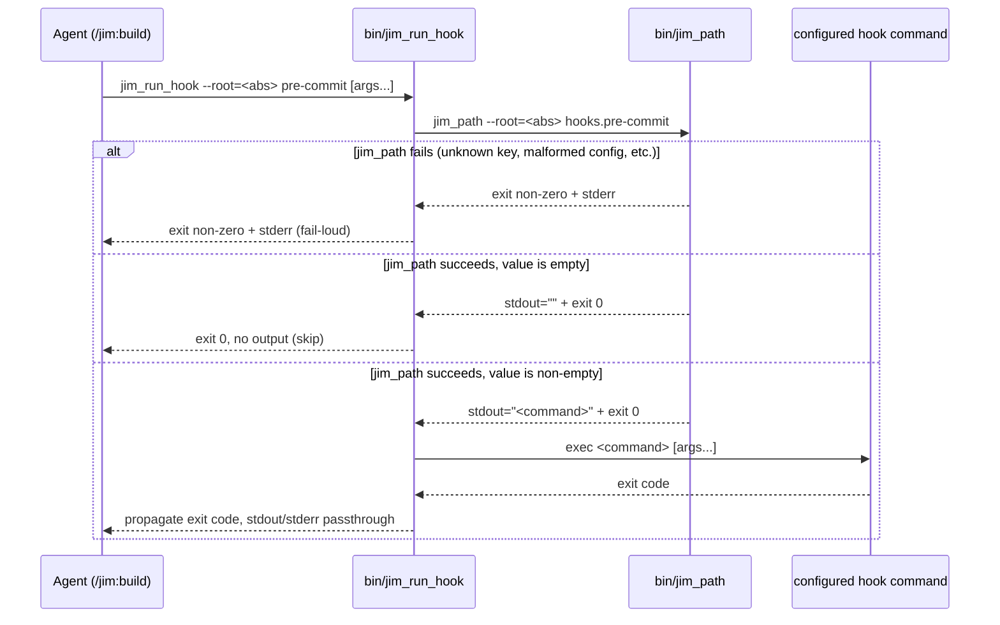

# 016 bin/jim_run_hook — single-call hook dispatcher

## Overview

Add a `bin/jim_run_hook` bash helper that resolves and dispatches a configured `hooks.<event>` value via a single Bash invocation, replacing the multi-line in-skill-prose idiom from spec 015 that interrupts every `/jim:build` commit by tripping Claude Code's Bash permission heuristic.

## Problem Statement

Spec 015 introduced configurable build hooks (`hooks.pre-commit`, `hooks.pre-completion`) and embedded a multi-line bash idiom in `skills/build/SKILL.md` to resolve the configured value and invoke it: `HOOK="$({jim_path} hooks.X)" || { echo "..."; exit 1; }; [ -n "$HOOK" ] && bash -c "$HOOK"`. Every viable variant of that idiom — brace-group fail-loud, if-form negated assignment, `bash -c "$HOOK"`, unquoted `$HOOK` execution — trips the Claude Code Bash permission heuristic for a different documented reason: brace-with-quote, parser bailout on negated-assignment-in-condition, expansion obfuscation inside quoted execution, simple-expansion in command-name slot. Each `/jim:build` commit consequently produces a "Do you want to proceed?" confirmation that the user must dismiss, breaking the TDD loop's flow and undermining spec 015's acceptance criterion that hooks "work via existing schema string-quoting rules" without ceremony. Reading the heuristic source in the Claude Code binary (the `EkK` always-rejected node-type set, the `mW()` strictness flag's command-name checks, the `cM` "Unhandled node type" fallback) confirms there is no in-prose bash form that simultaneously resolves a string-typed config value and invokes it as a command without tripping at least one rejection. The only robust path is to hide the resolve-and-exec dance inside a helper subprocess, where the heuristic does not reach.

## User Stories

- As a jim user with `hooks.pre-commit` configured, I can run `/jim:build` and see clean commit output without dismissing a permission prompt for every TDD iteration, so the loop's flow is not interrupted.
- As a jim contributor maintaining `skills/build/SKILL.md`, I can read a single-line hook invocation in skill prose (`{jim_run_hook} pre-commit`) instead of a multi-line bash block plus paragraph of caveats, so the skill body stays under its progressive-disclosure budget and the bash-heuristic edge cases live in the helper where they can be exercised, not in prose where they read as ceremony.
- As a jim user adding a future hook event (e.g., `hooks.pre-task`), I get the same dispatcher uniformly without per-event prose changes — the schema author adds the key, and `{jim_run_hook} <new-event>` works without a helper edit.

## Acceptance Criteria

- [ ] `bin/jim_run_hook` exists as a bash script (`#!/usr/bin/env bash`), invocable via Claude Code's plugin `bin/` PATH convention, parallel to `bin/jim_path`.
- [ ] CLI accepts `jim_run_hook --root='<abs>' <event> [args...]`. The `--root` flag is forwarded to `jim_path` internally; positional args after `<event>` are forwarded to the configured hook command.
- [ ] Helper resolves the configured value by invoking `jim_path --root='<abs>' hooks.<event>`. The helper itself does no schema parsing; `jim_path`'s existing schema validation is the single source of truth for which `hooks.<key>` keys are valid (schema-is-the-authority invariant).
- [ ] All helper-internal expansions of caller-provided arguments (`--root` value, `<event>` positional) are double-quoted when passed to subprocesses (e.g., `jim_path --root="$root" "hooks.$event"`). The verify battery includes a test case where `<event>` contains shell metacharacters (e.g., `; touch /tmp/owned` or `$(date)`) and asserts that no metacharacter is shell-evaluated — `jim_path` receives the literal key string and exits 2 with `unknown key`, and no side-effect file is created. Spec 015's trust model permits arbitrary commands in *configured* values, not in *helper-CLI args*; this AC closes the gap.
- [ ] When `jim_path` exits non-zero (unknown key, malformed config, schema-read failure, plugin-root plausibility check failure), the helper exits non-zero and surfaces `jim_path`'s stderr message — fail-loud, matching spec 015's Decision 5 posture.
- [ ] When the resolved value is the empty string (the schema default), the helper exits 0 with no output and does not execute anything.
- [ ] When the resolved value is non-empty, the helper executes it as a shell command with any forwarded positional args appended, and propagates the command's exit code unchanged.
- [ ] A new derived placeholder `{jim_run_hook}` is added to `skills/_shared/resolve-paths.md` (and documented in `skills/_shared/config-schema.md`'s Derived Placeholders section), parallel to `{jim_path}`. It expands to `jim_run_hook --root='<absolute-project-root>'` with the same single-quote-with-`'\''`-escape idiom and the same null-byte-in-root halt condition.
- [ ] `skills/build/SKILL.md` Commit phase (currently L72-78 — the `**Commit**` bullet) is replaced with a single-line invocation of `{jim_run_hook} pre-commit` via Bash. The current bash-idiom block, the prose paragraph documenting fail-loud and skip-if-empty semantics, and the embedded-quote limitation note are removed from skill prose.
- [ ] `skills/build/SKILL.md` step 6 Completion gate (currently L106-111 — sub-step 1 of the gate) is replaced with a single-line invocation of `{jim_run_hook} pre-completion` via Bash. The same prose simplification applies.
- [ ] `skills/_shared/config-schema.md` Hook keys section adds a one-line note that the canonical invoker is `bin/jim_run_hook` (or `{jim_run_hook}` in skill prose), rather than per-skill in-prose composition. The trust-model, embedded-quote, and agent-context-exposure paragraphs remain intact — they describe the configured value's properties, not the invocation mechanism.
- [ ] `ARCHITECTURE.md` Plugin Executables section adds a `bin/jim_run_hook` entry parallel to the existing `bin/jim_path` entry, naming purpose, location, interface (CLI signature, exit-code semantics, stderr conventions), dependencies (jim_path), and key constraints (no schema parsing in the helper; trusts jim_path's allowlist; fail-loud on jim_path failure).
- [ ] `ARCHITECTURE.md` Configuration and Overlay section's "Build hooks" bullet is updated to describe the helper as the dispatcher, replacing the current `$({jim_path} hooks.X)` + `||`-chain prose.
- [ ] `ARCHITECTURE.md` Security Considerations section (`L232-239`) is updated so the Shell-execution authority paragraph (added by spec 015) names `bin/jim_run_hook` as load-bearing for the trust model alongside `bin/jim_path`. Specifically, the helper's fail-loud-on-`jim_path`-failure invariant and skip-only-on-empty-value invariant are the runtime enforcement of the trust model documented in the schema's Hook keys section — a buggy helper that silently catches `jim_path` failures or skips the empty-check would silently disable the configured gate without any signal, defeating spec 015 Decision 5.
- [ ] `/jim:meta-test` passes after the changes — no literal default values leak into tool-argument positions; `{jim_run_hook}` derived placeholder follows the same substitution discipline as `{jim_path}`; no `bash -c "$HOOK"`, `eval`, or other in-prose composition that triggers the heuristic remains in `skills/build/SKILL.md`.
- [ ] When the agent has cd'd into a subdirectory of the project, `{jim_run_hook} pre-commit` still resolves correctly because the `--root='<abs>'` injection (parallel to `{jim_path}`) carries the project root through to `jim_path` regardless of CWD (cd-safety invariant from spec 013).
- [ ] The hook's stdout and stderr remain captured by Claude Code's Bash tool — the helper does not redirect or filter them, preserving the agent-context-exposure documented in spec 015.

## Data Flow

## Out of Scope

- Additional hook events (`hooks.pre-task`, `hooks.post-commit`, `hooks.pre-build`, `hooks.post-completion`). The helper's free-form `<event>` argument means future events land via schema-only changes; introducing the events themselves remains a separate spec when concrete need surfaces.
- Hook-event allowlisting at the helper level (`case "$event" in pre-commit|pre-completion) ...`). `jim_path`'s schema-driven validation is the single source of truth; duplicating the allowlist in the helper is rejected (interview Q2).
- Per-event timeout, sandbox, or resource limit on the configured command. The helper preserves spec 015's trust model — configured hooks run with the invoking user's privileges, unbounded.
- Backwards compatibility with the in-prose idiom from spec 015. No project currently depends on the literal idiom (the 015 build was meta — jim itself has no `hooks.*` configured). The idiom is fully superseded; `skills/build/SKILL.md` rewrites to call the helper.
- A migration tool or script to convert existing in-prose idiom invocations to helper invocations. Only one consumer exists (`skills/build/SKILL.md`); manual replacement during the build phase is sufficient.
- Permission-prompt UX experimentation (e.g., a default `Bash(jim_run_hook:*)` allowlist in `.claude/settings.local.json`). The user can add the rule themselves if desired, but settings authoring is outside the spec's scope.
- Restoring the literal-command transparency of the spec 015 idiom. The tradeoff was acknowledged during interview: permission prompts now show `jim_run_hook pre-commit` instead of the literal hook command. Mitigation is the helper being short, readable, and reviewable in `bin/`; further transparency mechanisms are deferred.
- Helper integration in skills other than `/jim:build`. The helper itself is generic, but spec 015 limited hook firing to `/jim:build`; expanding to other skills is its own decision.
- Updating spec 015's plan to mark Decisions 1 and 5 as superseded. The 015 plan is historical record; the prose stays as-was. This spec's existence is the supersession marker.

## Open Questions

None — all interview dimensions resolved.
