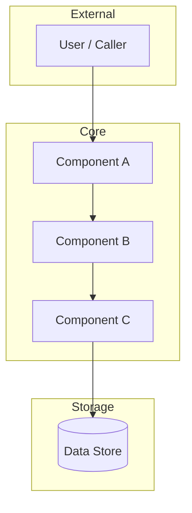

# Architecture — {Project or Component Name}

*Last updated: {YYYY-MM-DD}*

> This document is generated and maintained by `/jim:arch`. Edit via the skill to preserve consistency.

---

## Project Structure

*High-level directory layout with one-line annotations. Focus on structure that is non-obvious or architecturally significant.*

```
{project-root}/
├── {dir}/          # {what it contains and why}
├── {dir}/          # {what it contains and why}
│   ├── {subdir}/   # {what it contains}
│   └── {subdir}/   # {what it contains}
└── {file}          # {purpose}
```

## High-Level System Diagram

*Mermaid diagram showing primary components and their relationships. Update whenever a new component is introduced.*



## Core Components

*One subsection per significant component. "Significant" means it has a distinct responsibility, its own directory or module, or is referenced by other components.*

### {Component Name}

- **Purpose:** {One sentence — what this component does}
- **Location:** `{path/to/component/}`
- **Interfaces:** {What it exposes — function signatures, CLI flags, API endpoints, events}
- **Dependencies:** {What it depends on — other components, external services, libraries}
- **Key Constraints:** {Any invariants that must not be violated — e.g., "stateless: no local file writes"}

### {Component Name}

- **Purpose:** {One sentence}
- **Location:** `{path/}`
- **Interfaces:** {Exposed interface}
- **Dependencies:** {Depends on}
- **Key Constraints:** {Invariants}

<!-- Add one subsection per component. Remove this comment in the generated output. -->

## Data Stores

*Every persistence mechanism the system uses. "None" is a valid entry.*

| Store | Type | Location | Purpose | Owned By |
| :--- | :--- | :--- | :--- | :--- |
| {Name} | {File / SQLite / Postgres / Redis / etc.} | `{path or host}` | {What data, why persisted} | {Component} |

*None identified* — add when persistence is introduced.

## External Integrations

*Third-party services, APIs, and external tools the system calls out to. "None" is valid.*

| Integration | Type | Auth Method | Rate Limits | Failure Mode |
| :--- | :--- | :--- | :--- | :--- |
| {Name} | {REST API / WebSocket / CLI / etc.} | {API key / OAuth / none} | {Limit if known} | {How the system handles failure} |

*None identified.*

## Deployment & Infrastructure

*How the system runs in production (or how it is distributed if it's a library/plugin).*

- **Runtime:** {Language version, platform requirements}
- **Entry point:** `{command or file}`
- **Configuration:** {How it's configured — env vars, config files, flags}
- **Distribution:** {npm package / binary / Docker image / Claude Code plugin / etc.}
- **Environment requirements:** {What must be installed or available}

## Security Considerations

*Explicit security boundaries and decisions. Every system has at least one.*

- **Trust boundary:** {Where untrusted input enters the system and how it is validated}
- **Secrets management:** {How credentials and secrets are stored and accessed}
- **File system access:** {What paths the system reads/writes; any paths that must never be touched}
- **Auth:** {Authentication mechanism if applicable}
- **Known risks:** {Unresolved security concerns deferred to future work}

## Development & Testing

*How to develop against this system and verify changes.*

- **Setup:** `{command to get a working dev environment}`
- **Run tests:** `{test command}`
- **Test framework:** {Framework name, version, location of test files}
- **Test conventions:** {Naming patterns, where fixtures live, mock strategy}
- **Linting / formatting:** `{command}`

## Glossary

*Terms that have a specific meaning in this project. Define them here rather than in every component doc.*

| Term | Definition |
| :--- | :--- |
| {Term} | {Definition — project-specific meaning, not the general definition} |
