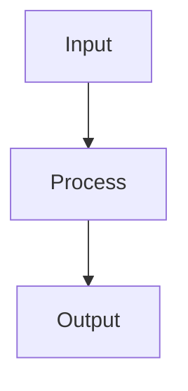
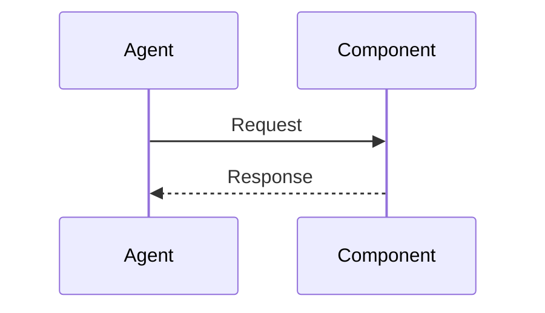

# {Title} — Plan

## Overview

{1-2 sentences summarizing the technical approach and key design choice.}

## Design Decisions

*Document the "Why" behind the "How." Each decision records what was chosen, the rationale, and what was rejected and why.*

### 1. {Decision Name — e.g., "State Management Strategy"}

- **Chosen:** {What was selected}
- **Why:** {1-2 sentences of rationale — what problem this solves or constraint it satisfies}
- **Rejected:** {Alternative} — {Why not, 1 sentence}

### 2. {Decision Name}

- **Chosen:** {What was selected}
- **Why:** {1-2 sentences}
- **Rejected:** {Alternative} — {Why not}

<!-- Add more decisions as needed. Every non-obvious choice needs a decision block. -->

## Constitution Check

*Gate: does this plan conflict with `docs/jim/ARCHITECTURE.md`? If no `docs/jim/ARCHITECTURE.md` exists, note its absence and proceed.*

**`docs/jim/ARCHITECTURE.md` status:** {Present — constraints noted below | Absent — no locked constraints}

| Constraint from `docs/jim/ARCHITECTURE.md` | Honored? | Notes |
| :--- | :--- | :--- |
| {e.g., "All writes go through the service layer"} | Yes / No | {If No, document the rationale for the exception} |

<!-- Remove this table if docs/jim/ARCHITECTURE.md is absent. -->

## File Manifest

*The physical blueprint for the Coder agent. Every file that will be created or modified.*

| Component | File Path | Action | Notes |
| :--- | :--- | :--- | :--- |
| {Name} | `{path/to/file}` | Create | {What goes in it} |
| {Name} | `{path/to/file}` | Update | {What changes} |

## Interface Contracts

*Define types, interfaces, or API shapes before the task breakdown. Tasks reference these — not the other way around.*

```{language}
// Define interfaces, types, or schemas here.
// The coder follows these exactly — changes require re-planning.
```

## Data Flow

*Mermaid flowchart showing how data moves across components. Include for non-trivial flows.*



<!-- Add a sequence diagram for timing-sensitive or multi-agent interactions: -->



## Task Breakdown

*Ordered by dependency. Each task is atomic (one thing changed, one thing verifiable) and independently confirmable.*

<!-- Feature type: standard ordered breakdown -->
<!-- Bug type: use Reproduce → Fix → Regression structure -->
<!-- Refactor type: front-load structural changes; each task ends with "existing tests pass" verify -->

1. [ ] {Task description — what file, what change, what interface it satisfies}
   **Verify:** `{shell command that proves this task is complete}`

2. [ ] {Task description}
   **Verify:** `{shell command}`

<!-- Each Verify command must be shell-executable. No "check manually" entries. -->
<!-- Tasks reference Interface Contracts by name when applicable. -->
<!-- Mark dependency: "Depends on task N" when ordering is not obvious. -->

## Requirements Coverage Summary

*Every acceptance criterion from the spec maps to at least one task. Gaps here are planning failures.*

| Spec Acceptance Criterion | Addressed In Task(s) |
| :--- | :--- |
| {AC from spec.md verbatim or paraphrased} | {Task number(s)} |
| {AC} | {Task number(s)} |

<!-- If a spec AC has no task, it is either Out of Scope (document it there) or a planning gap (add a task). -->
<!-- Use [NEEDS CLARIFICATION] marker for any AC that is ambiguous or technically underspecified. -->
<!-- Example: | User can export to PDF [NEEDS CLARIFICATION: which PDF library?] | — | -->

## Out of Scope

*Technical items explicitly deferred to prevent scope creep. If it's not listed here and not in the task breakdown, it doesn't exist.*

- {Item explicitly excluded}
- {Item deferred to a future spec}

## Open Questions

- [ ] {Unresolved technical question — flag with [NEEDS CLARIFICATION] in the relevant section above}
- [x] ~~{Resolved question}~~ → {Decision made}
