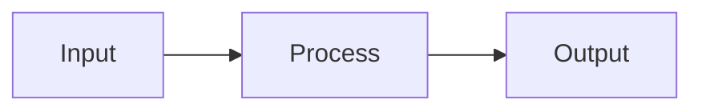

# {00X} {title}

## Overview
{1-2 sentence description of what this spec delivers and why.}

<!-- feature only -->
## Problem Statement
{What user problem does this solve? Why does this need to exist? Focus on user pain, not the solution.}

## User Stories
- As a {role}, I can {action} so that {benefit}.
<!-- end feature only -->

<!-- bug only -->
## Defect Profile
- **Steps to Reproduce:**
  1. {Step 1}
  2. {Step 2}
- **Actual Behavior:** {What is currently happening?}
- **Expected Behavior:** {What should happen?}
- **Environment:** {OS, version, relevant config}
<!-- end bug only -->

<!-- refactor only -->
## Refactor Rationale
- **Motivation:** {Why now? What triggered this refactor?}
- **Current State:** {Technical debt or structural issue being addressed.}
- **Desired State:** {The architectural improvement target.}
- **Affected Systems:** {Subsystems touched by this change.}
<!-- end refactor only -->

## Acceptance Criteria
- [ ] {Specific, testable criterion}
<!-- bug only: always include -->
- [ ] Regression test covers the reported scenario
<!-- refactor only: always include -->
- [ ] Existing tests pass without modification

## UI Mockup
<!-- Optional — include for specs with visible output, remove otherwise -->
```
+----------------------------------+
| {Screen Title}                   |
+----------------------------------+
|                                  |
|   {Key elements here}            |
|                                  |
+----------------------------------+
```

## Data Flow
<!-- Optional — include for specs with non-trivial data flow, remove if straightforward -->


## Out of Scope
{Explicit exclusions to prevent scope creep. If nothing is excluded, boundaries are too soft.}

- {Thing that might seem related but is not included}

## Open Questions
{Unresolved questions. Write "None" if all questions resolved.}

- [ ] {Question that needs answering}
- [x] ~{Resolved question}~ → {Decision made}
